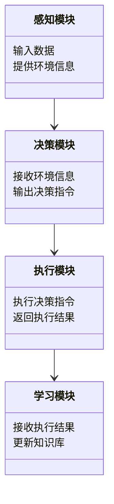
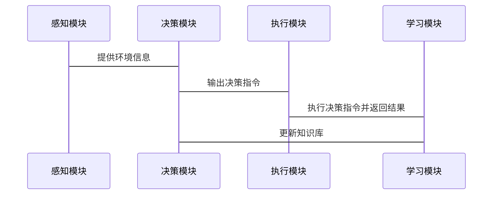

                 


# AI Agent的模块化设计：提高系统可维护性和扩展性

## 关键词：AI Agent，模块化设计，系统可维护性，系统扩展性，模块划分，接口设计，依赖注入

## 摘要：  
本文详细探讨了AI Agent的模块化设计方法，通过模块化设计可以显著提高系统的可维护性和扩展性。文章从模块化设计的基本概念出发，分析了其在AI Agent中的核心作用，详细讲解了模块化设计的原理、算法实现、系统架构设计以及实际项目中的应用案例。通过具体的代码实现和系统架构图，展示了如何通过模块化设计来优化AI Agent系统的开发和维护过程。

---

# 第1章: AI Agent模块化设计概述

## 1.1 AI Agent的基本概念  
### 1.1.1 什么是AI Agent  
AI Agent（人工智能代理）是指能够感知环境、自主决策并执行任务的智能实体。它可以是一个软件程序、机器人或其他智能系统，通过与环境交互完成特定目标。  

### 1.1.2 AI Agent的分类  
AI Agent可以分为以下几类：  
1. **简单反射型Agent**：基于当前感知直接做出反应，没有内部状态。  
2. **基于模型的反射型Agent**：维护内部状态，并根据当前状态和感知做出决策。  
3. **目标驱动型Agent**：根据目标选择行动，优先完成目标。  
4. **效用驱动型Agent**：通过最大化效用函数来优化决策。  

### 1.1.3 AI Agent的核心特征  
AI Agent的核心特征包括：  
- **自主性**：能够自主决策和行动。  
- **反应性**：能够感知环境并实时响应。  
- **目标导向性**：具有明确的目标并致力于实现目标。  
- **学习能力**：能够通过经验改进性能。  

## 1.2 模块化设计的背景与意义  
### 1.2.1 系统设计中的模块化思想  
模块化设计是一种将系统分解为独立模块的方法，每个模块负责特定的功能，模块之间通过接口进行通信。这种设计方法能够提高系统的可维护性和扩展性。  

### 1.2.2 模块化设计对系统可维护性的提升  
模块化设计通过将系统分解为独立模块，使得每个模块的修改和维护仅限于该模块内部，不会影响其他模块，从而降低了维护成本。  

### 1.2.3 模块化设计对系统扩展性的增强  
模块化设计使得新增功能或修改现有功能变得简单。只需修改或替换相关模块，而无需重构整个系统，从而提高了系统的扩展性。  

## 1.3 本章小结  
本章介绍了AI Agent的基本概念和分类，并阐述了模块化设计在系统可维护性和扩展性中的重要作用。

---

# 第2章: AI Agent模块化设计的核心概念  

## 2.1 模块化设计的定义与特点  
### 2.1.1 模块化的定义  
模块化设计是将系统分解为独立的模块，每个模块负责特定的功能，模块之间通过明确的接口进行通信。  

### 2.1.2 模块化设计的特点  
模块化设计的特点包括：  
- **独立性**：每个模块独立运行，互不干扰。  
- **可替换性**：模块可以被其他功能相同的模块替换。  
- **可扩展性**：新增功能只需添加新的模块即可。  

### 2.1.3 模块化与传统设计的区别  
| 特性         | 模块化设计       | 传统设计         |  
|--------------|------------------|------------------|  
| 独立性       | 高               | 低               |  
| 可维护性     | 高               | 低               |  
| 可扩展性     | 高               | 低               |  
| 开发效率     | 高               | 低               |  

## 2.2 AI Agent模块化设计的核心要素  
### 2.2.1 模块划分的原则  
模块划分的原则包括：  
1. **单一职责原则**：每个模块只负责一个功能。  
2. **接口隔离原则**：模块之间的接口应尽量简单且明确。  
3. **依赖倒置原则**：模块之间应通过抽象接口进行通信，而不是具体实现。  

### 2.2.2 模块之间的依赖关系  
模块之间的依赖关系可以通过以下方式表示：  
$$  
\text{模块A} \rightarrow \text{模块B}  
$$  
表示模块A依赖于模块B。  

### 2.2.3 模块的接口设计  
模块的接口是模块之间通信的桥梁。接口设计应遵循以下原则：  
1. **最小化接口数量**：减少接口数量，简化系统设计。  
2. **明确接口功能**：每个接口应只实现一个功能。  
3. **可扩展性**：接口设计应允许未来的扩展。  

## 2.3 模块化设计的数学模型与公式  
模块化设计的数学模型可以表示为：  
$$  
\text{模块化程度} = \frac{\text{模块间依赖性}}{\text{模块内部复杂度}}  
$$  
其中，模块间依赖性表示模块之间的依赖程度，模块内部复杂度表示模块内部的功能复杂度。  

## 2.4 本章小结  
本章详细讲解了模块化设计的核心概念，包括模块划分的原则、模块之间的依赖关系以及模块的接口设计。

---

# 第3章: AI Agent模块化设计的算法原理  

## 3.1 模块化设计的算法概述  
### 3.1.1 模块划分算法  
模块划分算法的目标是将系统功能分解为独立的模块。常见的模块划分算法包括：  
1. **基于功能分解的模块划分**：根据功能需求将系统分解为功能模块。  
2. **基于依赖关系的模块划分**：根据模块之间的依赖关系进行划分。  

### 3.1.2 模块间依赖关系的处理  
模块间依赖关系的处理可以通过以下步骤实现：  
1. **识别模块之间的依赖关系**：通过分析系统功能，识别模块之间的依赖关系。  
2. **构建依赖关系图**：将模块之间的依赖关系表示为图结构。  
3. **优化依赖关系**：通过重新设计模块接口，减少不必要的依赖关系。  

### 3.1.3 模块化设计的实现步骤  
模块化设计的实现步骤包括：  
1. **功能需求分析**：明确系统需要实现的功能。  
2. **模块划分**：根据功能需求将系统分解为独立的模块。  
3. **接口设计**：定义模块之间的接口。  
4. **实现模块功能**：根据接口设计实现每个模块的功能。  
5. **系统集成**：将所有模块集成到一起，完成系统的整体功能。  

## 3.2 模块化设计的算法实现  
### 3.2.1 模块划分算法的实现  
以下是基于功能分解的模块划分算法的Python代码示例：  

```python
def module_partitioning(functions):
    modules = []
    for function in functions:
        module = []
        for f in functions:
            if depends_on(f, function):
                module.append(f)
        modules.append(module)
    return modules

def depends_on(f, function):
    # 判断函数f是否依赖于function
    return True  # 根据具体需求实现
```

### 3.2.2 模块间依赖关系的处理算法  
以下是模块间依赖关系的处理算法的Python代码示例：  

```python
def dependency_optimization(modules):
    optimized_modules = []
    for module in modules:
        optimized_module = []
        for f in module:
            if not depends_on(f, module):
                optimized_module.append(f)
        optimized_modules.append(optimized_module)
    return optimized_modules
```

### 3.2.3 模块化设计的优化算法  
以下是模块化设计的优化算法的Python代码示例：  

```python
def module_optimization(modules):
    optimized_modules = []
    for module in modules:
        optimized_module = []
        for f in module:
            if is_critical(f):
                optimized_module.append(f)
        optimized_modules.append(optimized_module)
    return optimized_modules

def is_critical(f):
    # 判断函数f是否是关键函数
    return True  # 根据具体需求实现
```

## 3.3 模块化设计的数学模型与公式  
模块化设计的数学模型可以表示为：  
$$  
\text{模块化程度} = \frac{\sum_{i=1}^{n} \text{模块间依赖关系}(i,j)}{\sum_{i=1}^{n} \text{模块内部复杂度}(i)}  
$$  
其中，$n$是模块的数量，$\text{模块间依赖关系}(i,j)$表示模块$i$与模块$j$之间的依赖关系，$\text{模块内部复杂度}(i)$表示模块$i$内部的复杂度。  

## 3.4 本章小结  
本章详细讲解了模块化设计的算法原理，包括模块划分算法、模块间依赖关系的处理算法以及模块化设计的优化算法。

---

# 第4章: AI Agent模块化设计的系统分析与架构设计  

## 4.1 问题场景介绍  
在AI Agent的设计中，模块化设计可以帮助我们更好地管理复杂的系统功能，提高系统的可维护性和扩展性。  

## 4.2 项目介绍  
本项目旨在设计一个基于模块化设计的AI Agent系统，该系统包括感知模块、决策模块、执行模块和学习模块四个部分。  

## 4.3 系统功能设计  
### 4.3.1 领域模型设计  
以下是领域模型的类图：  



### 4.3.2 系统架构设计  
以下是系统架构的架构图：  


## 4.4 系统接口设计  
模块之间的接口设计如下：  

1. **感知模块接口**：提供环境信息。  
2. **决策模块接口**：接收环境信息并输出决策指令。  
3. **执行模块接口**：接收决策指令并执行操作。  
4. **学习模块接口**：接收执行结果并更新知识库。  

## 4.5 系统交互设计  
以下是系统交互的序列图：  



## 4.6 本章小结  
本章通过实际项目案例，详细讲解了AI Agent模块化设计的系统分析与架构设计，包括领域模型设计、系统架构设计、系统接口设计和系统交互设计。

---

# 第5章: AI Agent模块化设计的项目实战  

## 5.1 环境安装  
以下是项目所需的环境安装步骤：  
1. 安装Python编程语言。  
2. 安装依赖管理工具pip。  
3. 安装模块化设计所需的Python库，如`mermaid`和`graphviz`。  

## 5.2 系统核心实现源代码  
以下是系统核心实现的Python代码示例：  

```python
class 感知模块:
    def 提供环境信息(self):
        pass

class 决策模块:
    def 接收环境信息(self, 环境信息):
        pass

class 执行模块:
    def 执行决策指令(self, 决策指令):
        pass

class 学习模块:
    def 更新知识库(self, 执行结果):
        pass
```

## 5.3 代码应用解读与分析  
以下是代码的解读与分析：  
- **感知模块**：负责提供环境信息。  
- **决策模块**：接收环境信息并输出决策指令。  
- **执行模块**：接收决策指令并执行操作。  
- **学习模块**：接收执行结果并更新知识库。  

## 5.4 实际案例分析  
以下是实际案例的分析：  
假设我们设计一个AI Agent用于智能家居控制，模块化设计可以将系统分解为感知模块（温度传感器、湿度传感器）、决策模块（根据环境数据做出决策）、执行模块（控制空调、加湿器）和学习模块（根据历史数据优化决策策略）。  

## 5.5 本章小结  
本章通过实际项目案例，详细讲解了AI Agent模块化设计的项目实战，包括环境安装、系统核心实现、代码解读与分析以及实际案例分析。

---

# 第6章: AI Agent模块化设计的最佳实践  

## 6.1 总结与回顾  
模块化设计是一种有效的系统设计方法，能够显著提高系统的可维护性和扩展性。  

## 6.2 小结  
通过模块化设计，我们可以更好地管理复杂的系统功能，提高系统的开发效率和维护效率。  

## 6.3 注意事项  
在实际项目中，需要注意以下几点：  
1. **模块划分的原则**：遵循单一职责原则、接口隔离原则和依赖倒置原则。  
2. **模块之间的依赖关系**：尽量减少模块之间的依赖关系。  
3. **模块的接口设计**：确保模块之间的接口简洁明了。  

## 6.4 拓展阅读  
推荐阅读以下书籍和文章：  
- 《软件架构设计：系统工程与实践》  
- 《模块化编程：从理论到实践》  
- 《设计模式：可维护性与可扩展性的艺术》  

## 6.5 本章小结  
本章总结了AI Agent模块化设计的最佳实践，包括总结与回顾、小结、注意事项和拓展阅读。

---

# 第7章: 结语  

模块化设计是AI Agent系统设计中的一个重要思想，通过模块化设计可以显著提高系统的可维护性和扩展性。本文详细讲解了模块化设计的核心概念、算法原理、系统架构设计以及实际项目中的应用案例。希望本文能够为AI Agent的模块化设计提供有益的参考和指导。

---

# 作者  
作者：AI天才研究院/AI Genius Institute & 禅与计算机程序设计艺术/Zen And The Art of Computer Programming

