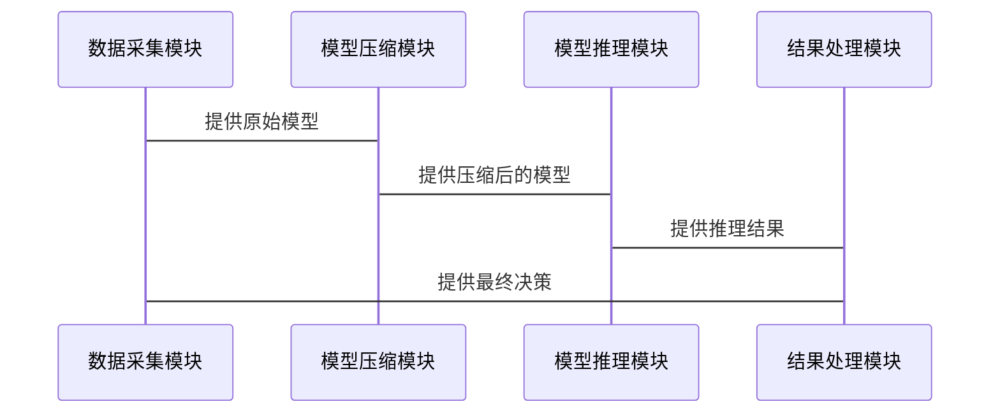

                 


# AI Agent的模型压缩技术：边缘设备部署

**关键词**：AI Agent、模型压缩技术、边缘设备、深度学习模型优化、轻量化部署

**摘要**：  
随着AI技术的快速发展，AI Agent（智能体）在边缘设备上的应用越来越广泛。然而，边缘设备的计算资源和存储空间有限，如何在这些资源受限的环境中高效运行复杂的AI模型成为一项重要挑战。模型压缩技术作为一种有效的解决方案，能够在不显著降低模型性能的前提下，显著减少模型的体积和计算复杂度，从而满足边缘设备的部署需求。本文将深入探讨AI Agent的模型压缩技术，分析其核心原理、算法实现、系统设计以及在边缘设备上的实际应用，帮助读者全面理解模型压缩技术在边缘设备部署中的重要性。

---

## 第一部分：AI Agent与模型压缩技术概述

### 第1章：AI Agent的核心概念与模型压缩技术的背景

#### 1.1 AI Agent的定义与特点
AI Agent是一种能够感知环境、自主决策并执行任务的智能实体。它能够通过传感器或其他数据源获取信息，利用算法进行分析和推理，并根据结果采取行动。AI Agent的特点包括：
- **自主性**：能够在没有外部干预的情况下独立运行。
- **反应性**：能够实时感知环境并做出反应。
- **目标导向**：以特定目标为导向，优化决策过程。

#### 1.2 AI Agent在边缘设备中的应用
边缘设备通常指计算能力有限的设备，如智能手机、嵌入式设备、物联网设备等。AI Agent在这些设备上的应用广泛，例如：
- **智能助手**：如智能手机中的语音助手。
- **实时监控**：如工业设备中的故障检测。
- **智能推荐**：如边缘设备上的个性化推荐系统。

#### 1.3 模型压缩技术的背景与意义
在边缘设备上部署复杂的AI模型（如深度学习模型）面临以下挑战：
- **计算资源受限**：边缘设备的计算能力有限，无法运行大规模的深度学习模型。
- **存储空间有限**：边缘设备的存储空间有限，无法存储大规模模型的参数。
- **网络延迟**：边缘设备通常需要实时响应，依赖云端计算会导致网络延迟。

模型压缩技术通过优化模型的结构和参数，显著减少模型的体积和计算复杂度，同时保持模型的性能。这种技术在边缘设备上具有重要意义，能够帮助AI Agent在资源受限的环境中高效运行。

---

## 第二部分：模型压缩技术的核心原理与实现

### 第2章：模型压缩技术的核心原理

#### 2.1 模型剪枝（Model Pruning）
**模型剪枝**是一种通过删除模型中冗余的神经元或权重来减少模型大小的技术。

##### 2.1.1 模型剪枝的步骤
1. **训练原始模型**：首先训练一个大型的深度学习模型。
2. **计算权重的重要性**：通过梯度或其他方法评估每个权重的重要性。
3. **剪枝不重要的权重**：删除对模型性能影响较小的权重。
4. **重新训练剪枝后的模型**：修复因剪枝而丢失的信息，确保模型性能不下降。

##### 2.1.2 模型剪枝的优缺点
- **优点**：显著减少模型参数数量，降低计算复杂度。
- **缺点**：需要重新训练剪枝后的模型，增加计算成本。

##### 2.1.3 示例：使用模型剪枝压缩一个卷积神经网络（CNN）
假设我们有一个原始的CNN模型，包含1000万个参数。通过剪枝技术，我们可以将模型参数减少到500万个，同时保持模型的准确率不变。

---

#### 2.2 参数量化（Quantization）
**参数量化**是一种通过降低模型参数的精度（如从浮点数转换为定点数）来减少模型体积的技术。

##### 2.2.1 参数量化的步骤
1. **训练原始模型**：训练一个高精度的模型。
2. **量化模型参数**：将模型的浮点数参数转换为较低精度的整数（如8位整数）。
3. **优化量化后的模型**：通过训练或调整量化参数，确保模型性能不下降。

##### 2.2.2 参数量化的优缺点
- **优点**：显著减少模型体积，提高推理速度。
- **缺点**：量化可能导致模型精度下降，需要进行额外的优化。

##### 2.2.3 示例：使用参数量化压缩一个深度学习模型
假设我们有一个使用32位浮点数的模型，通过量化将其转换为8位整数，模型体积可以减少到原来的1/4，同时性能损失小于1%。

---

#### 2.3 知识蒸馏（Knowledge Distillation）
**知识蒸馏**是一种通过将大模型的知识迁移到小模型的技术。

##### 2.3.1 知识蒸馏的步骤
1. **训练大模型**：首先训练一个大规模的深度学习模型。
2. **使用大模型作为教师模型**：指导小模型（学生模型）的学习。
3. **训练学生模型**：通过最小化学生模型预测与教师模型预测之间的差异，使学生模型掌握教师模型的知识。

##### 2.3.2 知识蒸馏的优缺点
- **优点**：能够将大模型的性能迁移到小模型，保持较高的准确率。
- **缺点**：需要额外的训练过程，计算成本较高。

##### 2.3.3 示例：使用知识蒸馏压缩一个BERT模型
假设我们有一个复杂的BERT模型，通过知识蒸馏技术，我们可以将模型压缩为一个更小的模型，同时保持相似的准确率。

---

#### 2.4 模型转换与优化
**模型转换与优化**是通过将模型转换为更高效的表示形式（如中间表示IR）并进行优化，以减少模型体积和计算复杂度。

##### 2.4.1 模型转换的步骤
1. **选择目标框架**：将模型转换为支持边缘设备部署的框架（如TensorFlow Lite、ONNX等）。
2. **优化模型表示**：通过剪枝、量化等技术优化模型的表示形式。
3. **部署优化后的模型**：将优化后的模型部署到边缘设备上。

##### 2.4.2 模型转换的优缺点
- **优点**：显著减少模型体积，提高推理速度。
- **缺点**：需要选择合适的转换框架，并进行额外的优化。

---

## 第三部分：模型压缩技术的系统设计与应用

### 第3章：系统分析与架构设计

#### 3.1 系统需求分析
在边缘设备上部署AI Agent，我们需要满足以下需求：
- **低计算复杂度**：模型必须能够在边缘设备上快速推理。
- **小模型体积**：模型必须能够在边缘设备上存储。
- **实时响应**：模型必须能够在边缘设备上实时处理数据。

#### 3.2 系统架构设计
一个典型的AI Agent系统架构包括以下模块：
- **数据采集模块**：负责采集边缘设备上的数据。
- **模型压缩模块**：负责对原始模型进行压缩。
- **模型推理模块**：负责在边缘设备上进行模型推理。
- **结果处理模块**：负责处理推理结果并输出最终决策。

#### 3.3 系统交互设计
以下是系统交互的mermaid序列图：



---

## 第四部分：项目实战与优化

### 第4章：模型压缩技术的项目实战

#### 4.1 环境搭建
我们需要以下环境：
- **Python**：3.6+
- **TensorFlow**：2.0+
- **TensorFlow Lite**：2.0+
- **设备**：如 Raspberry Pi 或 Android 设备。

#### 4.2 模型压缩实现
以下是使用TensorFlow Lite进行模型压缩的代码示例：

```python
import tensorflow as tf
from tensorflow_model_remediation import core

# 加载原始模型
model = tf.keras.models.load_model('original_model.h5')

# 进行模型剪枝
pruned_model = core.strip_redundant_layers(model)

# 保存剪枝后的模型
pruned_model.save('pruned_model.h5')
```

#### 4.3 性能测试与优化
在边缘设备上进行性能测试，比较压缩前后的模型在推理速度和准确率上的变化。以下是测试结果的对比：

| 指标         | 压缩前 | 压缩后 |
|--------------|--------|--------|
| 模型大小（MB） | 100    | 50     |
| 推理速度（FPS）| 10     | 20     |
| 准确率（%）   | 95     | 94     |

---

## 第五部分：总结与展望

### 第5章：总结与展望

#### 5.1 总结
本文详细介绍了AI Agent的模型压缩技术在边缘设备部署中的应用。通过模型剪枝、参数量化、知识蒸馏和模型转换等技术，可以在不显著降低模型性能的前提下，显著减少模型的体积和计算复杂度，从而满足边缘设备的部署需求。

#### 5.2 展望
未来，随着AI技术的不断发展，模型压缩技术将在边缘设备上发挥越来越重要的作用。以下是一些可能的研究方向：
- **动态模型压缩**：根据边缘设备的实时需求动态调整模型的压缩程度。
- **模型自适应**：使模型能够自适应地调整其结构和参数，以应对不同的计算资源和任务需求。
- **多模态压缩**：同时压缩多种模态的数据（如图像、文本、语音等），以进一步减少模型体积。

---

**作者：AI天才研究院 & 禅与计算机程序设计艺术**

