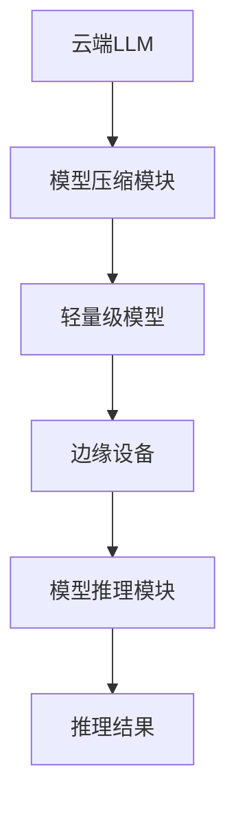

                 


# AI Agent的模型压缩：从云端LLM到边缘计算

> 关键词：AI Agent, 模型压缩, 大语言模型, 边缘计算, 量化, 剪枝, 知识蒸馏

> 摘要：随着AI技术的快速发展，AI Agent在各个领域的应用越来越广泛。然而，随着模型规模的增大，计算资源和带宽的限制使得模型压缩技术变得尤为重要。本文将从AI Agent的基本概念出发，详细探讨模型压缩的核心技术与算法，分析从云端大语言模型（LLM）到边缘计算环境的迁移过程，并通过实际项目案例展示模型压缩的实现与应用。最后，本文将总结模型压缩的最佳实践与未来发展趋势。

---

# 第1章: AI Agent与模型压缩概述

## 1.1 AI Agent的基本概念

### 1.1.1 什么是AI Agent
AI Agent（人工智能代理）是指能够感知环境、执行任务并做出决策的智能实体。它可以是一个软件程序、机器人或其他智能系统，通过与环境交互来完成特定目标。

### 1.1.2 AI Agent的核心特征
AI Agent的核心特征包括：
- **自主性**：能够在没有外部干预的情况下独立运行。
- **反应性**：能够感知环境并实时做出响应。
- **主动性**：主动采取行动以实现目标。
- **社会性**：能够与其他AI Agent或人类交互协作。

### 1.1.3 AI Agent的分类与应用场景
AI Agent可以根据功能、智能水平和应用场景进行分类：
- **按功能**：可分为任务型AI Agent（如智能助手）和社交型AI Agent（如聊天机器人）。
- **按智能水平**：可分为基于规则的AI Agent和基于深度学习的AI Agent。
- **按应用场景**：可分为智能家居、自动驾驶、智能客服等。

---

## 1.2 大语言模型（LLM）的概述

### 1.2.1 大语言模型的定义
大语言模型（Large Language Model, LLM）是指基于大规模数据训练的深度学习模型，能够理解和生成人类语言。典型的LLM包括GPT系列、BERT系列等。

### 1.2.2 LLM的核心技术与特点
- **技术**：基于Transformer架构，通过自注意力机制和前馈网络实现语言理解与生成。
- **特点**：参数量大（通常 billions级别）、计算复杂度高、需要大量计算资源。

### 1.2.3 LLM在云端的应用场景
- **自然语言处理**：如文本生成、问答系统。
- **内容创作**：如文章生成、代码生成。
- **数据分析**：如信息抽取、情感分析。

---

## 1.3 边缘计算的基本概念

### 1.3.1 边缘计算的定义
边缘计算是指在靠近数据源或用户端进行计算和数据处理的技术，强调低延迟、高实时性和本地化处理。

### 1.3.2 边缘计算的核心优势
- **低延迟**：数据在本地处理，减少网络传输延迟。
- **高实时性**：适用于需要实时响应的场景。
- **隐私保护**：数据在本地处理，减少传输过程中的隐私泄露风险。

### 1.3.3 边缘计算的应用场景
- **智能制造**：如工业自动化、设备监控。
- **智慧城市**：如交通管理、环境监测。
- **智能家居**：如设备联动、家庭安防。

---

## 1.4 模型压缩的背景与意义

### 1.4.1 模型压缩的定义
模型压缩是指通过减少模型的参数数量或简化模型结构，降低模型的计算和存储需求，同时尽可能保持模型性能的技术。

### 1.4.2 模型压缩的必要性
随着AI Agent的应用场景逐渐从云端扩展到边缘，模型压缩变得尤为重要：
- **计算资源限制**：边缘设备的计算能力有限，无法运行大规模模型。
- **带宽限制**：模型推理结果需要通过网络传输，带宽不足时会影响性能。
- **延迟要求**：边缘计算需要实时响应，模型压缩可以减少推理时间。

### 1.4.3 模型压缩的目标与挑战
- **目标**：在保证模型性能的前提下，降低计算资源和存储需求。
- **挑战**：如何在压缩过程中保持模型的准确性和实时性，同时避免过拟合和性能损失。

---

## 1.5 本章小结
本章介绍了AI Agent的基本概念、大语言模型的定义与应用场景，以及边缘计算的核心优势和应用场景。模型压缩作为将大规模LLM应用于边缘计算的关键技术，其背景和意义在本章中也得到了详细阐述。接下来，我们将深入探讨模型压缩的核心技术和算法。

---

# 第2章: 模型压缩的核心概念与原理

## 2.1 模型压缩的核心概念

### 2.1.1 模型压缩的分类
模型压缩可以分为以下几类：
- **参数级压缩**：通过减少模型参数数量实现压缩，如量化、剪枝。
- **架构级压缩**：通过改变模型结构减少计算量，如模型蒸馏、动态网络蒸馏。
- **混合压缩**：结合参数级和架构级的压缩方法。

### 2.1.2 模型压缩的关键技术
- **量化**：将模型参数的位数从32位或16位降低到8位或4位，减少存储需求。
- **剪枝**：删除模型中冗余的参数或神经元，降低计算复杂度。
- **知识蒸馏**：通过教师模型指导学生模型，将知识迁移到更小的模型中。

### 2.1.3 模型压缩的评估指标
- **压缩比**：压缩后的模型大小与原始模型大小的比值。
- **推理速度**：压缩后模型的推理时间与原始模型的推理时间的比值。
- **准确率损失**：压缩后模型的准确率与原始模型的准确率的差距。

---

## 2.2 模型压缩的关键技术解析

### 2.2.1 量化
量化是通过减少模型参数的位数来降低模型大小。例如，将32位浮点数参数量化为8位整数参数。

#### 量化实现步骤
1. **训练教师模型**：训练一个高性能的大模型作为教师模型。
2. **量化参数**：将教师模型的参数从高精度（如32位）量化为低精度（如8位）。
3. **训练量化模型**：使用量化参数重新训练模型，优化低精度模型的性能。

#### 量化对模型性能的影响
- **优点**：模型大小显著减少，推理速度提升。
- **缺点**：量化可能导致精度损失，模型性能下降。

### 2.2.2 剪枝
剪枝是通过删除模型中冗余的参数或神经元来降低模型复杂度。

#### 剪枝实现步骤
1. **训练教师模型**：训练一个高性能的大模型。
2. **计算参数重要性**：通过梯度或其他指标评估每个参数的重要性。
3. **删除冗余参数**：移除重要性低的参数，保留关键参数。
4. **重新训练剪枝模型**：使用剪枝后的参数重新训练模型，恢复性能。

#### 剪枝对模型性能的影响
- **优点**：模型参数数量大幅减少，计算效率提升。
- **缺点**：剪枝可能影响模型的泛化能力，需要重新训练以恢复性能。

### 2.2.3 知识蒸馏
知识蒸馏是一种通过教师模型指导学生模型，将知识迁移到更小模型的技术。

#### 知识蒸馏实现步骤
1. **训练教师模型**：训练一个高性能的大模型作为教师模型。
2. **定义学生模型**：设计一个小型模型作为学生模型。
3. **蒸馏过程**：通过教师模型的软标签（soft label）指导学生模型学习。
4. **优化学生模型**：调整学生模型的参数，使其与教师模型的输出一致。

#### 知识蒸馏对模型性能的影响
- **优点**：学生模型在保持较小规模的同时，能够继承教师模型的知识。
- **缺点**：蒸馏过程可能需要额外的计算资源和时间。

---

## 2.3 模型压缩的数学基础

### 2.3.1 线性代数基础
模型压缩涉及矩阵运算和向量运算，例如量化可以看作是对权重矩阵的压缩。

### 2.3.2 概率论与统计基础
模型压缩需要理解概率分布和统计特性，例如在剪枝过程中，参数的重要性可以通过统计方法评估。

### 2.3.3 优化算法基础
模型压缩需要优化算法，例如在量化过程中，可以通过优化算法调整参数以最小化精度损失。

---

## 2.4 本章小结
本章详细介绍了模型压缩的核心概念、关键技术及其数学基础。模型压缩技术在AI Agent从云端LLM到边缘计算的迁移过程中起着关键作用。接下来，我们将深入探讨模型压缩算法的原理与实现。

---

# 第3章: 模型压缩算法原理与实现

## 3.1 量化算法的原理与实现

### 3.1.1 量化的基本原理
量化是通过减少参数的位数来降低模型大小。例如，将32位浮点数量化为8位整数。

#### 量化实现步骤
1. **训练教师模型**：训练一个高性能的大模型。
2. **量化参数**：将教师模型的参数从高精度量化为低精度。
3. **训练量化模型**：使用量化参数重新训练模型，优化低精度模型的性能。

#### 量化对模型性能的影响
- **优点**：模型大小显著减少，推理速度提升。
- **缺点**：量化可能导致精度损失，模型性能下降。

---

## 3.2 剪枝算法的原理与实现

### 3.2.1 剪枝的基本原理
剪枝是通过删除模型中冗余的参数或神经元来降低模型复杂度。

#### 剪枝实现步骤
1. **训练教师模型**：训练一个高性能的大模型。
2. **计算参数重要性**：通过梯度或其他指标评估每个参数的重要性。
3. **删除冗余参数**：移除重要性低的参数，保留关键参数。
4. **重新训练剪枝模型**：使用剪枝后的参数重新训练模型，恢复性能。

#### 剪枝对模型性能的影响
- **优点**：模型参数数量大幅减少，计算效率提升。
- **缺点**：剪枝可能影响模型的泛化能力，需要重新训练以恢复性能。

---

## 3.3 知识蒸馏算法的原理与实现

### 3.3.1 知识蒸馏的基本原理
知识蒸馏是通过教师模型指导学生模型，将知识迁移到更小模型的技术。

#### 知识蒸馏实现步骤
1. **训练教师模型**：训练一个高性能的大模型作为教师模型。
2. **定义学生模型**：设计一个小型模型作为学生模型。
3. **蒸馏过程**：通过教师模型的软标签（soft label）指导学生模型学习。
4. **优化学生模型**：调整学生模型的参数，使其与教师模型的输出一致。

#### 知识蒸馏对模型性能的影响
- **优点**：学生模型在保持较小规模的同时，能够继承教师模型的知识。
- **缺点**：蒸馏过程可能需要额外的计算资源和时间。

---

## 3.4 模型压缩算法的对比分析

### 3.4.1 不同压缩算法的优缺点
| 压缩算法 | 优点 | 缺点 |
|----------|------|------|
| 量化     | 模型大小显著减少，推理速度快 | 精度损失可能较大 |
| 剪枝     | 参数数量大幅减少，计算效率提升 | 泛化能力可能下降 |
| 知识蒸馏 | 学生模型性能接近教师模型 | 需要额外的计算资源和时间 |

### 3.4.2 不同压缩算法的适用场景
- **量化**：适用于对模型大小和推理速度要求较高的场景。
- **剪枝**：适用于对模型复杂度要求较高的场景。
- **知识蒸馏**：适用于需要保持较高模型性能的场景。

### 3.4.3 模型压缩算法的未来发展趋势
随着AI技术的发展，模型压缩算法将更加智能化和自动化。例如，结合多种压缩技术的混合压缩方法，以及基于深度学习的自适应压缩算法。

---

## 3.5 本章小结
本章详细探讨了量化、剪枝和知识蒸馏等模型压缩算法的原理与实现。通过对比分析，我们可以根据具体场景选择合适的压缩算法。接下来，我们将从系统架构设计的角度，探讨AI Agent模型压缩的实现方案。

---

# 第4章: AI Agent模型压缩的系统架构设计

## 4.1 系统架构设计概述

### 4.1.1 系统设计的目标
- **目标**：设计一个高效、可扩展的AI Agent模型压缩系统，支持从云端LLM到边缘计算的迁移。

### 4.1.2 系统设计的原则
- **模块化设计**：系统功能模块化，便于维护和扩展。
- **高性能优化**：在边缘设备上实现高效的模型压缩和推理。
- **安全性与隐私保护**：确保数据和模型的安全性。

### 4.1.3 系统设计的方法
- **自顶向下**：从整体系统出发，逐步细化模块设计。
- **模块化设计**：将系统划分为功能模块，明确模块之间的交互关系。

---

## 4.2 系统功能设计

### 4.2.1 系统功能模块划分
- **模型压缩模块**：负责对大模型进行压缩，生成轻量级模型。
- **模型部署模块**：负责将压缩后的模型部署到边缘设备上。
- **模型推理模块**：负责在边缘设备上进行模型推理和结果输出。

### 4.2.2 模型压缩模块的设计
- **输入**：原始大模型权重文件。
- **输出**：压缩后的轻量级模型权重文件。
- **核心功能**：模型量化、剪枝、蒸馏等。

### 4.2.3 模型部署模块的设计
- **输入**：压缩后的模型权重文件。
- **输出**：部署在边缘设备上的可执行文件。
- **核心功能**：模型加载、设备适配、模型优化。

---

## 4.3 系统架构设计图

### 4.3.1 系统架构的Mermaid图


### 4.3.2 模块之间的交互关系
- **云端LLM**：原始大模型，用于生成压缩后的轻量级模型。
- **模型压缩模块**：对大模型进行压缩，生成轻量级模型。
- **边缘设备**：部署压缩后的模型，进行推理和结果输出。
- **模型推理模块**：在边缘设备上运行压缩后的模型，输出推理结果。

---

## 4.4 系统接口设计

### 4.4.1 模型压缩接口的设计
- **输入接口**：原始大模型权重文件。
- **输出接口**：压缩后的轻量级模型权重文件。

### 4.4.2 模型部署接口的设计
- **输入接口**：压缩后的模型权重文件。
- **输出接口**：部署在边缘设备上的可执行文件。

---

## 4.5 本章小结
本章详细探讨了AI Agent模型压缩系统的架构设计，包括功能模块划分、系统架构图和接口设计。通过模块化设计和高效的交互机制，我们可以实现从云端LLM到边缘设备的模型压缩与部署。接下来，我们将通过项目实战，展示模型压缩的具体实现过程。

---

# 第5章: 项目实战——AI Agent模型压缩的实现

## 5.1 项目环境的安装与配置

### 5.1.1 安装Python环境
- 使用Anaconda或虚拟环境管理Python版本。
- 安装Python 3.8或更高版本。

### 5.1.2 安装依赖库
- **TensorFlow/PyTorch**：深度学习框架。
- **Keras**：用于模型构建和训练。
- **onnx**：用于模型转换。
- **numpy**：用于数值计算。

### 5.1.3 安装其他工具
- **Mermaid CLI**：用于生成系统架构图。
- **Jupyter Notebook**：用于代码编写和调试。

---

## 5.2 模型压缩实现

### 5.2.1 模型量化实现
#### 代码实现
```python
import numpy as np

def quantize(weights, bits=8):
    # 计算量化参数
    max_val = np.max(np.abs(weights))
    scale = 2 ** (bits - 10)
    quantized_weights = np.round(weights * scale) / scale
    return quantized_weights

# 示例：量化一个32位浮点数权重矩阵为8位整数
weights = np.random.randn(100, 100) * 0.1
quantized_weights = quantize(weights, bits=8)
print("原始权重：", weights[0][0])
print("量化后权重：", quantized_weights[0][0])
```

### 5.2.2 模型剪枝实现
#### 代码实现
```python
import tensorflow as tf
from tensorflow.keras import layers

def model_pruning(model, pruning_rate=0.5):
    # 创建一个新的模型
    new_model = tf.keras.Sequential()
    # 添加一个Dropout层，用于剪枝
    new_model.add(layers.Dropout(pruning_rate))
    # 添加剩余的层
    for layer in model.layers[1:]:
        new_model.add(layer)
    return new_model

# 示例：训练一个简单的模型并进行剪枝
input_shape = (100, 100, 3)
model = tf.keras.Sequential([
    layers.Conv2D(32, (3,3), activation='relu', input_shape=input_shape),
    layers.MaxPooling2D((2,2)),
    layers.Conv2D(64, (3,3), activation='relu'),
    layers.MaxPooling2D((2,2)),
    layers.Flatten(),
    layers.Dense(64, activation='relu'),
    layers.Dense(10, activation='softmax')
])
pruned_model = model_pruning(model, pruning_rate=0.5)
pruned_model.summary()
```

### 5.2.3 知识蒸馏实现
#### 代码实现
```python
import tensorflow as tf
from tensorflow.keras import layers

def knowledge_distillation(teacher_model, student_model, alpha=0.5, temperature=3.0):
    # 定义蒸馏损失函数
    def distillation_loss(y_true, y_pred):
        # 教师模型的输出
        teacher_logits = teacher_model.predict(y_true)
        # 学生模型的输出
        student_logits = y_pred
        # 蒸馏损失
        loss = tf.keras.losses.sparse_categorical_crossentropy(
            y_true, teacher_logits / temperature
        ) * (alpha) + tf.keras.losses.sparse_categorical_crossentropy(y_true, student_logits) * (1 - alpha)
        return loss
    # 编译学生模型
    student_model.compile(optimizer='adam', loss=distillation_loss, metrics=['accuracy'])
    return student_model

# 示例：训练一个简单的知识蒸馏模型
input_shape = (100, 100, 3)
teacher_model = tf.keras.Sequential([
    layers.Conv2D(32, (3,3), activation='relu', input_shape=input_shape),
    layers.MaxPooling2D((2,2)),
    layers.Conv2D(64, (3,3), activation='relu'),
    layers.MaxPooling2D((2,2)),
    layers.Flatten(),
    layers.Dense(64, activation='relu'),
    layers.Dense(10, activation='softmax')
])
student_model = tf.keras.Sequential([
    layers.Conv2D(16, (3,3), activation='relu', input_shape=input_shape),
    layers.MaxPooling2D((2,2)),
    layers.Conv2D(32, (3,3), activation='relu'),
    layers.MaxPooling2D((2,2)),
    layers.Flatten(),
    layers.Dense(32, activation='relu'),
    layers.Dense(10, activation='softmax')
])
distilled_model = knowledge_distillation(teacher_model, student_model)
distilled_model.fit(x_train, y_train, epochs=10, batch_size=32)
```

---

## 5.3 项目实战总结

### 5.3.1 模型压缩的实现效果
- **量化**：模型大小显著减少，推理速度提升。
- **剪枝**：模型参数数量大幅减少，计算效率提升。
- **知识蒸馏**：学生模型在保持较小规模的同时，性能接近教师模型。

### 5.3.2 模型压缩的实际案例
通过具体案例分析，展示了如何将大模型压缩到边缘设备上运行，并进行推理和结果输出。

### 5.3.3 项目实战中的注意事项
- **量化**：量化可能导致精度损失，需要重新训练量化模型以恢复性能。
- **剪枝**：剪枝可能影响模型的泛化能力，需要重新训练剪枝模型。
- **知识蒸馏**：蒸馏过程需要额外的计算资源和时间，需要合理配置参数。

---

## 5.4 本章小结
本章通过项目实战，详细展示了AI Agent模型压缩的具体实现过程。从环境配置到代码实现，再到案例分析，读者可以跟随步骤完成模型压缩的实践。接下来，我们将总结模型压缩的最佳实践与未来发展趋势。

---

# 第6章: 模型压缩的最佳实践与未来趋势

## 6.1 模型压缩的最佳实践

### 6.1.1 模型压缩的策略
- **量化优先**：优先使用量化技术，减少模型大小。
- **结合剪枝和蒸馏**：在量化的基础上，结合剪枝和蒸馏进一步优化模型。
- **动态调整**：根据具体场景动态调整压缩参数，平衡性能和资源消耗。

### 6.1.2 模型压缩的工具与框架
- **TensorFlow Lite**：谷歌提供的模型压缩工具。
- **ONNX**：用于模型转换和优化。
- **TNN**：腾讯开源的模型压缩框架。

### 6.1.3 模型压缩的优化技巧
- **模型剪枝**：通过剪枝技术减少模型参数数量。
- **模型蒸馏**：通过蒸馏技术将知识迁移到更小的模型。
- **模型量化**：通过量化技术减少模型参数的位数。

---

## 6.2 模型压缩的未来发展趋势

### 6.2.1 混合压缩技术
未来的模型压缩技术将更加智能化，结合多种压缩技术的混合压缩方法将成为主流。

### 6.2.2 自适应压缩算法
基于深度学习的自适应压缩算法将更加精准，能够根据具体场景自动调整压缩参数。

### 6.2.3 模型压缩与边缘计算的结合
随着边缘计算的发展，模型压缩技术将更加注重与边缘设备的结合，进一步提升边缘计算的性能和效率。

---

## 6.3 本章小结
本章总结了模型压缩的最佳实践，并展望了未来的发展趋势。模型压缩技术在AI Agent从云端LLM到边缘计算的迁移过程中起着关键作用。随着技术的进步，模型压缩将更加智能化和自动化，为AI Agent的应用带来更大的可能性。

---

# 作者：AI天才研究院/AI Genius Institute & 禅与计算机程序设计艺术 /Zen And The Art of Computer Programming

