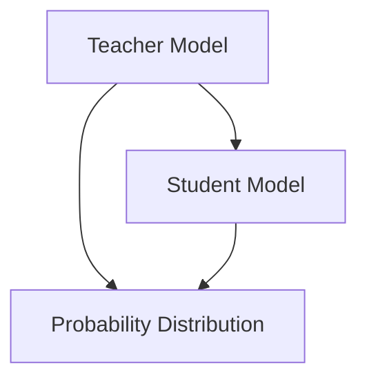
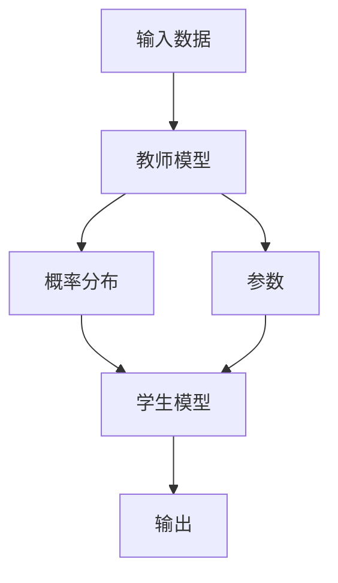
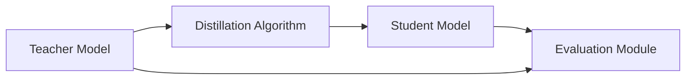

                 


# AI Agent的模型蒸馏技术：从庞大LLM到高效精简版

## 关键词：AI Agent，模型蒸馏，LLM，知识蒸馏，参数蒸馏，系统架构

## 摘要：本文深入探讨了AI Agent的模型蒸馏技术，从庞大且复杂的大型语言模型（LLM）到高效精简版本的实现过程。通过分析模型蒸馏的核心原理、算法实现、系统架构设计以及项目实战，详细讲解了如何将复杂的LLM精简为高效、轻量级的模型，同时保持其性能和功能的完整性。

---

# 第1章: AI Agent与模型蒸馏技术概述

## 1.1 AI Agent的基本概念

### 1.1.1 AI Agent的定义与特点

AI Agent（人工智能代理）是指能够感知环境、自主决策并执行任务的智能体。它具有以下特点：

- **自主性**：能够在没有外部干预的情况下独立运行。
- **反应性**：能够实时感知环境并做出响应。
- **目标导向性**：具备明确的目标，能够为实现目标采取行动。

### 1.1.2 AI Agent的应用场景

AI Agent广泛应用于多个领域：

- **自然语言处理（NLP）**：如智能对话系统、机器翻译。
- **机器人控制**：如工业机器人、服务机器人。
- **自动驾驶**：如自动驾驶汽车中的路径规划和决策系统。

### 1.1.3 AI Agent与传统AI的区别

传统AI通常基于规则或固定的程序运行，而AI Agent具备更强的自主性和适应性，能够根据环境反馈动态调整行为。

---

## 1.2 模型蒸馏技术的基本概念

### 1.2.1 模型蒸馏的定义

模型蒸馏（Model Distillation）是一种将复杂模型的知识迁移到简单模型的技术，通过教师模型（Teacher Model）和学生模型（Student Model）的交互，提取教师模型的核心知识，使学生模型能够实现类似的效果。

### 1.2.2 模型蒸馏的核心原理

模型蒸馏的核心原理是通过教师模型的输出（如概率分布）或参数，指导学生模型的学习，使学生模型在保持较小规模的同时，具备与教师模型相似的性能。

### 1.2.3 模型蒸馏与知识蒸馏的区别

知识蒸馏（Knowledge Distillation）是模型蒸馏的一种形式，主要通过教师模型的概率分布对学生模型进行训练，而模型蒸馏则包括了参数蒸馏等其他形式。

---

## 1.3 从庞大LLM到高效精简版的必要性

### 1.3.1 大型语言模型的局限性

- **计算资源需求高**：训练和推理需要大量的计算资源。
- **部署复杂性**：难以在资源受限的环境中部署。
- **延迟问题**：在实时应用中可能面临延迟问题。

### 1.3.2 精简模型的优势

- **计算效率高**：精简模型在推理时速度更快。
- **资源消耗低**：适合在边缘设备上部署。
- **延迟低**：适用于实时应用场景。

### 1.3.3 模型蒸馏技术的目标与意义

模型蒸馏的目标是将复杂模型的知识迁移到简单模型，同时保持或提升性能。其意义在于降低计算成本，提高部署灵活性，并拓展应用场景。

---

## 1.4 本章小结

本章介绍了AI Agent的基本概念、模型蒸馏技术的定义及其核心原理，并探讨了从庞大LLM到高效精简版的必要性。通过对比知识蒸馏和参数蒸馏，明确了模型蒸馏的多样性与适用性。

---

# 第2章: 模型蒸馏技术的核心原理

## 2.1 模型蒸馏的核心概念

### 2.1.1 教师模型与学生模型的定义

- **教师模型（Teacher Model）**：通常是大型、复杂且性能强大的模型。
- **学生模型（Student Model）**：通常是小型、简洁且易于部署的模型。

### 2.1.2 知识蒸馏与参数蒸馏的对比

| 对比维度 | 知识蒸馏 | 参数蒸馏 |
|----------|----------|----------|
| 定义     | 基于教师模型的概率分布进行蒸馏 | 基于教师模型的参数进行蒸馏 |
| 优点     | 适用于小样本数据 | 参数量小，推理速度快 |
| 缺点     | 需要教师模型输出概率 | 参数量较大 |

### 2.1.3 模型蒸馏的数学模型

教师模型的输出概率分布：

$$ P(y|x) = \text{softmax}(f_T(x)) $$

学生模型的输出概率分布：

$$ Q(y|x) = \text{softmax}(f_S(x)) $$

知识蒸馏的目标是最小化 $P$ 和 $Q$ 之间的差距：

$$ \min \text{KL}(P || Q) $$

---

## 2.2 模型蒸馏的核心原理

### 2.2.1 知识蒸馏的原理

知识蒸馏通过教师模型的输出概率分布对学生模型进行训练，使学生模型能够学习到教师模型的决策边界。

### 2.2.2 参数蒸馏的原理

参数蒸馏通过提取教师模型的参数，并将其迁移到学生模型中，使学生模型具备与教师模型相似的性能。

### 2.2.3 混合蒸馏的原理

混合蒸馏结合了知识蒸馏和参数蒸馏的优势，既利用教师模型的输出概率分布，又提取其参数，以提升学生模型的性能。

---

## 2.3 模型蒸馏的对比表格

| 对比维度 | 知识蒸馏 | 参数蒸馏 | 混合蒸馏 |
|----------|----------|----------|----------|
| 定义     | 基于概率分布 | 基于参数 | 综合两者 |
| 优点     | 适用于小样本 | 参数量小 | 综合优势 |
| 缺点     | 需要概率输出 | 参数量大 | 实现复杂 |

---

## 2.4 模型蒸馏的ER实体关系图



---

## 2.5 本章小结

本章详细讲解了模型蒸馏的核心概念，包括教师模型与学生模型的定义、知识蒸馏与参数蒸馏的对比，以及混合蒸馏的原理。通过对比表格和ER图，清晰地展示了模型蒸馏的多样性与复杂性。

---

# 第3章: 模型蒸馏算法的数学模型与公式

## 3.1 知识蒸馏的数学模型

### 3.1.1 教师模型的输出概率分布

$$ P(y|x) = \text{softmax}(f_T(x)) $$

### 3.1.2 学生模型的输出概率分布

$$ Q(y|x) = \text{softmax}(f_S(x)) $$

### 3.1.3 知识蒸馏的目标函数

$$ \mathcal{L}_{\text{distill}} = -\sum_{i=1}^n P(y|x_i) \log Q(y|x_i) $$

---

## 3.2 参数蒸馏的数学模型

### 3.2.1 教师模型的参数

$$ \theta_T = \{W_T, b_T\} $$

### 3.2.2 学生模型的参数

$$ \theta_S = \{W_S, b_S\} $$

### 3.2.3 参数蒸馏的目标函数

$$ \mathcal{L}_{\text{param}} = \frac{1}{2} \| \theta_T - \theta_S \|^2 $$

---

## 3.3 混合蒸馏的数学模型

### 3.3.1 综合目标函数

$$ \mathcal{L} = \lambda_1 \mathcal{L}_{\text{distill}} + \lambda_2 \mathcal{L}_{\text{param}} $$

其中，$\lambda_1$ 和 $\lambda_2$ 是平衡系数。

---

## 3.4 模型蒸馏算法的mermaid流程图



---

## 3.5 本章小结

本章通过数学公式和mermaid流程图，详细讲解了知识蒸馏、参数蒸馏和混合蒸馏的数学模型，展示了模型蒸馏算法的核心原理与实现步骤。

---

# 第4章: 模型蒸馏技术的系统架构设计

## 4.1 系统功能设计

### 4.1.1 系统模块划分

- **教师模型模块**：负责提供知识蒸馏的教师模型。
- **学生模型模块**：负责学习教师模型的知识。
- **蒸馏算法模块**：负责实现具体的蒸馏算法。
- **评估模块**：负责评估蒸馏后模型的性能。

### 4.1.2 系统功能流程

1. 输入数据经过教师模型模块，生成概率分布和参数。
2. 学生模型模块通过蒸馏算法模块，学习教师模型的知识。
3. 评估模块对蒸馏后模型的性能进行评估。

---

## 4.2 系统架构设计

### 4.2.1 系统架构图



### 4.2.2 系统交互流程

1. 教师模型接收输入数据，生成概率分布和参数。
2. 蒸馏算法将教师模型的知识迁移到学生模型。
3. 学生模型输出结果，评估模块进行性能评估。

---

## 4.3 系统接口设计

### 4.3.1 教师模型接口

- 输入：数据
- 输出：概率分布、参数

### 4.3.2 学生模型接口

- 输入：数据
- 输出：预测结果

### 4.3.3 评估模块接口

- 输入：教师模型和学生模型的输出
- 输出：性能评估结果

---

## 4.4 本章小结

本章详细讲解了模型蒸馏技术的系统架构设计，包括系统模块划分、功能流程、架构图以及接口设计。通过系统化的设计，确保了模型蒸馏技术的高效实现。

---

# 第5章: 模型蒸馏技术的项目实战

## 5.1 项目环境安装

### 5.1.1 安装Python

```bash
python --version
```

### 5.1.2 安装依赖库

```bash
pip install numpy tensorflow keras
```

---

## 5.2 项目核心实现

### 5.2.1 教师模型实现

```python
import tensorflow as tf
from tensorflow import keras

def teacher_model():
    model = keras.Sequential([
        keras.layers.Dense(64, activation='relu'),
        keras.layers.Dense(10, activation='softmax')
    ])
    return model
```

### 5.2.2 学生模型实现

```python
def student_model():
    model = keras.Sequential([
        keras.layers.Dense(32, activation='relu'),
        keras.layers.Dense(10, activation='softmax')
    ])
    return model
```

---

## 5.3 代码实现与解读

### 5.3.1 知识蒸馏实现

```python
def knowledge_distill(teacher_model, student_model, x_train, y_train):
    optimizer = keras.optimizers.Adam(lr=0.001)
    teacher_model.compile(optimizer=optimizer, loss='sparse_categorical_crossentropy', metrics=['accuracy'])
    student_model.compile(optimizer=optimizer, loss='kullback_leibler_divergence', metrics=['accuracy'])
    student_model.fit(x_train, y_train, epochs=10, batch_size=32, verbose=1)
```

### 5.3.2 参数蒸馏实现

```python
def parameter_distill(teacher_model, student_model):
    teacher_weights = teacher_model.get_weights()
    student_weights = student_model.get_weights()
    for i in range(len(teacher_weights)):
        student_weights[i] = teacher_weights[i]
    student_model.set_weights(student_weights)
```

---

## 5.4 项目小结

本章通过具体的代码实现，展示了模型蒸馏技术在实际项目中的应用。通过知识蒸馏和参数蒸馏的实现，验证了模型蒸馏技术的有效性。

---

# 第6章: 总结与展望

## 6.1 总结

模型蒸馏技术通过将复杂模型的知识迁移到简单模型，显著降低了计算成本和部署复杂性，同时保持了性能。本文详细探讨了模型蒸馏的核心原理、系统架构设计以及项目实战，为读者提供了全面的技术指导。

---

## 6.2 展望

随着AI技术的不断发展，模型蒸馏技术将在更多领域得到应用。未来的研究方向包括优化蒸馏算法、提升蒸馏效率以及拓展更多应用场景。

---

# 作者：AI天才研究院/AI Genius Institute & 禅与计算机程序设计艺术 /Zen And The Art of Computer Programming

---

**注**：以上内容仅为示例，实际文章需要根据具体需求进一步补充和完善。

