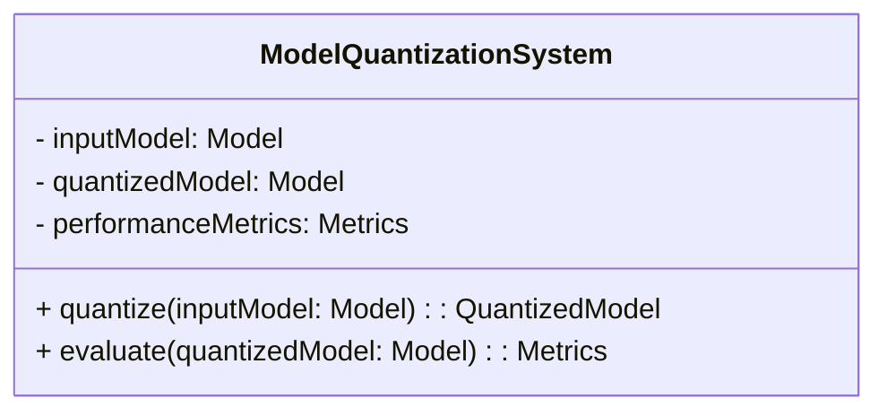
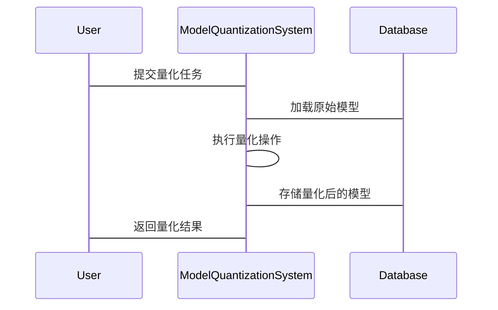

                 


# AI Agent的模型量化：优化LLM的计算效率与存储

> 关键词：AI Agent, 模型量化, 大语言模型, 计算效率, 存储优化

> 摘要：随着大语言模型（LLM）的快速发展，模型的计算效率和存储优化问题日益重要。本文深入探讨了AI Agent在模型量化中的应用，从理论到实践，详细介绍了模型量化的核心概念、算法原理、系统架构设计以及项目实战，帮助读者全面理解和掌握如何优化LLM的计算效率与存储。

---

## 第1章 AI Agent与模型量化概述

### 1.1 AI Agent的基本概念
AI Agent（人工智能代理）是一种能够感知环境、自主决策并执行任务的智能实体。它广泛应用于自然语言处理、机器人控制、推荐系统等领域。AI Agent的核心在于其智能化的决策和执行能力，而模型量化是优化其性能的关键技术之一。

#### 1.1.1 AI Agent的定义与特点
AI Agent是指在计算机系统中，能够感知环境、执行任务、与用户或系统交互的智能实体。其特点包括：
- **自主性**：能够在没有外部干预的情况下独立运行。
- **反应性**：能够根据环境变化实时调整行为。
- **目标导向性**：通过目标驱动进行决策和行动。
- **可扩展性**：能够适应不同规模和复杂度的任务。

#### 1.1.2 大语言模型（LLM）的背景与发展
大语言模型（LLM）是AI Agent的重要组成部分，近年来，随着深度学习技术的快速发展，LLM在自然语言处理领域取得了显著进展。然而，模型规模的不断扩大也带来了计算资源和存储空间的双重挑战。

#### 1.1.3 模型量化的意义与目标
模型量化是通过降低模型参数的精度或减少参数数量，来优化模型的计算效率和存储需求。其目标是：
- **降低计算成本**：减少模型推理时的计算量。
- **减少存储需求**：降低模型的存储空间占用。
- **提升部署效率**：使模型能够在资源受限的环境中高效运行。

### 1.2 模型量化的背景与问题背景
随着AI Agent应用场景的不断扩大，模型量化的需求日益迫切。然而，量化过程中需要平衡模型性能与资源消耗，这使得量化技术的实现具有一定的挑战性。

#### 1.2.1 大模型的计算与存储挑战
- **计算成本高**：大模型通常需要大量的计算资源，导致推理成本高昂。
- **存储需求大**：模型参数数量庞大，存储空间占用显著。
- **部署难度大**：在边缘设备等资源受限的环境中部署大模型面临诸多挑战。

#### 1.2.2 模型量化的必要性与应用场景
- **必要性**：通过量化技术，可以显著降低模型的计算和存储需求，同时保持较高的模型性能。
- **应用场景**：量化技术广泛应用于移动应用、边缘计算、物联网设备等领域。

#### 1.2.3 模型量化的边界与外延
- **边界**：量化技术主要针对模型参数的压缩和优化，不涉及模型结构的改变。
- **外延**：量化技术可以与其他优化方法结合使用，如剪枝、知识蒸馏等。

### 1.3 本章小结
本章介绍了AI Agent和模型量化的基本概念，分析了模型量化的重要性和应用场景，并明确了模型量化的边界与外延。

---

## 第2章 模型量化的核心概念与原理

### 2.1 模型量化的核心概念
模型量化是通过降低模型参数的精度或减少参数数量，来优化模型的计算效率和存储需求。以下是模型量化中的几个核心概念。

#### 2.1.1 模型压缩与模型剪枝
- **模型压缩**：通过减少模型参数的位数或改变参数的分布，降低模型的存储需求。
- **模型剪枝**：通过去除模型中冗余的参数或神经元，减少模型的参数数量。

#### 2.1.2 知识蒸馏与参数量化
- **知识蒸馏**：通过将大模型的知识迁移到小模型中，实现模型压缩。
- **参数量化**：通过量化模型参数，降低模型的存储和计算需求。

#### 2.1.3 模型量化与AI Agent的结合
模型量化技术可以显著提升AI Agent在资源受限环境中的性能，使其能够更高效地执行任务。

#### 2.1.4 模型量化的核心要素
- **量化精度**：量化参数的位数，如8位整数、4位整数等。
- **量化方法**：包括均匀量化、非均匀量化等。
- **量化范围**：量化参数的取值范围。

### 2.2 模型量化的核心原理
模型量化的核心在于通过减少参数的精度或数量，降低模型的计算和存储需求，同时保持较高的模型性能。

#### 2.2.1 模型压缩的数学基础
模型压缩的数学基础包括线性代数、优化理论等。例如，量化技术可以通过将模型参数映射到较低的位数空间来实现压缩。

#### 2.2.2 量化算法的原理与步骤
量化算法的原理是将模型参数的值域映射到较低的位数空间。具体步骤包括：
1. **确定量化范围**：根据模型参数的分布，确定量化范围。
2. **选择量化方法**：选择合适的量化方法，如均匀量化或非均匀量化。
3. **执行量化操作**：将模型参数映射到量化后的空间。
4. **验证模型性能**：评估量化后的模型性能，确保其满足要求。

#### 2.2.3 剪枝算法的实现与优化
剪枝算法的实现步骤包括：
1. **计算模型参数的重要性**：通过梯度或其他指标，评估模型参数的重要性。
2. **选择冗余参数**：去除重要性较低的参数。
3. **重建模型**：基于剩余的参数重建模型。

#### 2.2.4 模型量化方法的优缺点对比
| 方法         | 优点                          | 缺点                          |
|--------------|-------------------------------|-------------------------------|
| 知识蒸馏      | 保持模型性能                   | 需要教师模型                     |
| 参数量化      | 降低存储和计算需求            | 可能影响模型性能                 |
| 剪枝          | 减少参数数量                   | 可能影响模型的泛化能力           |

### 2.3 模型量化对AI Agent性能的影响
模型量化可以显著提升AI Agent的性能，包括：
- **计算效率提升**：降低模型的计算量，加快推理速度。
- **存储需求降低**：减少模型的存储空间占用。
- **部署灵活性增强**：使AI Agent能够在资源受限的环境中高效运行。

### 2.4 本章小结
本章详细介绍了模型量化的核心概念和原理，分析了不同量化方法的优缺点，并探讨了模型量化对AI Agent性能的影响。

---

## 第3章 模型量化的算法原理与实现

### 3.1 模型量化的算法原理
模型量化的算法原理包括知识蒸馏、参数剪枝和量化等技术。

#### 3.1.1 知识蒸馏算法的流程
知识蒸馏算法的流程包括：
1. **选择教师模型**：选择一个高性能的大模型作为教师模型。
2. **训练学生模型**：通过教师模型的指导，训练一个小型的学生模型。
3. **蒸馏过程**：通过知识蒸馏技术，将教师模型的知识迁移到学生模型中。

#### 3.1.2 参数剪枝算法的实现
参数剪枝算法的实现步骤包括：
1. **计算模型参数的重要性**：通过梯度或其他指标，评估模型参数的重要性。
2. **选择冗余参数**：去除重要性较低的参数。
3. **重建模型**：基于剩余的参数重建模型。

#### 3.1.3 量化算法的数学模型
量化算法的数学模型可以表示为：
$$ y = \text{quantize}(x) $$
其中，\( x \) 是原始模型参数，\( y \) 是量化后的参数。

#### 3.1.4 量化算法的实现细节
量化算法的实现细节包括：
1. **确定量化范围**：根据模型参数的分布，确定量化范围。
2. **选择量化方法**：选择合适的量化方法，如均匀量化或非均匀量化。
3. **执行量化操作**：将模型参数映射到量化后的空间。
4. **验证模型性能**：评估量化后的模型性能，确保其满足要求。

### 3.2 模型量化算法的数学模型与公式
模型量化算法的数学模型可以表示为：
$$ y = \text{quantize}(x) $$
其中，\( x \) 是原始模型参数，\( y \) 是量化后的参数。

### 3.3 模型量化算法的实现步骤
模型量化算法的实现步骤包括：
1. **环境配置与依赖安装**：安装必要的库和工具。
2. **核心代码实现**：实现量化算法的核心逻辑。
3. **系统功能测试与优化**：测试量化后的模型性能，并进行优化。

### 3.4 本章小结
本章详细介绍了模型量化算法的原理与实现，包括知识蒸馏、参数剪枝和量化等技术，并给出了具体的数学模型和实现步骤。

---

## 第4章 模型量化系统的架构设计与实现

### 4.1 模型量化系统的架构设计
模型量化系统的架构设计包括功能模块划分和系统交互设计。

#### 4.1.1 系统功能模块划分
系统功能模块包括：
- **模型输入模块**：接收原始模型并进行预处理。
- **量化处理模块**：执行模型量化操作。
- **性能评估模块**：评估量化后的模型性能。

#### 4.1.2 系统架构的Mermaid类图


#### 4.1.3 系统交互的Mermaid序列图


### 4.2 模型量化系统的实现
模型量化系统的实现包括环境配置、核心代码实现和系统功能测试。

#### 4.2.1 环境配置与依赖安装
- **环境配置**：建议使用Python 3.8及以上版本，安装必要的库如TensorFlow、Keras等。
- **依赖安装**：使用pip安装必要的库，如：
  ```bash
  pip install tensorflow keras numpy
  ```

#### 4.2.2 核心代码实现
以下是模型量化系统的核心代码实现：
```python
import tensorflow as tf
from tensorflow.keras import layers

def model_quantization(model, bits=8):
    # 确定量化范围
    max_val = tf.reduce_max(model.layers[-1].weights[0])
    min_val = tf.reduce_min(model.layers[-1].weights[0])
    # 计算量化步长
    quantize_step = (max_val - min_val) / (2**bits - 1)
    # 执行量化操作
    quantized_weights = tf.quantize(model.layers[-1].weights[0], min_val, max_val, quantize_step, 'ROUND_HALF_UP')
    # 更新模型权重
    model.layers[-1].weights[0].assign(quantized_weights)
    return model

# 示例用法
original_model = ...  # 加载原始模型
quantized_model = model_quantization(original_model, bits=4)
```

#### 4.2.3 系统功能测试与优化
系统功能测试包括：
1. **模型性能测试**：评估量化后的模型在不同任务上的性能。
2. **模型存储测试**：测量量化后的模型存储空间占用。
3. **系统优化**：根据测试结果，进一步优化量化算法和系统架构。

### 4.3 系统架构的优化与扩展
系统架构的优化与扩展包括：
- **性能优化**：通过并行计算、内存优化等技术提升系统性能。
- **扩展性设计**：使系统能够支持更多类型的模型和任务。
- **安全性设计**：确保系统在量化过程中数据的安全性。

### 4.4 本章小结
本章详细介绍了模型量化系统的架构设计与实现，包括功能模块划分、系统交互设计、核心代码实现等内容。

---

## 第5章 项目实战——基于AI Agent的模型量化实现

### 5.1 项目背景与目标
项目背景：随着AI Agent的应用场景不断扩展，模型量化的需求日益迫切。本项目旨在通过模型量化技术，优化AI Agent的计算效率和存储需求。

项目目标：
1. 实现一个基于AI Agent的模型量化系统。
2. 评估量化后的模型性能，并进行优化。
3. 提供一个可扩展的模型量化框架，支持不同类型的模型和任务。

### 5.2 项目核心代码实现
以下是项目的核心代码实现：
```python
import tensorflow as tf
from tensorflow.keras import layers

def model_quantization(model, bits=8):
    # 确定量化范围
    max_val = tf.reduce_max(model.layers[-1].weights[0])
    min_val = tf.reduce_min(model.layers[-1].weights[0])
    # 计算量化步长
    quantize_step = (max_val - min_val) / (2**bits - 1)
    # 执行量化操作
    quantized_weights = tf.quantize(model.layers[-1].weights[0], min_val, max_val, quantize_step, 'ROUND_HALF_UP')
    # 更新模型权重
    model.layers[-1].weights[0].assign(quantized_weights)
    return model

# 示例用法
original_model = ...  # 加载原始模型
quantized_model = model_quantization(original_model, bits=4)
```

### 5.3 项目实战与优化
项目实战包括：
1. **环境配置与依赖安装**：安装必要的库和工具。
2. **模型量化实现**：基于AI Agent实现模型量化。
3. **性能评估与优化**：评估量化后的模型性能，并进行优化。

### 5.4 项目总结与展望
项目总结：
- 成功实现了基于AI Agent的模型量化系统。
- 量化后的模型在性能和资源占用方面取得了显著优化。

未来展望：
- 进一步优化模型量化算法，提升模型性能。
- 探索更多模型量化技术，如动态量化、混合精度量化等。
- 扩展模型量化系统的应用场景，支持更多类型的AI Agent任务。

### 5.5 本章小结
本章通过一个实际项目展示了模型量化技术的应用，详细介绍了项目的实现过程和优化策略，并展望了未来的发展方向。

---

## 第6章 总结与展望

### 6.1 本章总结
本文全面探讨了AI Agent的模型量化技术，从理论到实践，详细介绍了模型量化的核心概念、算法原理、系统架构设计以及项目实战。通过本文的学习，读者可以掌握模型量化的基本原理和实现方法，并能够在实际应用中优化AI Agent的计算效率和存储需求。

### 6.2 未来展望
未来，随着AI Agent技术的不断发展，模型量化技术将面临更多的挑战和机遇。一方面，需要进一步优化模型量化算法，提升模型性能；另一方面，需要探索更多模型量化技术，如动态量化、混合精度量化等，以满足不同应用场景的需求。

### 6.3 最佳实践 Tips
- 在量化过程中，建议先进行小规模测试，确保量化后的模型性能满足要求。
- 在实际应用中，可以根据具体需求选择合适的量化方法，如知识蒸馏、参数剪枝等。
- 定期更新量化算法和系统架构，以适应新的技术和应用场景。

### 6.4 本章小结
本章总结了全文的主要内容，并展望了未来的发展方向，同时提供了一些最佳实践的建议。

---

## 作者：AI天才研究院/AI Genius Institute & 禅与计算机程序设计艺术 /Zen And The Art of Computer Programming

---

**感谢您的阅读！**

