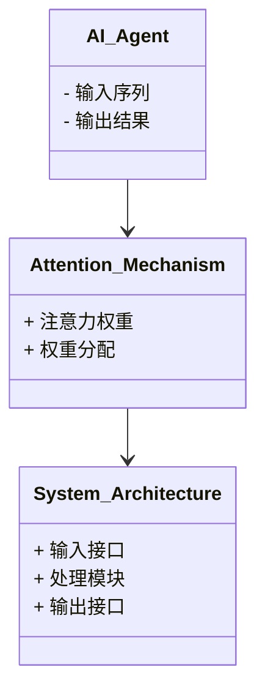

                 


# AI Agent的注意力机制：提高信息处理效率

## 关键词：
- AI Agent
- 注意力机制
- 信息处理效率
- 深度学习
- 自然语言处理
- 系统架构

## 摘要：
本文深入探讨AI Agent中注意力机制的核心原理及其在信息处理效率提升中的应用。通过分析注意力机制的背景、核心概念、算法原理、系统架构、项目实战和最佳实践，全面解析如何利用注意力机制优化信息处理流程，提升效率。文章结合理论与实践，提供详细的数学模型、算法流程和系统设计，帮助读者全面理解和掌握AI Agent中的注意力机制。

---

# 第1章: AI Agent的注意力机制概述

## 1.1 注意力机制的背景与发展

### 1.1.1 注意力机制的起源
- 早期心理学中的注意力研究
- 计算机科学中的注意力模拟
- 深度学习中的注意力概念引入

### 1.1.2 AI Agent中的注意力机制发展
- 自注意力机制的提出与演变
- 多头注意力机制的创新
- 分层注意力机制的应用

### 1.1.3 注意力机制的核心作用
- 提高信息处理的准确性
- 降低计算复杂度
- 增强模型的可解释性

## 1.2 AI Agent的信息处理效率问题

### 1.2.1 信息处理效率的定义
- 信息处理的定义与度量
- 信息处理效率的计算方法
- 提高效率的关键因素

### 1.2.2 注意力机制在信息处理中的重要性
- 注意力机制对信息选择的影响
- 注意力机制对信息权重分配的作用
- 注意力机制对信息处理速度的优化

### 1.2.3 提高信息处理效率的必要性
- 高效信息处理的需求背景
- 注意力机制在实际应用中的必要性
- 提高效率对系统性能的提升作用

## 1.3 注意力机制的基本概念

### 1.3.1 注意力机制的定义
- 注意力机制的定义与核心功能
- 注意力机制的基本组成部分
- 注意力机制的数学表达式

### 1.3.2 注意力机制的核心要素
- 查询（Query）
- 键（Key）
- 值（Value）
- 权重（Weight）

### 1.3.3 注意力机制的边界与外延
- 注意力机制的适用范围
- 注意力机制与其他机制的区别
- 注意力机制的未来发展

## 1.4 本章小结
- 总结注意力机制的背景与发展
- 强调注意力机制在信息处理中的重要性
- 展望注意力机制的未来发展

---

# 第2章: 注意力机制的核心概念与联系

## 2.1 注意力机制的原理

### 2.1.1 注意力计算的基本公式
- 点积注意力机制的数学公式
- 自注意力机制的计算流程
- 多头注意力机制的公式推导

### 2.1.2 权重分配的机制
- 权重计算的原理
- 权重分配的影响因素
- 权重调整的方法

### 2.1.3 注意力机制的数学模型
- 线性变换与注意力权重计算
- 激活函数在注意力机制中的应用
- 多头注意力的矩阵运算

## 2.2 注意力机制与其它机制的对比

### 2.2.1 注意力机制与传统特征提取方法的对比
- 传统特征提取方法的优缺点
- 注意力机制的优势与不足
- 两种方法的适用场景对比

### 2.2.2 注意力机制与强化学习的联系
- 强化学习中的注意力应用
- 两种机制的协同作用
- 组合优化的策略分析

### 2.2.3 注意力机制与生成模型的关系
- 生成模型中的注意力应用
- 注意力机制对生成效果的提升
- 生成模型与注意力机制的融合趋势

## 2.3 实体关系图与注意力机制的关联


## 2.4 本章小结
- 总结注意力机制的核心原理
- 对比注意力机制与其他机制的区别
- 强调注意力机制与其他技术的协同作用

---

# 第3章: 注意力机制的算法原理

## 3.1 注意力机制的数学模型

### 3.1.1 点积注意力机制
- 点积注意力的公式推导
- 点积注意力的计算流程
- 点积注意力的优缺点分析

### 3.1.2 自注意力机制
- 自注意力的定义与计算流程
- 自注意力机制的矩阵表示
- 自注意力机制的应用场景

### 3.1.3 多头注意力机制
- 多头注意力的结构与原理
- 多头注意力机制的公式推导
- 多头注意力机制的优势与局限性

## 3.2 注意力机制的计算流程


## 3.3 本章小结
- 总结注意力机制的数学模型
- 描述注意力机制的计算流程
- 分析不同注意力机制的优缺点

---

# 第4章: 注意力机制的系统分析与架构设计

## 4.1 项目背景介绍

### 4.1.1 项目目标
- 提高信息处理效率
- 优化系统性能
- 提升用户体验

### 4.1.2 项目需求
- 高效信息处理
- 实时响应
- 高可扩展性

## 4.2 系统功能设计

### 4.2.1 领域模型设计


### 4.2.2 功能模块划分
- 输入处理模块
- 注意力计算模块
- 权重分配模块
- 输出生成模块

## 4.3 系统架构设计

### 4.3.1 系统架构设计


### 4.3.2 交互流程设计


## 4.4 本章小结
- 描述项目背景与目标
- 分析系统功能设计
- 展示系统架构设计

---

# 第5章: 注意力机制的项目实战

## 5.1 环境安装与配置

### 5.1.1 环境要求
- Python版本要求
- 库的安装与配置
- 硬件要求

### 5.1.2 项目初始化
- 项目目录结构
- 初始化代码
- 环境变量配置

## 5.2 系统核心实现源代码

### 5.2.1 注意力机制实现代码
```python
import torch

def attention(query, key, value):
    # 点积注意力机制
    scores = torch.bmm(query, key.transpose(-2, -1))
    scores = torch.softmax(scores, dim=-1)
    output = torch.bmm(scores, value)
    return output
```

### 5.2.2 系统功能实现
```python
class AI-Agent:
    def __init__(self):
        self.input = None
        self.output = None
        self.attention_weights = None
    
    def process_input(self, input_sequence):
        # 输入处理
        self.input = input_sequence
    
    def compute_attention(self):
        # 注意力计算
        self.attention_weights = self.input @ self.input.transpose(-2, -1)
        self.attention_weights = torch.softmax(self.attention_weights, dim=-1)
    
    def generate_output(self):
        # 输出生成
        self.output = self.attention_weights @ self.input
        return self.output
```

### 5.2.3 代码应用解读与分析
- 代码的功能分析
- 代码的运行流程
- 代码的优化建议

## 5.3 实际案例分析与详细讲解剖析

### 5.3.1 案例背景
- 案例应用场景
- 案例输入与输出
- 案例目标

### 5.3.2 案例实现
- 实现步骤
- 实现细节
- 实现结果

### 5.3.3 案例分析
- 实现结果解读
- 案例优化建议
- 案例总结

## 5.4 本章小结
- 总结项目实战的环境配置
- 描述系统核心实现代码
- 分析实际案例的应用与优化

---

# 第6章: 注意力机制的最佳实践与总结

## 6.1 最佳实践 tips

### 6.1.1 注意力机制的应用建议
- 选择合适的注意力机制
- 参数调整与优化
- 模型训练与调优

### 6.1.2 系统设计的注意事项
- 系统架构的合理性
- 系统性能的优化
- 系统可扩展性设计

### 6.1.3 开发中的常见问题与解决方案
- 常见问题分析
- 解决方案总结
- 开发经验分享

## 6.2 小结

### 6.2.1 本章内容回顾
- 总结注意力机制的核心内容
- 描述注意力机制的系统设计
- 分析项目实战的经验与教训

## 6.3 注意事项

### 6.3.1 开发中的注意事项
- 模型选择的注意事项
- 参数调整的注意事项
- 系统性能优化的注意事项

### 6.3.2 使用中的注意事项
- 使用场景的选择
- 模型的适用性
- 模型的可解释性

## 6.4 未来展望

### 6.4.1 注意力机制的未来发展趋势
- 新型注意力机制的出现
- 注意力机制的优化与改进
- 注意力机制与其他技术的结合

### 6.4.2 AI Agent的未来发展
- AI Agent的智能化提升
- AI Agent的广泛应用
- AI Agent的持续创新

## 6.5 本章小结
- 总结注意力机制的最佳实践
- 展望注意力机制的未来发展

---

# 作者：AI天才研究院/AI Genius Institute & 禅与计算机程序设计艺术 /Zen And The Art of Computer Programming

