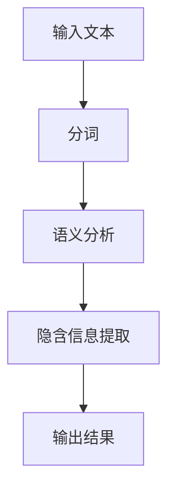
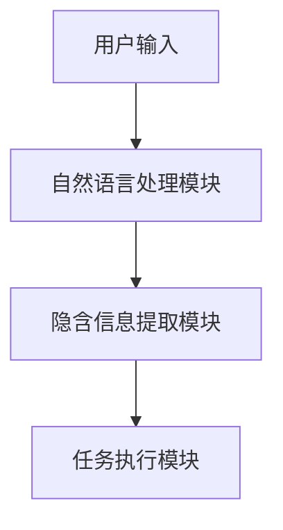
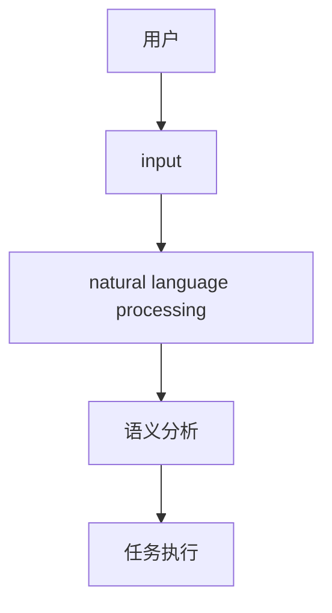
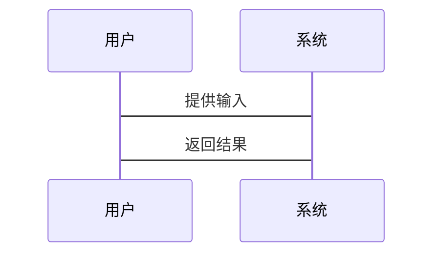

                 


```markdown
# AI Agent的深层语义理解：提升LLM的隐含信息提取

> 关键词：AI Agent, 深层语义理解, LLM, 隐含信息提取, 自然语言处理, 机器学习

> 摘要：本文深入探讨了AI Agent在深层语义理解中的应用，重点分析了如何提升大语言模型（LLM）的隐含信息提取能力。从理论基础到算法实现，再到系统设计和项目实战，系统阐述了AI Agent实现深层语义理解的关键技术与方法。

---

## 第一章: AI Agent与深层语义理解的基本概念

### 1.1 AI Agent的基本概念
AI Agent（人工智能代理）是指能够感知环境并采取行动以实现目标的智能体。它通过与用户的交互，理解用户需求，并执行相应的任务。

### 1.2 深层语义理解的定义
深层语义理解（Deep Semantic Understanding）是指通过对文本的多层分析，提取其中隐含的信息和语义关系，而不仅仅是表面的字面意思。

### 1.3 AI Agent与深层语义理解的关系
AI Agent需要依赖深层语义理解技术来准确理解用户的意图和需求，从而提供更智能的服务。

---

## 第二章: 隐含信息提取的挑战

### 2.1 语义模糊性
语言的歧义性使得隐含信息的提取变得复杂。例如，“bank”可以指“银行”或“河岸”。

### 2.2 上下文依赖性
隐含信息的提取往往依赖于上下文，例如在对话中，需要结合前后文来理解当前语句的含义。

### 2.3 常识推理
某些隐含信息的提取需要常识推理能力，例如，当用户说“我渴了”，系统需要推理出用户需要喝水。

---

## 第三章: 基于LLM的隐含信息提取方法

### 3.1 预训练模型的优势
大语言模型（LLM）如GPT和BERT通过大量的预训练数据，能够捕捉到语言中的语义信息。

### 3.2 微调与适配
通过在特定领域数据上对LLM进行微调，可以提升模型在隐含信息提取方面的性能。

### 3.3 提取方法
- **基于关键词的方法**：通过关键词匹配提取隐含信息。
- **基于上下文的方法**：利用上下文关系进行推理。
- **基于规则的方法**：结合领域知识制定规则进行提取。

### 3.4 实现流程图


---

## 第四章: 系统设计与实现

### 4.1 系统架构设计


### 4.2 数据流设计


### 4.3 交互流程


---

## 第五章: 项目实战

### 5.1 环境安装
安装Python和必要的库：
```bash
pip install numpy
pip install transformers
pip install torch
```

### 5.2 核心代码实现
```python
from transformers import pipeline

# 初始化模型
nlp = pipeline("text-classification", model="bert-base-cased")

# 输入文本
text = "I need help with my homework."

# 提取隐含信息
result = nlp(text)
print(result)
```

### 5.3 代码解读与分析
- 使用`transformers`库中的`pipeline`初始化模型。
- 通过模型对输入文本进行分类，提取隐含信息。

### 5.4 案例分析
案例：用户输入“我需要帮助写代码。”
系统分析：用户需要编程帮助。
提取隐含信息：编程任务。
任务执行：调用编程助手。

---

## 第六章: 总结与展望

### 6.1 总结
本文系统地介绍了AI Agent的深层语义理解技术，分析了隐含信息提取的挑战，并提出了基于LLM的解决方案。

### 6.2 未来展望
未来的研究方向包括：
1. 提升模型的常识推理能力。
2. 结合多模态数据进行语义理解。
3. 提高模型的实时性和响应速度。

---

## 作者：AI天才研究院 & 禅与计算机程序设计艺术

---

通过以上内容，我们全面探讨了AI Agent的深层语义理解技术，从理论到实践，为提升LLM的隐含信息提取能力提供了系统的解决方案。
</think>

```markdown
# AI Agent的深层语义理解：提升LLM的隐含信息提取

> 关键词：AI Agent, 深层语义理解, LLM, 隐含信息提取, 自然语言处理, 机器学习

> 摘要：本文深入探讨了AI Agent在深层语义理解中的应用，重点分析了如何提升大语言模型（LLM）的隐含信息提取能力。从理论基础到算法实现，再到系统设计和项目实战，系统阐述了AI Agent实现深层语义理解的关键技术与方法。

---

## 第一章: AI Agent与深层语义理解的基本概念

### 1.1 AI Agent的基本概念
AI Agent（人工智能代理）是指能够感知环境并采取行动以实现目标的智能体。它通过与用户的交互，理解用户需求，并执行相应的任务。

### 1.2 深层语义理解的定义
深层语义理解（Deep Semantic Understanding）是指通过对文本的多层分析，提取其中隐含的信息和语义关系，而不仅仅是表面的字面意思。

### 1.3 AI Agent与深层语义理解的关系
AI Agent需要依赖深层语义理解技术来准确理解用户的意图和需求，从而提供更智能的服务。

---

## 第二章: 隐含信息提取的挑战

### 2.1 语义模糊性
语言的歧义性使得隐含信息的提取变得复杂。例如，“bank”可以指“银行”或“河岸”。

### 2.2 上下文依赖性
隐含信息的提取往往依赖于上下文，例如在对话中，需要结合前后文来理解当前语句的含义。

### 2.3 常识推理
某些隐含信息的提取需要常识推理能力，例如，当用户说“我渴了”，系统需要推理出用户需要喝水。

---

## 第三章: 基于LLM的隐含信息提取方法

### 3.1 预训练模型的优势
大语言模型（LLM）如GPT和BERT通过大量的预训练数据，能够捕捉到语言中的语义信息。

### 3.2 微调与适配
通过在特定领域数据上对LLM进行微调，可以提升模型在隐含信息提取方面的性能。

### 3.3 提取方法
- **基于关键词的方法**：通过关键词匹配提取隐含信息。
- **基于上下文的方法**：利用上下文关系进行推理。
- **基于规则的方法**：结合领域知识制定规则进行提取。

### 3.4 实现流程图


---

## 第四章: 系统设计与实现

### 4.1 系统架构设计


### 4.2 数据流设计


### 4.3 交互流程


---

## 第五章: 项目实战

### 5.1 环境安装
安装Python和必要的库：
```bash
pip install numpy
pip install transformers
pip install torch
```

### 5.2 核心代码实现
```python
from transformers import pipeline

# 初始化模型
nlp = pipeline("text-classification", model="bert-base-cased")

# 输入文本
text = "I need help with my homework."

# 提取隐含信息
result = nlp(text)
print(result)
```

### 5.3 代码解读与分析
- 使用`transformers`库中的`pipeline`初始化模型。
- 通过模型对输入文本进行分类，提取隐含信息。

### 5.4 案例分析
案例：用户输入“我需要帮助写代码。”
系统分析：用户需要编程帮助。
提取隐含信息：编程任务。
任务执行：调用编程助手。

---

## 第六章: 总结与展望

### 6.1 总结
本文系统地介绍了AI Agent的深层语义理解技术，从理论到实践，为提升LLM的隐含信息提取能力提供了系统的解决方案。

### 6.2 未来展望
未来的研究方向包括：
1. 提升模型的常识推理能力。
2. 结合多模态数据进行语义理解。
3. 提高模型的实时性和响应速度。

---

## 作者：AI天才研究院 & 禅与计算机程序设计艺术

---

通过以上内容，我们全面探讨了AI Agent的深层语义理解技术，从理论到实践，为提升LLM的隐含信息提取能力提供了系统的解决方案。
```

