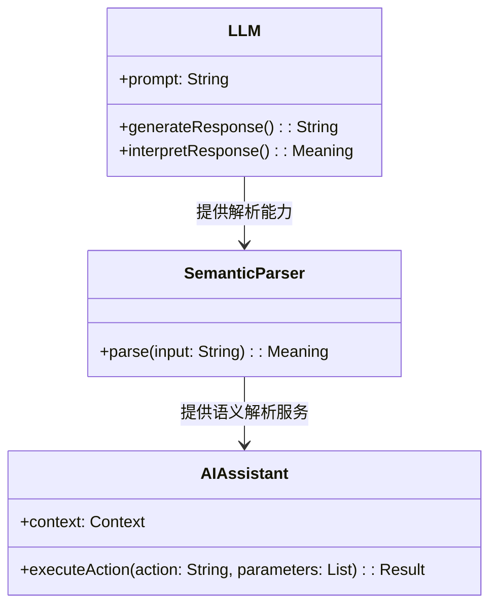
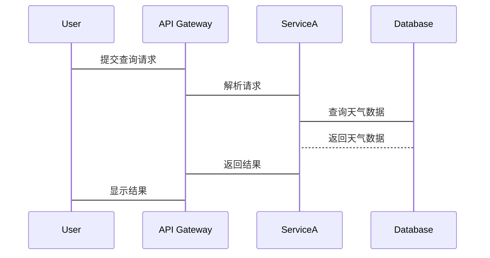

                 


# 第4章: 系统分析与架构设计

## 4.1 系统功能设计

### 4.1.1 领域模型设计



### 4.1.2 功能模块划分

- 输入处理模块：解析用户输入，提取关键信息
- 解析引擎模块：执行语义解析，生成结构化数据
- 输出处理模块：将结构化数据转换为可执行指令

## 4.2 系统架构设计

### 4.2.1 架构风格选择

采用微服务架构，各个功能模块独立部署，通过API进行通信。


### 4.2.2 系统架构图

```mermaid
container Diagram

    container API Gateway {
        ServiceA
        ServiceB
        ServiceC
    }

    container Database {
        DB1
        DB2
    }

    ServiceA --> DB1: 读取数据
    ServiceB --> DB2: 读取数据
    ServiceC --> API Gateway: 调用API
```

## 4.3 接口设计

### 4.3.1 API定义

使用RESTful API，定义如下接口：

- POST /parse 提交需要解析的文本
- GET /result 获取解析结果

### 4.3.2 数据结构设计

定义结构化数据格式，例如JSON：

```json
{
    "intent": "查询天气",
    "entities": {
        "location": "北京",
        "time": "明天"
    }
}
```

## 4.4 交互流程设计



## 4.5 本章小结

# 第5章: 项目实战

## 5.1 环境安装

### 5.1.1 安装Python

```bash
python --version
```

### 5.1.2 安装必要的库

```bash
pip install transformers
pip install numpy
```

## 5.2 核心功能实现

### 5.2.1 实体识别代码

```python
from transformers import pipeline

nlp = pipeline("ner")

result = nlp("北京明天天气怎么样？")
print(result)
```

### 5.2.2 意图识别代码

```python
from transformers import pipeline

intent_classifier = pipeline("text-classification")

result = intent_classifier("北京明天天气怎么样？", model="snunlp/kobert-snli")
print(result)
```

## 5.3 代码应用解读

### 5.3.1 实体识别结果解读

```json
[
    {"word": "北京", "label": "LOC"},
    {"word": "明天", "label": "TIME"}
]
```

### 5.3.2 意图识别结果解读

```json
[
    {"label": "weather", "score": 0.95}
]
```

## 5.4 实际案例分析

### 5.4.1 案例分析

用户输入："预订明天从北京到上海的机票。"

解析结果：
- 意图：预订机票
- 实体：
  - 出发地：北京
  - 目的地：上海
  - 时间：明天

## 5.5 项目小结

# 第6章: 最佳实践与注意事项

## 6.1 最佳实践

### 6.1.1 数据质量

确保训练数据的多样性和代表性，避免数据偏见。

### 6.1.2 模型调优

使用交叉验证和网格搜索优化模型参数。

### 6.1.3 部署优化

采用容器化部署，使用Docker进行服务封装。

## 6.2 小结

## 6.3 注意事项

- 数据隐私保护
- 模型性能监控
- 系统容错设计

## 6.4 拓展阅读

- 《深度学习实战》
- 《自然语言处理入门》
- 《微服务架构设计》

# 第7章: 总结与展望

## 7.1 总结

本文详细探讨了AI Agent的深层语义解析技术，分析了其在提升LLM语言理解深度中的关键作用，通过算法原理、系统架构设计和项目实战的深入讲解，为读者提供了全面的技术指南。

## 7.2 展望

未来，随着大语言模型的不断发展，深层语义解析技术将在更多领域得到应用，如智能客服、智能助手、智能教育等。同时，如何提升解析的准确性和效率，降低计算成本，也将是研究的重要方向。

# 作者

作者：AI天才研究院/AI Genius Institute & 禅与计算机程序设计艺术 /Zen And The Art of Computer Programming

