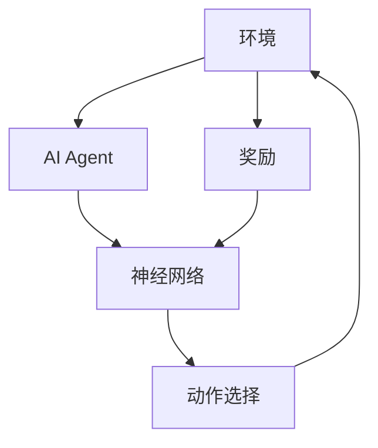
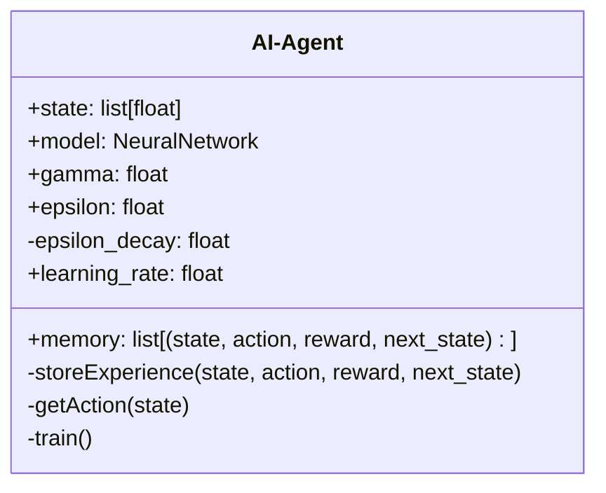

                 


```markdown
# AI Agent的深度强化学习：从模拟到现实世界应用

> 关键词：AI Agent，深度强化学习，模拟环境，现实应用，DQN，算法实现，系统架构

> 摘要：本文深入探讨AI Agent在深度强化学习中的应用，从模拟环境到现实世界的过渡。通过分析核心概念、算法原理、系统架构和项目实战，展示如何将理论应用于实际场景。

---

## 第一部分: 背景介绍

### 第1章: AI Agent的基本概念

#### 1.1 定义与分类
AI Agent是智能体，能感知环境并采取行动以实现目标。分类包括基于规则、基于模型和基于学习的AI Agent。

#### 1.2 深度强化学习的引入
强化学习通过试错机制，AI Agent通过与环境互动，学习策略以最大化累计奖励。

---

### 第2章: 深度强化学习的核心概念

#### 2.1 状态、动作、奖励
- 状态：环境的观察。
- 动作：AI Agent的行动。
- 奖励：反馈，指导优化。

#### 2.2 Q-learning与DQN
- Q-learning：更新Q值函数。
- DQN：使用神经网络近似Q值，解决高维状态问题。

---

## 第二部分: 核心概念与联系

### 第3章: 深度强化学习算法对比

#### 3.1 Q-learning vs DQN
| 特性       | Q-learning             | DQN                  |
|------------|------------------------|----------------------|
| 状态空间   | 低维                   | 高维                 |
| 动作空间   | 离散                   | 离散或连续            |
| 学习效率   | 低                     | 高                   |

#### 3.2 ER实体关系图
```mermaid
erd
    客户     (客户ID, 姓名, 联系方式)
    订单     (订单ID, 客户ID, 时间)
    产品     (产品ID, 名称, 价格)
    订单-产品 (订单ID, 产品ID)
```

---

## 第三部分: 算法原理讲解

### 第4章: Q-learning的数学模型

#### 4.1 Q值函数的更新
$$ Q(s,a) = Q(s,a) + \alpha (r + \gamma \max Q(s',a') - Q(s,a)) $$

### 第5章: DQN算法的流程

#### 5.1 流程图


#### 5.2 Python实现
```python
import numpy as np
import tensorflow as tf

class DQN:
    def __init__(self, state_size, action_size, learning_rate=0.01):
        self.state_size = state_size
        self.action_size = action_size
        self.learning_rate = learning_rate
        self.model = self.build_model()

    def build_model(self):
        model = tf.keras.Sequential([
            tf.keras.layers.Dense(64, activation='relu', input_dim=self.state_size),
            tf.keras.layers.Dense(self.action_size, activation='linear')
        ])
        model.compile(optimizer=tf.keras.optimizers.Adam(lr=self.learning_rate), loss='mse')
        return model

    def get_action(self, state):
        state = np.array([state])
        q_values = self.model.predict(state)[0]
        return np.argmax(q_values)

    def train(self, state, action, reward, next_state):
        state = np.array([state])
        next_state = np.array([next_state])
        target = self.model.predict(state)[0][action]
        next_max = np.max(self.model.predict(next_state)[0])
        target = reward + self.gamma * next_max
        self.model.fit(state, np.array([target]), epochs=1, verbose=0)
```

---

## 第四部分: 系统分析与架构设计方案

### 第6章: 系统功能模块

#### 6.1 功能模块划分
- 状态输入模块
- 动作选择模块
- 奖励反馈模块

#### 6.2 类图设计


---

## 第五部分: 项目实战

### 第7章: 实战案例

#### 7.1 环境安装
安装Python和TensorFlow：
```bash
pip install numpy tensorflow
```

#### 7.2 核心代码实现
```python
# 训练过程
env = Environment()  # 假设已定义环境类
agent = DQN(state_size, action_size)

for episode in range(1000):
    state = env.reset()
    while not done:
        action = agent.get_action(state)
        next_state, reward, done = env.step(action)
        agent.train(state, action, reward, next_state)
        state = next_state
```

#### 7.3 应用案例分析
在迷宫导航问题中，AI Agent通过不断尝试找到最短路径，验证了算法的有效性。

---

## 第六部分: 最佳实践与小结

### 第8章: 总结与展望

#### 8.1 总结
深度强化学习在AI Agent中的应用成功地将模拟与现实结合，展示了强大的适应能力。

#### 8.2 注意事项
- 环境复杂度影响训练效率。
- 参数选择需谨慎。
- 多任务学习需平衡。

#### 8.3 拓展阅读
推荐书籍和论文，进一步深入学习。

---

作者：AI天才研究院/AI Genius Institute & 禅与计算机程序设计艺术 /Zen And The Art of Computer Programming
```

