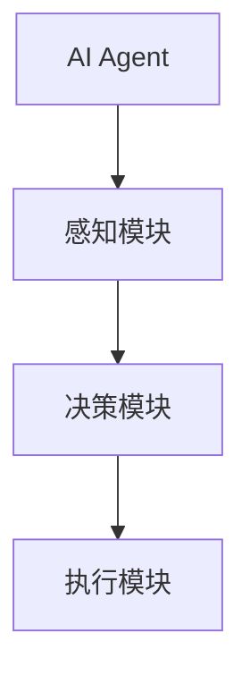
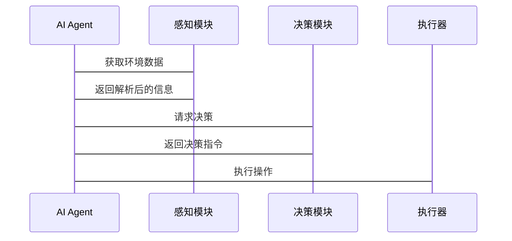

                 


# AI Agent的版本控制与迭代优化流程

## 关键词：AI Agent，版本控制，迭代优化，系统架构，项目实战

## 摘要：本文详细探讨了AI Agent的版本控制与迭代优化流程，从背景介绍到系统架构设计，再到项目实战和最佳实践，深入分析了AI Agent的核心概念、算法原理和实际应用。通过具体案例和详细解读，帮助读者掌握AI Agent的版本控制与迭代优化的关键流程和技术。

---

# 第1章: AI Agent的背景介绍

## 1.1 AI Agent的基本概念
### 1.1.1 什么是AI Agent
AI Agent（人工智能代理）是指能够感知环境、自主决策并执行任务的智能实体。它通过传感器获取信息，利用算法进行推理，并通过执行器与环境交互。

### 1.1.2 AI Agent的核心特点
AI Agent具有自主性、反应性、目标导向和社会能力等特点。它能够根据环境变化动态调整行为，以实现预定目标。

### 1.1.3 AI Agent与传统AI的区别
AI Agent与传统AI的主要区别在于其自主性和适应性。传统AI通常需要明确的输入和规则，而AI Agent能够在复杂环境中自主决策。

## 1.2 问题背景与问题描述
### 1.2.1 AI Agent版本控制的必要性
随着AI Agent的应用场景复杂化，版本控制变得至关重要。不同的版本可能需要适应不同的环境和任务，版本控制确保了不同版本的可追溯性和可管理性。

### 1.2.2 AI Agent迭代优化的挑战
AI Agent的迭代优化面临数据依赖性、计算资源消耗大以及模型复杂性增加等挑战。如何在保证性能的同时优化模型是关键问题。

### 1.2.3 问题解决的思路与方法
通过模块化设计、增量更新和性能监控等方法，可以有效管理和优化AI Agent的版本。

## 1.3 问题的边界与外延
### 1.3.1 AI Agent版本控制的边界
版本控制主要关注AI Agent的代码、模型和配置文件，不涉及外部依赖服务。

### 1.3.2 迭代优化的范围与限制
迭代优化通常在训练阶段进行，而在实际应用中，优化需要考虑实时性能和资源消耗。

### 1.3.3 相关概念的对比分析
对比分析AI Agent与其他AI形式（如传统AI、大模型）的区别，明确版本控制和迭代优化的目标和范围。

## 1.4 核心概念结构与组成要素
### 1.4.1 AI Agent的组成要素
AI Agent由感知模块、决策模块和执行模块组成，各模块协同工作以完成任务。

### 1.4.2 版本控制的核心要素
版本控制包括版本号生成、变更记录和版本回滚等功能，确保不同版本的可追溯性和稳定性。

### 1.4.3 迭代优化的关键组成
迭代优化涉及数据采集、模型训练和性能评估，通过不断优化模型提升AI Agent的表现。

---

# 第2章: AI Agent的核心原理

## 2.1 核心原理概述
### 2.1.1 AI Agent的工作原理
AI Agent通过感知环境信息，利用算法生成决策，并通过执行器执行操作，以实现预定目标。

### 2.1.2 版本控制的基本原理
版本控制通过记录代码、模型和配置的变化，实现不同版本的管理和回滚，确保系统的稳定性和可维护性。

### 2.1.3 迭代优化的核心机制
迭代优化通过不断训练和调整模型参数，优化模型性能，提升AI Agent的决策能力。

## 2.2 核心概念的属性对比
### 2.2.1 AI Agent与传统AI的对比
| 特性         | AI Agent                     | 传统AI                      |
|--------------|----------------------------|-----------------------------|
| 自主性       | 高                           | 低或无                      |
| 适应性       | 强                           | 较弱                        |
| 应用场景       | 复杂、动态环境               | 稳定、简单环境               |

### 2.2.2 版本控制与传统开发的对比
版本控制在AI Agent开发中的作用与传统软件开发类似，但需考虑模型的复杂性和数据依赖性。

---

# 第3章: AI Agent的算法原理

## 3.1 版本控制的算法流程
### 3.1.1 版本号生成
使用时间戳和哈希值生成唯一的版本号，确保每个版本的唯一性。

### 3.1.2 变更记录
通过日志记录每次修改的内容，便于回溯和分析。

### 3.1.3 版本回滚
当出现问题时，通过版本回滚恢复到之前的稳定版本。

## 3.2 迭代优化的算法策略
### 3.2.1 数据采集与预处理
收集相关数据并进行清洗和归一化处理，为模型训练提供高质量的数据。

### 3.2.2 模型训练
使用机器学习算法（如梯度下降、随机森林）训练模型，优化模型参数。

### 3.2.3 性能评估
通过准确率、召回率等指标评估模型性能，指导下一步优化方向。

## 3.3 数学模型与公式
### 3.3.1 版本号生成的哈希函数
$$ hash(s) = \sum_{i=0}^{n-1} s[i] \times 256^{n-1-i} $$

### 3.3.2 迭代优化的损失函数
$$ L(y, y_{\text{pred}}) = \frac{1}{2m} \sum_{i=1}^{m} (y_i - y_{\text{pred},i})^2 $$

---

# 第4章: AI Agent的系统架构设计

## 4.1 系统架构图


## 4.2 功能模块划分
| 模块         | 功能描述                     |
|--------------|-----------------------------|
| 感知模块     | 采集环境信息                 |
| 决策模块     | 分析信息生成决策             |
| 执行模块     | 执行决策操作                |

## 4.3 系统接口设计
### 4.3.1 感知模块接口
- 输入：环境数据
- 输出：解析后的信息

### 4.3.2 决策模块接口
- 输入：解析后的信息
- 输出：决策指令

## 4.4 系统交互流程


---

# 第5章: 项目实战

## 5.1 环境安装
### 5.1.1 安装Python
使用Python 3.8及以上版本，安装所需的库：numpy、pandas、scikit-learn。

### 5.1.2 安装AI框架
安装TensorFlow或PyTorch框架，用于模型训练和优化。

## 5.2 核心代码实现
### 5.2.1 版本控制代码
```python
def generate_version_hash(data):
    import hashlib
    return hashlib.sha256(data.encode()).hexdigest()
```

### 5.2.2 迭代优化代码
```python
def train_model(X, y):
    from sklearn.linear_model import SGDClassifier
    model = SGDClassifier()
    model.fit(X, y)
    return model
```

## 5.3 代码解读与分析
### 5.3.1 版本控制代码解读
上述代码通过哈希算法生成版本号，确保每个版本的唯一性。

### 5.3.2 迭代优化代码解读
使用SGDClassifier进行模型训练，通过迭代优化提升模型性能。

## 5.4 实际案例分析
### 5.4.1 案例背景
假设我们正在开发一个智能客服AI Agent，需要处理客户的问题并提供解决方案。

### 5.4.2 案例分析
通过版本控制和迭代优化，提升AI Agent的响应速度和准确性。

## 5.5 项目小结
通过实际案例分析，验证了版本控制与迭代优化的有效性，为后续优化提供了依据。

---

# 第6章: 最佳实践与总结

## 6.1 最佳实践
### 6.1.1 版本控制的注意事项
定期备份数据，确保版本控制的及时性和完整性。

### 6.1.2 迭代优化的常见问题
注意数据泄露、过拟合等问题，确保模型的泛化能力。

## 6.2 总结
本文详细探讨了AI Agent的版本控制与迭代优化流程，从理论到实践，全面分析了相关技术和方法。

## 6.3 拓展阅读
推荐阅读《机器学习实战》和《深度学习入门》等书籍，深入理解AI Agent的技术细节。

---

作者：AI天才研究院/AI Genius Institute & 禅与计算机程序设计艺术 /Zen And The Art of Computer Programming

