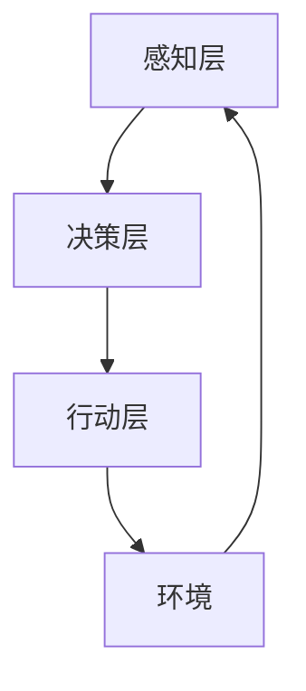
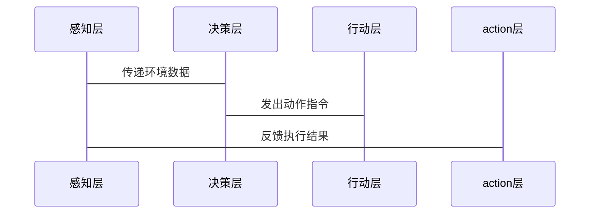

                 


# AI Agent的生物启发式学习算法实现

> 关键词：AI Agent，生物启发式学习，神经网络，遗传算法，强化学习，系统架构

> 摘要：本文详细探讨了AI Agent的生物启发式学习算法，涵盖从基础概念到实际应用的各个方面。通过分析神经网络、遗传算法和强化学习的原理，结合系统架构设计和项目实战，为读者提供了全面的指导。

---

# 第1章: AI Agent与生物启发式学习概述

## 1.1 AI Agent的基本概念

### 1.1.1 AI Agent的定义
AI Agent（人工智能代理）是能够感知环境并采取行动以实现目标的智能实体。它可以是一个软件程序或物理设备，通过与环境交互来优化其行为。

### 1.1.2 生物启发式学习的定义
生物启发式学习算法是受生物系统启发的学习方法，如神经网络模仿人脑结构，遗传算法模拟自然进化。

### 1.1.3 两者的结合与应用
将生物启发式算法应用于AI Agent，使其能够自主学习和适应环境，常见于机器人控制、自动驾驶和游戏AI等领域。

---

# 第2章: 生物启发式学习算法的核心原理

## 2.1 神经网络的基本原理

### 2.1.1 神经元模型
神经元通过激活函数处理输入，传递信号。常用的激活函数有Sigmoid和ReLU。

### 2.1.2 网络结构
神经网络由输入层、隐藏层和输出层组成，各层节点通过权重连接，形成复杂的计算结构。

### 2.1.3 学习机制
通过反向传播算法和梯度下降优化权重，使网络能够学习输入与输出的关系。

## 2.2 遗传算法的基本原理

### 2.2.1 适应度函数
评估个体适应环境的能力，适应度高的个体更可能被选中繁殖。

### 2.2.2 交叉与变异操作
通过交叉重组父代基因，变异引入随机变化，增加种群多样性。

### 2.2.3 进化过程
种群通过选择、交叉和变异迭代进化，逐步适应环境。

## 2.3 强化学习的基本原理

### 2.3.1 奖励机制
智能体通过执行动作获得奖励，奖励指导学习策略优化。

### 2.3.2 策略优化
通过最大化奖励期望，优化策略参数，使智能体选择最优动作。

### 2.3.3 探索与利用
平衡探索新动作和利用已知好动作，以避免陷入局部最优。

---

# 第3章: 基于生物启发式学习的AI Agent算法

## 3.1 强化学习算法

### 3.1.1 Q-Learning
通过Q表记录状态-动作对的价值，更新Q值以最大化未来奖励。

### 3.1.2 Deep Q-Networks
使用深度神经网络近似Q值函数，解决高维状态空间问题。

### 3.1.3 Policy Gradient Methods
直接优化策略参数，通过梯度上升最大化奖励期望。

## 3.2 进化策略算法

### 3.2.1 进化策略的基本步骤
评估个体适应度，选择高适应度个体，进行交叉和变异，生成新种群。

### 3.2.2 突变与交叉操作
通过随机突变和交叉重组，生成新的个体，增加种群多样性。

### 3.2.3 适应度评估
评估每个个体在环境中的表现，决定其生存和繁殖机会。

## 3.3 模仿学习算法

### 3.3.1 基于示例的模仿学习
通过观察专家行为，学习模仿其动作，适用于机器人控制。

### 3.3.2 知识蒸馏
将专家知识迁移到学生模型，减少数据需求，提高学习效率。

### 3.3.3 迁移学习
将已知任务的知识应用到新任务，加速学习过程。

---

# 第4章: 生物启发式学习算法的数学模型

## 4.1 神经网络的数学模型

### 4.1.1 网络结构的数学表示
使用矩阵和向量表示输入、权重和输出，如输入矩阵X，权重矩阵W，输出向量Y = W^T X。

### 4.1.2 激活函数的选择
Sigmoid函数σ(x) = 1/(1+e^{-x})，ReLU函数f(x) = max(0, x)。

### 4.1.3 损失函数的定义
均方误差损失：L = (1/2m)∑(y_i - y_hat_i)^2，交叉熵损失：L = -1/m∑y_i log(y_hat_i) + (1-y_i) log(1-y_hat_i)。

## 4.2 强化学习的数学模型

### 4.2.1 状态-动作-奖励的数学表示
状态s，动作a，奖励r，目标是最大化期望奖励：J(θ) = E[R_t], 使用策略梯度法更新参数θ，梯度∇J(θ) = E[∇ log π(a|s) * Q(s,a)]。

### 4.2.2 Q值的更新公式
Q-learning的更新公式：Q(s,a) ← Q(s,a) + α(y - Q(s,a))，其中y = r + γ max(Q(s',a'))。

### 4.2.3 策略的优化方法
策略梯度法优化：∇θ log π(a|s) * Q(s,a)，使用Adam优化器更新参数。

## 4.3 遗传算法的数学模型

### 4.3.1 适应度函数的计算
适应度f(x)衡量个体适应环境的能力，通常为最大化目标函数。

### 4.3.2 交叉与变异
交叉操作：父母基因重组生成子代，变异操作随机改变基因，增加多样性。

---

# 第5章: AI Agent的系统架构设计

## 5.1 系统架构概述

### 5.1.1 系统功能设计
AI Agent系统包括感知、决策、行动三个模块，感知环境信息，决策最优动作，执行动作。

### 5.1.2 系统架构设计
采用分层架构，感知层处理输入数据，决策层执行算法，行动层执行动作。

## 5.2 系统架构图



## 5.3 接口设计

### 5.3.1 感知层接口
接收环境输入，如传感器数据，传递给决策层。

### 5.3.2 决策层接口
处理输入数据，生成决策信号，传递给行动层。

### 5.3.3 行动层接口
执行决策动作，反馈执行结果，更新系统状态。

## 5.4 交互流程图



---

# 第6章: 项目实战

## 6.1 环境配置

### 6.1.1 安装必要的库
使用Python，安装TensorFlow、Keras、OpenAI Gym等库。

```bash
pip install tensorflow keras gym
```

## 6.2 核心代码实现

### 6.2.1 强化学习实现（Q-Learning）

```python
import numpy as np

class QLAgent:
    def __init__(self, state_size, action_size):
        self.state_size = state_size
        self.action_size = action_size
        self.Q = np.zeros((state_size, action_size))

    def act(self, state):
        return np.argmax(self.Q[state, :])

    def update(self, state, action, reward, next_state):
        alpha = 0.1
        gamma = 0.9
        self.Q[state, action] += alpha * (reward + gamma * max(self.Q[next_state, :]) - self.Q[state, action])
```

### 6.2.2 神经网络实现（Deep Q-Networks）

```python
from tensorflow.keras import layers

model = layers.Sequential([
    layers.Dense(64, activation='relu', input_shape=(state_size,)),
    layers.Dense(action_size, activation='linear')
])
model.compile(optimizer='adam', loss='mean_squared_error')
```

## 6.3 案例分析

### 6.3.1 机器人控制
使用强化学习训练机器人在迷宫中导航，通过奖励机制引导机器人找到出口。

### 6.3.2 游戏AI
训练AI在游戏环境中做出最优决策，如使用深度Q网络在Atari游戏中实现高分。

## 6.4 代码解读

### 6.4.1 强化学习代码
Q-Learning通过Q表记录状态-动作价值，Deep Q-Networks使用神经网络近似Q值函数，模型通过经验回放和目标网络优化。

### 6.4.2 系统交互
感知层接收环境输入，决策层执行算法，行动层执行动作，形成闭环。

---

# 第7章: 总结与展望

## 7.1 最佳实践 tips

### 7.1.1 算法选择
根据任务需求选择合适的算法，强化学习适合动态环境，遗传算法适合优化问题。

### 7.1.2 系统设计
模块化设计便于维护和扩展，分层架构提高系统的可读性和可维护性。

## 7.2 小结

通过生物启发式学习算法，AI Agent能够自主学习和适应环境，实现复杂任务。本文详细讲解了神经网络、遗传算法和强化学习的原理，以及系统架构设计和项目实战。

## 7.3 注意事项

- 确保算法的收敛性，避免陷入局部最优。
- 合理设置超参数，如学习率和折扣因子。
- 定期维护和优化系统架构，保持代码的清洁和高效。

## 7.4 拓展阅读

推荐阅读《深度学习》和《强化学习》相关书籍，深入了解算法细节和应用案例。

---

# 作者：AI天才研究院/AI Genius Institute & 禅与计算机程序设计艺术 /Zen And The Art of Computer Programming

---

以上是《AI Agent的生物启发式学习算法实现》的技术博客文章的完整大纲和内容，涵盖了从基础概念到实际应用的各个方面，结构清晰，内容详实，旨在为读者提供全面的指导。

