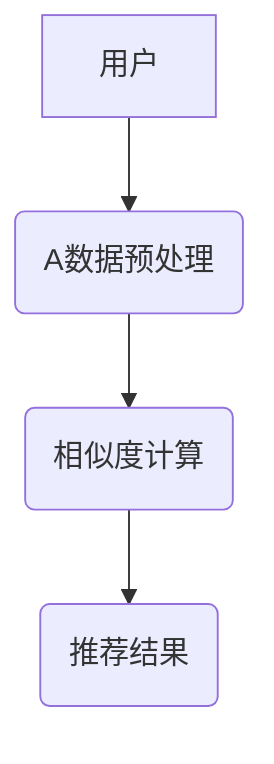
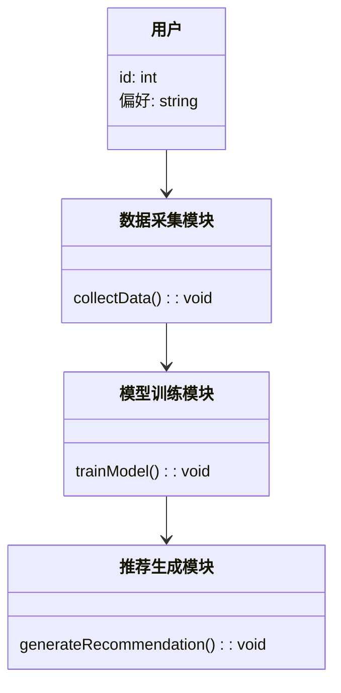
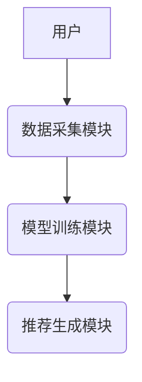
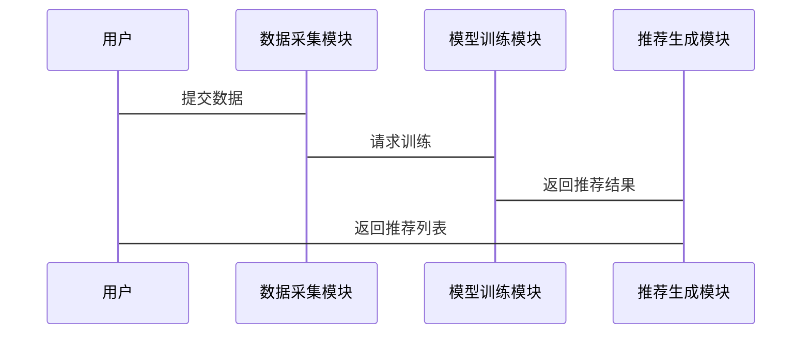

                 


# AI Agent的用户体验优化与个性化

## 关键词
AI Agent, 用户体验优化, 个性化推荐, 自然语言处理, 强化学习, 系统架构设计

## 摘要
AI Agent作为人工智能领域的重要组成部分，正在成为提升用户体验的核心技术。本文将从AI Agent的基本概念、算法原理、系统架构设计到实际项目案例，详细探讨如何通过AI Agent实现用户体验的优化与个性化服务。通过分析推荐算法、自然语言处理和强化学习等技术，结合实际案例，本文将为读者提供一个全面的视角，帮助他们理解并应用这些技术来提升用户满意度和产品竞争力。

---

# 第一部分: AI Agent的背景与核心概念

## 第1章: AI Agent的基本概念与背景

### 1.1 AI Agent的定义与特点
AI Agent，即人工智能代理，是一种能够感知环境、自主决策并执行任务的智能实体。其特点包括：

1. **自主性**：能够在没有外部干预的情况下独立运作。
2. **反应性**：能够实时感知环境变化并做出相应的反应。
3. **学习性**：通过数据和反馈不断优化自身的行为和决策。
4. **协作性**：能够与其他系统或用户进行交互和协作。

AI Agent的应用领域广泛，包括智能助手、推荐系统、自动驾驶等。

### 1.2 AI Agent的发展历程
AI Agent的发展经历了以下几个阶段：

1. **规则驱动阶段**：基于预定义的规则进行简单决策，如专家系统。
2. **数据驱动阶段**：通过机器学习算法从数据中学习模式，如协同过滤推荐。
3. **强化学习阶段**：通过与环境的交互不断优化决策策略，如AlphaGo。

### 1.3 用户体验优化与个性化
用户体验优化的核心目标是提高用户满意度和产品易用性。AI Agent通过以下方式实现个性化服务：

1. **用户行为分析**：通过分析用户的点击、浏览等行为，预测用户的偏好。
2. **个性化推荐**：基于用户的兴趣和行为，提供定制化的推荐内容。
3. **实时反馈**：通过实时与用户交互，动态调整服务内容。

---

## 第2章: AI Agent的核心概念与体系结构

### 2.1 AI Agent的体系结构
AI Agent的体系结构可以分为以下模块：

1. **感知模块**：负责收集和处理环境中的数据。
2. **决策模块**：基于感知数据，通过算法做出决策。
3. **执行模块**：将决策转化为具体的行动。

### 2.2 AI Agent的核心原理
AI Agent的核心原理包括：

1. **数据预处理**：对收集到的用户数据进行清洗和特征提取。
2. **模型训练**：通过机器学习算法训练模型，以预测用户的偏好。
3. **决策优化**：通过强化学习不断优化决策策略。

### 2.3 AI Agent与用户体验的关系
AI Agent通过分析用户需求和行为，优化用户体验。例如，通过个性化推荐算法，AI Agent可以根据用户的兴趣和行为，提供更加精准的内容推荐。

---

## 第3章: AI Agent的算法原理与数学模型

### 3.1 推荐算法原理
推荐算法是AI Agent实现个性化服务的核心技术之一。常用的推荐算法包括：

1. **协同过滤算法**：基于用户行为相似性进行推荐。
2. **基于内容的推荐算法**：基于商品的特征进行推荐。
3. **混合推荐算法**：结合协同过滤和基于内容的推荐。

#### 协同过滤算法的实现流程



### 3.2 自然语言处理算法
自然语言处理（NLP）算法用于理解和生成人类语言。常用的NLP算法包括：

1. **词袋模型**：将文本表示为词汇的集合。
2. **深度学习模型**：如LSTM和Transformer。
3. **强化学习模型**：用于对话生成。

### 3.3 强化学习算法
强化学习通过与环境的交互，学习最优策略。常用的强化学习算法包括：

1. **Q-learning**：通过状态和动作的值函数进行决策。
2. **Deep Q-Networks (DQN)**：结合深度学习和强化学习。

---

## 第4章: AI Agent的系统分析与架构设计

### 4.1 系统功能设计
系统功能设计包括：

1. **用户数据采集**：通过日志和传感器采集用户数据。
2. **模型训练**：基于用户数据训练推荐模型。
3. **推荐生成**：根据训练好的模型生成推荐结果。

#### 系统功能模块类图



### 4.2 系统架构设计
系统架构设计包括：

1. **单体架构**：适合小型项目，功能模块集中。
2. **微服务架构**：适合大型项目，功能模块独立。

#### 系统架构图



### 4.3 系统接口设计
系统接口设计包括：

1. **REST API**：用于数据采集和推荐结果返回。
2. **WebSocket**：用于实时交互。

### 4.4 系统交互流程图



---

## 第5章: 项目实战与案例分析

### 5.1 环境安装
项目实战需要以下环境：

1. Python 3.8+
2. TensorFlow 2.0+
3. scikit-learn 0.24+

### 5.2 核心代码实现
以下是协同过滤算法的实现代码：

```python
from sklearn.metrics.pairwise import cosine_similarity

# 数据预处理
def preprocess_data(data):
    # 假设data是一个数据框
    return data

# 计算相似度
def calculate_similarity(data):
    similarity = cosine_similarity(data)
    return similarity

# 生成推荐
def generate_recommendation(similarity, user_id):
    # 返回推荐列表
    pass
```

### 5.3 代码解读与分析
协同过滤算法通过计算用户之间的相似度，找到与目标用户最相似的用户，然后推荐这些用户喜欢的商品。

### 5.4 案例分析
通过实际案例分析，展示AI Agent在用户体验优化中的应用效果。

---

## 第6章: 总结与展望

### 6.1 总结
本文从AI Agent的基本概念到实际应用，详细探讨了AI Agent在用户体验优化与个性化中的实现方法。

### 6.2 展望
未来，AI Agent将在更多领域得到应用，同时需要解决数据隐私、计算效率等问题。

---

# 结语

AI Agent作为人工智能的重要应用，正在深刻改变我们的生活方式。通过本文的分析，希望读者能够更好地理解AI Agent的技术原理，并将其应用到实际项目中。

---

# 作者信息

作者：AI天才研究院/AI Genius Institute & 禅与计算机程序设计艺术 /Zen And The Art of Computer Programming

