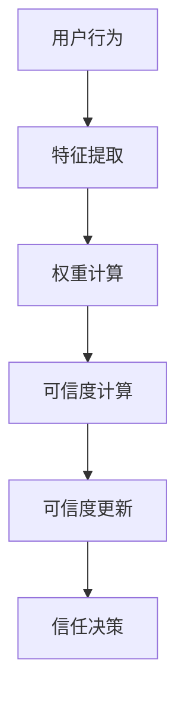

                 


# AI Agent的用户信任建立与维护机制

> 关键词：AI Agent, 用户信任, 可靠性, 透明性, 可解释性

> 摘要：本文系统地探讨了AI Agent的用户信任建立与维护机制。从基本概念到算法原理，再到系统架构与项目实战，全面分析了如何通过可靠性、透明性、可解释性和用户控制权等核心要素，结合数学模型与实际案例，确保AI Agent与用户之间建立和维护长期信任关系。

---

## 第1章: AI Agent与用户信任的基本概念

### 1.1 AI Agent的定义与类型
- **1.1.1 AI Agent的定义**  
  AI Agent（人工智能代理）是能够感知环境、自主决策并执行任务的智能体。它可以是一个软件程序、一个机器人或一个虚拟助手。
  
- **1.1.2 AI Agent的主要类型**  
  - **简单反射型AI Agent**：基于预定义规则执行任务，适用于简单的场景，如自动回复机器人。  
  - **基于模型的反射型AI Agent**：通过内部模型理解和推理环境，适用于复杂任务，如自动驾驶。  
  - **目标驱动型AI Agent**：以特定目标为导向，主动规划和优化行为，如智能推荐系统。  
  - **学习增强型AI Agent**：通过机器学习不断优化行为，如智能音箱。  

- **1.1.3 AI Agent的核心特征**  
  - **自主性**：无需外部干预，自主决策。  
  - **反应性**：能够实时感知环境并做出反应。  
  - **目标导向性**：通过目标驱动行为。  
  - **可交互性**：能够与用户或其他系统进行交互。  

### 1.2 用户信任的基本概念
- **1.2.1 信任的定义与特征**  
  信任是用户对AI Agent行为的依赖和信心，具有动态性、情境性和风险感知性。  

- **1.2.2 用户信任的分类**  
  - **短期信任**：基于单次交互的信任，如在线购物推荐。  
  - **长期信任**：基于长期互动建立的信任，如智能助手的个性化服务。  
  - **情景信任**：基于特定情境的信任，如医疗AI诊断系统。  

- **1.2.3 AI Agent信任的独特性**  
  - **技术依赖性**：用户信任依赖于AI技术的可靠性和透明性。  
  - **动态变化性**：信任会随着交互结果和环境变化而波动。  
  - **用户个体差异性**：不同用户对AI的信任程度不同，受个人经验、知识和风险偏好影响。  

### 1.3 AI Agent信任建立的重要性
- **1.3.1 用户信任对AI Agent系统的影响**  
  信任直接影响用户的使用意愿和满意度，信任缺失可能导致用户流失或系统被弃用。  

- **1.3.2 信任缺失的潜在风险**  
  - **用户抵触**：用户可能拒绝使用AI Agent，导致市场推广失败。  
  - **信息误传**：用户误解AI行为可能导致决策失误。  
  - **声誉损失**：信任缺失可能损害企业的品牌形象。  

- **1.3.3 建立信任的必要性与挑战**  
  - **必要性**：信任是AI Agent与用户建立长期互动的基础。  
  - **挑战**：AI行为的复杂性和不可预测性增加了信任建立的难度。  

### 1.4 本章小结  
本章从AI Agent的基本概念出发，分析了用户信任的定义、分类和重要性，强调了信任在AI Agent系统中的核心地位。

---

## 第2章: AI Agent信任建立的核心要素

### 2.1 信任建立的理论基础
- **2.1.1 信任的形成过程**  
  - **认知阶段**：用户了解AI Agent的功能和能力。  
  - **情感阶段**：用户对AI Agent产生情感依赖和信任感。  
  - **行为阶段**：用户基于信任主动与AI Agent互动。  

- **2.1.2 社会学视角下的信任机制**  
  - **社会交换理论**：信任基于互惠原则，用户信任AI Agent会期望得到相应的回报。  
  - **社会认知理论**：用户通过观察AI Agent的行为来评估其可信度。  

- **2.1.3 计算机科学中的信任模型**  
  - **基于行为的可信度模型**：通过分析AI Agent的历史行为来评估其可信度。  
  - **基于属性的可信度模型**：通过AI Agent的属性（如技术背景、开发者声誉）来评估其可信度。  

### 2.2 AI Agent信任的核心要素
- **2.2.1 可靠性**  
  - 可靠性是信任的核心，用户信任AI Agent能够稳定、准确地完成任务。  

- **2.2.2 透明性**  
  - 透明性是指AI Agent的行为过程和决策依据对用户公开，增加用户对AI行为的理解和信任。  

- **2.2.3 可解释性**  
  - 可解释性是指AI Agent的行为能够被用户理解和解释，减少“黑箱”效应带来的不信任。  

- **2.2.4 用户控制权**  
  - 用户能够对AI Agent的行为进行一定程度的控制，增强对AI的信任感。  

### 2.3 核心要素之间的关系
- **2.3.1 可靠性与透明性的关系**  
  - 高可靠性增强透明性的信任价值，透明性则提升用户对可靠性的感知。  

- **2.3.2 可解释性与用户控制权的平衡**  
  - 高可解释性赋予用户更多控制权，但可能降低AI的自主性。  

- **2.3.3 核心要素的系统性分析**  
  - 信任是多个要素的综合结果，单一要素的缺失可能导致信任下降。  

### 2.4 本章小结  
本章从理论和实践角度分析了AI Agent信任的核心要素，强调了可靠性、透明性、可解释性和用户控制权在信任建立中的作用。

---

## 第3章: AI Agent信任建立的算法原理

### 3.1 信任计算模型
- **3.1.1 基于行为的可信度计算**  
  - 通过分析AI Agent的历史行为，计算其可信度。  

- **3.1.2 基于历史数据的可信度评估**  
  - 利用历史数据中的行为模式，预测AI Agent的未来行为。  

- **3.1.3 基于上下文的可信度调整**  
  - 根据当前交互的上下文（如时间、地点、用户状态）动态调整可信度。  

### 3.2 算法原理的数学模型
- **3.2.1 可信度计算公式**  
  $$ C = \frac{\sum_{i=1}^{n} w_i \cdot x_i}{\sum_{i=1}^{n} w_i} $$  
  其中，$C$表示可信度，$w_i$是行为$x_i$的权重。  

- **3.2.2 可信度更新公式**  
  $$ C_{new} = C_{old} \cdot (1 - \alpha) + \alpha \cdot x_{new} $$  
  其中，$\alpha$是信任更新系数，$x_{new}$是新行为特征。  

### 3.3 算法流程图（使用mermaid）


### 3.4 本章小结  
本章通过数学模型和流程图详细讲解了AI Agent信任计算的算法原理，为后续系统实现提供了理论基础。

---

## 第4章: AI Agent信任维护的系统架构

### 4.1 系统功能设计
- **4.1.1 信任评估模块**  
  - 负责实时评估AI Agent的行为可信度。  

- **4.1.2 信任调整模块**  
  - 根据交互结果动态调整信任值。  

- **4.1.3 用户反馈模块**  
  - 收集用户对AI Agent行为的反馈，用于信任计算的优化。  

### 4.2 系统架构设计


### 4.3 项目实战
- **4.3.1 环境安装**  
  - 需要安装Python、TensorFlow、Scikit-learn等工具。  

- **4.3.2 核心实现代码**  
  ```python
  def trust_score(user_behavior, history_data):
      # 计算权重
      weights = [0.5, 0.3, 0.2]
      # 特征提取
      features = extract_features(user_behavior, history_data)
      # 可信度计算
      score = sum(w * f for w, f in zip(weights, features)) / sum(weights)
      return score
  ```

- **4.3.3 代码解读与分析**  
  - 该代码实现了一个简单的可信度计算函数，基于用户行为和历史数据提取特征，并根据权重计算最终的可信度。  

### 4.4 本章小结  
本章通过系统架构设计和代码实现，展示了如何将信任建立机制应用于实际项目中。

---

## 第5章: 总结与展望

### 5.1 本章总结
- 本文系统地探讨了AI Agent的用户信任建立与维护机制，从理论到实践，详细分析了信任的核心要素、算法原理和系统架构。

### 5.2 未来展望
- **动态信任调整**：随着AI技术的进步，信任计算将更加动态和个性化。  
- **多模态信任评估**：结合文本、语音、视觉等多种模态信息，提升信任评估的准确性。  
- **伦理与隐私保护**：未来信任机制需考虑伦理和隐私保护，确保用户数据安全。  

### 5.3 最佳实践Tips
- **透明化设计**：尽可能向用户展示AI Agent的行为逻辑。  
- **可解释性优化**：通过可视化工具帮助用户理解AI决策过程。  
- **用户控制权保障**：赋予用户对AI行为的一定程度的控制权。  

### 5.4 小结结束语
AI Agent的信任建立与维护是一个复杂的系统工程，需要技术、用户心理和伦理等多个维度的综合考虑。未来，随着技术的发展，信任机制将更加智能化和人性化。

---

## 作者：AI天才研究院/AI Genius Institute & 禅与计算机程序设计艺术 /Zen And The Art of Computer Programming

