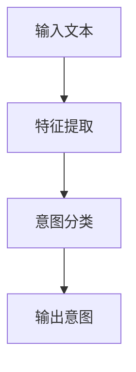
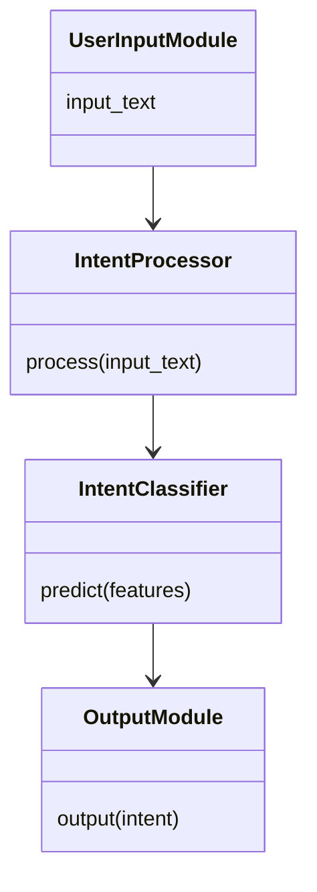

                 


# AI Agent的用户意图推理与预测

> 关键词：用户意图，AI Agent，自然语言处理，深度学习，意图预测

> 摘要：本文将深入探讨AI Agent在用户意图推理与预测领域的核心原理、算法实现及系统架构设计。通过分析意图推理的背景、核心概念、算法原理和系统实现，结合实际案例，帮助读者全面理解并掌握这一技术的最新进展与应用场景。

---

## 第1章: 用户意图推理与预测的核心概念

### 1.1 问题背景与描述
#### 1.1.1 从传统自然语言处理到意图推理的演进
自然语言处理（NLP）技术的进步推动了人机交互的发展，从最初的关键词匹配到复杂的语义理解，意图推理成为连接用户需求与系统响应的核心技术。通过意图推理，AI Agent能够理解用户的深层需求，从而提供更精准的服务。

#### 1.1.2 当前AI Agent在人机交互中的挑战
随着智能音箱、聊天机器人等应用的普及，AI Agent需要处理更加复杂和多样化的用户输入。如何准确识别用户的意图，尤其是在上下文依赖和多轮对话场景中，成为当前技术的主要挑战。

#### 1.1.3 用户意图推理与预测的定义与边界
用户意图推理是指通过分析用户的输入（如文本、语音）来推断其潜在需求的过程。意图预测则是在此基础上，根据历史数据和当前上下文，预测用户后续的行为或需求。意图推理的核心在于理解用户的语言背后的意图，而意图预测则关注未来行为的预判。

### 1.2 意图推理与预测的核心要素
#### 1.2.1 用户意图的分类与层次结构
用户意图可以分为显式意图和隐式意图。显式意图是用户直接表达的需求，如“预订酒店”；隐式意图是用户未明说但可以通过上下文推断的需求，如“寻找附近的餐厅”。意图的层次结构包括具体意图和抽象意图。

#### 1.2.2 意图推理的关键特征对比分析
下表对比了基于规则和基于深度学习的意图推理方法的关键特征：

| 特性 | 基于规则 | 基于深度学习 |
|------|----------|--------------|
| 可解释性 | 高        | 中            |
| 灵活性   | 低        | 高            |
| 需要人工标注 | 高        | 低            |
| 适用场景 | 简单场景   | 复杂场景       |

#### 1.2.3 意图预测的数学模型与公式
意图预测通常基于条件概率模型，如下：
$$ P(y|x) = \frac{P(x|y)P(y)}{P(x)} $$
其中，$y$ 表示意图，$x$ 表示用户输入。

---

## 第2章: 意图推理的原理与算法

### 2.1 意图推理的基本原理
#### 2.1.1 基于概率论的意图推理模型
概率论是意图推理的基础，通过计算每个意图的可能性，选择概率最高的意图作为最终结果。例如，使用贝叶斯定理进行分类。

#### 2.1.2 基于深度学习的意图表示方法
深度学习模型（如LSTM和Transformer）能够捕捉文本中的语义信息，生成更准确的意图表示。

#### 2.1.3 意图与上下文的关系分析
上下文对意图推理至关重要，例如在多轮对话中，上下文信息可以帮助修正初始意图。

### 2.2 意图预测的算法对比
#### 2.2.1 基于规则的意图预测
通过预定义的规则匹配用户的输入，适用于简单场景。

#### 2.2.2 基于统计学习的意图预测
使用机器学习算法（如SVM、随机森林）进行分类，适合中等复杂度的任务。

#### 2.2.3 基于深度学习的意图预测
利用神经网络模型（如BERT）进行端到端训练，效果更优。

### 2.3 意图推理的ER实体关系图
```mermaid
er
actor: 用户
role: 意图
action: 意图推理
```

---

## 第3章: 意图推理的算法实现

### 3.1 意图推理的数学模型
#### 3.1.1 基于条件概率的意图推理公式
$$ P(y|x) = \frac{P(x|y)P(y)}{P(x)} $$

#### 3.1.2 基于神经网络的意图表示模型
使用Transformer模型进行序列编码，生成意图向量。

### 3.2 意图预测的算法流程


### 3.3 意图推理的Python实现示例
```python
import numpy as np
from sklearn.metrics import accuracy_score

class IntentClassifier:
    def __init__(self, features):
        self.features = features
        self.intent_map = {
            0: 'search',
            1: 'book',
            2: 'info'
        }
    
    def predict(self, input_text):
        features = self.extract_features(input_text)
        prediction = np.argmax(features.dot(self.model))
        return self.intent_map[prediction]

    def extract_features(self, text):
        return np.array([1 if word in text else 0 for word in self.features])
```

---

## 第4章: 意图推理的系统分析与架构设计

### 4.1 应用场景分析
AI Agent在智能音箱、聊天机器人、推荐系统等领域广泛应用。

### 4.2 系统功能设计
使用类图展示系统功能模块：



### 4.3 系统架构设计
使用架构图展示系统整体结构：


### 4.4 系统接口设计
定义RESTful API接口：

- POST /intent
- 输入：{ "text": "查询天气" }
- 输出：{ "intent": "weather" }

---

## 第5章: 项目实战

### 5.1 环境安装
安装必要的库：
```bash
pip install numpy scikit-learn
```

### 5.2 核心实现
实现意图分类器：

```python
class IntentClassifier:
    def __init__(self, features):
        self.features = features
        self.model = np.random.rand(len(features), 3)
    
    def train(self, X, y):
        # 简单训练示例
        for x, label in zip(X, y):
            features = self.extract_features(x)
            self.model += features.reshape(-1, 1) * label
```

### 5.3 案例分析
案例：用户输入“我要去北京旅游”，系统识别意图“旅游计划”。

---

## 第6章: 总结与展望

### 6.1 最佳实践 tips
- 数据清洗与特征工程至关重要。
- 结合上下文信息可以提高准确性。
- 使用预训练模型（如BERT）可以提升效果。

### 6.2 小结
通过本文的分析，读者可以掌握意图推理与预测的核心原理和实现方法。

### 6.3 注意事项
- 数据泄露问题需要警惕。
- 模型的可解释性在实际应用中不可忽视。

### 6.4 拓展阅读
推荐阅读《深度学习》和《自然语言处理实战》。

---

# 作者：AI天才研究院/AI Genius Institute & 禅与计算机程序设计艺术 /Zen And The Art of Computer Programming

