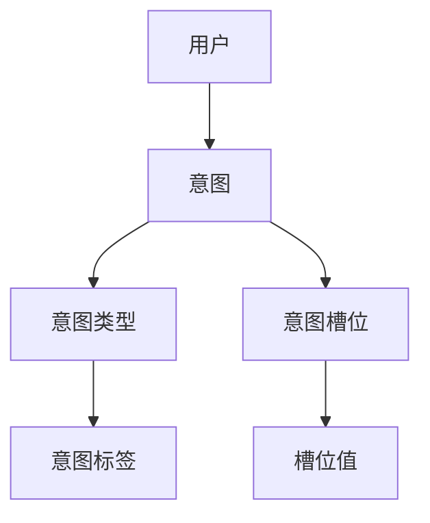

                 


# AI Agent的用户意图理解：从表层到深层

## 关键词：AI Agent, 用户意图, 深度学习, 意图理解, 意图分类, NLU, 对话系统

## 摘要：  
本文深入探讨了AI Agent用户意图理解的核心概念、算法原理、系统架构及实践应用。从表层意图到深层意图的演进，详细分析了意图理解的分类、模型设计、算法实现及系统构建。通过实例分析，展示了如何在实际场景中实现高效的用户意图理解，并总结了相关的关键技术和未来研究方向。

---

## 第一部分: AI Agent用户意图理解的背景与概念

### 第1章: 用户意图理解的背景与重要性

#### 1.1 用户意图理解的定义与范围
- **1.1.1 什么是用户意图**  
  用户意图是指用户在与AI Agent交互时所表达的目标、需求或情感。意图可以是显式的（如“预订机票”）或隐式的（如“寻求旅行建议”）。  
- **1.1.2 表层意图与深层意图的区分**  
  表层意图是用户直接表达的需求（如“我要买书”），深层意图是用户未明确表达但可以通过上下文推断的需求（如“寻找折扣书籍”）。  
- **1.1.3 用户意图理解的边界与外延**  
  用户意图理解的边界包括输入的自然语言文本、语音或图像等，外延则延伸到多模态数据的融合与分析。

#### 1.2 用户意图理解的核心要素
- **1.2.1 意图理解的三要素模型**  
  1. 输入数据（如文本、语音）  
  2. 意图类型（如查询、预订、投诉）  
  3. 意图槽位（如时间、地点、价格范围）。  
- **1.2.2 意图理解与自然语言处理的关系**  
  意图理解是自然语言处理（NLP）的核心任务之一，旨在从输入中提取语义信息。  
- **1.2.3 意图理解在AI Agent中的作用**  
  意图理解是AI Agent执行任务的基础，决定了其如何响应用户需求。

### 第2章: 用户意图理解的演进与挑战

#### 2.1 从表层到深层意图的演进
- **2.1.1 表层意图的理解方法**  
  表层意图通常通过关键词匹配、规则库或统计模型进行识别。例如，用户输入“我要买书”，系统识别出“购买”意图。  
- **2.1.2 深层意图的挖掘技术**  
  深层意图挖掘需要结合上下文、用户历史行为和情感分析。例如，用户多次询问“哪里有折扣”，系统推断出“寻找优惠”的深层意图。  
- **2.1.3 意图理解的复杂性与多样性**  
  不同用户的表达方式可能相同，但实际需求可能不同。例如，“我需要帮助”可以是寻求技术支持，也可以是情感支持。

#### 2.2 用户意图理解的主要挑战
- **2.2.1 数据质量与多样性问题**  
  数据噪声、领域差异和用户表达的多样性会影响意图理解的准确性。  
- **2.2.2 模型泛化能力的限制**  
  基于规则的模型难以应对未知意图，而深度学习模型需要大量标注数据。  
- **2.2.3 多模态输入的处理难度**  
  用户可能通过文本、语音或图像等多种形式表达意图，如何高效融合这些信息是当前的难点。

---

## 第二部分: 用户意图理解的核心概念与联系

### 第3章: 用户意图理解的核心概念原理

#### 3.1 意图理解的分类与对比
- **3.1.1 基于规则的意图理解**  
  通过预定义的规则匹配用户的输入，适用于简单的意图识别。例如，规则匹配“关键词：买书”对应“购买书籍”意图。  
- **3.1.2 基于统计的意图理解**  
  使用机器学习模型（如朴素贝叶斯、SVM）进行意图分类，基于特征工程提取文本信息。  
- **3.1.3 基于深度学习的意图理解**  
  使用神经网络（如LSTM、Transformer）进行端到端学习，能够捕捉复杂的语义信息。  

#### 3.2 意图理解的关键属性特征对比
- **3.2.1 意图类型对比表**  
  | 意图类型 | 示例 | 复杂度 |  
  |----------|------|--------|  
  | 查询 | “附近有哪些餐馆？” | 中等 |  
  | 预订 | “预订明天的机票” | 高 |  
  | 投诉 | “我的订单有问题” | 高 |  
- **3.2.2 意图理解的准确性与实时性对比**  
  实时性要求高（如客服对话系统）通常需要简化模型，而准确性要求高（如医疗领域）需要更复杂的模型。  
- **3.2.3 意图理解的可解释性与可扩展性对比**  
  基于规则的模型可解释性高但扩展性差，深度学习模型可扩展性好但可解释性差。

#### 3.3 意图理解的ER实体关系图架构


---

## 第三部分: 用户意图理解的算法原理与数学模型

### 第4章: 意图理解的算法原理

#### 4.1 基于深度学习的意图理解模型
- **4.1.1 模型结构**  
  使用Transformer架构进行文本编码，通过全连接层输出意图类别。  
- **4.1.2 模型训练流程**  
  ```mermaid
  graph TD
      Input --> Tokenize
      Tokenize --> Embedding
      Embedding --> Transformer
      Transformer --> Output
      Output --> Softmax
  ```

- **4.1.3 模型数学公式**  
  输入文本经过嵌入层后，通过多层Transformer编码，最终输出概率分布：  
  $$ P(y|x) = \text{softmax}(Wx + b) $$  
  其中，$x$ 是输入向量，$y$ 是意图类别。

#### 4.2 意图槽位填充的算法实现
- **4.2.1 槽位填充的定义**  
  槽位填充是指在识别意图后，进一步提取与意图相关的实体信息。例如，识别出“购买书籍”后，提取“书名”和“作者”。  
- **4.2.2 基于CRF的槽位填充**  
  使用条件随机场（CRF）进行序列标注，公式为：  
  $$ P(y|x) = \frac{1}{Z} \exp(\sum_{i=1}^n \sum_{j=1}^m w_{i,j} x_i y_j) $$  
  其中，$w$ 是权重，$x$ 是输入特征，$y$ 是标签。

---

## 第四部分: 用户意图理解的系统架构与实现

### 第5章: 意图理解的系统架构设计

#### 5.1 系统功能设计
- **5.1.1 领域模型设计**  
  ```mermaid
  classDiagram
      class 用户 {
          id
          历史记录
          }
      class 意图 {
          类型
          槽位
          }
      class 数据源 {
          文本
          语音
          图像
          }
      用户 --> 数据源
      数据源 --> 意图
  ```

- **5.1.2 系统架构设计**  
  ```mermaid
  architecture
      客户端 --> 服务端
      服务端 --> 数据库
      服务端 --> 模型推理引擎
  ```

- **5.1.3 系统交互设计**  
  ```mermaid
  sequenceDiagram
      用户 -> 客户端: 发送请求
      客户端 -> 服务端: 调用API
      服务端 -> 数据库: 查询意图模型
      服务端 -> 用户: 返回结果
  ```

### 第6章: 项目实战与案例分析

#### 6.1 项目背景与目标
- 项目背景：设计一个基于意图理解的智能客服系统。  
- 项目目标：实现用户意图识别和槽位填充，提升客服效率。

#### 6.2 核心实现
- **6.2.1 意图分类实现**  
  使用预训练的BERT模型进行微调，代码如下：  
  ```python
  import torch
  from transformers import BertForSequenceClassification, BertTokenizer

  model = BertForSequenceClassification.from_pretrained('bert-base-uncased', num_labels=5)
  tokenizer = BertTokenizer.from_pretrained('bert-base-uncased')

  inputs = tokenizer("我需要帮助", return_tensors="pt")
  outputs = model(**inputs)
  logits = outputs.logits
  ```

- **6.2.2 槽位填充实现**  
  使用CRF模型进行序列标注，代码如下：  
  ```python
  import torch
  from torch import nn

  class CRF(nn.Module):
      def __init__(self, input_size, tag_size):
          super(CRF, self).__init__()
          self.tag_size = tag_size
          self.transitions = nn.Parameter(torch.randn(tag_size, tag_size))
          self.start = nn.Parameter(torch.zeros(tag_size))
          self.end = nn.Parameter(torch.zeros(tag_size))

      def forward(self, input, lengths):
          # 输入处理与计算略...
          return log_prob
  ```

#### 6.3 案例分析
- 案例1：电商客服中的意图识别  
  用户输入：“我收到的商品与描述不符。”  
  系统识别：意图类型为“投诉”，槽位为“商品描述”。  
- 案例2：医疗咨询中的意图识别  
  用户输入：“我最近总是感到疲惫。”  
  系统识别：意图类型为“咨询”，槽位为“症状描述”。

---

## 第五部分: 总结与展望

### 第7章: 总结与未来研究方向

#### 7.1 核心知识点回顾
- 意图理解的核心概念：表层意图与深层意图  
- 意图理解的关键技术：深度学习模型、CRF、多模态融合  
- 意图理解的应用场景：智能客服、对话系统、医疗咨询  

#### 7.2 未来研究方向
- **7.2.1 深度学习模型的优化**  
  结合大语言模型（如GPT-3）提升意图理解的准确性和可解释性。  
- **7.2.2 多模态意图理解**  
  结合文本、语音和图像信息，实现更全面的意图理解。  
- **7.2.3 意图理解的实时性优化**  
  在保证准确性的前提下，优化模型推理速度，提升实时应用场景的性能。

---

## 作者：AI天才研究院/AI Genius Institute & 禅与计算机程序设计艺术 /Zen And The Art of Computer Programming

---

**总结**：  
本文系统性地探讨了AI Agent用户意图理解的理论与实践，从表层到深层意图的演进，详细分析了意图理解的分类、算法实现和系统架构。通过实际案例，展示了如何在不同场景中实现高效的用户意图理解，并总结了未来的研究方向。希望本文能为AI Agent领域的研究者和开发者提供有价值的参考。

