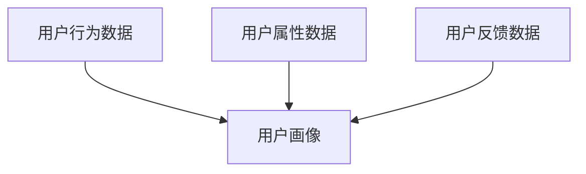
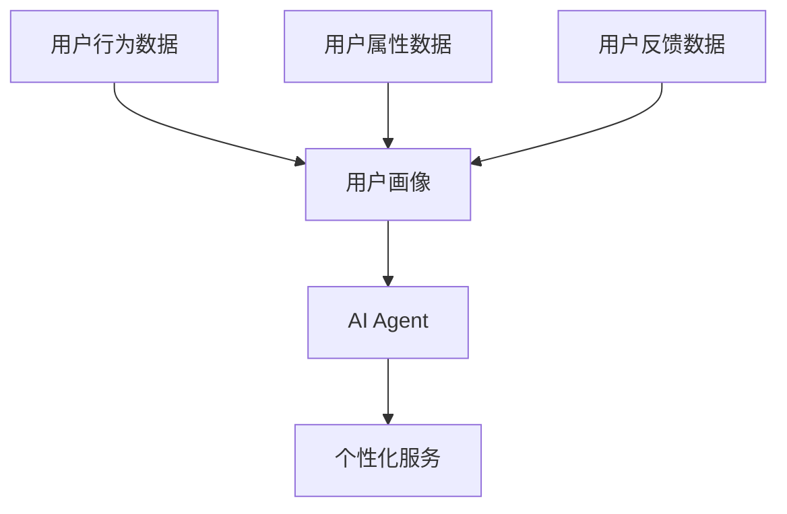
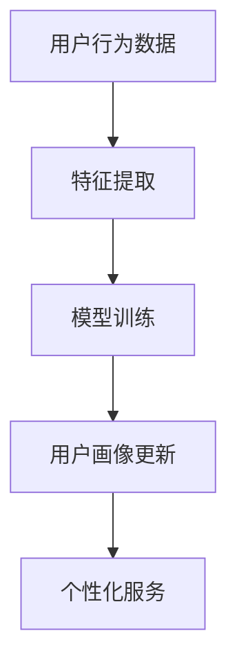
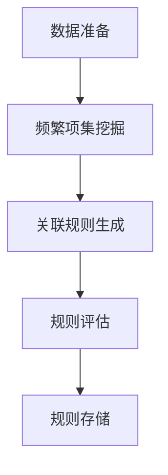
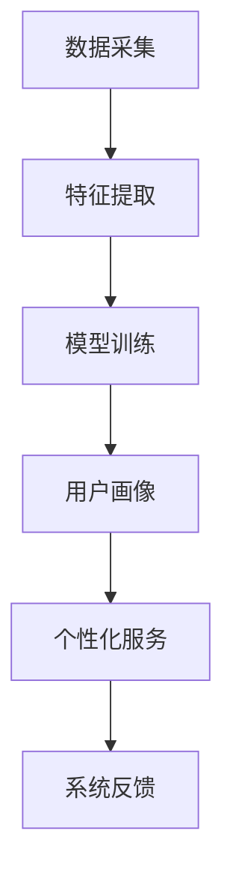
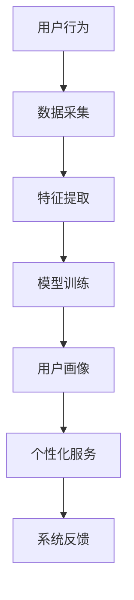

                 


# AI Agent的用户画像动态更新系统

> 关键词：AI Agent, 用户画像, 动态更新系统, 实时反馈, 数据挖掘, 机器学习

> 摘要：AI Agent的用户画像动态更新系统是一种结合实时数据反馈和机器学习算法的智能化用户画像构建与更新方法，通过动态调整用户画像的特征和权重，提升AI Agent对用户行为和偏好的理解和预测能力，从而实现更加精准和个性化的服务。

---

# 第1章: 背景介绍

## 1.1 核心概念术语说明

- **用户画像（User Profile）**：通过对用户行为数据、属性数据和反馈数据的分析，构建的用户特征描述，用于AI系统理解和预测用户行为。
- **动态更新（Dynamic Update）**：根据实时数据反馈，持续优化和调整用户画像的特征和权重，确保用户画像的准确性和时效性。
- **AI Agent（人工智能代理）**：一种能够感知环境、主动理解和响应用户需求的智能系统，通常具备学习和自适应能力。

## 1.2 问题背景

### 1.2.1 用户行为的复杂性

用户行为受到多种因素影响，包括时间、环境、情绪等，导致用户需求和偏好的动态变化。

### 1.2.2 数据的实时性要求

为了准确反映用户当前状态，用户画像需要实时更新，否则可能导致服务不准确或过时。

### 1.2.3 AI Agent的需求

AI Agent需要通过用户画像来理解用户需求，从而提供个性化服务。如果用户画像是静态的，AI Agent将无法适应用户行为的变化。

## 1.3 问题描述

### 1.3.1 用户画像的静态问题

静态用户画像是基于历史数据构建的，无法反映用户的实时状态和动态变化。

### 1.3.2 数据更新的延迟

传统用户画像是定期更新的，导致数据延迟，影响AI Agent的实时响应能力。

### 1.3.3 系统适应性不足

静态用户画像是固定的，无法根据实时反馈快速调整，导致AI Agent在面对用户行为变化时表现不佳。

## 1.4 问题解决

### 1.4.1 动态更新的目标

- 实现用户画像的实时更新，确保数据的准确性和时效性。
- 提升AI Agent对用户行为变化的适应能力，提供更加个性化的服务。

### 1.4.2 系统设计的思路

- 引入实时数据流，持续采集用户行为数据。
- 使用机器学习算法，动态调整用户画像的特征权重。
- 设计高效的更新机制，确保系统的实时性和稳定性。

### 1.4.3 技术实现的路径

- 数据采集：通过日志系统、传感器等实时采集用户行为数据。
- 数据处理：对采集的数据进行清洗、特征提取和转换。
- 模型训练：使用机器学习算法对用户画像进行动态更新。
- 应用反馈：根据AI Agent的反馈结果，进一步优化用户画像。

## 1.5 边界与外延

### 1.5.1 系统的边界

- 用户画像动态更新系统的范围：数据采集、特征提取、模型训练和应用反馈。
- 不包含的内容：其他系统如推荐系统、决策系统等的实现。

### 1.5.2 相关领域的外延

- 数据挖掘：用户数据的采集和处理。
- 机器学习：用户画像的特征提取和动态更新。
- 自然语言处理：用户反馈的语义分析。

### 1.5.3 与其他系统的区别

- 与静态用户画像系统的区别：动态更新系统的实时性和自适应性。
- 与传统推荐系统的区别：动态更新系统注重用户画像的动态调整。

## 1.6 概念结构与核心要素

### 1.6.1 用户画像的层次结构



### 1.6.2 核心要素的定义与属性

| 概念 | 属性 | 描述 |
|------|------|------|
| 用户行为数据 | 数据类型 | 行为日志、点击流数据 |
| 用户属性数据 | 数据类型 | 用户ID、地理位置、设备信息 |
| 用户反馈数据 | 数据类型 | 用户评分、点击反馈、文本反馈 |
| 用户画像 | 更新频率 | 实时更新、周期性更新 |
| AI Agent | 交互方式 | 主动推荐、被动响应 |

### 1.6.3 要素之间的关系



---

# 第2章: 核心概念原理

## 2.1 用户画像的动态更新机制

### 2.1.1 数据采集与处理

- 数据采集：通过日志系统、传感器等实时采集用户行为数据。
- 数据清洗：去除噪声数据，确保数据质量。
- 数据转换：将原始数据转换为适合模型训练的格式。

### 2.1.2 特征提取与建模

- 特征提取：从用户行为数据中提取有意义的特征，如点击频率、浏览时间等。
- 建模：使用机器学习算法，如协同过滤、关联规则挖掘等，构建用户画像模型。

### 2.1.3 更新触发条件

- 实时触发：根据用户行为的实时变化自动触发更新。
- 周期性触发：定期批量更新用户画像。

## 2.2 动态更新的驱动因素

### 2.2.1 用户行为变化

- 用户兴趣的变化：如用户的购买行为、浏览偏好等。
- 用户状态的变化：如用户地理位置、设备环境等。

### 2.2.2 系统反馈

- 系统对用户行为的反馈：如推荐结果、用户评分等。
- 用户对系统的反馈：如点击、评分、文本反馈等。

### 2.2.3 时间周期

- 实时更新：根据用户的实时行为动态调整用户画像。
- 周期性更新：每隔一段时间批量更新用户画像。

## 2.3 AI Agent的核心算法

### 2.3.1 协同过滤算法

- **基于用户的协同过滤**：通过寻找与当前用户行为相似的其他用户，推荐他们喜欢的内容。
- **基于物品的协同过滤**：通过分析用户对物品的偏好，推荐与当前物品相关的其他物品。

### 2.3.2 关联规则挖掘

- **关联规则挖掘**：通过分析用户行为数据，挖掘出用户行为之间的关联规则，用于动态调整用户画像。

### 2.3.3 基于深度学习的推荐算法

- **神经网络模型**：通过深度学习模型（如神经协同过滤、变种自动机等）来学习用户行为的隐含特征，动态调整用户画像。

### 2.3.4 算法流程图



## 2.4 核心概念属性对比表

| 概念 | 属性 | 描述 |
|------|------|------|
| 用户画像 | 数据来源 | 行为数据、用户属性、反馈数据 |
| 动态更新 | 更新频率 | 实时更新、周期性更新 |
| AI Agent | 交互方式 | 主动推荐、被动响应 |

---

# 第3章: 算法原理

## 3.1 协同过滤算法

### 3.1.1 基于用户的协同过滤

- **数学模型**：基于相似度计算，如余弦相似度、Jaccard相似度等。
- **公式**：$$sim(i,j) = \frac{\sum_{k} (r_{ik} \times r_{jk})}{\sqrt{\sum_{k} r_{ik}^2} \times \sqrt{\sum_{k} r_{jk}^2}}}$$

### 3.1.2 基于物品的协同过滤

- **数学模型**：通过计算物品之间的相似度，推荐与当前物品相似的其他物品。
- **公式**：$$sim(i,j) = \frac{\sum_{u} (r_{ui} \times r_{uj})}{\sqrt{\sum_{u} r_{ui}^2} \times \sqrt{\sum_{u} r_{uj}^2}}}$$

## 3.2 关联规则挖掘

### 3.2.1 基本原理

- **关联规则**：挖掘用户行为中频繁出现的项集，发现其中的关联关系。
- **支持度和置信度**：$$support(A \rightarrow B) = \frac{\text{count}(A \cap B)}{\text{count}(B)}$$
  $$confidence(A \rightarrow B) = \frac{\text{count}(A \cap B)}{\text{count}(A)}$$

### 3.2.2 算法流程



## 3.3 基于深度学习的推荐算法

### 3.3.1 神经协同过滤

- **模型结构**：通过神经网络学习用户和物品的隐含特征，计算用户对物品的偏好。
- **公式**：$$y = \sigma(W_u u_i^T W_i i_j + b)$$

### 3.3.2 变种自动机

- **模型结构**：通过变种自动机捕捉用户行为的序列模式，动态调整用户画像。

## 3.4 算法实现代码

### 协同过滤算法示例

```python
import numpy as np

def cosine_similarity(user_profiles, item_profiles):
    # 用户画像和物品画像的向量化表示
    # 计算用户与物品的相似度矩阵
    similarities = np.zeros((len(user_profiles), len(item_profiles)))
    for i in range(len(user_profiles)):
        for j in range(len(item_profiles)):
            # 计算余弦相似度
            numerator = np.sum(user_profiles[i] * item_profiles[j])
            denominator = np.sqrt(np.sum(user_profiles[i]**2)) * np.sqrt(np.sum(item_profiles[j]**2))
            if denominator == 0:
                similarities[i][j] = 0.0
            else:
                similarities[i][j] = numerator / denominator
    return similarities
```

### 关联规则挖掘示例

```python
from mlxtend.frequent_itemsets import apriori

# 数据准备
transactions = [[1,2,3], [2,3,4], [1,3,4,5]]

# 挖掘频繁项集
frequent_itemsets = apriori(transactions, min_support=0.5)

# 生成关联规则
from mlxtend.frequent_itemsets import association_rules

rules = association_rules(frequent_itemsets, transactions)
```

## 3.5 数学模型和公式

- **协同过滤模型**：
  $$sim(i,j) = \frac{\sum_{k} (r_{ik} \times r_{jk})}{\sqrt{\sum_{k} r_{ik}^2} \times \sqrt{\sum_{k} r_{jk}^2}}$$
  
- **关联规则**：
  $$support(A \rightarrow B) = \frac{\text{count}(A \cap B)}{\text{count}(B)}$$
  $$confidence(A \rightarrow B) = \frac{\text{count}(A \cap B)}{\text{count}(A)}$$

---

# 第4章: 系统架构设计

## 4.1 问题场景介绍

- **目标**：构建一个实时更新用户画像的系统，支持AI Agent的动态响应。
- **场景**：用户与系统交互过程中，实时更新用户画像，提升服务的精准度。

## 4.2 系统功能设计

### 4.2.1 数据采集模块

- **功能**：实时采集用户行为数据、属性数据和反馈数据。
- **输入**：用户ID、行为数据、反馈数据。
- **输出**：清洗后的数据流。

### 4.2.2 特征提取模块

- **功能**：从数据流中提取特征，构建用户画像的初始表示。
- **输入**：清洗后的数据流。
- **输出**：特征向量。

### 4.2.3 模型训练模块

- **功能**：使用机器学习算法动态更新用户画像。
- **输入**：特征向量。
- **输出**：更新后的用户画像。

### 4.2.4 应用反馈模块

- **功能**：收集系统反馈，优化用户画像。
- **输入**：系统反馈数据。
- **输出**：优化后的用户画像。

## 4.3 系统架构图



## 4.4 接口设计

- **数据接口**：提供REST API，供其他系统调用用户画像数据。
- **模型接口**：提供API，供其他系统调用模型训练结果。

## 4.5 交互流程

### 4.5.1 用户行为采集

- 用户与系统交互，产生行为数据。
- 数据采集模块实时采集行为数据。

### 4.5.2 特征提取

- 特征提取模块对采集到的数据进行特征提取，生成特征向量。

### 4.5.3 模型训练

- 模型训练模块使用特征向量训练机器学习模型，动态更新用户画像。

### 4.5.4 应用反馈

- 应用系统根据用户反馈优化用户画像，形成闭环。

## 4.6 交互流程图



---

# 第5章: 项目实战

## 5.1 环境安装

- **安装Python环境**：建议使用Anaconda。
- **安装依赖库**：numpy、pandas、scikit-learn、mlxtend等。

## 5.2 核心实现代码

### 数据采集与处理

```python
import logging
from datetime import datetime

class UserDataCollector:
    def __init__(self, user_id):
        self.user_id = user_id
        self.data = []
        self.logger = logging.getLogger('UserDataCollector')
        self.logger.setLevel(logging.INFO)
        handler = logging.StreamHandler()
        formatter = logging.Formatter('%(asctime)s - %(name)s - %(levelname)s - %(message)s')
        handler.setFormatter(formatter)
        self.logger.addHandler(handler)

    def collect(self):
        # 模拟数据采集
        self.data.append((datetime.now(), self.user_id, 'click', 'item_123'))
        self.logger.info(f'Collected data: {self.data}')
```

### 特征提取与建模

```python
from sklearn.feature_extraction.text import TfidfVectorizer

class UserProfileBuilder:
    def __init__(self):
        self.vectorizer = TfidfVectorizer()

    def build_profile(self, texts):
        selfprofiles = self.vectorizer.fit_transform(texts)
        return selfprofiles
```

### 应用反馈

```python
from sklearn.metrics.pairwise import cosine_similarity

class UserProfiler:
    def __init__(self):
        self.similarity_matrix = None

    def update_profile(self, new_profile):
        # 更新相似度矩阵
        self.similarity_matrix = cosine_similarity(new_profile)
```

## 5.3 代码应用解读与分析

- **数据采集模块**：实时采集用户行为数据，确保数据的实时性。
- **特征提取模块**：将采集到的数据转换为适合模型训练的特征向量。
- **模型训练模块**：使用机器学习算法动态更新用户画像，提升准确性。

## 5.4 实际案例分析

### 案例1: 基于协同过滤的用户画像更新

- **数据准备**：收集用户行为数据，构建用户-物品的交互矩阵。
- **模型训练**：使用协同过滤算法计算用户之间的相似度，动态更新用户画像。
- **结果分析**：比较更新前后的用户画像，评估更新效果。

### 案例2: 基于关联规则的用户行为分析

- **数据准备**：收集用户的点击流数据。
- **模型训练**：挖掘用户行为中的关联规则，动态调整用户画像。
- **结果分析**：分析关联规则对用户画像的影响。

## 5.5 项目小结

- **核心实现**：实现了用户数据的实时采集、特征提取和动态更新。
- **系统优势**：提升了AI Agent对用户行为变化的适应能力，提供了更加个性化的服务。

---

# 第6章: 总结与展望

## 6.1 总结

- **核心内容**：介绍了AI Agent用户画像动态更新系统的核心概念、算法原理和系统架构。
- **主要收获**：理解了动态更新用户画像的重要性，掌握了相关算法和技术实现。

## 6.2 经验总结

- **数据采集的挑战**：实时数据采集的延迟和可靠性问题。
- **算法优化的挑战**：如何在保证实时性的前提下，提升算法的准确性和效率。

## 6.3 对未来的展望

- **技术发展**：随着深度学习和实时计算技术的发展，用户画像动态更新系统将更加智能化和高效。
- **应用场景**：动态更新用户画像技术将在电子商务、社交媒体、智能客服等领域得到更广泛的应用。

## 6.4 注意事项

- **数据隐私**：在采集和处理用户数据时，必须遵守相关法律法规，保护用户隐私。
- **系统稳定性**：确保系统的实时性和稳定性，避免数据丢失和更新延迟。

## 6.5 拓展阅读

- 推荐阅读相关领域的书籍和论文，深入理解用户画像和动态更新的技术细节。

---

# 作者：AI天才研究院/AI Genius Institute & 禅与计算机程序设计艺术 /Zen And The Art of Computer Programming

