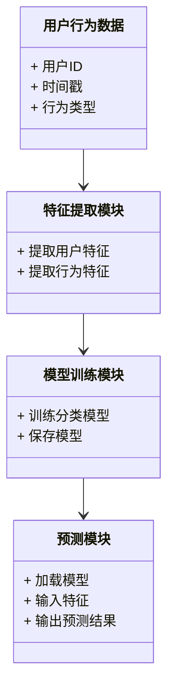
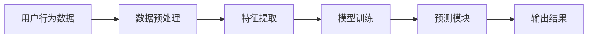
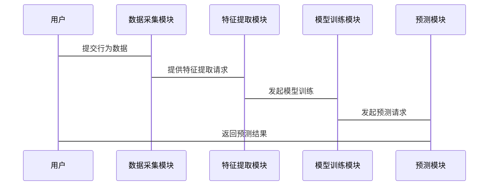

                 


```markdown
# AI Agent的用户行为分析与预测系统

> 关键词：AI Agent, 用户行为分析, 行为预测, 机器学习, 深度学习, 系统架构设计

> 摘要：本文系统地探讨了AI Agent在用户行为分析与预测系统中的应用。通过介绍AI Agent的基本概念和用户行为分析的核心概念，深入分析了基于规则、统计和深度学习的算法原理，结合实际案例详细讲解了系统的架构设计和项目实现。文章内容丰富，结构清晰，为读者提供了从理论到实践的全面指导。

---

## 第1章: AI Agent与用户行为分析概述

### 1.1 AI Agent的基本概念

#### 1.1.1 AI Agent的定义与特点
- **定义**：AI Agent（智能代理）是具备自主决策和交互能力的智能实体，能够感知环境并采取行动。
- **特点**：
  - **自主性**：能够在没有外部干预的情况下自主运行。
  - **反应性**：能够实时感知环境并做出反应。
  - **目标导向**：具备明确的目标，行为围绕目标展开。
  - **社会性**：能够与其他Agent或用户进行交互和协作。

#### 1.1.2 用户行为分析的定义与目标
- **定义**：用户行为分析是对用户在特定系统或平台上的行为进行数据收集、分析和理解的过程。
- **目标**：
  - 发现用户行为模式。
  - 预测未来行为。
  - 优化用户体验和系统性能。

#### 1.1.3 AI Agent在用户行为分析中的作用
- **实时监控**：AI Agent能够实时监控用户行为，提供实时反馈。
- **主动调整**：根据分析结果主动调整系统行为，优化用户体验。

### 1.2 用户行为分析的背景与应用

#### 1.2.1 问题背景与挑战
- **背景**：随着互联网和移动应用的普及，用户行为数据的收集和分析变得越来越重要。
- **挑战**：
  - 数据量大、行为多样性。
  - 实时性要求高。

#### 1.2.2 用户行为分析的主要应用场景
- **电子商务**：推荐系统、用户流失预测。
- **社交媒体**：用户互动预测、网络影响力分析。
- **金融领域**：欺诈检测、交易行为分析。

#### 1.2.3 AI Agent在行为预测中的优势
- **实时响应**：AI Agent能够快速响应用户行为变化，提供实时预测。

### 1.3 本章小结
- 总结：AI Agent在用户行为分析中的重要性，以及其在实时监控和主动调整中的优势。

---

## 第2章: 用户行为分析的核心概念

### 2.1 用户行为分析的理论基础

#### 2.1.1 数据挖掘与机器学习基础
- **数据挖掘**：从大量数据中提取有价值模式的过程。
- **机器学习**：通过训练模型来实现对用户行为的预测。

#### 2.1.2 自然语言处理与行为理解
- **自然语言处理（NLP）**：用于理解用户在文本中的意图和情感，进而分析行为动机。

#### 2.1.3 时间序列分析与行为预测
- **时间序列分析**：用于识别行为模式中的时间依赖性，预测未来行为。

### 2.2 AI Agent的行为分析模型

#### 2.2.1 基于规则的行为分析模型
- **算法原理**：通过预定义的规则来判断用户行为类别。
- **流程图**：
  ```mermaid
  graph TD
  A[开始] --> B[收集用户数据]
  B --> C[提取用户行为特征]
  C --> D[建立行为规则库]
  D --> E[匹配规则进行行为分类]
  E --> F[输出结果]
  F --> G[结束]
  ```

#### 2.2.2 基于统计的学习模型
- **算法原理**：通过统计方法从数据中学习用户行为模式。
- **流程图**：
  ```mermaid
  graph TD
  A[开始] --> B[收集用户数据]
  B --> C[数据预处理]
  C --> D[特征提取]
  D --> E[训练模型]
  E --> F[预测行为]
  F --> G[输出结果]
  G --> H[结束]
  ```

#### 2.2.3 基于深度学习的模型
- **算法原理**：利用神经网络进行复杂模式识别，提高预测准确性。
- **流程图**：
  ```mermaid
  graph TD
  A[开始] --> B[收集用户数据]
  B --> C[数据预处理]
  C --> D[特征提取]
  D --> E[输入深度学习网络]
  E --> F[输出预测结果]
  F --> G[结束]
  ```

### 2.3 用户行为分析的核心要素

#### 2.3.1 用户特征与行为数据
- 包括用户的基本信息、历史行为数据等。

#### 2.3.2 行为模式与行为序列
- 分析用户在不同时间点的行为序列，发现行为规律。

#### 2.3.3 行为预测的准确性与实时性
- 预测结果的准确性直接影响系统的决策效果，实时性则影响系统的响应速度。

### 2.4 核心概念对比分析

#### 2.4.1 不同行为分析模型的对比
- 基于规则模型适合简单场景，而深度学习模型适用于复杂场景。

#### 2.4.2 基于规则与基于学习的模型优缺点
- **规则模型**：易于解释，但灵活性差。
- **学习模型**：适应性强，但可能缺乏可解释性。

#### 2.4.3 深度学习模型的适用场景
- 处理非结构化数据、复杂模式识别等场景。

### 2.5 本章小结
- 总结：用户行为分析的核心概念，以及不同模型的优缺点和适用场景。

---

## 第3章: 用户行为分析的算法原理

### 3.1 基于规则的用户行为分析算法

#### 3.1.1 算法原理与流程
- 收集用户数据 -> 提取特征 -> 建立规则库 -> 匹配规则 -> 分类行为。

### 3.2 基于统计的学习算法

#### 3.2.1 统计学习算法原理
- 通过数据预处理、特征提取、模型训练、预测等步骤实现行为分析。

### 3.3 基于深度学习的行为预测模型

#### 3.3.1 深度学习模型原理
- 利用神经网络的多层结构，提取深层次特征，进行行为预测。

### 3.4 数学模型与公式

#### 3.4.1 基于概率论的行为预测模型
- 公式：$$ P(A|B) = \frac{P(B|A)P(A)}{P(B)} $$

#### 3.4.2 基于机器学习的损失函数
- 公式：$$ L = \frac{1}{n}\sum_{i=1}^{n}(y_i - \hat{y}_i)^2 $$

#### 3.4.3 基于深度学习的模型数学基础
- 神经网络中的激活函数、损失函数和优化算法等。

### 3.5 本章小结
- 总结：不同算法的原理和适用场景，以及数学模型的作用。

---

## 第4章: 系统分析与架构设计

### 4.1 系统分析

#### 4.1.1 问题场景介绍
- 在线购物平台需要预测用户的购买行为，优化推荐策略。

#### 4.1.2 系统功能需求
- 实时监测用户行为，预测购买概率，提供个性化推荐。

### 4.2 系统架构设计

#### 4.2.1 系统模块划分
- 数据采集模块、特征提取模块、模型训练模块、预测模块。

#### 4.2.2 Mermaid类图展示


#### 4.2.3 Mermaid架构图展示


### 4.3 系统接口设计
- **用户行为数据接口**：定义数据输入格式和接口调用方式。
- **预测结果接口**：定义预测结果的返回格式。

### 4.4 系统交互设计
- **Mermaid序列图**：


### 4.5 本章小结
- 总结：系统架构设计的重要性，以及各模块之间的协作关系。

---

## 第5章: 项目实战

### 5.1 环境安装
- 安装Python、相关机器学习库（如scikit-learn、TensorFlow）以及数据处理库（如Pandas）。

### 5.2 系统核心实现源代码

#### 5.2.1 数据预处理代码
```python
import pandas as pd

# 读取数据
data = pd.read_csv('user_behavior.csv')
# 数据清洗
data.dropna(inplace=True)
# 标准化处理
from sklearn.preprocessing import StandardScaler
scaler = StandardScaler()
data_scaled = scaler.fit_transform(data)
```

#### 5.2.2 模型训练代码
```python
from sklearn.ensemble import RandomForestClassifier
model = RandomForestClassifier()
model.fit(X_train, y_train)
```

#### 5.2.3 预测代码
```python
y_pred = model.predict(X_test)
```

### 5.3 代码应用解读与分析
- 解释每部分代码的功能，说明数据预处理、特征提取、模型训练和预测的过程。

### 5.4 实际案例分析和详细讲解剖析
- 以电子商务平台为例，展示如何利用AI Agent预测用户的购买行为，优化推荐策略。

### 5.5 项目小结
- 总结：项目的实现过程，强调AI Agent在用户行为分析中的实际应用价值。

---

## 第6章: 总结与展望

### 6.1 本章总结
- 回顾全文，总结AI Agent在用户行为分析与预测系统中的应用及其优势。

### 6.2 未来研究方向
- 提出未来可能的研究方向，如更复杂的深度学习模型、实时行为预测的优化等。

### 6.3 注意事项与最佳实践
- 提醒读者在实际应用中需要注意的数据隐私问题、模型的可解释性等。

### 6.4 拓展阅读
- 推荐相关的书籍和论文，供读者深入学习。

---

## 附录

- **附录A**：常用机器学习算法简介
- **附录B**：深度学习框架概述

---

## 作者

作者：AI天才研究院/AI Genius Institute & 禅与计算机程序设计艺术 /Zen And The Art of Computer Programming
```

