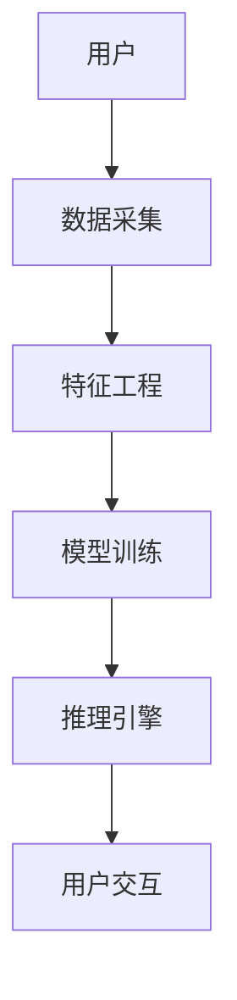
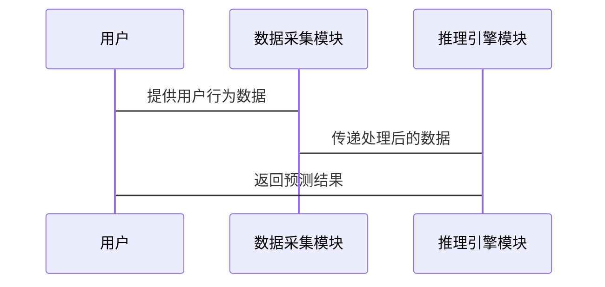

                 


# AI Agent的用户需求预测与主动服务

> 关键词：AI Agent、用户需求预测、主动服务、深度学习、强化学习、系统架构

> 摘要：本文探讨了AI Agent在用户需求预测与主动服务中的应用，从算法原理、系统架构设计到实际项目实现，详细分析了AI Agent如何通过预测用户需求并主动提供服务，提升用户体验。文章内容涵盖背景介绍、核心算法、系统架构设计、项目实战及最佳实践，为读者提供全面而深入的技术解析。

---

## 第一章：AI Agent的核心概念与背景

### 1.1 AI Agent的定义与核心概念

AI Agent（人工智能代理）是指能够感知环境、自主决策并执行任务的智能实体。其核心特征包括：

1. **智能性**：能够理解、学习和适应环境。
2. **主动性**：主动采取行动以实现目标。
3. **反应性**：实时感知环境变化并做出反应。

AI Agent的类型包括：
- **简单反射型**：基于当前输入做出反应。
- **基于模型的反射型**：利用内部模型进行推理。
- **目标驱动型**：以特定目标为导向。
- **效用驱动型**：追求最大效用或利益。

### 1.2 用户需求预测的背景与意义

用户需求预测是指通过分析用户行为、历史数据和环境信息，预测用户的潜在需求。其意义在于：
- 提高用户体验，通过主动服务减少用户操作负担。
- 提升商业效率，通过精准推荐和自动化服务降低成本。

### 1.3 本章小结

本章介绍了AI Agent的核心概念和用户需求预测的基本背景，为后续内容打下基础。

---

## 第二章：用户需求预测的基础知识

### 2.1 用户需求预测的基本方法

用户需求预测的方法包括：
- **基于统计的方法**：如回归分析、时间序列分析。
- **基于机器学习的方法**：如协同过滤、聚类分析。
- **基于深度学习的方法**：如神经网络、序列模型。

### 2.2 用户行为分析与需求挖掘

用户行为分析包括：
- 数据采集：收集用户行为数据，如点击、浏览、购买记录。
- 特征提取：提取用户行为的特征，如频率、偏好、活跃度。

### 2.3 本章小结

本章详细介绍了用户需求预测的基本方法和用户行为分析的关键步骤。

---

## 第三章：AI Agent的核心算法与数学模型

### 3.1 协同过滤算法

协同过滤是基于用户或物品之间的相似性推荐相关内容。实现步骤如下：

1. **数据预处理**：去除缺失值、处理异常值。
2. **相似性计算**：基于余弦相似度或Jaccard系数。
3. **推荐生成**：为用户推荐相似用户的高评分物品。

### 3.2 时间序列分析

时间序列分析用于预测用户行为的时间模式。常用模型包括ARIMA和LSTM。

#### ARIMA模型原理

ARIMA（自回归积分滑动平均模型）由三部分组成：
- AR(p)：自回归部分，p为阶数。
- I(d)：差分部分，d为阶数。
- MA(q)：滑动平均部分，q为阶数。

#### LSTM模型

LSTM（长短期记忆网络）通过门控机制解决梯度消失问题，适合处理时间序列数据。

### 3.3 基于深度学习的需求预测

深度学习模型如DNN和LSTM在需求预测中表现优异。

#### DNN模型

DNN通过多层神经网络提取高维特征，实现非线性关系建模。

---

## 第四章：系统分析与架构设计

### 4.1 系统架构设计

AI Agent系统架构包括：
- 数据采集模块：采集用户行为数据。
- 特征工程模块：处理数据，提取特征。
- 模型训练模块：训练预测模型。
- 推理引擎模块：基于模型生成预测结果。
- 用户交互模块：与用户进行实时交互。

#### 系统架构图（Mermaid）



### 4.2 项目实现

#### 环境安装

需要安装Python、TensorFlow、Keras等库。

#### 核心代码实现

```python
import numpy as np
from sklearn.metrics import mean_squared_error
from tensorflow.keras.models import Sequential
from tensorflow.keras.layers import Dense, LSTM

# 数据预处理
def preprocess(data):
    # 假设data为时间序列数据
    train_data = data[:-100]
    test_data = data[-100:]
    train_scaled = normalize(train_data)
    test_scaled = normalize(test_data)
    return train_scaled, test_scaled

# 模型训练
def train_model(train_scaled, test_scaled):
    model = Sequential()
    model.add(LSTM(128, input_shape=(timesteps, features)))
    model.add(Dense(1))
    model.compile(loss='mean_squared_error', optimizer='adam')
    model.fit(train_scaled, epochs=100, batch_size=32, verbose=1)
    return model

# 预测与评估
def evaluate(model, test_scaled):
    predicted = model.predict(test_scaled)
    rmse = np.sqrt(mean_squared_error(predicted, test_labels))
    print(f'RMSE: {rmse}')
    return predicted
```

### 4.3 系统交互流程图（Mermaid）



---

## 第五章：项目实战

### 5.1 案例分析

以电商推荐系统为例，详细描述项目需求、系统设计和实现过程。

#### 5.1.1 项目背景

电商推荐系统通过预测用户购买行为，提供个性化推荐。

#### 5.1.2 实现步骤

1. 数据采集：收集用户点击、浏览、购买数据。
2. 特征提取：提取用户行为特征，如点击频率、购买历史。
3. 模型训练：训练协同过滤或深度学习模型。
4. 服务部署：将模型部署为API，供前端调用。

#### 5.1.3 代码实现

```python
# 协同过滤实现
def collaborative_filtering(user_item_matrix):
    user_similarity = compute_similarities(user_item_matrix)
   推荐结果 = generate_recommendations(user_id, user_similarity, user_item_matrix)
    return 推荐结果
```

### 5.2 总结与优化

总结项目成果，讨论优化方向，如模型调优、系统扩展。

---

## 第六章：总结与展望

### 6.1 本章总结

AI Agent通过用户需求预测和主动服务，显著提升了用户体验和商业效率。系统架构设计和算法实现是关键。

### 6.2 未来展望

未来，AI Agent将更加智能化，结合多模态数据和边缘计算，提供更精准的服务。

---

## 作者：AI天才研究院 & 禅与计算机程序设计艺术

---

这篇文章系统地介绍了AI Agent在用户需求预测与主动服务中的应用，从算法原理到系统设计，再到实际项目实现，为读者提供了全面而深入的技术解析。

