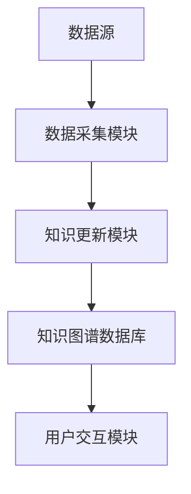
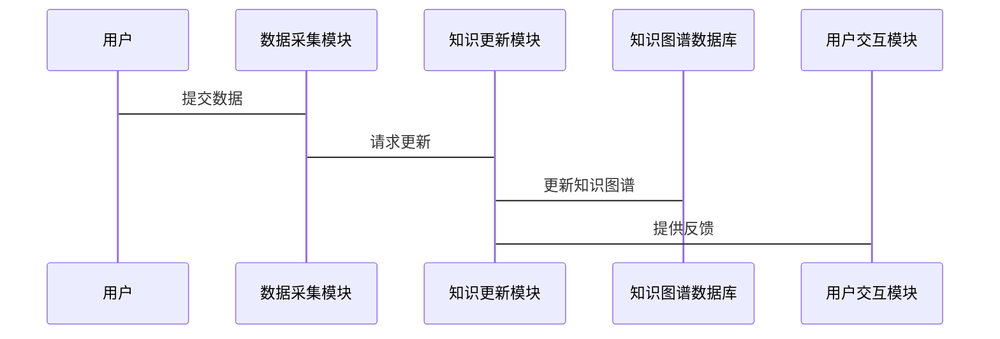

                 


---

# AI Agent的知识图谱动态更新机制设计

**关键词：** AI Agent, 知识图谱, 动态更新, 图数据库, 算法设计, 系统架构

**摘要：**  
本文详细探讨了AI Agent的知识图谱动态更新机制的设计与实现。首先介绍了AI Agent和知识图谱的基本概念及其重要性，接着分析了知识图谱的构建与管理方法，重点阐述了动态更新机制的设计原理与算法实现。通过实际案例分析，展示了动态更新机制在不同场景中的应用，并结合系统架构设计与项目实战，深入探讨了动态更新机制的实现细节。最后，总结了全文并提出了未来的研究方向。

---

## 第1章: AI Agent与知识图谱基础

### 1.1 AI Agent的基本概念
#### 1.1.1 AI Agent的定义与特点
- **定义：** AI Agent（人工智能代理）是指能够感知环境、自主决策并执行任务的智能实体。
- **特点：**  
  - **自主性：** AI Agent能够自主决策，无需外部干预。  
  - **反应性：** 能够实时感知环境变化并做出反应。  
  - **目标导向：** 具有明确的目标，并通过行动实现目标。  
  - **学习能力：** 能够通过经验或数据进行自我改进。  

#### 1.1.2 知识图谱的定义与特点
- **定义：** 知识图谱是一种以图结构表示知识的数据库，节点代表实体或概念，边表示实体之间的关系。  
- **特点：**  
  - **结构化：** 采用图结构，便于计算机理解和推理。  
  - **语义化：** 包含丰富的语义信息，能够表示复杂的知识关系。  
  - **动态性：** 知识图谱需要根据实时数据动态更新。  

#### 1.1.3 AI Agent与知识图谱的关系
- AI Agent依赖知识图谱进行推理和决策。  
- 知识图谱为AI Agent提供了丰富的知识库，支持其执行复杂任务。  

### 1.2 知识图谱的应用场景
#### 1.2.1 知识图谱在自然语言处理中的应用
- **智能问答系统：** 基于知识图谱提供准确的答案。  
- **语义理解：** 利用知识图谱提升自然语言处理的准确性。  

#### 1.2.2 知识图谱在推荐系统中的应用
- **个性化推荐：** 根据用户行为和知识图谱中的关系进行推荐。  
- **上下文理解：** 利用知识图谱理解推荐的上下文信息。  

#### 1.2.3 知识图谱在智能问答中的应用
- **问题解析：** 基于知识图谱理解问题意图。  
- **答案生成：** 通过知识图谱生成准确的答案。  

### 1.3 动态更新机制的重要性
#### 1.3.1 知识图谱的静态与动态特性
- **静态特性：** 知识图谱的初始构建阶段。  
- **动态特性：** 知识图谱需要实时更新以反映最新信息。  

#### 1.3.2 动态更新机制的必要性
- **实时性：** 知识图谱需要实时更新以应对变化的环境。  
- **准确性：** 动态更新机制能够确保知识图谱的准确性。  

#### 1.3.3 动态更新机制的挑战与机遇
- **挑战：** 动态更新需要处理大量的实时数据，且更新过程需要高效且准确。  
- **机遇：** 动态更新机制能够提升AI Agent的智能化水平。  

### 1.4 本章小结
本章介绍了AI Agent和知识图谱的基本概念，并探讨了知识图谱的应用场景和动态更新机制的重要性。通过这些内容，读者可以理解动态更新机制在AI Agent中的核心作用。

---

## 第2章: 知识图谱的构建与管理

### 2.1 知识图谱的构建方法
#### 2.1.1 基于规则的构建方法
- **规则定义：** 根据领域专家定义的规则进行知识抽取。  
- **优点：** 精确性高，适用于规则明确的领域。  
- **缺点：** 需要大量人工干预，难以应对复杂场景。  

#### 2.1.2 基于机器学习的构建方法
- **机器学习模型：** 使用深度学习模型（如BERT）进行知识抽取和关系抽取。  
- **优点：** 可以自动学习知识，适用于复杂场景。  
- **缺点：** 需要大量标注数据，且模型训练成本较高。  

#### 2.1.3 基于混合方法的构建
- **混合方法：** 结合规则和机器学习的方法，优势互补。  
- **优点：** 精确性和自动化的结合，适用于复杂场景。  

### 2.2 知识图谱的存储与管理
#### 2.2.1 图数据库的选择与使用
- **图数据库：** 常见的图数据库包括Neo4j、RDF等。  
- **存储结构：** 使用节点和边表示实体及其关系。  

#### 2.2.2 知识图谱的存储结构
- **节点：** 表示实体，属性包括名称、类型等。  
- **边：** 表示实体之间的关系，属性包括关系类型、权重等。  

#### 2.2.3 知识图谱的版本控制
- **版本控制：** 管理知识图谱的更新历史，支持回滚和对比。  
- **工具：** 使用Git等版本控制工具进行知识图谱的管理。  

### 2.3 知识图谱的质量评估
#### 2.3.1 知识图谱的完整性评估
- **完整性：** 评估知识图谱是否覆盖了所有相关知识。  
- **方法：** 通过统计节点和边的数量进行评估。  

#### 2.3.2 知识图谱的准确性评估
- **准确性：** 评估知识图谱中信息的正确性。  
- **方法：** 使用领域专家进行人工审核或采用机器学习模型进行自动评估。  

#### 2.3.3 知识图谱的可扩展性评估
- **可扩展性：** 评估知识图谱是否能够方便地扩展和更新。  
- **方法：** 通过设计模式和数据结构的合理性进行评估。  

### 2.4 本章小结
本章详细介绍了知识图谱的构建方法、存储与管理以及质量评估。通过这些内容，读者可以理解如何构建和维护一个高质量的知识图谱。

---

## 第3章: 知识图谱动态更新机制的设计

### 3.1 动态更新的触发条件
#### 3.1.1 实时数据源的接入
- **实时数据源：** 如社交媒体、传感器数据等。  
- **触发条件：** 数据源中的新数据到达时触发更新。  

#### 3.1.2 用户反馈的驱动
- **用户反馈：** 用户对知识图谱的修改建议或错误报告。  
- **触发条件：** 用户提交反馈后触发更新。  

#### 3.1.3 知识图谱的自我学习
- **自我学习：** 知识图谱通过机器学习模型进行自我优化。  
- **触发条件：** 定期运行自我学习算法，自动更新知识图谱。  

### 3.2 动态更新算法的选择
#### 3.2.1 基于规则的更新算法
- **规则定义：** 根据预定义的规则进行知识更新。  
- **优点：** 简单易懂，适用于规则明确的场景。  
- **缺点：** 需要频繁维护规则，难以应对复杂场景。  

#### 3.2.2 基于机器学习的更新算法
- **机器学习模型：** 使用深度学习模型进行知识更新。  
- **优点：** 可以自动学习更新规则，适用于复杂场景。  
- **缺点：** 训练成本高，需要大量标注数据。  

#### 3.2.3 基于图论的更新算法
- **图论算法：** 使用图论中的算法（如最短路径算法）进行知识更新。  
- **优点：** 精确性高，适用于需要精确更新的场景。  
- **缺点：** 计算复杂度较高，适用于大规模知识图谱时性能可能下降。  

### 3.3 动态更新的同步策略
#### 3.3.1 分层同步策略
- **分层设计：** 将知识图谱分为多个层次，逐步进行同步。  
- **优点：** 减少同步冲突，提高同步效率。  

#### 3.3.2 增量同步策略
- **增量更新：** 只更新发生变化的部分，减少计算量。  
- **优点：** 提高同步效率，节省资源。  

#### 3.3.3 基于冲突检测的同步策略
- **冲突检测：** 在同步过程中检测并解决冲突。  
- **优点：** 确保知识图谱的准确性和一致性。  

### 3.4 本章小结
本章详细探讨了动态更新的触发条件、算法选择和同步策略，为后续章节的实现提供了理论基础。

---

## 第4章: 动态更新算法的设计与实现

### 4.1 动态更新算法的设计
#### 4.1.1 算法设计原理
- **目标：** 设计一种高效的动态更新算法。  
- **输入：** 需要更新的知识图谱和新的数据。  
- **输出：** 更新后的知识图谱。  

#### 4.1.2 算法设计步骤
1. **数据预处理：** 对新数据进行清洗和格式化。  
2. **关系抽取：** 使用自然语言处理技术抽取实体关系。  
3. **知识推理：** 基于现有知识图谱进行推理，确定新知识的位置。  
4. **知识融合：** 将新知识与现有知识图谱进行融合。  
5. **冲突检测：** 检测并解决冲突。  
6. **知识存储：** 更新知识图谱并存储。  

### 4.2 动态更新算法的实现
#### 4.2.1 使用的工具与库
- **Python：** 用于算法实现。  
- **Neo4j：** 用于知识图谱的存储与管理。  
- **NLTK：** 用于自然语言处理。  

#### 4.2.2 算法实现代码
```python
def dynamic_update(kg, new_data):
    # 数据预处理
    processed_data = preprocess(new_data)
    # 关系抽取
    relations = extract_relations(processed_data)
    # 知识推理
    inferred_kg = infer_knowledge(kg, relations)
    # 冲突检测
    resolved_kg = resolve_conflicts(inferred_kg)
    # 知识存储
    update_kg(resolved_kg)
    return resolved_kg
```

#### 4.2.3 算法实现的步骤解释
1. **数据预处理：** 对新数据进行清洗和格式化，确保数据质量。  
2. **关系抽取：** 使用自然语言处理技术从文本中抽取实体关系。  
3. **知识推理：** 基于现有知识图谱进行推理，确定新知识的位置。  
4. **冲突检测：** 检测知识图谱中的冲突，并通过协商或规则解决冲突。  
5. **知识存储：** 将更新后的知识图谱存储到数据库中。  

### 4.3 本章小结
本章详细介绍了动态更新算法的设计与实现，通过Python代码和步骤解释，帮助读者理解动态更新算法的具体实现过程。

---

## 第5章: 动态更新机制在实际场景中的应用

### 5.1 案例分析
#### 5.1.1 金融领域的应用
- **应用场景：** 实时监控金融市场的动态，更新公司关系和市场趋势。  
- **具体实现：** 基于实时新闻数据更新知识图谱。  

#### 5.1.2 医疗领域的应用
- **应用场景：** 更新疾病知识图谱，支持智能诊断。  
- **具体实现：** 基于最新医学研究数据更新知识图谱。  

### 5.2 应用中的挑战与解决方案
#### 5.2.1 数据源的多样性
- **挑战：** 不同数据源的数据格式和质量差异较大。  
- **解决方案：** 使用数据融合技术，统一数据格式。  

#### 5.2.2 实时性要求高
- **挑战：** 动态更新机制需要处理大量的实时数据，计算效率可能不足。  
- **解决方案：** 使用分布式计算和流处理技术（如Apache Kafka）。  

### 5.3 本章小结
本章通过案例分析展示了动态更新机制在不同场景中的应用，并探讨了应用中的挑战与解决方案。

---

## 第6章: 系统架构设计与实现

### 6.1 系统功能设计
#### 6.1.1 功能模块划分
- **数据采集模块：** 采集实时数据。  
- **知识更新模块：** 处理数据并更新知识图谱。  
- **用户交互模块：** 提供用户界面，支持用户反馈。  

#### 6.1.2 功能流程
1. **数据采集：** 从数据源获取数据。  
2. **知识更新：** 处理数据并更新知识图谱。  
3. **用户交互：** 提供用户反馈接口，支持动态更新。  

### 6.2 系统架构设计
#### 6.2.1 系统架构图


#### 6.2.2 接口设计
- **数据采集接口：** REST API，支持数据上传。  
- **知识更新接口：** REST API，支持知识图谱的更新。  
- **用户交互接口：** Web界面，支持用户反馈。  

#### 6.2.3 交互流程


### 6.3 本章小结
本章详细介绍了系统架构设计与实现，包括功能模块划分、架构图和交互流程，为后续章节的项目实战提供了理论支持。

---

## 第7章: 项目实战

### 7.1 项目环境安装
#### 7.1.1 安装Python
- **命令：** `python --version`  
- **安装：** 使用`get-pip.py`安装Python包管理工具。  

#### 7.1.2 安装Neo4j
- **下载地址：** [Neo4j官方下载页面](https://neo4j.com/download/)  
- **安装：** 按照官方文档进行安装。  

#### 7.1.3 安装相关Python库
- **库：** `neo4j`, `networkx`, `numpy`  
- **安装命令：** `pip install neo4j networkx numpy`  

### 7.2 系统核心功能实现
#### 7.2.1 数据采集模块实现
```python
import neo4j-driver

def connect_neo4j():
    driver = neo4j-driver.connect('bolt://localhost:7687', auth=('neo4j', 'password'))
    return driver

def load_data(driver, data):
    with driver.session() as session:
        session.run("CREATE (n:Node {name: $name})", name=data)
```

#### 7.2.2 知识更新模块实现
```python
from networkx import Graph

def update_kg(kg, new_data):
    new_node = add_node(kg, new_data)
    add_edges(kg, new_node, new_data)
    return kg
```

#### 7.2.3 用户交互模块实现
```python
def user_feedback():
    name = input("请输入实体名称：")
    return name
```

### 7.3 项目实战总结
通过本章的项目实战，读者可以掌握AI Agent的知识图谱动态更新机制的具体实现方法，并能够将其应用到实际项目中。

---

## 第8章: 总结与展望

### 8.1 全文总结
本文详细探讨了AI Agent的知识图谱动态更新机制的设计与实现，包括知识图谱的构建与管理、动态更新机制的设计、算法实现以及实际应用。通过这些内容，读者可以全面理解动态更新机制的重要性与实现方法。

### 8.2 未来研究方向
- **高效算法研究：** 研究更高效的动态更新算法，提升计算效率。  
- **智能系统集成：** 将动态更新机制与其他智能系统（如机器人、自动驾驶）进行集成。  
- **跨领域应用：** 探讨动态更新机制在更多领域的应用，如教育、农业等。  

### 8.3 最佳实践 tips
- **数据质量：** 确保数据来源可靠，数据质量高。  
- **算法选择：** 根据具体场景选择合适的算法，避免盲目使用复杂算法。  
- **系统架构：** 设计合理的系统架构，确保系统的可扩展性和可维护性。  

### 8.4 作者信息
作者：AI天才研究院 & 禅与计算机程序设计艺术

---

**文章结束**

