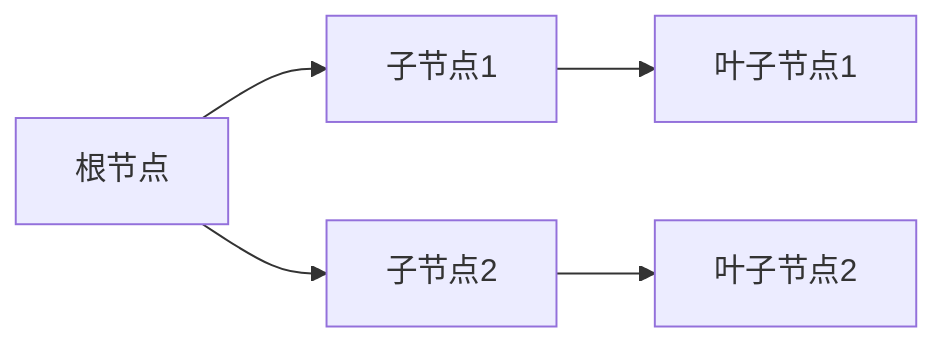
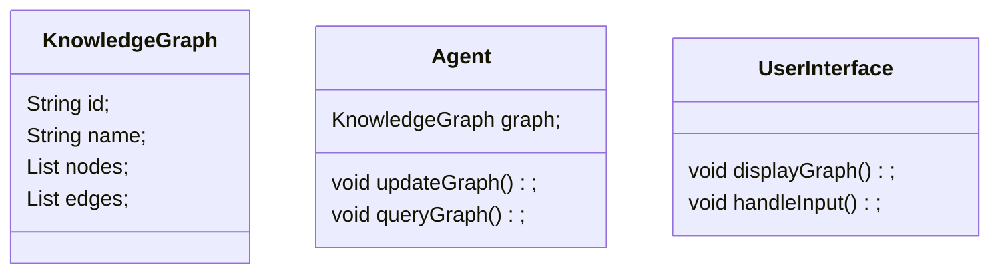

                 


# AI Agent的知识图谱可视化技术

> 关键词：知识图谱，AI Agent，可视化技术，布局算法，系统架构

> 摘要：本文详细探讨了AI Agent在知识图谱可视化技术中的应用，从知识图谱与AI Agent的基本概念出发，分析了知识图谱可视化的核心技术和算法原理，结合实际案例展示了系统架构设计和项目实现过程，并提出了相关的最佳实践和未来发展趋势。

---

## 第一章：知识图谱与AI Agent概述

### 1.1 知识图谱的定义与特点
知识图谱是一种以图结构表示知识的语义网络，节点代表实体或概念，边表示实体之间的关系。其特点包括语义性、结构化、可扩展性和动态性。

### 1.2 AI Agent的定义与特点
AI Agent是指具有感知环境、自主决策和执行任务能力的智能体。其特点包括自主性、反应性、目标导向和学习能力。

### 1.3 知识图谱与AI Agent的结合
知识图谱为AI Agent提供了丰富的语义信息，使其能够进行更智能的推理和决策。AI Agent则通过动态更新和交互，提升了知识图谱的实用性和实时性。

---

## 第二章：知识图谱可视化的核心概念

### 2.1 知识图谱可视化的定义与目标
知识图谱可视化是将复杂的数据结构转化为图形化的表示，便于理解和分析。其目标包括信息传递、辅助决策和提升用户体验。

### 2.2 知识图谱可视化的核心技术
- **图形绘制技术**：包括节点布局、边绘制和交互操作。
- **数据预处理技术**：数据清洗、标准化和关联规则提取。
- **可视化交互技术**：包括缩放、筛选和查询功能。

### 2.3 知识图谱与AI Agent的可视化结合
通过可视化，AI Agent能够更直观地理解知识图谱的结构，并与用户进行有效的交互。

---

## 第三章：知识图谱可视化的算法原理

### 3.1 知识图谱可视化的布局算法
#### 3.1.1 层次布局算法
层次布局将节点按层次排列，适用于树状结构的知识图谱。



#### 3.1.2 力导向布局算法
力导向布局模拟物理力，将节点分布均匀。


#### 3.1.3 曼哈顿布局算法
曼哈顿布局将节点按行和列排列，适用于网格结构。


### 3.2 算法实现与优化
布局算法的实现步骤包括数据预处理、初始化布局和优化调整。优化方法包括局部搜索和模拟退火。

### 3.3 算法实现的Python代码
以下是层次布局算法的Python实现：

```python
import networkx as nx

def hierarchy_layout(G):
    pos = {}
    for node in G.nodes():
        parent = G.predecessors(node)[0] if G.predecessors(node) else None
        if parent is None:
            pos[node] = (0, 0)
        else:
            pos[node] = (pos[parent][0] + 1, pos[parent][1] + 1)
    return pos
```

---

## 第四章：知识图谱可视化的系统架构设计

### 4.1 系统功能设计
系统功能包括数据输入、知识抽取、知识存储、可视化生成和用户交互。



### 4.2 系统架构设计
系统架构采用分层设计，包括数据层、服务层和表现层。

```mermaid
architectural
    client --[HTTP]--> server
    server --[RabbitMQ]--> worker
    worker --[File]--> storage
```

### 4.3 系统接口设计
系统接口包括数据接口、查询接口和可视化接口。

### 4.4 系统交互设计
用户通过界面输入查询请求，系统生成并显示知识图谱。

---

## 第五章：项目实战

### 5.1 环境安装
安装必要的库，如networkx、matplotlib和ipython。

### 5.2 数据处理
读取数据并构建知识图谱。

### 5.3 可视化实现
使用networkx绘制知识图谱。

### 5.4 结果分析
分析可视化结果，优化布局。

---

## 第六章：高级应用与未来展望

### 6.1 动态知识图谱
实时更新知识图谱，提升可视化效果。

### 6.2 多模态可视化
结合文本、图像等多种数据源进行可视化。

### 6.3 分布式架构
在大规模数据下，采用分布式架构提升性能。

---

## 结语

知识图谱可视化技术为AI Agent提供了强大的工具，帮助其更好地理解和处理复杂知识。未来，随着技术的发展，知识图谱可视化将更加智能化和多样化。

---

作者：AI天才研究院 & 禅与计算机程序设计艺术

