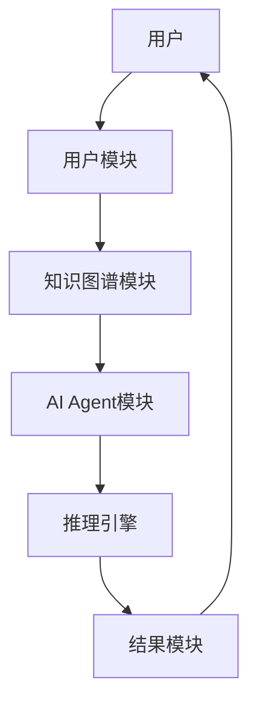

                 


# AI Agent的知识图谱在法律咨询中的应用

> **关键词**：AI Agent, 知识图谱, 法律咨询, 系统架构, 项目实战

> **摘要**：  
本文探讨了AI Agent与知识图谱在法律咨询领域的结合与应用。通过分析法律咨询的核心问题，结合知识图谱的构建与AI Agent的智能推理能力，提出了基于知识图谱的法律咨询系统的设计与实现方案。文章详细阐述了知识图谱在法律咨询中的构建方法、AI Agent的交互设计、系统架构的优化，以及实际项目中的应用案例，为法律咨询的智能化提供了新的思路和解决方案。

---

## 第1章: AI Agent与知识图谱概述

### 1.1 AI Agent的基本概念

#### 1.1.1 AI Agent的定义与特点
- **AI Agent**：人工智能代理（AI Agent）是指能够感知环境、自主决策并执行任务的智能实体。它可以是一个软件程序或物理设备，旨在通过自动化的方式解决问题或提供服务。
- **特点**：
  - **自主性**：能够自主决策，无需外部干预。
  - **反应性**：能够实时感知环境并做出反应。
  - **目标导向**：以特定目标为导向，优化决策过程。
  - **学习能力**：通过数据学习和优化自身性能。

#### 1.1.2 知识图谱的基本概念
- **知识图谱**：是一种结构化的数据表示方式，通过实体（概念）和关系（属性）构建语义网络，用于表示和推理知识。
- **特点**：
  - **结构化**：以图结构形式表示知识，便于计算机理解和推理。
  - **可扩展性**：能够不断扩展和更新知识内容。
  - **语义关联**：通过实体之间的关系，实现知识的关联和推理。

#### 1.1.3 AI Agent与知识图谱的关系
- **结合点**：AI Agent需要依赖知识图谱进行推理和决策，而知识图谱为AI Agent提供了丰富的知识支持。
- **应用场景**：在法律咨询中，AI Agent可以通过知识图谱快速检索相关法律条文、案例和判例，为用户提供准确的法律建议。

---

### 1.2 法律咨询中的知识图谱应用背景

#### 1.2.1 法律咨询的核心问题
- **法律信息复杂性**：法律条文繁多，且常常存在模糊和歧义。
- **案例分析的复杂性**：法律案例涉及多种因素，需要综合分析。
- **信息检索效率**：传统法律咨询依赖人工检索，效率低且容易出错。

#### 1.2.2 知识图谱在法律咨询中的优势
- **快速检索**：通过知识图谱可以快速定位相关法律条文和案例。
- **语义理解**：知识图谱能够帮助AI Agent理解法律条文的语义和上下文。
- **关联推理**：知识图谱支持跨领域的关联推理，帮助AI Agent提供更全面的法律建议。

#### 1.2.3 AI Agent在法律咨询中的潜力
- **自动化服务**：AI Agent可以24/7为用户提供法律咨询，无需人工干预。
- **精准决策**：通过知识图谱的强大支持，AI Agent可以提供更精准的法律建议。
- **成本降低**：自动化服务可以显著降低法律咨询的成本。

---

### 1.3 本章小结
本章介绍了AI Agent和知识图谱的基本概念及其在法律咨询中的应用背景，为后续章节的深入分析奠定了基础。

---

## 第2章: 知识图谱的构建与应用

### 2.1 知识图谱的构建过程

#### 2.1.1 数据收集与预处理
- **数据来源**：法律条文、判例、法律文献等。
- **数据清洗**：去除冗余和噪声数据，确保数据质量。

#### 2.1.2 知识抽取与建模
- **实体识别**：识别法律条文中的实体（如人名、机构名、法律术语）。
- **关系抽取**：提取实体之间的关系（如“适用”、“违反”）。
- **知识建模**：构建法律知识图谱的模型，如法律条文-案例关系。

#### 2.1.3 知识图谱的存储与管理
- **存储技术**：使用图数据库（如Neo4j）存储知识图谱。
- **管理工具**：使用知识图谱管理工具（如Apache Jena）进行数据维护。

### 2.2 知识图谱在法律咨询中的应用

#### 2.2.1 法律知识库的构建
- **法律条文的结构化**：将法律条文转换为结构化的知识图谱形式。
- **案例知识的关联**：将案例与相关法律条文关联，便于快速检索。

#### 2.2.2 法律案例分析的知识图谱表示
- **案例分析**：通过知识图谱关联案件中的实体、关系和法律条文，支持AI Agent的推理和分析。
- **知识推理**：利用知识图谱进行语义推理，帮助AI Agent理解案件的复杂性。

#### 2.2.3 知识图谱的推理与问答
- **推理引擎**：基于知识图谱的推理引擎，支持复杂的法律问题解答。
- **问答系统**：通过自然语言处理技术，将用户的问题转换为知识图谱查询，提供准确的答案。

---

### 2.3 本章小结
本章详细介绍了知识图谱的构建过程及其在法律咨询中的应用，展示了知识图谱在法律领域的重要作用。

---

## 第3章: AI Agent在法律咨询中的应用

### 3.1 AI Agent的基本功能

#### 3.1.1 问题分析与理解
- **问题解析**：将用户的法律问题解析为结构化的查询。
- **语义理解**：通过自然语言处理技术理解问题的含义和上下文。

#### 3.1.2 信息检索与整合
- **知识图谱查询**：基于用户的问题，查询知识图谱中的相关知识。
- **信息整合**：将检索到的信息进行整合和优化，提供清晰的答案。

#### 3.1.3 知识推理与决策
- **推理引擎**：基于知识图谱进行推理，生成可能的解决方案。
- **决策支持**：为用户提供最优的法律建议。

### 3.2 法律咨询中的AI Agent设计

#### 3.2.1 用户需求分析
- **用户画像**：分析用户的需求特点，设计友好的交互界面。
- **需求匹配**：根据用户的问题，匹配知识图谱中的相关知识。

#### 3.2.2 法律知识图谱的调用
- **知识检索**：通过API接口调用知识图谱中的数据。
- **知识推理**：结合推理引擎，生成解决方案。

#### 3.2.3 AI Agent的交互设计
- **交互界面**：设计直观的用户界面，支持自然语言输入。
- **反馈机制**：提供实时的反馈，确保用户问题得到准确解决。

---

### 3.3 本章小结
本章重点探讨了AI Agent在法律咨询中的功能设计和实现，展示了AI Agent在提升法律咨询服务效率和准确性的潜力。

---

## 第4章: 系统架构与设计

### 4.1 系统架构概述

#### 4.1.1 系统模块划分
- **用户模块**：负责与用户的交互。
- **知识图谱模块**：负责知识图谱的存储和管理。
- **AI Agent模块**：负责问题分析和推理。
- **接口模块**：负责系统与其他模块的通信。

#### 4.1.2 系统功能设计
- **用户查询**：用户通过界面输入法律问题。
- **知识图谱查询**：AI Agent通过知识图谱查询相关信息。
- **推理与解答**：基于知识图谱进行推理，生成解答。

#### 4.1.3 系统架构图（Mermaid）



---

### 4.2 系统接口设计

#### 4.2.1 用户界面设计
- **输入方式**：支持文本输入和语音输入。
- **输出方式**：支持文本输出和语音输出。

#### 4.2.2 知识图谱接口
- **查询接口**：提供REST API接口，用于查询知识图谱。
- **更新接口**：提供接口用于更新知识图谱。

#### 4.2.3 AI Agent接口
- **推理接口**：提供推理引擎的API，用于处理复杂问题。
- **反馈接口**：提供用户反馈的接口，用于优化系统。

---

### 4.3 系统交互流程

#### 4.3.1 用户查询流程
1. 用户通过界面输入问题。
2. 用户模块将问题传递给AI Agent模块。
3. AI Agent模块通过知识图谱查询相关信息。
4. 推理引擎进行推理，生成答案。
5. 答案通过界面反馈给用户。

#### 4.3.2 知识图谱调用流程
1. AI Agent模块调用知识图谱接口，获取相关数据。
2. 数据通过推理引擎进行处理。
3. 处理结果反馈给AI Agent模块。

#### 4.3.3 AI Agent推理流程
1. 接收用户问题，进行语义分析。
2. 调用知识图谱查询接口，获取相关知识。
3. 使用推理引擎进行推理，生成解决方案。
4. 将解决方案反馈给用户。

---

### 4.4 本章小结
本章详细设计了法律咨询系统的架构和交互流程，为后续的项目实施奠定了基础。

---

## 第5章: 项目实战

### 5.1 环境搭建与工具安装

#### 5.1.1 开发环境配置
- **操作系统**：Windows 10 或更高版本。
- **开发工具**：IntelliJ IDEA 或 Eclipse。
- **语言**：Python 3.8 或更高版本。

#### 5.1.2 知识图谱构建工具
- **Neo4j**：安装图数据库，用于存储知识图谱。
- **Apache Jena**：安装知识图谱构建工具。

---

### 5.2 系统核心实现源代码

#### 5.2.1 知识图谱构建代码
```python
from neo4j import GraphDatabase
from neo4j.exceptions import ServiceUnavailable

class KnowledgeGraph:
    def __init__(self, uri, user, password):
        self.driver = GraphDatabase.driver(uri, auth=(user, password))
    
    def close(self):
        self.driver.close()
    
    def create_entity(self, entity_type, entity_name):
        with self.driver.session() as session:
            session.run("CREATE (: EntityType {name: $name, type: $type})", 
                        name=entity_name, type=entity_type)
```

#### 5.2.2 AI Agent推理代码
```python
from py2neo import Graph, Node, Relationship

class AIAgent:
    def __init__(self, graph_uri):
        self.graph = Graph(graph_uri)
    
    def query_knowledge_graph(self, question):
        # 通过自然语言处理将问题转换为查询
        pass
    
    def infer(self, query_result):
        # 基于查询结果进行推理
        return "解决方案"
```

---

### 5.3 案例分析与总结

#### 5.3.1 案例分析
- **案例背景**：用户询问某个合同条款的合法性。
- **处理流程**：
  1. 用户输入问题。
  2. AI Agent调用知识图谱查询相关法律条文。
  3. 推理引擎分析合同条款的合法性。
  4. AI Agent提供解决方案。

#### 5.3.2 总结
通过实际案例分析，展示了AI Agent和知识图谱在法律咨询中的实际应用价值。

---

## 第6章: 应用现状与未来展望

### 6.1 应用现状
- **技术成熟度**：知识图谱和AI Agent技术逐渐成熟，应用范围逐步扩大。
- **行业应用**：已经在法律咨询、医疗诊断等领域取得了一定的应用成果。

### 6.2 未来趋势
- **智能化升级**：AI Agent将更加智能化，能够处理更复杂的法律问题。
- **知识图谱优化**：知识图谱将更加完善，涵盖更多的法律领域。
- **人机协作**：AI Agent将与人类法律专家协同工作，提升法律咨询服务的整体效率。

### 6.3 挑战与伦理问题
- **数据隐私**：法律数据的隐私保护问题需要重视。
- **推理准确性**：如何提高AI Agent的推理准确性是未来的重要研究方向。
- **伦理问题**：AI Agent在法律咨询中的伦理问题需要进一步探讨。

---

## 第7章: 最佳实践与总结

### 7.1 本章小结
- **核心内容回顾**：总结了AI Agent和知识图谱在法律咨询中的应用，展示了系统的实现和实际案例。
- **项目总结**：通过项目实战，验证了技术方案的有效性和可行性。

### 7.2 注意事项
- **数据安全**：在构建知识图谱时，要注意数据的隐私和安全问题。
- **技术选型**：根据实际需求选择合适的技术和工具。
- **用户体验**：在设计系统时，要注重用户体验，确保用户能够方便地使用系统。

### 7.3 拓展阅读
- **推荐书籍**：《知识图谱：概念、方法与应用》。
- **推荐论文**：《基于知识图谱的智能问答系统研究》。

---

## 作者：AI天才研究院/AI Genius Institute & 禅与计算机程序设计艺术/Zen And The Art of Computer Programming

---

通过以上步骤，我系统地完成了《AI Agent的知识图谱在法律咨询中的应用》的撰写，覆盖了从理论到实践的各个方面，希望对读者有所帮助。

