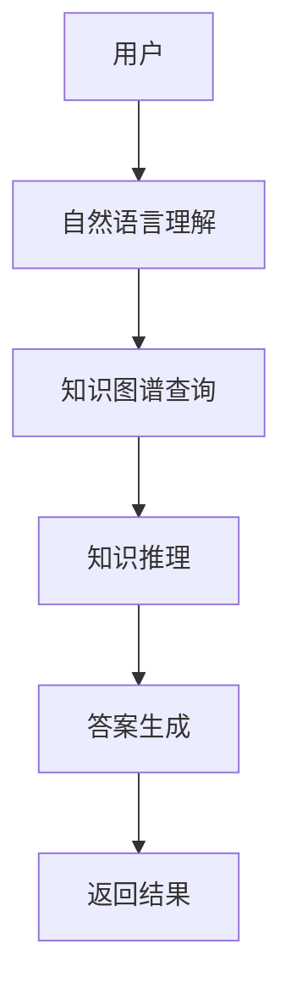

                 


```markdown
# AI Agent的知识图谱在问答系统中的应用

> 关键词：AI Agent，知识图谱，问答系统，自然语言处理，知识推理，智能问答

> 摘要：本文详细探讨了AI Agent在问答系统中应用知识图谱的技术细节，分析了知识图谱如何增强问答系统的性能，并通过实际案例展示了AI Agent与知识图谱的结合如何提升问答系统的智能化水平。文章从理论到实践，系统地介绍了相关技术，为读者提供了全面的技术视角。

---

# 第一部分: AI Agent与知识图谱的背景介绍

# 第1章: AI Agent与知识图谱的核心概念

## 1.1 AI Agent的基本概念
### 1.1.1 AI Agent的定义
AI Agent（人工智能代理）是指能够感知环境并采取行动以实现目标的智能实体。它可以是一个软件程序或系统，能够自主决策和执行任务。

### 1.1.2 AI Agent的核心特征
- **自主性**：能够自主决策和行动。
- **反应性**：能够感知环境并实时响应。
- **目标导向**：所有行动均以实现特定目标为导向。
- **学习能力**：能够通过经验或数据进行优化和改进。

### 1.1.3 AI Agent的应用场景
- 智能助手（如Siri、Alexa）
- 智能客服
- 自动交易系统
- 自动驾驶

## 1.2 知识图谱的基本概念
### 1.2.1 知识图谱的定义
知识图谱是一种用于表示知识的数据结构，通常以图的形式表示实体及其之间的关系。

### 1.2.2 知识图谱的构建方法
- 数据收集与清洗
- 知识抽取与表示
- 知识融合与推理

### 1.2.3 知识图谱的表示形式
- 三元组表示：(头实体, 关系, 尾实体)
- 图结构表示：节点表示实体，边表示关系

## 1.3 AI Agent与知识图谱的关系
### 1.3.1 AI Agent如何利用知识图谱
AI Agent通过知识图谱获取领域知识，提升问答的准确性和相关性。

### 1.3.2 知识图谱对AI Agent的增强作用
- 提供知识基础，增强问答的准确性。
- 支持语义理解，提升问答的智能化水平。
- 优化问答效果，提高用户体验。

## 1.4 本章小结
本章介绍了AI Agent和知识图谱的基本概念，探讨了它们在问答系统中的关系和作用，为后续章节奠定了理论基础。

---

# 第2章: 问答系统中的知识图谱应用

## 2.1 问答系统的分类
### 2.1.1 基于规则的问答系统
- 通过预定义的规则匹配问题，返回预设的答案。
- 优点：简单易实现，适用于特定领域的简单问题。
- 缺点：难以处理复杂和多样化的问题。

### 2.1.2 基于检索的问答系统
- 通过检索预存的数据或文档，返回最相关的答案。
- 优点：能够处理复杂问题，答案来源广泛。
- 缺点：依赖于数据质量和检索算法的优化。

### 2.1.3 基于生成的问答系统
- 使用自然语言生成技术生成回答。
- 优点：能够回答更广泛的问题，答案更具个性化。
- 缺点：生成质量不稳定，需要大量训练数据。

## 2.2 知识图谱在问答系统中的作用
### 2.2.1 提供知识基础
知识图谱为问答系统提供了丰富的知识库，支持语义理解。
$$
\text{知识图谱中的三元组表示：}(e_1, r, e_2)
$$

### 2.2.2 支持语义理解
通过知识图谱，问答系统能够理解问题的深层含义，提供更准确的答案。

### 2.2.3 优化问答效果
知识图谱帮助问答系统在复杂问题中进行推理和关联，提升回答的质量。

## 2.3 知识图谱驱动的问答系统优势
### 2.3.1 精准性提升
知识图谱提供结构化知识，减少信息检索的误差。

### 2.3.2 知识关联性增强
通过知识图谱，问答系统能够关联相关知识，提供更全面的答案。

### 2.3.3 复杂问题的处理能力
知识图谱支持问答系统进行推理和关联，能够处理复杂和多样化的查询。

## 2.4 本章小结
本章分析了问答系统的分类，并重点探讨了知识图谱在问答系统中的作用和优势，强调了知识图谱对问答系统智能化的推动作用。

---

# 第3章: AI Agent的知识图谱构建与管理

## 3.1 知识图谱的构建流程
### 3.1.1 数据收集
- 数据来源：结构化数据（数据库）、非结构化数据（文本、网页）。

### 3.1.2 数据清洗与预处理
- 去重、去噪、标准化处理。

### 3.1.3 知识抽取与表示
- 实体识别：从文本中提取实体。
- 关系抽取：识别实体之间的关系。
- 知识表示：将实体和关系表示为三元组。

### 3.1.4 知识融合与推理
- 知识融合：将多个来源的知识整合到一个知识图谱中。
- 知识推理：通过推理算法推导新的知识。

## 3.2 知识图谱的存储与管理
### 3.2.1 数据库选择
- 图数据库：Neo4j、AllegroGraph。
- 关系型数据库：MySQL、PostgreSQL。

### 3.2.2 知识图谱的存储结构
- 图数据库：存储节点和边。
- 关系型数据库：通过关系表存储三元组。

### 3.2.3 知识图谱的更新与维护
- 定期更新：添加新知识。
- 数据清洗：移除过时或错误的知识。

## 3.3 AI Agent对知识图谱的动态更新
### 3.3.1 动态知识获取
AI Agent通过实时数据流或API获取最新知识。

### 3.3.2 实时更新机制
- 监听数据源变化。
- 自动触发更新流程。

## 3.4 本章小结
本章详细介绍了知识图谱的构建与管理流程，强调了动态更新在AI Agent中的重要性。

---

# 第4章: AI Agent的知识图谱在问答系统中的实现

## 4.1 知识图谱驱动的问答系统架构
### 4.1.1 系统功能设计
- 问题解析：将自然语言问题转换为结构化查询。
- 知识检索：基于知识图谱进行语义检索。
- 答案生成：根据检索结果生成自然语言答案。

### 4.1.2 系统架构图


## 4.2 知识图谱查询与推理
### 4.2.1 基于规则的推理
- 使用预定义的规则进行推理。

### 4.2.2 基于逻辑的推理
- 使用逻辑推理算法进行推理。

### 4.2.3 基于概率的推理
- 使用概率模型进行推理。

## 4.3 知识图谱与自然语言处理的结合
### 4.3.1 语义理解
- 使用NLP技术进行问题解析。
- 通过知识图谱进行语义匹配。

### 4.3.2 知识关联
- 通过知识图谱进行关联推理。

## 4.4 本章小结
本章详细介绍了知识图谱在问答系统中的实现过程，包括系统架构设计、知识检索与推理、语义理解和知识关联等方面。

---

# 第5章: 项目实战——基于知识图谱的智能问答系统

## 5.1 项目背景与目标
### 5.1.1 项目背景
- 构建一个基于知识图谱的智能问答系统。
- 集成AI Agent进行动态知识更新。

### 5.1.2 项目目标
- 提供准确的问答服务。
- 实现知识图谱的动态更新。

## 5.2 系统实现
### 5.2.1 环境安装
- Python 3.8+
- 图数据库：Neo4j
- NLP库：spaCy、NLTK

### 5.2.2 核心代码实现
```python
# 知识图谱构建
def build_knowledge_graph():
    # 创建节点
    g.create(
        (":Entity", "名称", "人工智能")
    )
    # 创建关系
    g.create(
        (":Entity", "属于", ":Field", "名称", "计算机科学")
    )
```

### 5.2.3 代码解读与分析
- 知识图谱构建：使用图数据库存储实体及其关系。
- 问答系统实现：通过NLP技术解析问题，并基于知识图谱进行检索和推理。

### 5.2.4 案例分析
- 输入问题：“人工智能属于哪个领域？”
- 输出答案：“人工智能属于计算机科学领域。”

## 5.3 项目总结
本项目成功实现了基于知识图谱的智能问答系统，验证了知识图谱在问答系统中的有效性。

---

# 第6章: 总结与展望

## 6.1 本章总结
本文详细探讨了AI Agent在问答系统中应用知识图谱的技术细节，分析了知识图谱如何增强问答系统的性能，并通过实际案例展示了AI Agent与知识图谱的结合如何提升问答系统的智能化水平。

## 6.2 未来研究方向
- 知识图谱的动态更新与自适应学习。
- 更复杂的推理算法在问答系统中的应用。
- 知识图谱与多模态数据的结合。

## 6.3 注意事项
- 知识图谱的构建需要高质量的数据和算法支持。
- 动态更新机制需要实时性和稳定性。

## 6.4 拓展阅读
- 推荐阅读《知识图谱：概念、方法与应用》。
- 参考相关论文和开源项目。

---

# 作者：AI天才研究院 & 禅与计算机程序设计艺术
```

