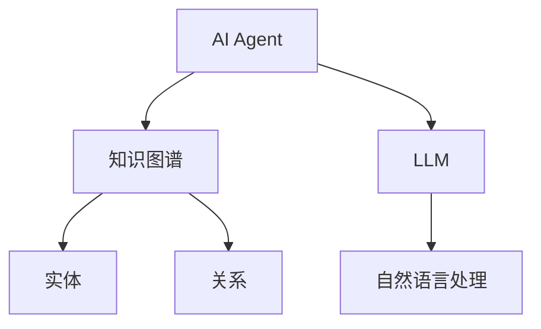
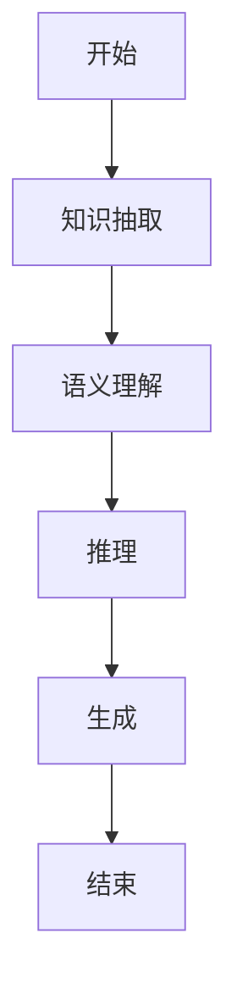
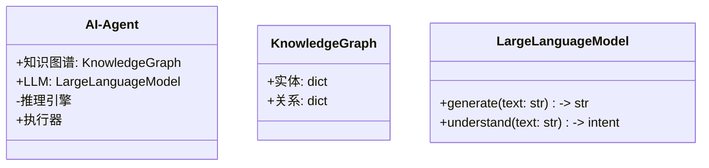

                 


# AI Agent的知识图谱增强：整合LLM与结构化知识

> 关键词：知识图谱，大语言模型（LLM），AI Agent，结构化知识，智能增强

> 摘要：本文探讨如何通过整合知识图谱与大语言模型（LLM）来增强AI Agent的能力。文章从背景、核心概念、算法原理、系统架构到项目实战，全面解析知识图谱与LLM的结合方式，提升AI Agent的理解和推理能力。

---

## 第一部分：背景介绍

### 第1章：AI Agent与知识图谱概述

#### 1.1 问题背景
知识图谱是一种结构化的数据表示，通过实体和关系描述现实世界。LLM凭借强大的语言理解能力，为AI Agent提供了生成和理解自然语言的能力。然而，AI Agent在处理复杂任务时，缺乏深度的推理和结构化知识的整合，导致智能性受限。

#### 1.2 问题描述
当前AI Agent依赖LLM处理任务，但缺乏结构化知识支持，导致在需要精确推理的任务中表现不佳。整合知识图谱与LLM，可以弥补这一不足，提升AI Agent的智能性。

#### 1.3 问题解决
通过知识图谱提供结构化知识，LLM处理自然语言，AI Agent结合两者，提升任务处理能力。这种整合需要优化知识抽取、语义理解、推理等模块。

#### 1.4 边界与外延
知识图谱用于结构化知识，LLM处理语言生成，AI Agent负责整合。其边界包括知识图谱的构建、LLM的调用及结果的融合。

#### 1.5 核心要素组成
知识图谱包含实体、关系和属性，LLM提供生成能力，AI Agent负责协调和执行。

---

## 第二部分：核心概念与联系

### 第2章：知识图谱与LLM的核心概念

#### 2.1 知识图谱的原理
知识图谱通过三元组表示实体和关系，构建语义网络。推理算法如RDF和SPARQL用于查询和推理。

#### 2.2 LLM的原理
LLM通过神经网络模型处理文本，生成相关回复。训练数据庞大，使其具备上下文理解和生成能力。

#### 2.3 核心概念对比
| 属性 | 知识图谱 | LLM |
|------|----------|-----|
| 数据类型 | 结构化 | 非结构化 |
| 优势 | 精准推理 | 自然语言处理 |

#### 2.4 实体关系图


---

## 第三部分：算法原理讲解

### 第3章：知识图谱与LLM的融合算法

#### 3.1 算法概述
融合过程包括知识抽取、语义理解、推理生成。通过预处理知识图谱数据，结合LLM进行问答和推理。

#### 3.2 算法流程


#### 3.3 算法实现
```python
class KnowledgeGraph:
    def __init__(self, data):
        self.data = data

    def get_entity(self, entity):
        return self.data.get(entity, [])
```

---

## 第四部分：系统分析与架构设计

### 第4章：系统设计

#### 4.1 问题场景
AI Agent处理复杂任务，如智能助手，需要整合知识图谱和LLM。

#### 4.2 系统功能设计


#### 4.3 系统架构设计


---

## 第五部分：项目实战

### 第5章：知识图谱与LLM的项目实战

#### 5.1 环境安装
安装必要的库如NetworkX和Transformers，配置LLM如GPT-3。

#### 5.2 核心代码实现
```python
import networkx as nx
from transformers import GPT2LMHeadModel, GPT2Tokenizer

def build_graph(entities, relations):
    G = nx.DiGraph()
    for rel in relations:
        G.add_edge(rel[0], rel[1], label=rel[2])
    return G

# 示例
entities = ['猫', '狗']
relations = [('猫', '喜欢', '鱼'), ('狗', '喜欢', '骨头')]
graph = build_graph(entities, relations)
```

#### 5.3 代码解读与分析
代码构建知识图谱，使用GPT-2生成回答。结合图数据和LLM生成智能回复。

#### 5.4 案例分析
构建宠物知识图谱，LLM生成问答，AI Agent提供智能宠物建议。

#### 5.5 项目小结
通过实战，展示知识图谱与LLM的整合，提升AI Agent的智能性。

---

## 第六部分：最佳实践

### 第6章：小结与注意事项

#### 6.1 小结
整合知识图谱与LLM，提升AI Agent的智能性，但需处理数据规模和计算效率问题。

#### 6.2 注意事项
- 数据质量：知识图谱需准确。
- 模型选择：选择适合任务的LLM。
- 优化：平衡结构化知识与生成能力。

#### 6.3 拓展阅读
推荐学习知识图谱构建、LLM优化和AI Agent设计的相关文献。

---

## 作者

作者：AI天才研究院 & 禅与计算机程序设计艺术

---

以上是文章的详细结构，涵盖了从背景到实战的各个方面，确保内容全面且深入。

