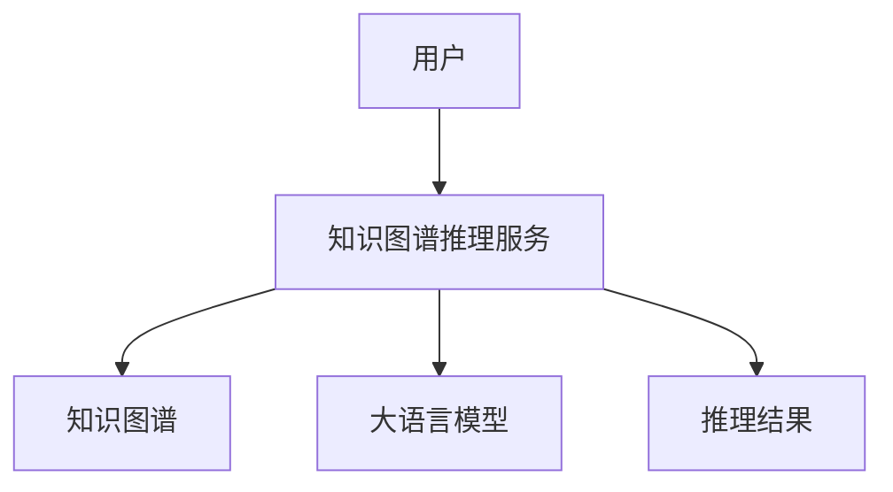
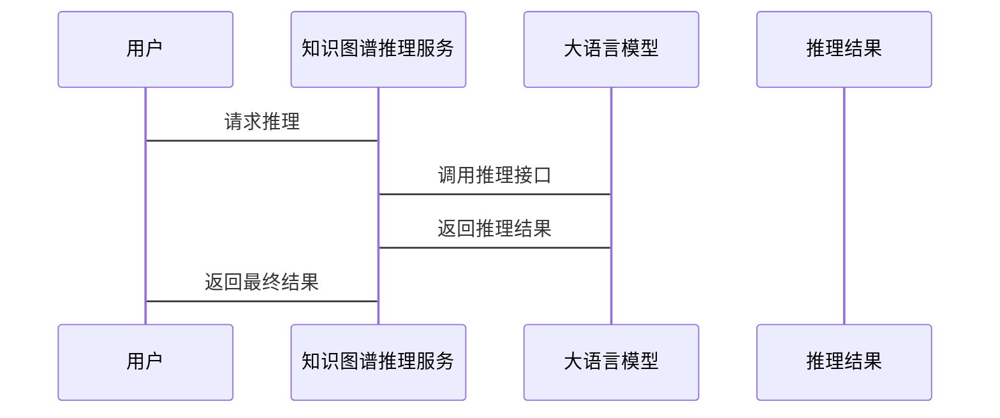

                 


# AI Agent的知识图谱推理：增强LLM的关系理解

> 关键词：AI Agent, 知识图谱, 知识图谱推理, 大语言模型, LLM, 关系理解

> 摘要：本文详细探讨了AI Agent在知识图谱推理中的应用，重点分析了如何通过知识图谱增强大语言模型（LLM）的关系理解能力。文章从背景介绍、核心概念、算法原理、系统架构到项目实战，全面解析了知识图谱推理的关键技术与实践应用。

---

# 第一部分: AI Agent与知识图谱推理基础

## 第1章: AI Agent与知识图谱概述

### 1.1 AI Agent的基本概念

#### 1.1.1 AI Agent的定义与分类
AI Agent（智能体）是指在计算机系统中，能够感知环境、自主决策并执行任务的实体。AI Agent可以分为**简单反射Agent**、**基于模型的反射Agent**、**目标驱动Agent**和**效用驱动Agent**等类型。AI Agent的核心特征包括自主性、反应性、目标导向性和社会性。

#### 1.1.2 知识图谱的基本概念与特点
知识图谱是一种以结构化的形式表示知识的网络，由实体（节点）和关系（边）组成。知识图谱具有以下特点：
- **结构化**：以三元组（头实体、关系、尾实体）形式表示知识。
- **可扩展性**：支持大规模数据的整合与推理。
- **语义丰富性**：通过实体间的关系和属性，提供深层次的语义理解。

#### 1.1.3 知识图谱推理的定义与作用
知识图谱推理是指在知识图谱中，根据已有的实体和关系，推导出新的知识或关系的过程。其作用包括：
- **知识补全**：通过推理填补知识图谱中的空白。
- **关系发现**：挖掘隐含的关系和模式。
- **决策支持**：为AI Agent提供更准确的知识支持。

---

### 1.2 知识图谱与AI Agent的关系

#### 1.2.1 知识图谱在AI Agent中的应用场景
- **信息检索**：通过知识图谱提供更精准的信息检索服务。
- **对话系统**：利用知识图谱提升对话的语义理解和上下文关联性。
- **决策支持**：基于知识图谱推理结果，辅助AI Agent做出更合理的决策。

#### 1.2.2 AI Agent如何利用知识图谱进行推理
AI Agent可以通过以下方式利用知识图谱进行推理：
1. **基于规则的推理**：根据预定义的规则，在知识图谱中进行路径查询和推理。
2. **基于学习的推理**：利用机器学习模型，从知识图谱中学习推理规则。
3. **混合推理**：结合符号逻辑和向量表示，实现多模态推理。

#### 1.2.3 知识图谱推理的优势与挑战
- **优势**：
  - 提供结构化的知识表示，便于推理。
  - 支持大规模数据的高效处理。
- **挑战**：
  - 知识图谱的稀疏性问题。
  - 推理算法的计算效率问题。
  - 实际场景中的动态知识更新问题。

---

### 1.3 知识图谱推理的核心概念

#### 1.3.1 符号逻辑与知识表示
符号逻辑是知识图谱推理的基础，常用谓词逻辑表示知识。例如，知识图谱中的三元组可以表示为：
$$ \text{Subject}(s, r, o) $$
其中，$s$是头实体，$r$是关系，$o$是尾实体。

#### 1.3.2 向量空间模型与知识表示
向量空间模型通过将实体和关系表示为向量，利用向量运算进行推理。例如，Word2Vec模型可以将实体和关系表示为向量，并通过向量相似度计算实体间的关联性。

#### 1.3.3 知识图谱推理的边界与外延
知识图谱推理的边界包括：
- 推理范围：仅限于知识图谱中的已知实体和关系。
- 推理能力：基于知识图谱的结构和已有规则进行推理。
知识图谱推理的外延包括：
- 多模态推理：结合图像、文本等多种数据形式进行推理。
- 动态推理：支持实时更新和动态推理。

---

## 第2章: 知识图谱推理的基本原理

### 2.1 知识图谱推理的符号逻辑基础

#### 2.1.1 命题逻辑与谓词逻辑
命题逻辑通过真值命题进行推理，谓词逻辑则通过谓词和个体进行推理。例如：
$$ \text{Person}(p) \land \text{Likes}(p, f) \rightarrow \text{Eats}(p, f) $$
表示“如果一个人喜欢食物$f$，那么他会吃$f$”。

#### 2.1.2 知识图谱中的三元组表示
知识图谱中的三元组表示为：
$$ (s, r, o) $$
其中，$s$是头实体，$r$是关系，$o$是尾实体。

#### 2.1.3 逻辑推理的基本规则
逻辑推理的基本规则包括：
- **合取规则**：如果$s \rightarrow o_1$且$s \rightarrow o_2$，则$s \rightarrow o_1 \land o_2$。
- **析取规则**：如果$s \rightarrow o_1$或$s \rightarrow o_2$，则$s \rightarrow o_1 \lor o_2$。

---

### 2.2 知识图谱推理的向量表示方法

#### 2.2.1 向量空间模型的基本原理
向量空间模型通过将实体和关系表示为向量，利用向量运算进行推理。例如，Word2Vec模型通过上下文信息生成实体向量。

#### 2.2.2 知识图谱中的嵌入表示
知识图谱中的嵌入表示通过将实体和关系映射到低维向量空间，利用向量相似度计算实体间的关系。例如，TransE模型将三元组表示为：
$$ s + r = o $$

#### 2.2.3 基于向量的推理方法
基于向量的推理方法包括：
- **向量加法**：通过向量加法计算关系向量。
- **向量相似度**：通过余弦相似度计算实体间的关系相似度。

---

### 2.3 知识图谱推理的算法实现

#### 2.3.1 基于符号逻辑的推理算法
基于符号逻辑的推理算法包括：
- **前向链推理**：从已知事实出发，逐步推导出新的结论。
- **反向链推理**：从目标结论出发，逐步推导出前提条件。

#### 2.3.2 基于向量的推理算法
基于向量的推理算法包括：
- **TransE**：通过向量加法进行关系推理。
- **TransH**：通过向量空间转换进行关系推理。

#### 2.3.3 混合推理方法
混合推理方法结合符号逻辑和向量表示，通过多模态推理提升推理的准确性和效率。

---

## 第3章: 知识图谱与大语言模型的结合

### 3.1 大语言模型的基本原理

#### 3.1.1 大语言模型的训练目标
大语言模型通过大规模文本数据的预训练，学习语言的分布规律和语义表示。

#### 3.1.2 大语言模型的推理机制
大语言模型通过生成式推理，根据上下文生成合理的文本输出。

#### 3.1.3 大语言模型的知识表示特点
大语言模型通过分布式表示，将知识表示为概率分布，支持多义词和上下文理解。

---

### 3.2 知识图谱与大语言模型的结合方式

#### 3.2.1 知识图谱作为外部知识库
通过将知识图谱作为外部知识库，大语言模型可以利用知识图谱中的结构化知识进行推理。

#### 3.2.2 知识图谱嵌入到模型参数中
通过将知识图谱嵌入到模型参数中，大语言模型可以利用知识图谱的结构信息进行推理。

#### 3.2.3 知识图谱与大语言模型的联合训练
通过联合训练的方式，大语言模型可以同时学习知识图谱的结构信息和语言模型的语义表示。

---

### 3.3 知识图谱增强大语言模型的关系理解

#### 3.3.1 知识图谱对关系理解的提升
知识图谱通过结构化的关系表示，帮助大语言模型更好地理解实体间的关系。

#### 3.3.2 知识图谱在关系推理中的应用
知识图谱通过提供实体间的关系和属性，支持大语言模型进行关系推理和实体链接。

#### 3.3.3 知识图谱与大语言模型的结合案例
通过结合知识图谱和大语言模型，可以构建更智能的对话系统、问答系统和推荐系统。

---

## 第4章: 知识图谱推理的系统架构与实现

### 4.1 系统架构设计

#### 4.1.1 系统功能设计
系统功能包括：
- 知识图谱构建与管理
- 知识图谱推理服务
- 知识图谱与大语言模型的结合

#### 4.1.2 系统架构图


#### 4.1.3 系统交互流程


---

### 4.2 知识图谱推理的实现细节

#### 4.2.1 知识图谱构建
知识图谱构建包括数据抽取、实体识别和关系抽取。

#### 4.2.2 知识图谱推理算法实现
知识图谱推理算法实现包括符号逻辑推理和向量空间推理。

#### 4.2.3 系统接口设计
系统接口设计包括：
- 知识图谱推理服务接口
- 大语言模型调用接口
- 推理结果返回接口

---

## 第5章: 项目实战——基于知识图谱的问答系统

### 5.1 项目背景与目标
项目背景：构建一个基于知识图谱的问答系统，提升问答的准确性和智能性。
项目目标：实现知识图谱与大语言模型的结合，支持复杂关系推理。

### 5.2 项目实现

#### 5.2.1 环境安装
- 安装知识图谱构建工具（如Neo4j）
- 安装大语言模型框架（如Hugging Face）
- 安装推理算法库（如networkx）

#### 5.2.2 核心代码实现
```python
# 知识图谱构建
class KnowledgeGraph:
    def __init__(self):
        self.graph = {}

    def add_triple(self, s, r, o):
        if s not in self.graph:
            self.graph[s] = {}
        self.graph[s][r] = o

# 知识图谱推理
class KnowledgeReasoning:
    def __init__(self, graph):
        self.graph = graph

    def forward_chaining(self, s):
        visited = set()
        to_visit = [s]
        while to_visit:
            node = to_visit.pop()
            if node not in visited:
                visited.add(node)
                for r, o in self.graph[node].items():
                    to_visit.append(o)
        return visited
```

#### 5.2.3 代码解读与分析
知识图谱构建部分通过`KnowledgeGraph`类实现，支持三元组的添加和查询。知识图谱推理部分通过`KnowledgeReasoning`类实现，支持前向链推理和反向链推理。

### 5.3 实际案例分析
通过构建一个简单的知识图谱，实现问答系统的功能。例如：
- **问题**：谁是公司的CEO？
- **推理过程**：从“公司”实体出发，通过“CEO”关系推理出具体人员。

### 5.4 项目小结
通过本项目，我们实现了知识图谱与大语言模型的结合，验证了知识图谱推理在问答系统中的应用价值。

---

## 第6章: 总结与展望

### 6.1 总结
本文详细探讨了AI Agent在知识图谱推理中的应用，重点分析了如何通过知识图谱增强大语言模型的关系理解能力。文章从背景介绍、核心概念、算法原理、系统架构到项目实战，全面解析了知识图谱推理的关键技术与实践应用。

### 6.2 未来展望
未来的研究方向包括：
- **多模态知识图谱推理**：结合图像、文本等多种数据形式，提升推理的准确性和多样性。
- **可解释性推理**：研究推理过程的可解释性，提升用户的信任度。
- **动态知识图谱推理**：支持实时更新和动态推理，适应快速变化的环境。

---

# 作者：AI天才研究院/AI Genius Institute & 禅与计算机程序设计艺术 /Zen And The Art of Computer Programming

