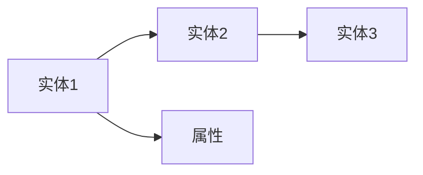
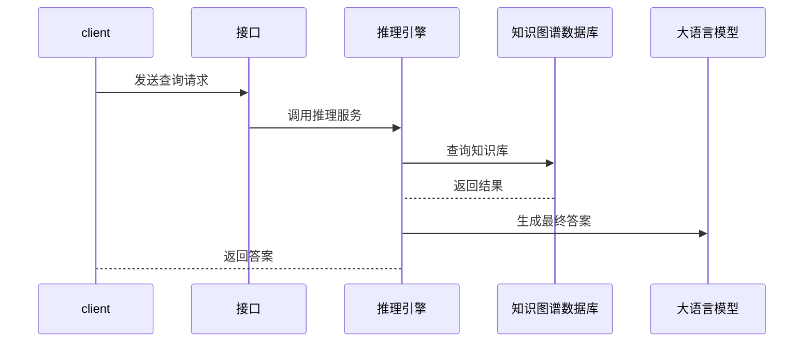

                 


# AI Agent的知识图谱推理：结合LLM与图数据库技术

## 关键词：AI Agent, 知识图谱, LLM, 图数据库, 推理算法

## 摘要：本文探讨AI Agent如何结合知识图谱推理、大语言模型（LLM）与图数据库技术，实现高效的知识管理与推理。通过系统分析与架构设计，展示如何利用LLM进行语义理解，并借助图数据库进行复杂关系推理，最终构建智能问答系统。

---

# 第一部分：AI Agent与知识图谱推理概述

## 第1章：AI Agent与知识图谱的基本概念

### 1.1 AI Agent的定义与特点

AI Agent（智能体）是指能够感知环境、自主决策并执行任务的智能实体。它具备以下特点：

- **自主性**：无需外部干预，自主完成任务。
- **反应性**：能实时感知环境变化并做出响应。
- **目标导向**：基于目标驱动行动，优化决策。
- **学习能力**：通过数据和经验不断优化性能。

**应用场景**：
- 智能助手（如Siri、Alexa）
- 自动驾驶系统
- 机器人控制

**边界与外延**：
- 边界：AI Agent通常依赖特定环境和数据，决策空间有限。
- 外延：涉及机器学习、自然语言处理、计算机视觉等技术。

---

### 1.2 知识图谱的定义与特点

知识图谱是描述世界实体及其关系的网络结构，具有以下特点：

- **结构化**：由实体（节点）和关系（边）组成，支持语义搜索。
- **语义丰富**：通过关系网络捕捉复杂语义，提升信息检索准确性。

**应用场景**：
- 智能问答系统
- 知识管理与检索

**边界与外延**：
- 边界：专注于结构化数据的存储与推理。
- 外延：涉及自然语言处理和数据挖掘技术。

---

## 第2章：核心概念与联系

### 2.1 核心概念原理

- **知识图谱推理**：通过逻辑推理发现隐性知识，支持复杂查询。
- **大语言模型（LLM）**：处理自然语言理解与生成，提供语义解析能力。

### 2.2 概念属性对比

| 概念     | 知识图谱 | LLM |
|----------|----------|-----|
| 输入形式 | 结构化数据 | 文本 |
| 输出形式 | 实体关系 | 文本 |
| 核心能力 | 推理能力 | 理解与生成 |

### 2.3 实体关系图



---

## 第3章：算法原理

### 3.1 知识图谱推理算法

- **基于规则的推理**：利用逻辑规则进行推理，如三元组推理。
- **基于图的推理**：通过遍历图结构发现隐性关系，如最短路径算法。

### 3.2 大语言模型算法

- **Transformer架构**：通过自注意力机制处理长文本，捕捉上下文信息。
- **损失函数**：交叉熵损失函数，优化模型预测准确性。

$$
\text{损失函数} = -\sum_{i=1}^{n} \log P(y_i|x_i)
$$

---

## 第4章：系统分析与架构设计

### 4.1 项目背景

构建一个智能问答系统，利用知识图谱和LLM进行语义理解与推理。

### 4.2 系统功能设计

- **知识库构建**：抽取结构化数据，构建知识图谱。
- **语义理解**：利用LLM进行自然语言解析。
- **推理引擎**：基于知识图谱进行推理，生成答案。

### 4.3 系统架构图


### 4.4 接口设计与交互流程



---

## 第5章：项目实战

### 5.1 环境安装

- **工具安装**：
  - 图数据库：Neo4j
  - 深度学习框架：TensorFlow/PyTorch
  - 语言模型：Hugging Face库

### 5.2 核心代码实现

```python
# 知识图谱构建
class KnowledgeGraph:
    def __init__(self, database):
        self.db = database

    def add_node(self, node):
        pass

    def add_edge(self, start, end, relation):
        pass

# LLM集成
class LLMIntegration:
    def __init__(self, model):
        self.model = model

    def semantic_analysis(self, text):
        pass

# 推理引擎
class ReasoningEngine:
    def __init__(self, kg, llm):
        self.kg = kg
        self.llm = llm

    def infer(self, query):
        # 调用知识图谱和LLM进行推理
        pass
```

### 5.3 实际案例分析

通过具体案例展示系统如何处理复杂查询，结合知识图谱和LLM生成准确答案。

---

## 第6章：总结与展望

### 6.1 最佳实践

- **数据质量**：确保知识图谱数据的准确性和完整性。
- **模型优化**：定期更新LLM，提升语义理解能力。
- **性能调优**：优化推理引擎，提高处理速度。

### 6.2 注意事项

- **数据隐私**：确保数据安全，避免信息泄露。
- **系统维护**：定期检查系统，及时修复漏洞。

### 6.3 拓展阅读

推荐相关书籍和论文，深入学习知识图谱和大语言模型技术。

---

# 作者：AI天才研究院 & 禅与计算机程序设计艺术

---

通过以上结构，本文系统地介绍了AI Agent与知识图谱推理的结合，详细讲解了技术原理和实现方法，为读者提供了一套完整的解决方案。希望对您理解AI Agent与知识图谱推理有所帮助。

