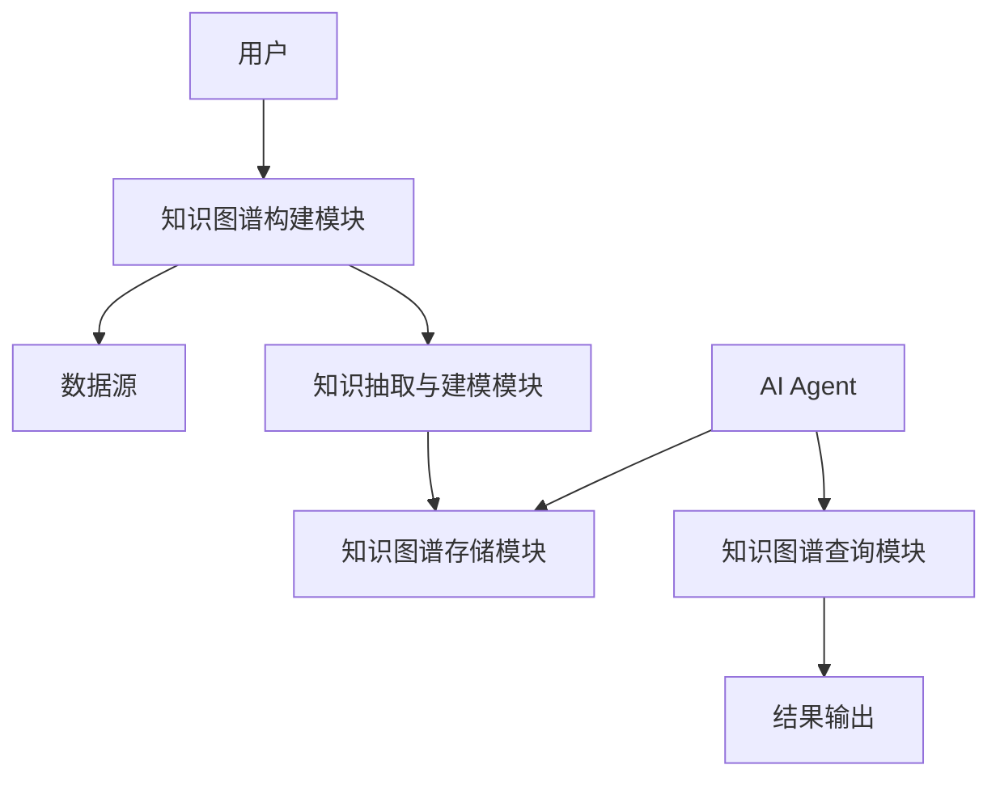
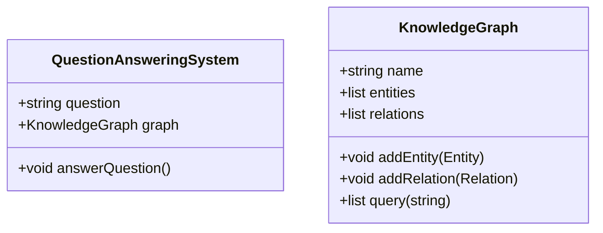

                 


# AI Agent的知识图谱构建与应用

---

## 关键词：AI Agent, 知识图谱, 知识抽取, 知识表示, 系统架构, 应用案例

---

## 摘要：  
本文深入探讨AI Agent的知识图谱构建与应用，从基础知识到实际应用进行全面解析。文章首先介绍AI Agent和知识图谱的基本概念及其关系，然后详细讲解知识图谱的构建方法、存储与管理，接着分析知识图谱在AI Agent中的应用场景，包括智能问答、推荐系统和对话系统。随后，文章从系统架构和实现的角度，探讨如何设计和实现支持知识图谱的AI Agent系统，并通过项目实战展示具体实现过程。最后，文章总结了知识图谱构建与应用的关键点，并展望了未来的发展方向。

---

## 第一部分: AI Agent与知识图谱基础知识

### 第1章: AI Agent概述

#### 1.1 AI Agent的基本概念
##### 1.1.1 什么是AI Agent
AI Agent（智能体）是指能够感知环境、自主决策并采取行动以实现目标的智能系统。它可以分为简单反射型、基于模型型、实用导向型和目标导向型四种类型。AI Agent的核心功能包括感知、推理、规划和执行。

##### 1.1.2 AI Agent的分类与特点
- **简单反射型AI Agent**：基于直接规则进行反应式操作。
- **基于模型型AI Agent**：维护环境模型，能够进行基于模型的推理。
- **实用导向型AI Agent**：基于效用函数进行决策优化。
- **目标导向型AI Agent**：根据目标状态规划行动路径。

##### 1.1.3 AI Agent的核心功能与应用场景
AI Agent广泛应用于自动驾驶、智能助手（如Siri、Alexa）、智能推荐系统、游戏AI等领域。

#### 1.2 知识图谱的基本概念
##### 1.2.1 知识图谱的定义与特点
知识图谱是一种以图结构形式表示知识的语义网络，节点表示实体或概念，边表示实体之间的关系。

##### 1.2.2 知识图谱的构建目标与价值
知识图谱的构建目标是将分散的、异构的知识源整合成一个统一的语义网络，其价值在于提升数据的可理解性和可计算性，支持智能应用的语义理解。

##### 1.2.3 知识图谱与传统数据库的区别
- 数据模型不同：传统数据库以行和列为数据结构，知识图谱以节点和边为数据结构。
- 存储方式不同：传统数据库存储结构化数据，知识图谱存储语义网络。
- 查询方式不同：传统数据库基于关系查询，知识图谱基于图遍历或语义查询。

---

### 第2章: 知识图谱与AI Agent的关系

#### 2.1 知识图谱在AI Agent中的作用
##### 2.1.1 知识图谱作为AI Agent的知识库
知识图谱为AI Agent提供丰富的语义知识，支持其进行智能推理和决策。

##### 2.1.2 知识图谱如何支持AI Agent的决策能力
知识图谱提供知识关联性，帮助AI Agent理解上下文并做出更准确的决策。

##### 2.1.3 知识图谱与AI Agent的协同进化
知识图谱的构建和更新依赖AI Agent提供的数据和反馈，AI Agent的能力提升又依赖知识图谱的支持。

#### 2.2 知识图谱构建的核心挑战
##### 2.2.1 数据的多样性与复杂性
数据来源多样，格式多样，需要进行清洗和标准化。

##### 2.2.2 知识表示的标准化问题
如何统一不同领域的知识表示，避免语义冲突。

##### 2.2.3 知识图谱的可扩展性与维护性
知识图谱需要动态更新，支持新增知识和版本管理。

#### 2.3 知识图谱的应用场景
##### 2.3.1 智能问答系统
基于知识图谱实现语义理解，支持复杂问题的解答。

##### 2.3.2 智能推荐系统
通过知识图谱分析用户行为和物品属性，提供个性化推荐。

##### 2.3.3 自然语言处理中的知识图谱应用
知识图谱增强NLP模型的语义理解能力，提升文本生成和理解的准确性。

---

## 第二部分: 知识图谱的构建与管理

### 第3章: 知识图谱的构建方法

#### 3.1 知识图谱的构建流程
##### 3.1.1 数据采集与预处理
从多种数据源（如网页、文档、数据库）获取数据，清洗和标准化数据。

##### 3.1.2 数据清洗与标准化
去除重复数据、填充缺失值、统一字段命名规范。

##### 3.1.3 知识抽取与表示
通过NLP技术从文本中提取实体、关系和属性，并将它们表示为图结构。

##### 3.1.4 知识融合与推理
将多个来源的知识进行整合，消除冲突，构建一致的知识图谱。

#### 3.2 知识抽取技术
##### 3.2.1 实体识别与关系抽取
- 实体识别：使用NER（命名实体识别）技术提取文本中的实体。
- 关系抽取：识别实体之间的关系，如“苹果是美国的一家公司”。

##### 3.2.2 命名实体识别（NER）技术
使用预训练模型（如spaCy、HanLP）进行NER任务，将文本中的实体识别出来。

##### 3.2.3 语义角色标注（SRL）技术
标注句子中谓词和论元的关系，如“张三购买了一台电脑”中的谓词“购买”和论元“张三”、“电脑”。

#### 3.3 知识表示与建模
##### 3.3.1 本体论（Ontology）建模
定义领域内的概念、属性和关系，构建领域知识库。

##### 3.3.2 图结构表示（RDF, KG）
使用RDF（资源描述框架）或知识图谱（KG）表示知识，节点表示实体，边表示关系。

##### 3.3.3 知识图谱的存储与管理
使用图数据库（如Neo4j）存储知识图谱，支持高效的查询和更新。

---

### 第4章: 知识图谱的存储与管理

#### 4.1 知识图谱的存储技术
##### 4.1.1 图数据库
- **Neo4j**：开源的NoSQL图数据库，支持高效的图遍历操作。
- **TinkerPop**：一个图处理框架，支持多种图数据库和计算引擎。

##### 4.1.2 知识图谱的存储模型
- **RDF存储**：使用三元组（subject, predicate, object）表示知识。
- **属性图模型**：使用节点和边存储实体和关系，边可以有属性。

##### 4.1.3 知识图谱的查询语言
- **SPARQL**：用于RDF数据的查询。
- **Cypher**：用于Neo4j的图查询语言。

#### 4.2 知识图谱的管理与维护
##### 4.2.1 数据同步与更新
定期同步数据源的更新，保持知识图谱的最新性。

##### 4.2.2 知识图谱的版本控制
记录知识图谱的变更历史，支持回滚和版本比较。

##### 4.2.3 知识图谱的安全性管理
控制知识图谱的访问权限，防止敏感信息泄露。

---

## 第三部分: 知识图谱在AI Agent中的应用

### 第5章: 知识图谱在AI Agent中的应用场景

#### 5.1 智能问答系统
##### 5.1.1 基于知识图谱的问答系统
通过知识图谱提供准确的知识答案，支持复杂问题的解答。

##### 5.1.2 知识图谱在问答系统中的作用
帮助问答系统理解上下文，提供更精准的答案。

#### 5.2 智能推荐系统
##### 5.2.1 基于知识图谱的推荐算法
结合用户行为和知识图谱中的实体关系，进行个性化推荐。

##### 5.2.2 知识图谱在推荐系统中的优势
通过知识关联性，提升推荐的准确性和多样性。

#### 5.3 自然语言处理中的知识图谱应用
##### 5.3.1 基于知识图谱的语义理解
增强NLP模型的语义理解能力，支持复杂的文本生成和分析。

##### 5.3.2 知识图谱在对话系统中的应用
通过知识图谱实现上下文理解，支持多轮对话和复杂场景的对话管理。

---

## 第四部分: 系统架构与实现

### 第6章: 系统架构与实现

#### 6.1 系统架构设计
##### 6.1.1 系统功能模块
- 知识图谱构建模块
- 数据采集与处理模块
- 知识抽取与建模模块
- AI Agent交互模块

##### 6.1.2 系统架构图


#### 6.2 系统实现
##### 6.2.1 环境安装
- Python 3.8+
- Neo4j 4.0+
- spaCy 3.0+

##### 6.2.2 核心实现代码
```python
from neo4j import GraphDatabase
from spacy.lang.zh import Chinese

# 知识抽取代码示例
def extract_entities(text):
    nlp = Chinese()
    doc = nlp(text)
    entities = [(ent.text, ent.label_) for ent in doc.ents]
    return entities

# 知识图谱存储代码示例
class KnowledgeGraph:
    def __init__(self, uri, user, password):
        self.driver = GraphDatabase.driver(uri, auth=(user, password))
    
    def create_node(self, label, properties):
        with self.driver.session() as session:
            session.write_transaction(
                lambda tx: tx.create_node(label, properties)
            )
```

---

## 第五部分: 项目实战

### 第7章: 项目实战

#### 7.1 智能问答系统实现
##### 7.1.1 需求分析
构建一个基于知识图谱的智能问答系统，支持复杂问题的语义理解与回答。

##### 7.1.2 系统设计


##### 7.1.3 实现与测试
```python
# 知识图谱查询代码示例
def query_knowledge_graph(question):
    kg = KnowledgeGraph("bolt://localhost:7687", "neo4j", "password")
    entities = kg.query(question)
    return entities
```

---

## 第六部分: 高级主题与未来展望

### 第8章: 高级主题与未来展望

#### 8.1 知识图谱的可解释性
##### 8.1.1 知识图谱的可解释性问题
如何确保知识图谱的决策过程是透明和可解释的。

##### 8.1.2 提升知识图谱可解释性的方法
通过可视化和语义分析，增强知识图谱的可解释性。

#### 8.2 知识图谱与图神经网络的结合
##### 8.2.1 图神经网络的基本原理
图神经网络通过节点和边的特征进行学习，应用于知识图谱推理和节点分类。

##### 8.2.2 知识图谱与图神经网络的结合应用
通过图神经网络对知识图谱进行深度学习，提升知识推理和关联发现的能力。

#### 8.3 未来展望
##### 8.3.1 知识图谱的动态更新与自适应
研究如何实现知识图谱的动态更新和自适应，以应对快速变化的环境。

##### 8.3.2 知识图谱的跨领域应用
探索知识图谱在不同领域的交叉应用，推动AI Agent的跨领域智能化。

---

## 作者：AI天才研究院/AI Genius Institute & 禅与计算机程序设计艺术 /Zen And The Art of Computer Programming

