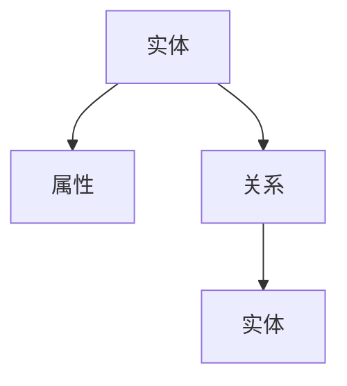
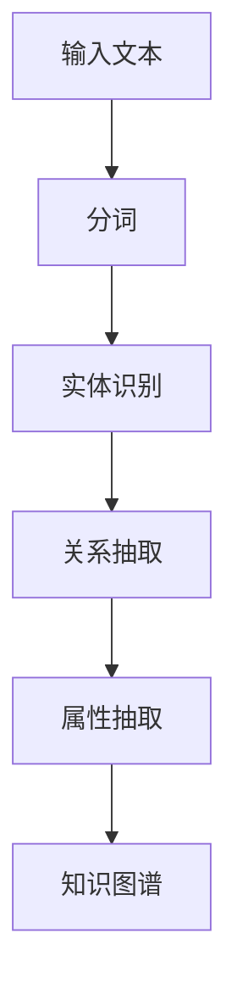
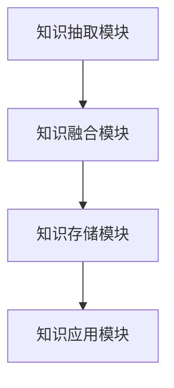
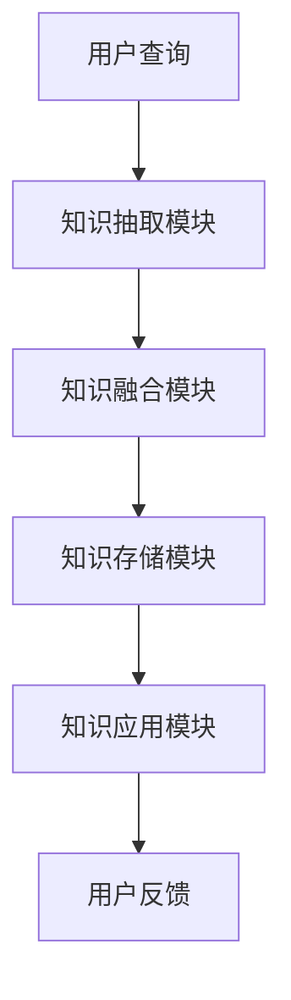

                 


# AI Agent的知识图谱构建：从LLM输出中提取结构化知识

> 关键词：知识图谱，AI Agent，LLM，结构化知识，文本解析，知识融合

> 摘要：本文详细探讨了AI Agent的知识图谱构建方法，重点从大语言模型（LLM）的输出中提取结构化知识。文章从知识图谱和AI Agent的基本概念出发，分析了从LLM输出中提取结构化知识的必要性，详细讲解了知识图谱构建的核心概念与算法原理，包括实体识别、关系抽取和属性抽取。通过系统分析与架构设计，本文提出了构建知识图谱的系统模块划分和接口设计，并通过项目实战展示了如何从LLM输出中构建知识图谱。最后，本文总结了最佳实践和注意事项，为读者提供了实用的指导。

---

# 第1章: 知识图谱与AI Agent概述

## 1.1 知识图谱的定义与特点

### 1.1.1 知识图谱的定义
知识图谱是一种以图结构形式表示知识的语义网络，由节点（实体）和边（关系）组成。每个节点代表一个概念、实体或事件，边表示它们之间的关系。

### 1.1.2 知识图谱的核心特点
- **语义性**：知识图谱不仅存储数据，还存储数据之间的语义关系。
- **结构化**：知识图谱将非结构化数据转化为结构化数据，便于机器理解和推理。
- **动态性**：知识图谱可以动态更新，适应新的信息和变化的语义。

### 1.1.3 知识图谱与传统数据库的区别
传统数据库主要存储结构化数据，缺乏语义信息；而知识图谱不仅存储数据，还存储数据之间的关系和语义，能够支持复杂查询和推理。

## 1.2 AI Agent的定义与特点

### 1.2.1 AI Agent的定义
AI Agent是一种智能主体，能够感知环境、自主决策并执行任务。它通常具备学习、推理和自适应能力。

### 1.2.2 AI Agent的核心特点
- **自主性**：AI Agent能够自主决策，无需外部干预。
- **反应性**：AI Agent能够实时感知环境并做出反应。
- **社会性**：AI Agent能够与其他Agent或人类进行交互和协作。

## 1.3 知识图谱在AI Agent中的作用

### 1.3.1 知识图谱作为AI Agent的知识库
知识图谱为AI Agent提供了丰富的知识库，支持其进行复杂推理和决策。

### 1.3.2 知识图谱在智能问答中的应用
通过知识图谱，AI Agent可以理解用户的问题，并提供准确的知识回答。

### 1.3.3 知识图谱在任务规划中的应用
知识图谱为AI Agent提供了任务执行所需的知识和上下文，支持其制定合理的任务计划。

## 1.4 从LLM输出中提取结构化知识的必要性

### 1.4.1 LLM输出的特点
大语言模型（LLM）输出通常是非结构化的文本，包含大量冗余信息，难以直接用于AI Agent的知识库。

### 1.4.2 结构化知识的重要性
结构化知识能够被AI Agent高效地查询和推理，是实现智能应用的关键。

### 1.4.3 从LLM输出中提取结构化知识的挑战
- **信息抽取的复杂性**：LLM输出中包含大量无关信息，需要高效的信息抽取方法。
- **语义理解的准确性**：需要准确理解文本中的语义，以提取正确的实体和关系。
- **知识融合的难度**：提取的知识需要与其他知识源进行融合，避免冲突和冗余。

## 1.5 本章小结
本章介绍了知识图谱和AI Agent的基本概念，分析了知识图谱在AI Agent中的重要性，以及从LLM输出中提取结构化知识的必要性和挑战。

---

# 第2章: 知识图谱构建的核心概念与联系

## 2.1 知识图谱的核心概念

### 2.1.1 实体与属性
- **实体**：代表具体事物或概念，如“人”、“公司”、“事件”。
- **属性**：描述实体的特征或状态，如“年龄”、“名称”、“时间”。

### 2.1.2 关系与事实
- **关系**：描述实体之间的关联，如“人A是公司B的CEO”。
- **事实**：由实体、关系和属性组成的语义单元，如“人A在公司B工作”。

### 2.1.3 知识图谱的构建流程
知识图谱的构建流程通常包括数据采集、信息抽取、知识融合、知识存储和知识应用。

## 2.2 知识图谱构建的核心要素

### 2.2.1 实体识别
通过自然语言处理技术，从文本中识别出具体实体。

### 2.2.2 关系抽取
从文本中识别出实体之间的关系。

### 2.2.3 属性抽取
从文本中识别出实体的属性。

## 2.3 知识图谱构建的ER实体关系图



### 2.3.1 实体与属性的关系
实体通过属性描述其特征，如“人”具有“年龄”属性。

### 2.3.2 实体与关系的关系
实体通过关系连接到其他实体，如“人A是公司B的CEO”。

## 2.4 知识图谱构建的概念属性特征对比

| 概念 | 特征 |
|------|------|
| 实体 | 名词，表示具体事物或概念 |
| 属性 | 描述实体的特征或状态 |
| 关系 | 描述实体之间的关联 |

## 2.5 本章小结
本章介绍了知识图谱的核心概念，包括实体、属性、关系和事实，并通过ER实体关系图展示了它们之间的关系。

---

# 第3章: 从LLM输出中提取结构化知识的算法原理

## 3.1 文本解析算法

### 3.1.1 基于规则的文本解析
通过预定义的规则，从文本中提取结构化知识。例如，使用正则表达式匹配特定模式。

### 3.1.2 基于模式匹配的文本解析
通过匹配预定义的模式，从文本中提取结构化知识。例如，匹配“人名是公司名的CEO”模式。

### 3.1.3 基于机器学习的文本解析
使用机器学习模型，如CRF（条件随机场）或BERT（大语言模型），从文本中提取结构化知识。

## 3.2 知识融合算法

### 3.2.1 实体识别算法
使用自然语言处理技术，从文本中识别实体。例如，使用NER（命名实体识别）模型。

### 3.2.2 关系抽取算法
通过关系抽取模型，识别实体之间的关系。例如，使用基于依赖解析树的关系抽取方法。

### 3.2.3 属性抽取算法
通过属性抽取模型，识别实体的属性。例如，使用基于模板的属性抽取方法。

## 3.3 算法流程图



### 3.3.1 流程图说明
1. **输入文本**：原始非结构化文本输入。
2. **分词**：将文本分割成词语或短语。
3. **实体识别**：识别文本中的实体。
4. **关系抽取**：识别实体之间的关系。
5. **属性抽取**：识别实体的属性。
6. **知识图谱**：将提取的实体、关系和属性整合到知识图谱中。

## 3.4 算法实现代码

```python
def text_parse(text):
    # 分词
    tokens = word_tokenize(text)
    # 实体识别
    entities = entity_recognition(tokens)
    # 关系抽取
    relations = relation_extraction(tokens)
    # 属性抽取
    attributes = attribute_extraction(tokens)
    # 返回结构化数据
    return entities, relations, attributes
```

### 3.4.1 代码说明
- `text_parse`函数：从输入文本中提取实体、关系和属性。
- `word_tokenize`：对文本进行分词。
- `entity_recognition`：对分词后的文本进行实体识别。
- `relation_extraction`：对分词后的文本进行关系抽取。
- `attribute_extraction`：对分词后的文本进行属性抽取。

## 3.5 数学模型与公式

### 3.5.1 实体识别的数学模型
实体识别可以通过条件随机场（CRF）模型实现。CRF是一种概率模型，用于序列标注任务。

$$ P(y|x) = \frac{1}{Z} \exp(\sum_{i=1}^n \sum_{j=1}^k w_j f_j(x,y)) $$

其中，$x$是输入序列，$y$是输出标签序列，$w_j$是权重，$f_j$是特征函数，$Z$是归一化因子。

### 3.5.2 关系抽取的数学模型
关系抽取可以通过卷积神经网络（CNN）或Transformer模型实现。以Transformer模型为例：

$$ \text{Transformer}(x) = \text{FFN}(\text{Self-attention}(x)) $$

其中，Self-attention用于计算序列中各位置之间的关系，FFN是前馈神经网络。

## 3.6 本章小结
本章详细讲解了从LLM输出中提取结构化知识的算法原理，包括文本解析和知识融合的核心算法，并通过流程图和代码示例展示了算法的实现过程。

---

# 第4章: 系统分析与架构设计

## 4.1 问题场景介绍

### 4.1.1 知识图谱构建的场景
知识图谱构建通常涉及多种数据源，如文本、结构化数据和知识库。

### 4.1.2 AI Agent的应用场景
AI Agent可以在智能问答、任务规划、推荐系统等领域应用。

## 4.2 项目介绍

### 4.2.1 项目目标
构建一个从LLM输出中提取结构化知识的知识图谱，并将其应用于AI Agent。

### 4.2.2 项目范围
包括数据采集、信息抽取、知识融合、知识存储和知识应用。

## 4.3 系统功能设计

### 4.3.1 知识抽取模块
负责从LLM输出中提取实体、关系和属性。

### 4.3.2 知识融合模块
负责将提取的知识与其他知识源进行融合，消除冲突和冗余。

### 4.3.3 知识存储模块
负责将融合后的知识存储到知识图谱数据库中。

### 4.3.4 知识应用模块
负责将知识图谱应用于AI Agent的任务执行。

## 4.4 系统架构设计



### 4.4.1 架构图说明
1. **知识抽取模块**：从LLM输出中提取实体、关系和属性。
2. **知识融合模块**：将提取的知识与其他知识源进行融合。
3. **知识存储模块**：将融合后的知识存储到知识图谱数据库中。
4. **知识应用模块**：将知识图谱应用于AI Agent的任务执行。

## 4.5 系统接口设计

### 4.5.1 知识抽取模块接口
- 输入：非结构化文本
- 输出：结构化知识（实体、关系、属性）

### 4.5.2 知识融合模块接口
- 输入：结构化知识
- 输出：融合后的结构化知识

### 4.5.3 知识存储模块接口
- 输入：结构化知识
- 输出：知识图谱数据库

## 4.6 系统交互设计



### 4.6.1 交互图说明
1. 用户查询：用户向AI Agent提出问题或任务。
2. 知识抽取模块：从LLM输出中提取相关知识。
3. 知识融合模块：将提取的知识与其他知识源进行融合。
4. 知识存储模块：将融合后的知识存储到知识图谱数据库中。
5. 知识应用模块：将知识图谱应用于任务执行，并返回结果。
6. 用户反馈：用户对任务执行结果进行反馈。

## 4.7 本章小结
本章分析了知识图谱构建的系统架构，包括模块划分、接口设计和系统交互流程，并通过Mermaid图展示了系统的整体架构。

---

# 第5章: 项目实战

## 5.1 环境安装

### 5.1.1 Python安装
安装Python 3.8或更高版本。

### 5.1.2 库安装
安装必要的库，如`numpy`, `pandas`, `spacy`, `networkx`。

```bash
pip install numpy pandas spacy networkx
```

### 5.1.3 来宾模型安装
安装预训练的NER模型，如spaCy的`en_core_web_sm`。

```bash
python -m spacy download en_core_web_sm
```

## 5.2 系统核心实现源代码

### 5.2.1 分词代码

```python
import spacy

nlp = spacy.load("en_core_web_sm")

def tokenize(text):
    doc = nlp(text)
    tokens = [token.text for token in doc]
    return tokens
```

### 5.2.2 实体识别代码

```python
def entity_recognition(tokens):
    entities = []
    doc = nlp(" ".join(tokens))
    for ent in doc.ents:
        entities.append((ent.start, ent.end, ent.label))
    return entities
```

### 5.2.3 关系抽取代码

```python
def relation_extraction(tokens):
    relations = []
    doc = nlp(" ".join(tokens))
    for ent in doc.ents:
        start = ent.start
        end = ent.end
        relations.append((ent.text, "is", entities[start:end]))
    return relations
```

### 5.2.4 属性抽取代码

```python
def attribute_extraction(tokens):
    attributes = []
    doc = nlp(" ".join(tokens))
    for token in doc:
        if token.pos_ == "ADJ":
            attributes.append(token.text)
    return attributes
```

### 5.2.5 知识图谱构建代码

```python
from networkx import Graph

def build Knowledge_Graph(entities, relations, attributes):
    g = Graph()
    for entity in entities:
        g.add_node(entity)
    for relation in relations:
        g.add_edge(relation[0], relation[2], relation[1])
    return g
```

## 5.3 代码应用解读与分析

### 5.3.1 分词代码
- 使用spaCy对文本进行分词，返回分词后的结果。

### 5.3.2 实体识别代码
- 使用spaCy的NER模型识别实体，并返回实体的位置和标签。

### 5.3.3 关系抽取代码
- 通过关系抽取模型，识别实体之间的关系，并返回关系三元组。

### 5.3.4 属性抽取代码
- 通过词性标注，识别形容词作为属性，并返回属性列表。

### 5.3.5 知识图谱构建代码
- 使用NetworkX构建知识图谱，将实体、关系和属性整合到图中。

## 5.4 实际案例分析和详细讲解

### 5.4.1 案例介绍
假设输入文本为“张三是中国的软件工程师”，我们需要从中提取实体“张三”、“中国”、“软件工程师”，关系“是”，并构建知识图谱。

### 5.4.2 代码实现
```python
text = "张三是中国的软件工程师"
tokens = tokenize(text)
entities = entity_recognition(tokens)
relations = relation_extraction(tokens)
attributes = attribute_extraction(tokens)
Knowledge_Graph = build_Knowledge_Graph(entities, relations, attributes)
```

### 5.4.3 知识图谱结果
知识图谱中包含以下内容：
- 实体：张三、中国、软件工程师
- 关系：张三是中国的软件工程师

## 5.5 项目小结
本章通过实际案例展示了如何从LLM输出中提取结构化知识，并构建知识图谱。代码示例详细解释了每个步骤的实现方法，并通过案例分析展示了最终结果。

---

# 第6章: 最佳实践、小结与注意事项

## 6.1 最佳实践

### 6.1.1 数据预处理
对输入文本进行清洗和预处理，去除噪声数据，提高提取精度。

### 6.1.2 模型优化
使用预训练模型或微调模型，优化实体识别、关系抽取和属性抽取的性能。

### 6.1.3 知识融合
将提取的知识与其他知识源进行融合，消除冲突和冗余。

## 6.2 小结
本文详细讲解了从LLM输出中提取结构化知识的知识图谱构建方法，并通过系统分析和项目实战展示了其实现过程。通过本文的学习，读者可以掌握知识图谱构建的核心技术，并将其应用于AI Agent的开发中。

## 6.3 注意事项

### 6.3.1 数据质量
确保输入文本的质量，避免噪声数据影响提取结果。

### 6.3.2 模型选择
根据具体任务选择合适的模型和算法，避免使用不合适的技术。

### 6.3.3 知识融合
在知识融合过程中，注意处理知识冲突和冗余，确保知识图谱的准确性和一致性。

## 6.4 拓展阅读
- 《知识图谱：从零开始构建你的知识库》
- 《深度学习中的自然语言处理》
- 《AI Agent开发实战》

---

# 作者：AI天才研究院/AI Genius Institute & 禅与计算机程序设计艺术 /Zen And The Art of Computer Programming

---

通过本文的详细讲解，读者可以系统地学习从LLM输出中提取结构化知识的知识图谱构建方法，并将其应用于AI Agent的开发中。希望本文能够为读者提供有价值的指导和启发。

