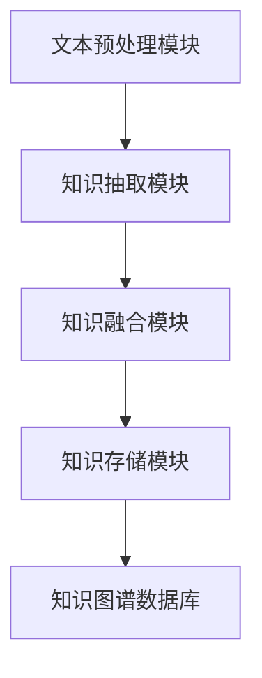

                 


# AI Agent的知识图谱构建：从LLM输出提取结构化信息

> 关键词：AI Agent, 知识图谱, LLM, 结构化信息提取, 自然语言处理, 大语言模型

> 摘要：本文深入探讨了AI Agent的知识图谱构建方法，重点分析了如何从大语言模型（LLM）的输出中提取结构化信息，构建高效的知识图谱。文章从基础知识入手，详细讲解了知识图谱的构建过程、基于LLM的结构化信息提取方法、系统架构设计以及实际项目实现。通过丰富的案例分析和代码示例，帮助读者全面理解AI Agent的知识图谱构建技术及其应用场景。

---

## 第一部分: AI Agent与知识图谱概述

### 第1章: AI Agent的基本概念

#### 1.1 AI Agent的定义与特点
AI Agent（人工智能代理）是指能够感知环境、执行任务并做出决策的智能实体。其特点包括：

- **自主性**：能够在没有外部干预的情况下自主运作。
- **反应性**：能够实时感知环境变化并做出响应。
- **目标导向**：以明确的目标为导向，执行任务。
- **学习能力**：能够通过数据和经验不断优化自身性能。

#### 1.2 知识图谱的基本概念
知识图谱是一种以结构化形式表示知识的图数据库，节点表示实体或概念，边表示实体之间的关系。其特点包括：

- **结构化**：知识以图的形式组织，便于计算机理解和推理。
- **可扩展性**：能够通过不断添加新的实体和关系扩展知识。
- **语义丰富性**：通过实体间的关系和属性，提供丰富的语义信息。

#### 1.3 LLM与知识图谱的关系
大语言模型（LLM）通过处理大量文本数据，能够生成自然语言文本、回答问题、进行对话等。其与知识图谱的关系如下：

- **知识图谱为LLM提供结构化知识**：LLM可以通过知识图谱获取结构化的知识，增强其回答的准确性。
- **LLM为知识图谱提供动态更新能力**：LLM可以从文本中提取新的知识，用于更新知识图谱。
- **知识图谱增强LLM的推理能力**：通过知识图谱，LLM可以进行复杂的推理，提供更智能的服务。

---

## 第二部分: 知识图谱构建的核心概念与方法

### 第2章: 知识图谱的构建过程

#### 2.1 知识抽取与处理
知识抽取是从文本中提取实体、关系和属性的过程，主要包括以下步骤：

- **文本分段**：将文本分割成句子或段落，便于后续处理。
- **实体识别**：通过自然语言处理技术，识别文本中的实体（如人名、地名、组织名等）。
- **关系抽取**：识别实体之间的关系（如“是”、“属于”、“位于”等）。

#### 2.2 知识融合与整合
知识融合是将多个来源的知识整合到一个统一的知识图谱中的过程，主要包括：

- **实体对齐**：将不同来源的实体进行匹配，确保实体唯一性。
- **知识冲突检测**：发现知识图谱中的矛盾或冲突，并进行解决。
- **知识扩展**：通过外部数据源，不断扩展知识图谱的规模和深度。

#### 2.3 知识存储与管理
知识图谱的存储与管理需要考虑以下方面：

- **存储结构**：通常采用图数据库（如Neo4j）或关系型数据库。
- **数据管理**：包括数据的录入、更新、查询和维护。
- **版本控制**：对知识图谱的修改进行记录和管理，确保数据的可追溯性。

---

## 第三部分: 基于LLM的知识图谱构建方法

### 第3章: 从LLM输出提取结构化信息的方法

#### 3.1 LLM输出的结构化处理
从LLM的输出中提取结构化信息，可以采用以下方法：

- **基于规则的文本解析**：通过预定义的规则，提取特定模式的信息。
- **基于模式匹配的信息抽取**：利用正则表达式匹配特定模式，提取结构化信息。
- **基于深度学习的文本解析**：使用神经网络模型，自动学习文本中的结构信息。

#### 3.2 知识图谱构建的算法原理
以下是一些常用的算法原理：

- **规则匹配算法**：通过预定义的规则，匹配文本中的特定模式，提取实体和关系。
- **深度学习算法**：使用序列标注模型（如CRF）或图神经网络（如Graph Neural Networks）进行实体识别和关系抽取。

#### 3.3 算法实现与代码示例
以下是基于规则的实体识别代码示例：

```python
import re

def extract_entities(text):
    # 定义实体模式
    patterns = {
        'name': r'\b[A-Z][a-z]+\b',
        'location': r'\b[A-Z][a-z]+, [A-Z][a-z]+\b'
    }
    entities = {}
    for pattern, regex in patterns.items():
        matches = re.finditer(regex, text)
        entities[pattern] = [match.group() for match in matches]
    return entities

text = "John Doe is located in New York, USA."
result = extract_entities(text)
print(result)
```

---

## 第四部分: 系统架构与实现

### 第4章: 知识图谱构建系统的架构设计

#### 4.1 系统功能设计
知识图谱构建系统的核心功能模块包括：

- **文本预处理模块**：对输入文本进行清洗和分段。
- **知识抽取模块**：从文本中提取实体和关系。
- **知识融合模块**：整合不同来源的知识，消除冲突。
- **知识存储模块**：将提取的知识存储到知识图谱数据库中。

#### 4.2 系统架构设计
知识图谱构建系统的架构设计如下：



#### 4.3 系统接口设计
系统接口设计需要考虑以下方面：

- **输入接口**：接收文本数据或外部知识库的数据。
- **输出接口**：输出结构化的知识图谱数据。
- **API设计**：提供RESTful API，方便其他系统调用知识图谱数据。

---

## 第五部分: 项目实战与案例分析

### 第5章: 项目实战

#### 5.1 环境安装
需要安装以下工具和库：

- **Python**：3.8+
- **自然语言处理库**：spaCy、NLTK
- **图数据库**：Neo4j
- **深度学习框架**：TensorFlow、PyTorch

#### 5.2 系统核心实现
以下是基于深度学习的关系抽取代码示例：

```python
import spacy

nlp = spacy.load("en_core_web_sm")

def extract_relations(text):
    doc = nlp(text)
    relations = []
    for token in doc:
        if token.ent_type_ == "ORG":
            relations.append(token.text)
    return relations

text = "Google is a technology company located in Mountain View, California."
result = extract_relations(text)
print(result)
```

#### 5.3 案例分析
通过案例分析，验证系统的有效性。例如，从新闻文本中提取公司名称和地理位置信息，构建公司地理位置的知识图谱。

---

## 第六部分: 未来展望与总结

### 第6章: 未来趋势与总结

#### 6.1 未来趋势
随着大语言模型和自然语言处理技术的不断发展，知识图谱构建将更加智能化和自动化。未来的趋势包括：

- **多模态知识图谱**：结合图像、视频等多种数据源，构建多模态的知识图谱。
- **动态知识图谱**：实时更新知识图谱，确保信息的时效性。
- **跨语言知识图谱**：支持多语言的知识图谱构建，促进跨语言信息共享。

#### 6.2 总结
本文详细探讨了AI Agent的知识图谱构建方法，从基础知识到实际应用，全面分析了从LLM输出提取结构化信息的技术。通过本文的学习，读者可以掌握知识图谱构建的核心技术，并将其应用于实际场景中。

---

## 作者：AI天才研究院 & 禅与计算机程序设计艺术

