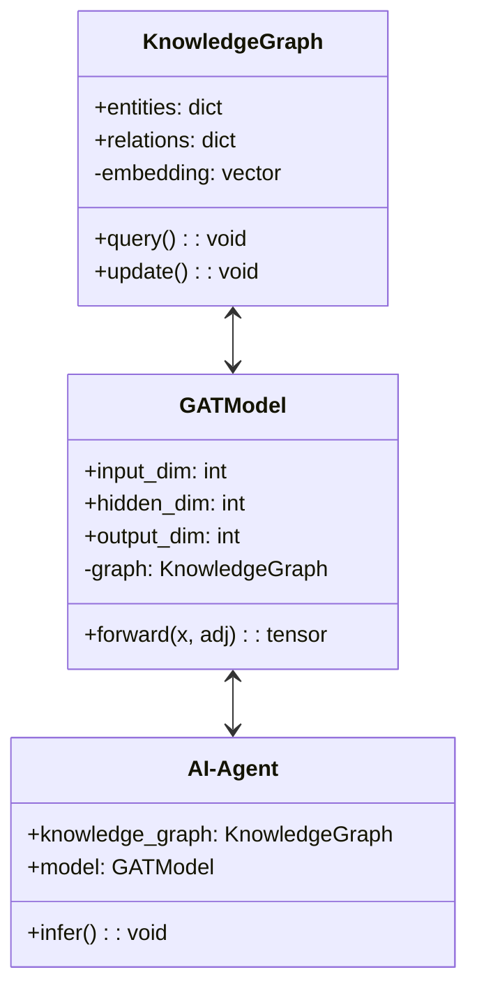
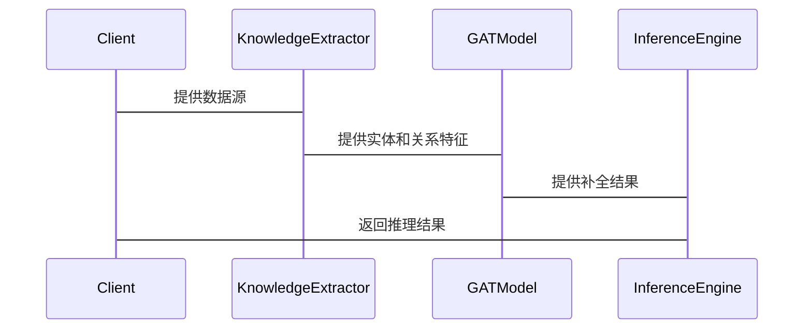

                 


# AI Agent的知识图谱补全技术在推理中的应用

---

## 关键词：  
AI Agent, 知识图谱, 补全技术, 推理, 深度学习, 实体识别, 知识图谱构建

---

## 摘要：  
本文详细探讨了AI Agent在知识图谱补全技术中的应用，重点分析了知识图谱补全技术的核心原理、算法实现及其在AI Agent推理中的具体应用。文章从知识图谱的基本概念出发，结合实际案例，详细讲解了知识图谱补全技术的分类、算法原理及系统架构设计，并通过Python代码示例展示了如何实现基于深度学习的补全算法。最后，本文总结了知识图谱补全技术在AI Agent推理中的应用价值，并提出了未来研究的方向。

---

## 第一部分: AI Agent与知识图谱概述

### 第1章: AI Agent与知识图谱概述

#### 1.1 AI Agent的基本概念
AI Agent（人工智能代理）是指能够感知环境、自主决策并执行任务的智能实体。它具有以下核心特征：
- **自主性**：能够在没有外部干预的情况下独立运行。
- **反应性**：能够感知环境并实时做出反应。
- **目标导向**：通过设定目标来驱动行为。
- **社交能力**：能够与其他Agent或人类进行交互协作。

AI Agent的应用场景广泛，包括智能助手、自动驾驶、智能推荐系统等。在这些场景中，知识图谱作为一种结构化的知识表示方式，为AI Agent提供了丰富的语义信息，使其能够更好地理解和推理复杂场景。

#### 1.2 知识图谱的定义与构建
知识图谱是一种以实体和关系为核心的知识表示方式，通常以图的形式存储。它由节点（实体）和边（关系）组成，能够表示现实世界中的复杂关系。

**知识图谱的构建过程：**
1. **数据收集**：从多种数据源（如文本、结构化数据、数据库）中获取信息。
2. **实体识别**：通过自然语言处理技术从文本中提取实体。
3. **关系抽取**：识别实体之间的关系。
4. **知识融合**：将不同数据源中的信息整合到统一的知识图谱中。
5. **知识完善**：通过补全技术填充知识图谱中的缺失信息。

#### 1.3 知识图谱补全技术的背景与意义
知识图谱在构建过程中不可避免地会存在信息缺失的问题，这可能影响AI Agent的推理能力。知识图谱补全技术的目标是通过算法自动填充缺失的信息，提升知识图谱的完整性和准确性。

**知识图谱补全技术的应用场景：**
- **智能问答系统**：通过补全知识图谱，智能问答系统能够回答更复杂的问题。
- **推荐系统**：通过补全用户和商品之间的关系，推荐系统可以提供更精准的推荐。
- **自动驾驶**：通过补全道路、交通规则等知识，自动驾驶系统能够做出更智能的决策。

---

## 第二部分: 知识图谱补全技术的核心概念与联系

### 第2章: 知识图谱补全技术的核心原理

#### 2.1 知识图谱补全技术的原理
知识图谱补全技术的核心目标是通过算法推断出知识图谱中缺失的实体或关系。常见的补全方法包括基于规则的补全、基于统计的补全和基于深度学习的补全。

**知识图谱补全的基本流程：**
1. **数据预处理**：对知识图谱进行清洗和格式化。
2. **特征提取**：从知识图谱中提取实体和关系的特征。
3. **模型训练**：基于特征训练补全模型。
4. **结果验证**：对补全结果进行验证和优化。

#### 2.2 知识图谱补全技术的分类
知识图谱补全技术可以根据不同的方法分为以下几类：

| **分类方法** | **描述** |
|--------------|----------|
| 基于规则的补全 | 通过预定义的规则（如语义规则、模式匹配）进行补全。 |
| 基于统计的补全 | 基于统计学方法（如共现分析、关联规则挖掘）进行补全。 |
| 基于深度学习的补全 | 使用深度学习模型（如图神经网络、Transformer）进行补全。 |

**知识图谱补全技术与AI Agent的关系：**
知识图谱补全技术为AI Agent提供了更完整、更准确的知识库，从而提升了AI Agent的推理能力和应用场景的广度。

---

## 第三部分: 算法原理讲解

### 第3章: 基于深度学习的补全算法

#### 3.1 基于深度学习的补全算法原理
基于深度学习的补全算法通常使用图神经网络（Graph Neural Networks, GNN）来建模知识图谱。通过学习实体和关系的特征表示，模型可以推断出缺失的信息。

**图神经网络的工作流程：**
1. **输入层**：输入知识图谱中的实体和关系。
2. **嵌入层**：将实体和关系映射到低维向量空间。
3. **计算层**：通过聚合邻居节点的信息来更新当前节点的表示。
4. **输出层**：生成补全结果。

#### 3.2 基于深度学习的补全算法实现
以下是一个基于GAT（Graph Attention Network）的补全算法的Python代码示例：

```python
import torch
import torch.nn as nn
import torch.nn.functional as F

class GAT(nn.Module):
    def __init__(self, in_dim, hidden_dim, out_dim):
        super(GAT, self).__init__()
        self.embed = nn.Linear(in_dim, hidden_dim)
        self.att = nn.Parameter(torch.ones(hidden_dim))
        self.out = nn.Linear(hidden_dim, out_dim)

    def forward(self, x, adj):
        x = self.embed(x)
        x = x * F.softmax(self.att, dim=0)
        x = torch.matmul(x, adj)
        x = self.out(x)
        return x

# 示例数据
n = 100
in_dim = 5
hidden_dim = 10
out_dim = 2

model = GAT(in_dim, hidden_dim, out_dim)
input_x = torch.randn(n, in_dim)
input_adj = torch.randn(n, n)
output = model(input_x, input_adj)
print(output)
```

**代码解释：**
- `GAT`类定义了一个基于图注意力网络的模型。
- `forward`方法实现了图注意力机制，通过注意力权重聚合邻居节点的信息。
- `input_x`表示输入的实体特征，`input_adj`表示图的邻接矩阵。
- `output`表示模型的输出，即补全后的结果。

---

## 第四部分: 系统分析与架构设计

### 第4章: 系统架构设计

#### 4.1 系统功能设计
系统功能模块包括：
- **知识抽取模块**：从文本中提取实体和关系。
- **知识融合模块**：将不同数据源的知识整合到统一的知识图谱中。
- **推理引擎模块**：基于知识图谱进行推理和决策。

**领域模型（Mermaid类图）：**


#### 4.2 系统架构设计
**系统架构图（Mermaid架构图）：**
```mermaid
archi
    title AI Agent知识图谱补全系统架构
    client -> KnowledgeExtractor: 提供数据源
    KnowledgeExtractor -> KnowledgeBase: 存储提取的知识
    KnowledgeBase -> GATModel: 训练补全模型
    GATModel -> InferenceEngine: 进行推理
    InferenceEngine -> AI-Agent: 提供推理结果
```

#### 4.3 接口设计与交互流程
**接口设计（Mermaid序列图）：**


---

## 第五部分: 项目实战

### 第5章: 项目实战

#### 5.1 环境安装
安装所需的Python库：
```bash
pip install torch
pip install numpy
pip install networkx
pip install matplotlib
```

#### 5.2 核心代码实现
**知识图谱补全的Python实现：**
```python
import networkx as nx
import matplotlib.pyplot as plt

# 创建知识图谱
G = nx.Graph()
G.add_nodes_from(['A', 'B', 'C'])
G.add_edges_from([('A', 'B'), ('B', 'C')])

# 可视化知识图谱
nx.draw(G, with_labels=True, node_color='lightblue', edge_color='red')
plt.show()
```

**补全算法实现：**
```python
def complete_graph(G):
    # 补全缺失的边
    nodes = list(G.nodes())
    for i in range(len(nodes)):
        for j in range(i+1, len(nodes)):
            if not G.has_edge(nodes[i], nodes[j]):
                G.add_edge(nodes[i], nodes[j])
    return G

# 补全知识图谱
G_complete = complete_graph(G)

# 可视化补全后的知识图谱
nx.draw(G_complete, with_labels=True, node_color='lightblue', edge_color='red')
plt.show()
```

#### 5.3 实际案例分析
**案例分析：**
假设我们有一个简单的知识图谱，表示公司员工之间的关系。通过补全算法，我们可以推断出更多的关系，例如部门关系、项目关系等。

---

## 第六部分: 最佳实践与小结

### 第6章: 最佳实践与小结

#### 6.1 小结
知识图谱补全技术为AI Agent提供了更完整、更准确的知识库，显著提升了AI Agent的推理能力和应用场景的广度。通过深度学习算法，我们可以更高效地进行知识图谱的补全。

#### 6.2 注意事项
- 数据质量是知识图谱补全技术的关键，高质量的数据能够显著提升补全效果。
- 在实际应用中，需要根据具体场景选择合适的补全算法。
- 知识图谱的动态更新和维护也是需要重点关注的问题。

#### 6.3 拓展阅读
- 《Deep Learning for Graphical Models》
- 《Knowledge Graph Construction and Completion》
- 《Graph Neural Networks for Knowledge Representation》

---

## 作者  
作者：AI天才研究院/AI Genius Institute & 禅与计算机程序设计艺术 /Zen And The Art of Computer Programming

