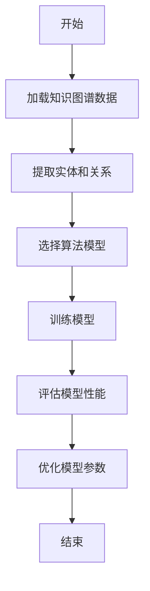
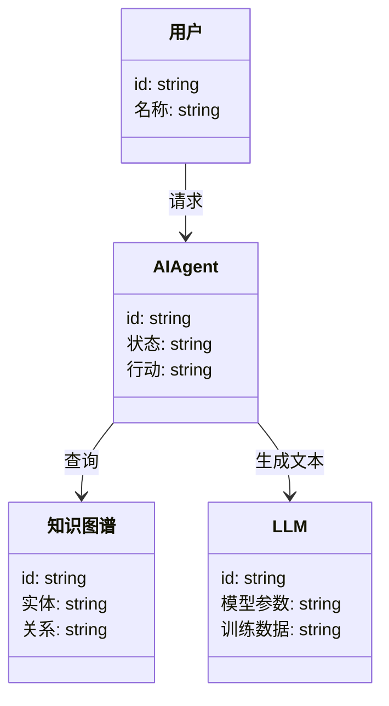
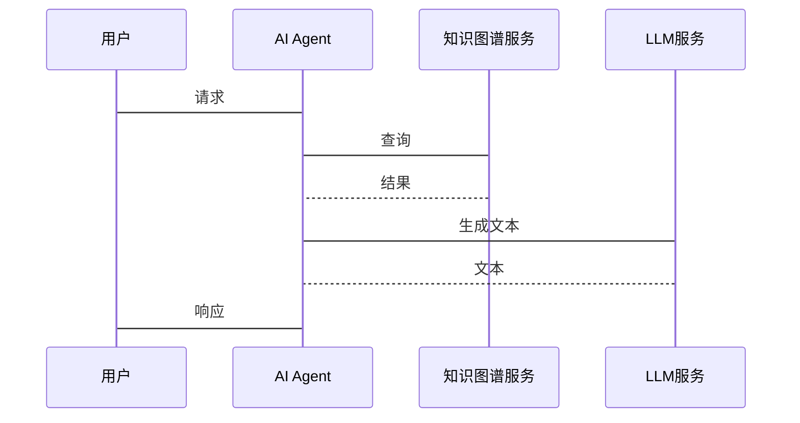

                 


```markdown
# AI Agent的知识图谱：整合LLM与结构化知识库

> 关键词：知识图谱，LLM，AI Agent，大语言模型，结构化知识库，整合，算法原理，系统架构

> 摘要：本文探讨了AI Agent的知识图谱整合，分析了知识图谱与大语言模型（LLM）的结合，详细阐述了其核心概念、算法原理、系统架构以及项目实战，最后总结了最佳实践。

---

## 第1章 AI Agent与知识图谱概述

### 1.1 知识图谱的背景与概念

#### 1.1.1 知识图谱的定义与特点
知识图谱是一种用于描述实体及其关系的结构化数据模型，它通过图结构将数据中的实体和关系表示出来。知识图谱具有以下特点：
- **结构化**：实体和关系之间的连接清晰明确。
- **语义丰富**：通过关系描述，能够捕捉数据中的深层语义。
- **可扩展性**：支持大规模数据的扩展和更新。

#### 1.1.2 知识图谱的构建与应用
知识图谱的构建过程包括数据抽取、实体识别、关系抽取和知识融合等步骤。其主要应用包括搜索引擎优化、智能问答系统、推荐系统等。

#### 1.1.3 知识图谱与传统数据库的对比
传统数据库主要存储结构化数据，查询基于预定义的模式。而知识图谱则通过语义网络的方式，能够处理复杂的关联关系，提供更智能化的查询能力。

### 1.2 大语言模型（LLM）的背景与特点

#### 1.2.1 LLM的定义与技术原理
大语言模型是一种基于深度学习的自然语言处理模型，通过大量数据的训练，能够理解和生成人类语言。其核心技术包括词嵌入、注意力机制和解码器等。

#### 1.2.2 LLM的核心优势与应用场景
- **强大的上下文理解**：能够处理长文本，理解复杂的语义。
- **多语言支持**：能够处理多种语言，支持跨语言应用。
- **广泛的应用场景**：包括文本生成、机器翻译、问答系统等。

#### 1.2.3 LLM与知识图谱的结合潜力
通过结合知识图谱，大语言模型可以利用结构化知识来提升其回答的准确性和相关性，同时知识图谱也可以借助大语言模型的生成能力来丰富其表现形式。

### 1.3 AI Agent的定义与核心功能

#### 1.3.1 AI Agent的基本概念
AI Agent是一种能够感知环境并采取行动以实现目标的智能实体。它能够通过与用户交互，理解需求并提供相应的服务。

#### 1.3.2 AI Agent的核心功能与能力
- **感知能力**：通过传感器或用户输入获取环境信息。
- **推理能力**：基于知识库和逻辑推理，得出解决问题的方法。
- **行动能力**：通过执行动作或调用服务来实现目标。

#### 1.3.3 AI Agent的典型应用场景
- **智能助手**：如Siri、Alexa等，能够执行日程管理、信息查询等任务。
- **推荐系统**：基于用户的偏好和行为，推荐个性化的内容。
- **智能客服**：通过自然语言处理技术，提供高效的客户支持。

### 1.4 知识图谱与LLM整合的意义

#### 1.4.1 知识图谱与LLM结合的必要性
知识图谱提供了丰富的结构化知识，而大语言模型则具备强大的生成和理解能力。两者的结合能够互补优势，提升AI Agent的智能水平。

#### 1.4.2 整合后的能力提升与优势
- **知识丰富性**：结合结构化知识和生成能力，能够提供更精准的信息。
- **语义理解**：通过知识图谱的支持，提升自然语言处理的准确性。
- **动态更新**：知识图谱的动态更新能力，使得AI Agent能够适应不断变化的信息。

#### 1.4.3 整合对AI Agent发展的推动作用
整合知识图谱与LLM，使得AI Agent具备更强的推理能力和上下文理解能力，能够更好地满足用户的复杂需求。

### 1.5 本章小结
本章介绍了知识图谱和大语言模型的基本概念及其特点，探讨了两者的结合意义，为后续章节的深入分析奠定了基础。

---

## 第2章 知识图谱与LLM的核心概念与联系

### 2.1 知识图谱的构建与表示

#### 2.1.1 知识图谱的构建流程
知识图谱的构建包括数据采集、预处理、实体识别、关系抽取和知识融合等步骤。每个步骤都需要处理大量的数据，并通过算法进行优化。

#### 2.1.2 知识图谱的表示方法
常用的知识图谱表示方法包括RDF、RDFS和OWL等。其中，RDF通过三元组（主语-谓词-宾语）的形式描述实体及其关系。

#### 2.1.3 知识图谱的存储与管理
知识图谱的存储和管理需要考虑数据的高效查询和更新。常用的技术包括图数据库和知识图谱管理系统。

### 2.2 大语言模型的工作原理

#### 2.2.1 LLM的训练过程
大语言模型的训练过程包括数据预处理、模型初始化、正向传播和反向传播等步骤。训练目标是最小化预测输出与真实输出的差异。

#### 2.2.2 LLM的推理机制
大语言模型的推理机制基于注意力机制和解码器结构。通过自注意力机制，模型能够捕捉文本中的长距离依赖关系。

#### 2.2.3 LLM的输出生成过程
模型通过生成式的方式，逐词生成输出文本。生成过程基于概率分布，选择最可能的下一个词。

### 2.3 知识图谱与LLM的结合原理

#### 2.3.1 知识图谱作为LLM的知识库
知识图谱可以作为LLM的知识库，为模型提供结构化的知识支持，提升其回答的准确性和相关性。

#### 2.3.2 LLM作为知识图谱的增强工具
通过LLM的生成能力，可以丰富知识图谱的表现形式，例如生成自然语言描述或回答用户问题。

#### 2.3.3 知识图谱与LLM的协同工作模式
知识图谱和LLM可以协同工作，LLM利用知识图谱中的结构化知识进行推理，而知识图谱则通过LLM的生成能力扩展其应用场景。

### 2.4 核心概念对比与联系

#### 2.4.1 知识图谱与LLM的属性特征对比
| 属性       | 知识图谱                  | LLM                     |
|------------|--------------------------|--------------------------|
| 数据类型    | 结构化数据                | 非结构化文本             |
| 处理方式    | 基于规则和关系            | 基于概率和生成            |
| 应用场景    | 信息检索、推荐系统        | 文本生成、问答系统         |

#### 2.4.2 知识图谱与LLM的ER实体关系图
```mermaid
erDiagram
    actor 用户 {
        string id
        string 名称
    }
    entity 知识图谱 {
        string id
        string 实体
        string 关系
    }
    entity LLM {
        string id
        string 模型参数
        string 训练数据
    }
    用户 --> 知识图谱: 查询
    用户 --> LLM: 生成文本
    知识图谱 --> LLM: 提供知识支持
```

### 2.5 本章小结
本章详细探讨了知识图谱和LLM的核心概念及其联系，为后续的算法融合奠定了理论基础。

---

## 第3章 知识图谱与LLM的算法原理

### 3.1 知识图谱的表示学习

#### 3.1.1 知识图谱的向量表示方法
知识图谱的向量表示方法包括Word2Vec、GloVe和FastText等。这些方法通过将实体和关系映射到向量空间，便于计算相似度。

#### 3.1.2 知识图谱的图嵌入算法
图嵌入算法如Node2Vec和GraphSAGE等，能够将图结构中的节点嵌入到低维空间中，便于后续的分析和计算。

#### 3.1.3 知识图谱的表示学习应用
通过向量表示，可以实现知识图谱的相似度计算、实体链接和语义检索等应用。

### 3.2 大语言模型的微调与适配

#### 3.2.1 知识图谱的嵌入表示
知识图谱中的实体和关系可以通过向量表示，将其嵌入到LLM的语义空间中，以便模型能够理解结构化的知识。

#### 3.2.2 LLM的微调过程
通过在特定领域的知识图谱上对LLM进行微调，可以提升模型在该领域的表现。微调过程包括参数微调和任务适配。

#### 3.2.3 知识图谱与LLM的协同学习
协同学习是指知识图谱和LLM共同优化，通过知识图谱为LLM提供监督信号，同时利用LLM的生成能力丰富知识图谱的内容。

### 3.3 知识图谱与LLM的融合算法

#### 3.3.1 知识增强的LLM训练
通过将知识图谱中的结构化知识嵌入到LLM的训练过程中，可以提升模型的知识表示能力。

#### 3.3.2 LLM驱动的知识图谱构建
利用LLM的生成能力，可以自动化构建和扩展知识图谱，提升构建效率和覆盖范围。

### 3.4 算法流程图



### 3.5 本章小结
本章详细分析了知识图谱与LLM的算法原理，探讨了它们的融合方法及其应用。

---

## 第4章 系统分析与架构设计

### 4.1 问题场景介绍

#### 4.1.1 系统目标
构建一个基于知识图谱和LLM的AI Agent系统，实现智能问答、信息检索和推荐等功能。

#### 4.1.2 问题约束
- 系统需要支持大规模数据的处理。
- 系统需要具备高可用性和可扩展性。

### 4.2 系统功能设计

#### 4.2.1 领域模型设计


#### 4.2.2 系统架构设计


#### 4.2.3 系统接口设计
系统接口包括用户接口、知识图谱接口和LLM接口。用户接口负责接收用户请求，知识图谱接口负责提供结构化知识，LLM接口负责生成自然语言文本。

### 4.3 系统交互设计

#### 4.3.1 交互流程
1. 用户向AI Agent发送请求。
2. AI Agent调用知识图谱服务进行查询。
3. 知识图谱服务返回结果。
4. AI Agent调用LLM服务生成响应文本。
5. LLM服务返回生成的文本。
6. AI Agent将结果返回给用户。

#### 4.3.2 交互流程图


### 4.4 本章小结
本章通过系统分析和架构设计，明确了AI Agent的系统结构和交互流程，为后续的实现奠定了基础。

---

## 第5章 项目实战

### 5.1 环境安装与配置

#### 5.1.1 环境需求
- 操作系统：Linux/Windows/MacOS
- Python版本：3.8及以上
- 需要安装的库：numpy、pandas、networkx、pymermaid、transformers

#### 5.1.2 安装步骤
```bash
pip install numpy pandas networkx pymermaid transformers
```

### 5.2 系统核心实现

#### 5.2.1 知识图谱构建代码
```python
import networkx as nx

G = nx.Graph()
G.add_edge("人", "名字")
G.add_edge("人", "年龄")
G.add_edge("名字", "张三")
G.add_edge("年龄", 25)
```

#### 5.2.2 LLM微调代码
```python
from transformers import AutoTokenizer, AutoModelForCausalLM

tokenizer = AutoTokenizer.from_pretrained("gpt2")
model = AutoModelForCausalLM.from_pretrained("gpt2")
```

#### 5.2.3 AI Agent实现代码
```python
class AI_Agent:
    def __init__(self):
        self.knowledge_graph = KnowledgeGraph()
        self.llm = LLM()

    def process_request(self, request):
        # 调用知识图谱进行查询
        result = self.knowledge_graph.query(request)
        # 调用LLM生成响应
        response = self.llm.generate(result)
        return response
```

### 5.3 代码应用解读与分析

#### 5.3.1 知识图谱构建的代码解读
上述代码通过Networkx库构建了一个简单的知识图谱，展示了实体之间的关系。

#### 5.3.2 LLM微调的代码解读
上述代码使用了Transformers库，对GPT-2模型进行了加载，可以用于生成文本。

#### 5.3.3 AI Agent实现的代码解读
AI Agent类通过整合知识图谱和LLM，实现了请求的处理流程。

### 5.4 案例分析与详细讲解

#### 5.4.1 案例场景
用户向AI Agent询问：“张三的年龄是多少？”

#### 5.4.2 实现步骤
1. AI Agent接收用户的请求。
2. 调用知识图谱进行查询，获取张三的年龄信息。
3. 调用LLM生成自然语言的响应：“张三的年龄是25岁。”

### 5.5 项目小结
本章通过具体的代码实现，展示了如何将知识图谱和LLM整合到AI Agent中，实现智能问答功能。

---

## 第6章 最佳实践与总结

### 6.1 小结
本文详细探讨了AI Agent的知识图谱整合，分析了知识图谱与LLM的结合方式，通过算法原理和系统架构设计，展示了如何实现一个高效的AI Agent系统。

### 6.2 注意事项
- 知识图谱的构建需要考虑数据的准确性和完整性。
- LLM的训练需要大量的计算资源，注意模型的优化和调优。
- 系统设计需要考虑可扩展性和可维护性。

### 6.3 拓展阅读
建议读者进一步阅读相关领域的最新研究，如知识图谱的动态更新、LLM的实时推理等。

---

## 作者：AI天才研究院 & 禅与计算机程序设计艺术

---

以上是文章的完整目录和内容框架，涵盖从理论到实践的各个方面，确保读者能够系统地理解和掌握AI Agent的知识图谱整合技术。
```

