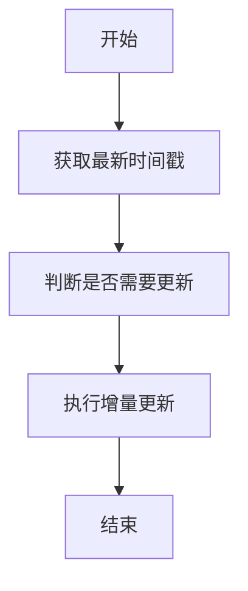
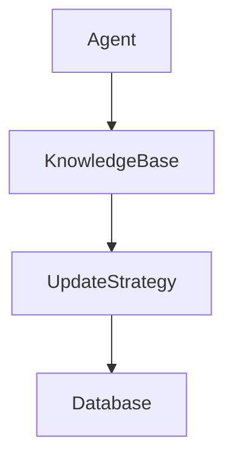
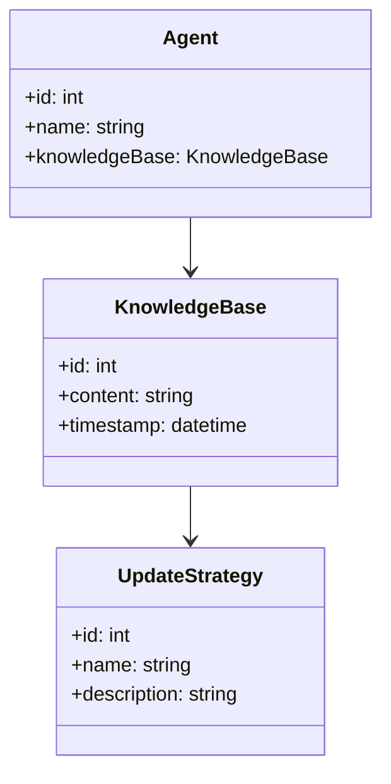
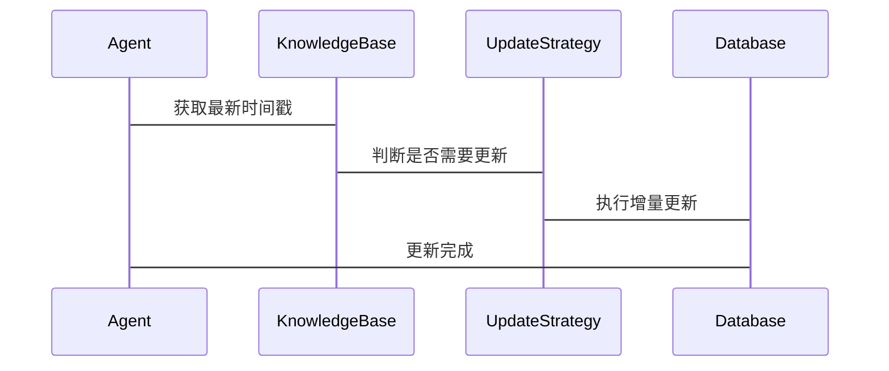

                 


# AI Agent的知识库增量更新策略：保持信息时效性

## 关键词：AI Agent，知识库，增量更新，时效性，系统架构，算法原理

## 摘要：  
在AI Agent领域，知识库的时效性和准确性是关键。本文系统性地探讨了AI Agent知识库增量更新的策略，从背景、核心概念、算法原理到系统架构和项目实战，层层剖析，为读者提供全面而深入的指导。通过对比分析、模型构建和案例解读，本文旨在帮助技术从业者优化知识库的更新机制，确保信息的实时性和准确性，同时兼顾系统性能和可扩展性。

---

# 第1章: 背景与问题背景

## 1.1 问题背景  
### 1.1.1 AI Agent与知识库的基本概念  
AI Agent（人工智能代理）是能够感知环境、自主决策并执行任务的智能体。知识库作为其核心数据源，存储了AI Agent所需的所有信息。知识库的时效性直接关系到AI Agent的决策能力。  

### 1.1.2 知识库时效性的重要性  
知识库的时效性决定了AI Agent在动态环境中的适应能力。 outdated或过时的信息可能导致错误的决策，甚至引发严重后果。因此，保持知识库的实时更新至关重要。  

### 1.1.3 知识库增量更新的必要性  
全量更新虽然能确保数据准确性，但效率低下且资源消耗大。增量更新通过仅更新变化的部分，显著提高了效率，减少了资源浪费。  

## 1.2 问题描述  
### 1.2.1 知识库更新的挑战  
- 数据源的多样性和异构性：不同数据源的格式和更新频率差异大，难以统一处理。  
- 更新频率与系统性能的平衡：频繁的增量更新可能影响系统性能，需权衡利弊。  
- 数据冲突与一致性：增量更新可能导致数据冲突，需确保一致性。  

### 1.2.2 增量更新与全量更新的对比  
| 特性                | 增量更新                   | 全量更新                   |  
|---------------------|---------------------------|---------------------------|  
| 更新频率            | 高频                      | 低频                      |  
| 资源消耗            | 低                       | 高                       |  
| 数据一致性          | 易出问题                  | 易保证                    |  

### 1.2.3 时效性与准确性的平衡  
过时的信息会影响决策的准确性，而频繁的更新可能降低系统的稳定性。因此，需找到时效性与准确性的最佳平衡点。  

## 1.3 问题解决  
### 1.3.1 知识库增量更新的目标  
- 提高更新效率：通过只更新变化的部分，减少资源消耗。  
- 保证数据一致性：确保增量更新后的数据与现有数据一致。  
- 实时性：及时反映数据的变化，保持知识库的时效性。  

### 1.3.2 增量更新的核心原则  
1. **最小化更新量**：仅更新变化的部分，避免不必要的资源消耗。  
2. **保证一致性**：确保增量更新后数据的完整性与一致性。  
3. **实时性**：及时反映数据的变化，确保信息的时效性。  

### 1.3.3 更新策略的选择与优化  
- 基于时间戳的增量更新：通过记录数据的修改时间，判断是否需要更新。  
- 基于变化检测的增量更新：通过比较前后数据，判断是否需要更新。  

## 1.4 边界与外延  
### 1.4.1 知识库增量更新的边界条件  
- 数据源的可靠性：增量更新依赖于数据源的准确性。  
- 系统性能的限制：增量更新可能影响系统性能，需考虑硬件限制。  
- 用户需求的多样性：不同用户对时效性的要求不同，需灵活调整。  

### 1.4.2 更新策略的适用范围  
- 适用于数据更新频繁但变化幅度小的场景。  
- 适用于对实时性要求高但资源受限的场景。  

### 1.4.3 与其他技术的关联与区别  
- **关联**：与分布式系统中的数据同步机制相似。  
- **区别**：增量更新专注于数据变化的部分，而数据同步关注整体一致性。  

## 1.5 概念结构与核心要素  
### 1.5.1 知识库的基本构成  
- 数据存储：存储知识库的内容。  
- 更新机制：实现数据的增量更新。  
- 时间戳：记录数据的修改时间。  

### 1.5.2 增量更新的核心要素  
- 数据变化检测：识别数据的变化部分。  
- 更新策略：选择合适的增量更新方式。  
- 时间戳管理：记录和管理数据的修改时间。  

### 1.5.3 更新策略的逻辑框架  
1. 检测数据变化：通过时间戳或变化检测算法，判断数据是否需要更新。  
2. 执行增量更新：仅更新变化的部分，确保数据一致性。  
3. 确保实时性：及时反映数据变化，保持知识库的时效性。  

## 1.6 本章小结  
本章从背景、问题背景、核心概念等方面详细介绍了AI Agent知识库增量更新的必要性和挑战。通过对比分析，明确了增量更新的目标和核心原则，并提出了初步的解决方案。

---

# 第2章: 核心概念与联系

## 2.1 核心概念原理  
### 2.1.1 知识库的表示与存储  
知识库通常以结构化数据的形式存储，如关系型数据库或图数据库。  

### 2.1.2 增量更新的基本原理  
增量更新的核心是检测数据变化，仅更新变化的部分。  

### 2.1.3 时效性管理的机制  
通过时间戳记录数据的修改时间，判断是否需要更新。  

## 2.2 核心概念对比  
### 2.2.1 知识库与数据库的对比  
| 特性          | 知识库                   | 数据库                   |  
|---------------|-------------------------|-------------------------|  
| 数据结构      | 多样性，支持复杂查询    | 结构化，支持高效查询    |  
| 更新频率      | 高                     | 中                     |  

### 2.2.2 增量更新与全量更新的对比  
| 特性          | 增量更新                 | 全量更新                 |  
|---------------|-------------------------|-------------------------|  
| 更新效率      | 高                     | 低                     |  
| 资源消耗      | 低                     | 高                     |  

### 2.2.3 时效性与准确性的对比  
| 特性          | 时效性优先              | 准确性优先              |  
|---------------|-------------------------|-------------------------|  
| 更新频率      | 高                     | 低                     |  
| 决策影响      | 可能影响决策的实时性    | 可能影响决策的准确性    |  

## 2.3 ER实体关系图  
```mermaid
er
    Actor(Agent, id, name)
    KnowledgeBase(id, content, timestamp)
    UpdateStrategy(id, name, description)
    Agent关联到KnowledgeBase
```

## 2.4 本章小结  
本章通过对比分析，明确了知识库与数据库、增量更新与全量更新、时效性与准确性的区别与联系，并通过ER图展示了实体关系。

---

# 第3章: 算法原理与实现

## 3.1 增量更新算法原理  
### 3.1.1 基于时间戳的增量更新  
通过记录数据的修改时间，判断是否需要更新。  

### 3.1.2 基于变化检测的增量更新  
通过比较前后数据，判断是否需要更新。  

### 3.1.3 基于优先级的增量更新  
根据数据的重要性，优先更新关键部分。  

## 3.2 算法实现  
### 3.2.1 时间戳机制  


### 3.2.2 变化检测算法  
```python
def incremental_update(timestamp):
    if current_timestamp > last_update_timestamp:
        update知识库
    return
```

## 3.3 数学模型与公式  
### 3.3.1 时间戳更新公式  
$$
current\_timestamp = max(last\_update\_timestamp, current\_timestamp)
$$

### 3.3.2 变化检测公式  
$$
\Delta = current\_content - last\_content
$$

## 3.4 本章小结  
本章详细介绍了增量更新的算法原理，并通过时间戳机制和变化检测算法，展示了如何实现高效的知识库更新。

---

# 第4章: 系统架构与实现

## 4.1 系统架构设计  


## 4.2 系统功能设计  
### 4.2.1 领域模型  


### 4.2.2 系统架构  


### 4.2.3 系统接口设计  


## 4.3 本章小结  
本章通过系统架构设计和功能设计，展示了如何实现高效的增量更新机制，并通过接口设计确保系统的可扩展性和可维护性。

---

# 第5章: 项目实战与案例分析

## 5.1 项目背景与目标  
一个AI Agent需要实时更新知识库，以保持决策的准确性。  

## 5.2 环境与工具安装  
- Python 3.8+  
- Mermaid工具  
- 数据库：MySQL或MongoDB  

## 5.3 核心代码实现  
```python
class KnowledgeBase:
    def __init__(self, id, content, timestamp):
        self.id = id
        self.content = content
        self.timestamp = timestamp

class UpdateStrategy:
    def __init__(self, id, name, description):
        self.id = id
        self.name = name
        self.description = description

    def update(self, knowledge_base):
        if self.is_update_needed(knowledge_base):
            self.apply_update(knowledge_base)

    def is_update_needed(self, knowledge_base):
        current_timestamp = self.get_current_timestamp()
        return current_timestamp > knowledge_base.timestamp

    def apply_update(self, knowledge_base):
        # 执行增量更新
        pass
```

## 5.4 案例分析与解读  
通过一个具体案例，展示了增量更新的实际应用。  

## 5.5 项目小结  
本章通过项目实战，展示了如何将理论应用于实践，并通过代码实现和案例分析，进一步验证了增量更新策略的有效性。

---

# 第6章: 总结与展望

## 6.1 总结  
本文系统性地探讨了AI Agent知识库增量更新的策略，从背景、核心概念、算法原理到系统架构和项目实战，层层剖析，为读者提供了全面而深入的指导。  

## 6.2 展望  
未来，随着AI技术的不断发展，增量更新策略将更加智能化和自动化。通过结合机器学习和分布式计算，进一步优化知识库的更新机制，实现更高效率和更优性能。

## 6.3 最佳实践  
- 定期测试和优化增量更新策略。  
- 根据具体场景选择合适的增量更新方式。  
- 确保数据一致性与系统性能的平衡。  

## 6.4 小结  
本文通过理论与实践相结合的方式，为AI Agent知识库增量更新的优化提供了有力支持，同时展望了未来的发展方向。

---

# 作者：AI天才研究院/AI Genius Institute & 禅与计算机程序设计艺术 /Zen And The Art of Computer Programming

---

以上是一个详细的思考过程和文章框架，您可以根据实际需求进行调整和补充。

