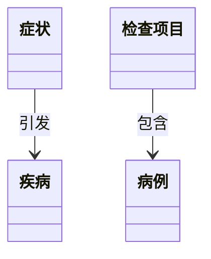
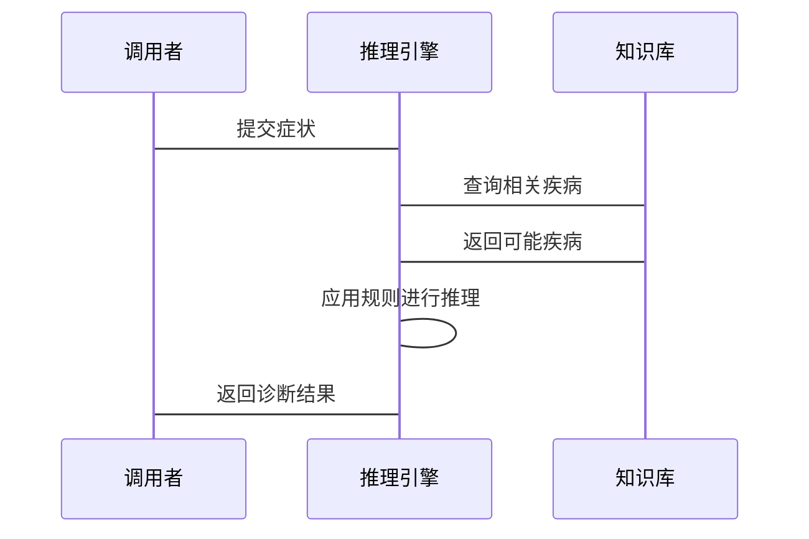

                 


# AI Agent的知识推理链：逐步解决复杂问题

## 关键词：
AI Agent, 知识推理链, 复杂问题解决, 系统架构设计, 项目实战, 算法原理

## 摘要：
本文详细探讨了AI Agent的知识推理链在解决复杂问题中的应用。通过逐步分析，从核心概念到算法实现，再到系统架构设计，结合实际案例，全面阐述了知识推理链的构建与应用过程。文章结合Mermaid图和数学模型，深入浅出地展示了如何利用知识推理链来提升AI Agent的智能水平。

---

## 第三章 知识推理链的算法原理

### 3.1 算法选择与原理

#### 3.1.1 算法选择：基于规则的推理

基于规则的推理是一种简单而有效的知识推理方法。它通过定义一系列规则（如果-那么结构）来模拟人类的推理过程。例如，规则可以表示为：

$$
\text{如果 } A \text{ 且 } B \text{，那么 } C
$$

这些规则存储在规则库中，推理引擎根据当前知识库中的事实应用这些规则，逐步推导出新的结论。

#### 3.1.2 推理过程

推理过程可以分为以下步骤：

1. **事实匹配**：从知识库中提取与规则的前提条件匹配的事实。
2. **规则应用**：将匹配的事实与规则进行比较，推导出结论。
3. **结论更新**：将新结论添加到知识库中，作为后续推理的事实依据。

这个过程可以递归进行，直到没有新的事实可以推导为止。

#### 3.1.3 算法优化

为了提高推理效率，可以引入以下优化方法：

1. **剪枝技术**：在推理过程中，跳过不可能推导出新结论的分支。
2. **规则优先级**：优先应用高优先级的规则，减少不必要的计算。

### 3.2 算法实现

#### 3.2.1 基于规则的推理算法代码

以下是一个简单的基于规则的推理算法实现：

```python
class Rule:
    def __init__(self, premises, conclusion):
        self.premises = premises
        self.conclusion = conclusion

class InferenceEngine:
    def __init__(self, rules):
        self.rules = rules
        self.facts = set()

    def add_fact(self, fact):
        self.facts.add(fact)

    def infer(self):
        new_facts = set()
        for rule in self.rules:
            premises_met = True
            for premise in rule.premises:
                if premise not in self.facts:
                    premises_met = False
                    break
            if premises_met:
                new_facts.add(rule.conclusion)
        for fact in new_facts:
            self.facts.add(fact)
        return new_facts
```

#### 3.2.2 推理过程中的数学模型

基于规则的推理可以表示为逻辑推理模型，其中规则的前提和结论可以用逻辑表达式表示。例如：

$$
\text{规则：如果 } x \text{ 和 } y \text{ 是朋友，且 } y \text{ 和 } z \text{ 是朋友，那么 } x \text{ 和 } z \text{ 是朋友。}
$$

在代码中，上述规则可以表示为：

```python
rule = Rule(["is_friend(x, y)", "is_friend(y, z)"], "is_friend(x, z)")
```

推理引擎会不断应用这些规则，直到没有新的事实可以推导。

---

## 第四章 系统分析与架构设计

### 4.1 项目介绍

本项目旨在开发一个AI Agent，能够通过知识推理链解决复杂的诊断问题。我们将以医疗诊断系统为例，展示如何利用知识推理链进行疾病诊断。

### 4.2 领域模型设计

领域模型展示系统的功能模块和数据流。



### 4.3 系统架构设计

系统架构展示各个模块的交互关系。


### 4.4 系统接口设计

系统接口展示模块之间的数据交互。



---

## 第五章 项目实战

### 5.1 环境配置

环境配置：

1. **Python 3.8+**
2. **Mermaid CLI**
3. **MathJax支持的Markdown编辑器**

### 5.2 系统核心实现源代码

以下是医疗诊断系统的代码实现：

```python
from typing import Set, List
from dataclasses import dataclass

@dataclass
class Fact:
    subject: str
    predicate: str
    object: str

class Rule:
    def __init__(self, premises: List[Fact], conclusion: Fact):
        self.premises = premises
        self.conclusion = conclusion

class InferenceEngine:
    def __init__(self, rules: List[Rule]):
        self.rules = rules
        self.facts = Set()

    def add_fact(self, fact: Fact):
        self.facts.add(fact)

    def get_facts(self, predicate: str, obj: str) -> List[Fact]:
        return [fact for fact in self.facts if fact.predicate == predicate and fact.object == obj]

    def apply_rule(self, rule: Rule) -> bool:
        premises_met = True
        for premise in rule.premises:
            if not any(f.predicate == premise.predicate and f.object == premise.object for f in self.facts):
                premises_met = False
                break
        if premises_met:
            self.facts.add(rule.conclusion)
            return True
        return False

    def infer(self):
        has_inferred = True
        while has_inferred:
            has_inferred = False
            for rule in self.rules:
                if self.apply_rule(rule):
                    has_inferred = True
                    break
```

### 5.3 代码应用解读与分析

代码解读：

- **Fact类**：表示一个事实，包含主题、谓词和宾语。
- **Rule类**：表示一条规则，包含前提和结论。
- **InferenceEngine类**：推理引擎，管理事实和规则，并执行推理过程。

### 5.4 实际案例分析

案例：诊断疾病

1. **症状输入**：患者有咳嗽和发热。
2. **规则匹配**：规则1：如果患者有咳嗽和发热，那么可能患流感。
3. **推理结果**：推导出患者可能患流感。

### 5.5 项目小结

通过代码实现，我们可以看到知识推理链在医疗诊断中的应用潜力。推理引擎能够根据输入的症状和规则库，推导出可能的疾病，辅助医生进行诊断。

---

## 第六章 总结与展望

### 6.1 内容总结

本文详细探讨了AI Agent的知识推理链在解决复杂问题中的应用，从理论到实践，展示了如何构建和实现一个基于知识推理链的AI系统。

### 6.2 未来展望

未来，知识推理链可以通过以下方式进一步优化：

1. **结合机器学习**：将规则推理与机器学习模型结合，提高推理的准确性和效率。
2. **动态规则更新**：根据新的数据和反馈，动态更新规则库，提升系统的自适应能力。
3. **分布式推理**：在分布式系统中实现知识推理链，提高处理大规模数据的能力。

### 6.3 最佳实践

- **规则设计**：规则应简洁明了，避免过于复杂的逻辑。
- **性能优化**：合理使用剪枝技术，提高推理效率。
- **数据管理**：确保知识库的数据质量，减少推理错误。

---

## 作者：AI天才研究院 & 禅与计算机程序设计艺术

---

希望这篇文章能够为读者提供清晰的知识推理链构建思路，并激发进一步的研究和实践。

