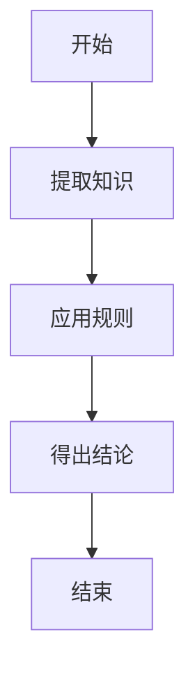
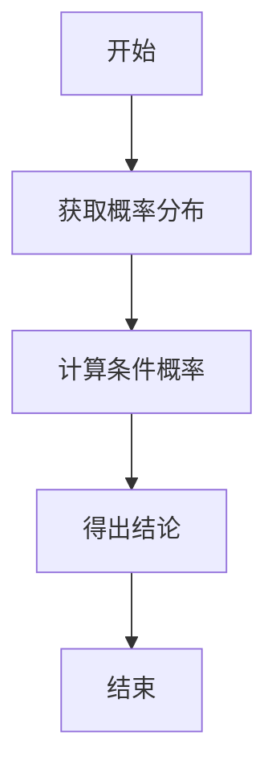
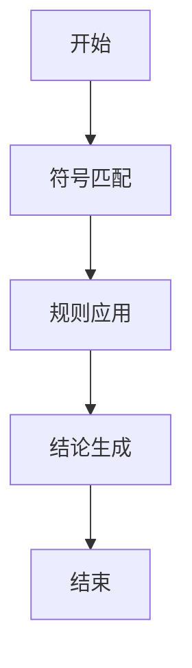
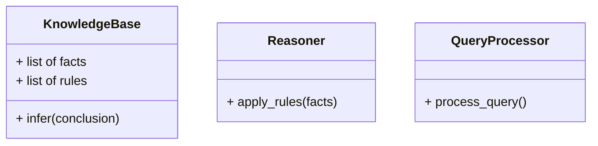
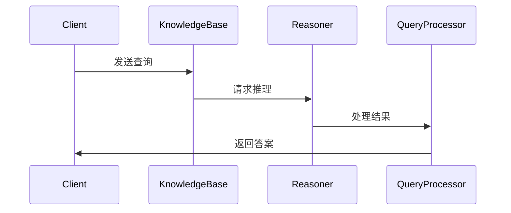

                 


# AI Agent的知识推理：从已知到未知

## 关键词：
- AI Agent
- 知识推理
- 逻辑推理
- 概率推理
- 知识图谱
- 系统架构

## 摘要：
AI Agent的知识推理是实现智能系统的核心能力之一。本文从知识推理的基本概念出发，逐步深入探讨其在AI Agent中的应用，涵盖逻辑推理、概率推理、符号推理等算法原理，结合系统架构设计与项目实战，为读者提供从理论到实践的全面指导。

---

# 第一部分: AI Agent的知识推理概述

## 第1章: AI Agent与知识推理概述

### 1.1 AI Agent的基本概念
#### 1.1.1 AI Agent的定义与特征
AI Agent（智能体）是能够感知环境并采取行动以实现目标的实体。其主要特征包括自主性、反应性、目标导向性和社会性。

#### 1.1.2 知识推理的定义与作用
知识推理是指通过已有的知识库，推导出新的结论或事实的过程。它是AI Agent理解环境、解决问题的关键能力。

#### 1.1.3 AI Agent与知识推理的关系
AI Agent依赖知识推理来处理不确定性、复杂性和动态变化的环境，从而做出合理决策。

### 1.2 知识推理的背景与问题背景
#### 1.2.1 知识推理的起源与发展
知识推理起源于逻辑学和数学，随着AI技术的发展，逐渐成为研究热点。

#### 1.2.2 当前知识推理的核心问题
主要挑战包括知识表示的多样性、推理的高效性以及处理不确定性的能力。

#### 1.2.3 知识推理的边界与外延
知识推理不仅涉及逻辑推理，还包括概率推理和符号推理等多领域。

### 1.3 知识推理在AI Agent中的问题描述
#### 1.3.1 知识推理的基本问题
如何有效地表示、存储和推理知识？

#### 1.3.2 知识推理的核心目标
实现从已知到未知的准确推导，提高AI Agent的智能水平。

#### 1.3.3 知识推理的实现路径
结合多种推理方法，构建高效的推理系统。

### 1.4 本章小结
本章介绍了AI Agent与知识推理的基本概念、问题背景和实现目标，为后续内容打下基础。

---

# 第二部分: 知识推理的核心概念与联系

## 第2章: 知识推理的核心概念

### 2.1 知识推理的原理与机制
#### 2.1.1 知识表示的基本原理
知识表示是推理的前提，常用的表示方法包括语义网络、知识图谱等。

#### 2.1.2 知识推理的基本机制
推理过程包括知识提取、规则匹配和结论生成。

#### 2.1.3 知识推理的核心要素
包括知识库、推理规则和推理引擎。

### 2.2 知识推理的关键特征
#### 2.2.1 知识的可表示性
知识应以计算机可处理的形式表示。

#### 2.2.2 推理的逻辑性
推理过程必须符合逻辑规则。

#### 2.2.3 推理的不确定性
处理不确定知识的能力是推理系统的重要特征。

### 2.3 知识推理与AI Agent的关系
#### 2.3.1 知识推理在AI Agent中的角色
是AI Agent理解环境和解决问题的核心能力。

#### 2.3.2 知识推理与任务规划的联系
任务规划依赖知识推理来确定最优行动路径。

#### 2.3.3 知识推理与决策优化的结合
通过推理优化决策过程，提高效率和准确性。

### 2.4 知识推理的核心概念对比表

| 概念         | 逻辑推理 | 概率推理 | 符号推理 |
|--------------|----------|----------|----------|
| 表示方法     | 命题逻辑 | 概率分布 | 符号规则 |
| 处理方式     | 确定性   | 不确定性 | 确定性   |
| 应用场景     | 严格推理 | 概率预测 | 知识库构建 |

### 2.5 知识推理的ER实体关系图
```mermaid
erDiagram
    knowledge_base <------ knowledge_instance
    knowledge_instance <------ concept
    concept <------ relation
```

---

# 第三部分: 知识推理的算法原理

## 第3章: 知识推理的算法原理

### 3.1 逻辑推理算法
#### 3.1.1 逻辑推理的原理
基于命题逻辑和谓词逻辑，通过规则匹配进行推理。

#### 3.1.2 逻辑推理的数学模型
$$ P(h|e) = \frac{P(e| h)P(h)}{P(e)} $$
其中，P(h|e)表示在证据e下的假设h的概率。

#### 3.1.3 逻辑推理的实现流程


#### 3.1.4 逻辑推理的Python实现
```python
def logical_inference(rules, evidence):
    # rules: 列表，每个规则是元组（前提，结论）
    # evidence: 列表，已知事实
    known = set(evidence)
    inferred = set()
    while True:
        for rule in rules:
            premise, conclusion = rule
            if all(p in known for p in premise):
                if conclusion not in known and conclusion not in inferred:
                    inferred.add(conclusion)
                    known.add(conclusion)
                    break
        else:
            break
    return known
```

---

## 第4章: 概率推理算法

### 4.1 概率推理的原理
基于概率论，处理不确定性知识。

### 4.2 概率推理的数学模型
$$ P(A|B) = \frac{P(B|A)P(A)}{P(B)} $$

### 4.3 概率推理的实现流程


### 4.4 概率推理的Python实现
```python
import numpy as np

def probabilistic_inference(junction_tree, query_variable, evidence):
    # junction_tree: 联合树结构
    # query_variable: 查询变量
    # evidence: 已知证据
    result = 0
    for leaf in junction_tree.leaves():
        if leaf.variable == query_variable:
            if leaf.observed:
                result += leaf.potential * evidence_weight
    return result / sum_of_weights
```

---

## 第5章: 符号推理算法

### 5.1 符号推理的原理
基于符号逻辑，通过规则库进行推理。

### 5.2 符号推理的数学模型
$$ \text{如果 } P \text{ 和 } Q \text{ 为真，则 } R \text{ 为真} $$

### 5.3 符号推理的实现流程


### 5.4 符号推理的Python实现
```python
def symbolic_inference(rules, facts):
    known = set(facts)
    inferred = set()
    while True:
        for rule in rules:
            premise, conclusion = rule
            if all(p in known for p in premise):
                if conclusion not in known and conclusion not in inferred:
                    inferred.add(conclusion)
                    known.add(conclusion)
                    break
        else:
            break
    return known
```

---

# 第四部分: 系统分析与架构设计

## 第6章: 知识推理系统的分析与架构设计

### 6.1 系统场景介绍
构建一个基于知识推理的智能问答系统。

### 6.2 系统功能设计
#### 6.2.1 领域模型设计


### 6.3 系统架构设计


### 6.4 系统接口设计
定义RESTful API接口：
- POST /query：接收查询请求
- GET /results：返回推理结果

### 6.5 系统交互设计


---

# 第五部分: 项目实战

## 第7章: 知识推理系统的项目实战

### 7.1 环境安装
安装必要的库：
```bash
pip install python3-logictree
pip install numpy
```

### 7.2 系统核心实现
#### 7.2.1 知识库构建
```python
from logictree import KnowledgeTree

kb = KnowledgeTree()
kb.add_fact("A")
kb.add_rule("A implies B")
```

#### 7.2.2 推理引擎实现
```python
def infer(conclusions):
    for conclusion in conclusions:
        print(f"推导出：{conclusion}")
```

#### 7.2.3 接口实现
```python
from flask import Flask

app = Flask(__name__)

@app.route('/query', methods=['POST'])
def handle_query():
    data = request.json
    result = kb.infer(data['query'])
    return jsonify({'result': result})
```

### 7.3 项目实战案例分析
实现一个简单的问答系统：
```python
kb.add_fact("下雨")
kb.add_rule("下雨 implies 地湿")
kb.infer("下雨了吗？")
```

### 7.4 项目总结
总结项目实现过程，讨论优缺点，提出改进建议。

---

# 第六部分: 总结与展望

## 第8章: 总结与展望

### 8.1 全文总结
回顾知识推理的核心概念、算法原理和系统设计。

### 8.2 未来展望
探讨知识推理的前沿技术，如深度学习结合符号推理。

### 8.3 最佳实践
给出在实际项目中应用知识推理的最佳实践建议。

---

# 作者：
AI天才研究院  
禅与计算机程序设计艺术

