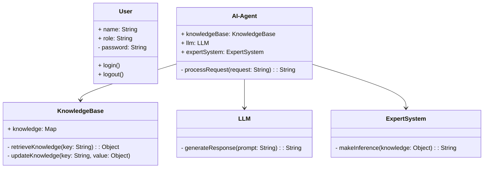
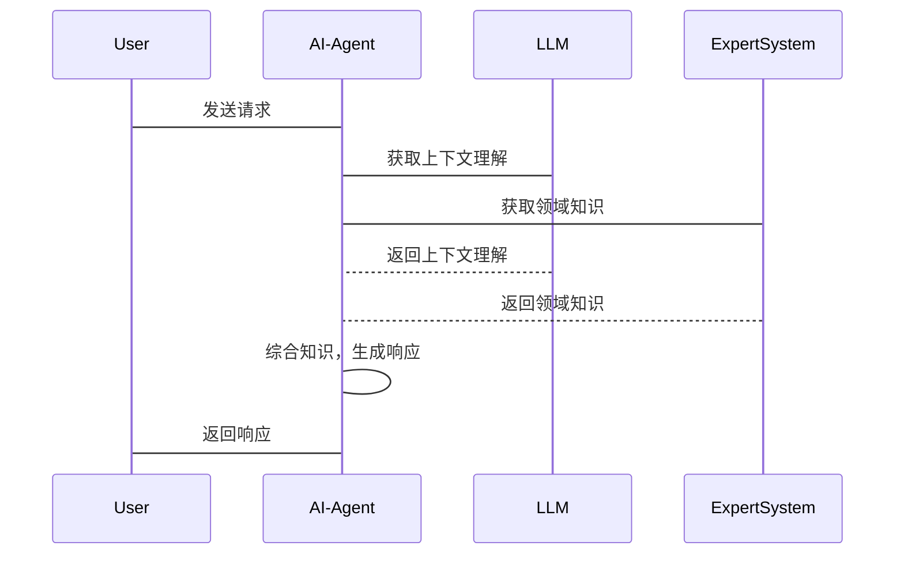

                 


# AI Agent的知识整合：融合LLM与专家系统

## 关键词：AI Agent, LLM, 大语言模型, 专家系统, 知识整合, 融合, 人工智能

## 摘要：
本文深入探讨了AI Agent的知识整合，重点分析了如何将大语言模型（LLM）与专家系统相结合。通过系统化的结构，文章详细阐述了AI Agent的背景、核心概念、融合原理、系统架构设计、项目实战以及最佳实践。结合理论与实践，本文为读者提供了从基础概念到实际应用的全面指南，帮助理解并掌握AI Agent的知识整合技术。

---

# 第一部分: AI Agent的知识整合概述

## 第1章: AI Agent与知识整合的背景

### 1.1 AI Agent的基本概念
#### 1.1.1 什么是AI Agent
AI Agent（人工智能代理）是指能够感知环境、自主决策并采取行动以实现目标的智能实体。它可以是一个软件程序、机器人或其他智能系统，具备以下核心特征：
- **自主性**：能够在没有外部干预的情况下独立运行。
- **反应性**：能够实时感知环境并做出响应。
- **目标导向**：通过目标驱动行为，优化决策过程。

#### 1.1.2 AI Agent的核心特征
- **知识表示**：AI Agent需要通过知识库来表示和处理信息。
- **推理能力**：能够基于知识库进行逻辑推理，得出结论。
- **学习能力**：通过与环境的交互，不断优化自身的知识和行为。

#### 1.1.3 知识整合在AI Agent中的重要性
知识整合是AI Agent实现复杂任务的核心能力。通过整合多种知识来源（如LLM生成的上下文理解和专家系统提供的领域知识），AI Agent能够更好地应对动态复杂的环境。

### 1.2 LLM与专家系统的概念
#### 1.2.1 大语言模型（LLM）的定义
LLM是一种基于深度学习的自然语言处理模型，能够理解和生成人类语言。其核心在于通过大量数据的训练，学习语言的语法、语义和上下文关系。

#### 1.2.2 专家系统的定义与特点
专家系统是一种基于领域知识的智能系统，通过知识库和推理引擎模拟专家的决策过程。其特点包括：
- **知识专精**：专注于特定领域。
- **推理能力**：能够根据知识库进行逻辑推理。
- **可解释性**：推理过程和结果具有较高的透明度。

#### 1.2.3 LLM与专家系统的结合优势
- **知识互补性**：LLM擅长处理非结构化数据，而专家系统擅长处理结构化知识。
- **灵活性与专精性**：结合LLM的灵活性和专家系统的专精性，能够实现更强大的智能能力。

### 1.3 AI Agent在现代应用中的作用
#### 1.3.1 AI Agent在企业级应用中的价值
AI Agent在企业中可以用于客户支持、流程自动化、风险管理等领域，通过整合LLM和专家系统，能够提供更智能、更高效的解决方案。

#### 1.3.2 知识整合在AI Agent中的应用场景
- **智能客服**：通过整合LLM的自然语言理解和专家系统的领域知识，提供更精准的客户服务。
- **医疗诊断**：结合医疗领域的知识库和LLM的自然语言处理能力，辅助医生进行诊断。

#### 1.3.3 未来发展趋势
随着技术的进步，AI Agent的知识整合将更加智能化和个性化，应用场景也将更加广泛。

### 1.4 本章小结
本章介绍了AI Agent的基本概念、核心特征以及知识整合的重要性。同时，分析了LLM和专家系统的概念及其结合优势，为后续章节奠定了基础。

---

## 第2章: LLM的核心原理

### 2.1 LLM的训练与推理
#### 2.1.1 模型训练过程
- **数据预处理**：清洗、标注和格式化。
- **模型构建**：选择适合的深度学习模型（如Transformer）。
- **训练优化**：通过反向传播和优化算法（如Adam）进行参数调整。

#### 2.1.2 模型推理机制
- **输入处理**：将输入文本转换为模型可处理的形式。
- **生成过程**：基于上下文生成合理的回复。

#### 2.1.3 LLM的优缺点分析
- **优点**：强大的自然语言处理能力，能够处理复杂语义。
- **缺点**：对计算资源需求高，存在一定的错误率。

### 2.2 LLM的数学模型与公式
#### 2.2.1 概率论基础
- **条件概率**：$P(y|x)$ 表示在输入 $x$ 的情况下，输出 $y$ 的概率。

#### 2.2.2 深度学习模型的数学表达
- **Transformer模型**：由编码器和解码器组成，通过自注意力机制处理序列数据。

#### 2.2.3 损失函数与优化算法
- **交叉熵损失函数**：$$\text{交叉熵损失函数} = -\sum_{i=1}^{n} y_i \log(p_i) + (1-y_i)\log(1-p_i)$$
- **优化算法**：Adam优化器通过梯度下降优化模型参数。

### 2.3 LLM的训练流程
#### 2.3.1 数据预处理
- **清洗数据**：去除噪音和无关信息。
- **数据标注**：为数据添加标签或注释。

#### 2.3.2 模型训练
- **选择模型架构**：如GPT、BERT等。
- **训练参数调整**：优化学习率、批量大小等超参数。

#### 2.3.3 模型调优
- **微调**：在特定领域数据上进行微调，提升模型性能。
- **评估与测试**：通过测试集评估模型的准确性和鲁棒性。

---

## 第3章: 专家系统的原理与架构

### 3.1 专家系统的基本构成
#### 3.1.1 知识库
- **知识表示**：通过符号逻辑表示领域知识，如规则、事实和概念。
- **知识存储**：将知识以结构化的形式存储，便于推理引擎访问。

#### 3.1.2 推理机
- **推理规则**：定义知识之间的逻辑关系，如“如果A则B”。
- **推理引擎**：根据知识库中的事实和推理规则，生成结论。

#### 3.1.3 用户接口
- **输入接口**：接收用户输入，解析需求。
- **输出接口**：将推理结果以用户可理解的形式展示。

### 3.2 专家系统的知识表示
#### 3.2.1 知识库的构建
- **知识获取**：通过专家访谈、文档分析等方式获取领域知识。
- **知识整理**：将获取的知识进行分类、组织，形成结构化的知识库。

#### 3.2.2 知识表示方法
- **谓词逻辑**：使用谓词表示事实和关系，如“ isa(A, B) ”表示A是B的一种。
- **规则表示**：通过条件语句表示推理规则，如“如果A，那么B”。

#### 3.2.3 知识推理规则
- **演绎推理**：从一般到特殊的推理，如三段论。
- **归纳推理**：从具体到一般的推理，如统计归纳。

### 3.3 专家系统的优缺点
#### 3.3.1 优点
- **领域专精**：在特定领域内具有深厚的知识。
- **可解释性**：推理过程和结果具有较高的透明度。

#### 3.3.2 缺点
- **知识获取成本高**：需要专家参与知识库的构建。
- **难以应对复杂问题**：在处理不确定性和模糊性问题时表现有限。

#### 3.3.3 改进方向
- **结合机器学习**：通过机器学习方法自动获取和更新知识。
- **增强推理能力**：引入非单调推理、模糊推理等方法。

---

## 第4章: LLM与专家系统的融合原理

### 4.1 知识整合的基本思路
#### 4.1.1 知识的表示与融合
- **知识表示**：将LLM生成的知识和专家系统中的知识统一表示。
- **知识融合**：通过特定算法将两种知识进行整合，消除冲突，提升一致性。

#### 4.1.2 知识的动态更新
- **实时更新**：根据新数据动态更新知识库。
- **版本控制**：对知识库的修改进行记录和管理。

#### 4.1.3 知识的可解释性
- **可解释性要求**：确保融合后的知识具备可解释性。
- **解释生成**：为用户提供融合知识的解释。

### 4.2 LLM与专家系统的协同工作
#### 4.2.1 知识互补性分析
- **LLM的优势**：强大的自然语言理解和生成能力。
- **专家系统的优势**：领域知识专精，推理能力强大。

#### 4.2.2 知识融合的实现方式
- **符号与分布表示的结合**：将专家系统的符号逻辑与LLM的分布表示相结合。
- **混合推理**：结合LLM的生成能力和专家系统的推理能力，实现更复杂的推理任务。

#### 4.2.3 知识整合的效果评估
- **准确率**：融合后系统的正确推理比例。
- **响应速度**：系统在处理复杂任务时的性能。

### 4.3 融合模型的数学表达
#### 4.3.1 知识融合的公式
- **融合权重**：根据知识的可靠性和相关性赋予不同的权重，如加权平均。

#### 4.3.2 模型性能的评估指标
- **F1分数**：综合准确率和召回率的指标。
- **困惑度**：衡量模型生成文本的流畅性。

#### 4.3.3 知识整合的优化算法
- **遗传算法**：用于优化知识融合的权重和参数。
- **强化学习**：通过强化学习优化知识整合的过程。

---

## 第5章: 系统分析与架构设计

### 5.1 问题场景介绍
#### 5.1.1 项目背景
- **目标**：开发一个结合LLM和专家系统的AI Agent，应用于智能客服领域。
- **需求分析**：用户需要通过自然语言与系统交互，系统能够准确理解并提供解决方案。

### 5.2 系统功能设计
#### 5.2.1 领域模型
- **类图设计**：通过Mermaid类图展示系统的类及其关系。



#### 5.2.2 系统架构设计
- **分层架构**：包括数据层、知识层、逻辑层和交互层。


### 5.3 系统接口设计
#### 5.3.1 用户接口
- **输入接口**：支持文本输入和语音输入。
- **输出接口**：支持文本输出和语音输出。

#### 5.3.2 系统交互
- **交互流程**：用户输入请求，系统解析需求，调用LLM和专家系统进行推理，返回结果。

### 5.4 系统交互的Mermaid序列图



---

## 第6章: 项目实战

### 6.1 环境安装
- **开发工具**：安装Python、TensorFlow、Keras、Scikit-learn等库。
- **框架选择**：选择适合的LLM框架（如Hugging Face）和专家系统框架（如Rete）。

### 6.2 系统核心实现源代码
#### 6.2.1 知识库管理
```python
class KnowledgeBase:
    def __init__(self):
        self.knowledge = {}

    def retrieve_knowledge(self, key):
        return self.knowledge.get(key)

    def update_knowledge(self, key, value):
        self.knowledge[key] = value
```

#### 6.2.2 LLM集成
```python
class LLM:
    def generate_response(self, prompt):
        # 调用LLM API生成响应
        pass
```

#### 6.2.3 专家系统推理
```python
class ExpertSystem:
    def make_inference(self, knowledge):
        # 根据知识进行推理，返回结论
        pass
```

#### 6.2.4 AI Agent实现
```python
class AI-Agent:
    def __init__(self):
        self.knowledge_base = KnowledgeBase()
        self.llm = LLM()
        self.expert_system = ExpertSystem()

    def process_request(self, request):
        # 获取上下文理解
        context = self.llm.generate_response(request)
        # 获取领域知识
        knowledge = self.knowledge_base.retrieve_knowledge(context)
        # 综合推理
        result = self.expert_system.make_inference(knowledge)
        return result
```

### 6.3 代码应用解读与分析
- **知识库管理**：通过`KnowledgeBase`类实现知识的存储和检索。
- **LLM集成**：通过`LLM`类调用外部API生成自然语言文本。
- **专家系统推理**：通过`ExpertSystem`类进行基于知识库的逻辑推理。

### 6.4 实际案例分析
#### 6.4.1 案例背景
- **应用场景**：智能客服系统。
- **用户需求**：用户咨询产品问题。

#### 6.4.2 系统处理流程
1. 用户发送请求：“这个产品的功能有哪些？”
2. AI Agent调用LLM生成上下文理解：“用户询问产品功能”。
3. AI Agent从知识库中检索相关知识：“产品功能列表”。
4. AI Agent调用专家系统进行推理，生成详细的产品功能说明。
5. AI Agent将结果返回给用户。

### 6.5 项目总结
- **项目成果**：成功实现了结合LLM和专家系统的AI Agent。
- **经验总结**：知识整合的关键在于知识的表示与融合，以及系统的优化与调优。

---

## 第7章: 最佳实践与小结

### 7.1 最佳实践
- **知识管理**：建立规范的知识管理流程，确保知识的准确性和一致性。
- **系统优化**：通过持续优化算法和架构设计，提升系统的性能和效率。
- **用户体验**：注重用户交互设计，提升用户体验。

### 7.2 小结
本文系统地探讨了AI Agent的知识整合，详细分析了LLM与专家系统的融合原理和实现方法。通过理论与实践相结合，为读者提供了从基础概念到实际应用的全面指导。

### 7.3 注意事项
- **数据安全**：确保知识库和用户数据的安全性。
- **性能优化**：在实际应用中，需要注意系统的性能优化和资源管理。

### 7.4 拓展阅读
- **推荐书籍**：《深度学习》（Ian Goodfellow著）
- **推荐论文**：《Attention Is All You Need》（Vaswani等人）

---

# 作者：AI天才研究院/AI Genius Institute & 禅与计算机程序设计艺术 /Zen And The Art of Computer Programming

