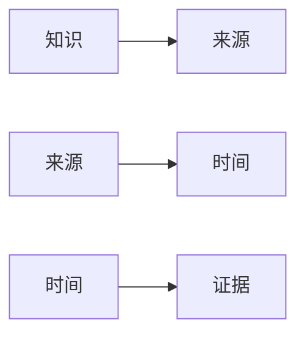

                 


# AI Agent的知识溯源机制：提高LLM输出的可追溯性

> 关键词：AI Agent，知识溯源，LLM，可追溯性，知识图谱，图嵌入，符号逻辑

> 摘要：本文深入探讨了AI Agent的知识溯源机制，重点分析了其在提高LLM输出可追溯性中的作用。通过结合知识图谱、图嵌入和符号逻辑等技术，本文提出了系统的知识溯源方法，并详细阐述了其实现原理和应用场景。

---

# 第一部分: AI Agent知识溯源机制的背景与意义

## 第1章: 知识溯源机制的背景与意义

### 1.1 知识溯源机制的定义与核心概念

#### 1.1.1 知识溯源机制的定义
知识溯源机制（Knowledge Provenance Mechanism）是指通过记录和分析知识的来源、生成过程及关联关系，以验证知识的可靠性和真实性的一种机制。在AI Agent和大型语言模型（LLM）的应用中，知识溯源机制主要用于追踪模型输出结果的依据和推理过程，从而提高输出的可追溯性和可信度。

#### 1.1.2 知识溯源机制的核心概念
知识溯源机制的核心概念包括：
- **知识来源**：知识的原始出处，例如训练数据、外部知识库或推理过程。
- **知识关联**：知识之间的关系和依赖，例如上下文关联、逻辑推理链。
- **知识验证**：对知识的正确性进行验证和校正的过程。

#### 1.1.3 知识溯源机制的背景与问题背景
随着LLM（如GPT系列模型）的广泛应用，其输出结果的可追溯性和可信度问题逐渐成为关注的焦点。LLM的“黑箱”特性使得用户难以理解模型生成结果的依据，这在需要高透明度和可解释性的场景（如医疗、法律等领域）中带来了挑战。知识溯源机制正是为了解决这些问题而提出。

#### 1.1.4 知识溯源机制的边界与外延
知识溯源机制的边界在于知识的生成和推理过程，其外延则涉及知识的表示、存储和验证等多个环节。

---

### 1.2 知识溯源机制的重要性

#### 1.2.1 提高LLM输出的可追溯性
通过记录知识的来源和推理过程，知识溯源机制能够为LLM的输出提供透明的解释，从而提高其可追溯性。

#### 1.2.2 知识溯源在AI Agent中的作用
AI Agent需要依赖知识来完成任务，而知识的来源和可靠性直接影响其决策的正确性。知识溯源机制能够帮助AI Agent更好地理解和验证其知识基础。

#### 1.2.3 知识溯源机制的现实意义
知识溯源机制在提升AI系统的可信度、支持决策的可解释性以及应对法律和伦理问题方面具有重要意义。

---

## 第2章: 知识溯源机制的核心概念与联系

### 2.1 知识溯源机制的原理

#### 2.1.1 知识溯源机制的基本原理
知识溯源机制通过记录知识的来源、关联和验证过程，构建一个完整的知识链，从而实现知识的可追溯性。

#### 2.1.2 知识溯源机制的实现方式
知识溯源机制的实现方式包括：
- **基于知识图谱的溯源**：通过构建知识图谱，记录知识的来源和关联关系。
- **基于符号逻辑的溯源**：通过符号逻辑推理，验证知识的正确性。
- **基于概率论的溯源**：通过概率模型，评估知识的可信度。

#### 2.1.3 知识溯源机制的数学模型
知识溯源机制的数学模型通常包括知识关联的相似度计算和知识校正的概率模型。

### 2.2 知识溯源机制的核心要素

#### 2.2.1 知识的表示与存储
知识的表示与存储是知识溯源机制的基础。常用的知识表示方法包括符号逻辑、向量表示和图结构表示。

#### 2.2.2 知识的关联与推理
知识的关联与推理是知识溯源机制的核心。通过关联知识之间的关系，可以构建知识网络，并通过推理验证知识的正确性。

#### 2.2.3 知识的验证与校正
知识的验证与校正是知识溯源机制的关键环节。通过验证知识的正确性，可以对知识进行校正和优化。

### 2.3 知识溯源机制的实体关系图



### 2.4 知识溯源机制的概念属性特征对比表

| 概念 | 属性 | 特征 |
|------|------|------|
| 知识来源 | 可靠性 | 高/中/低 |
| 知识关联 | 关联性 | 强/弱 |
| 知识验证 | 正确性 | 真/假 |

---

## 第3章: 知识溯源机制的算法原理

### 3.1 知识图谱构建算法

#### 3.1.1 知识图谱构建的基本流程
知识图谱的构建通常包括数据抽取、实体识别、关系抽取和知识融合等步骤。

#### 3.1.2 知识图谱的表示方法
知识图谱的表示方法包括符号逻辑表示和向量表示。符号逻辑表示通常使用谓词逻辑，而向量表示则常用图嵌入方法。

#### 3.1.3 知识图谱的存储与查询
知识图谱的存储通常使用图数据库，查询则通过SPARQL等查询语言进行。

### 3.2 知识关联与推理算法

#### 3.2.1 基于图嵌入的知识关联算法
图嵌入方法通过将图中的节点表示为向量，计算节点之间的相似度，从而实现知识关联。

#### 3.2.2 基于符号逻辑的知识推理算法
符号逻辑推理算法通过谓词逻辑和规则推理，验证知识的正确性。

#### 3.2.3 基于概率论的知识校正算法
概率论校正算法通过计算知识的可信度，对知识进行校正和优化。

### 3.3 知识溯源机制的数学模型

#### 3.3.1 知识关联的数学模型
知识关联的相似度计算公式如下：
$$sim(a,b) = \frac{a \cdot b}{\|a\|\|b\|}$$

#### 3.3.2 知识校正的数学模型
知识校正的概率模型如下：
$$P(evidence) = \prod_{i=1}^{n} P(f_i | e_{i-1})$$

---

## 第4章: 知识溯源机制的系统分析与架构设计

### 4.1 系统分析

#### 4.1.1 系统目标与需求分析
系统的目标是实现知识的可追溯性，需求包括知识的表示、关联、推理和验证。

#### 4.1.2 系统功能模块划分
系统的功能模块包括知识表示模块、知识关联模块、知识推理模块和知识验证模块。

#### 4.1.3 系统性能指标与约束条件
系统的性能指标包括处理速度、内存占用和扩展性等。

### 4.2 系统架构设计

#### 4.2.1 系统架构设计
系统的架构设计包括知识表示层、知识关联层、知识推理层和知识验证层。

#### 4.2.2 系统交互设计
系统的交互设计包括用户输入、系统处理和结果输出。

---

## 第5章: 项目实战

### 5.1 环境安装与配置

#### 5.1.1 环境要求
需要安装Python、图数据库等工具。

#### 5.1.2 安装步骤
安装Python依赖库，如networkx、numpy等。

### 5.2 核心功能实现

#### 5.2.1 知识表示实现
使用符号逻辑表示知识。

#### 5.2.2 知识关联实现
使用图嵌入方法计算知识的相似度。

#### 5.2.3 知识推理实现
使用符号逻辑进行知识推理。

#### 5.2.4 知识验证实现
通过概率模型对知识进行校正。

### 5.3 代码实现与解读

#### 5.3.1 核心代码实现
以下是知识关联的代码示例：

```python
import numpy as np

def compute_similarity(a, b):
    return np.dot(a, b) / (np.linalg.norm(a) * np.linalg.norm(b))
```

#### 5.3.2 代码解读
上述代码实现了知识关联的相似度计算，使用向量的点积公式计算相似度。

### 5.4 实际案例分析

#### 5.4.1 案例背景
以医疗领域的知识溯源为例，分析LLM输出结果的可追溯性。

#### 5.4.2 案例分析
通过知识图谱构建和符号逻辑推理，验证医疗知识的正确性。

#### 5.4.3 分析结果
分析结果表明，知识溯源机制能够显著提高LLM输出的可追溯性和可信度。

### 5.5 项目小结

#### 5.5.1 项目总结
本项目实现了知识溯源机制的核心功能，验证了其在提高LLM输出可追溯性中的作用。

#### 5.5.2 项目意义
本项目的意义在于为AI Agent和LLM的应用提供了重要的技术支撑。

---

## 第6章: 总结与展望

### 6.1 总结

#### 6.1.1 核心内容回顾
本文深入探讨了知识溯源机制的背景、核心概念、算法原理和系统设计，提出了系统的知识溯源方法。

#### 6.1.2 技术特点总结
本文的技术特点包括结合知识图谱、图嵌入和符号逻辑等技术，构建了完整的知识溯源机制。

### 6.2 未来展望

#### 6.2.1 技术发展趋势
未来，知识溯源机制将与更多AI技术结合，如强化学习和自监督学习。

#### 6.2.2 应用场景拓展
知识溯源机制将在更多领域得到应用，如医疗、法律和金融等。

### 6.3 最佳实践 Tips

#### 6.3.1 实践建议
在实际应用中，建议结合具体场景选择合适的知识溯源方法。

#### 6.3.2 注意事项
注意知识的多样性和复杂性，确保系统的鲁棒性和扩展性。

#### 6.3.3 拓展阅读
推荐阅读相关领域的最新论文和技术报告，以获取更多灵感和启发。

---

# 作者：AI天才研究院/AI Genius Institute & 禅与计算机程序设计艺术 /Zen And The Art of Computer Programming

