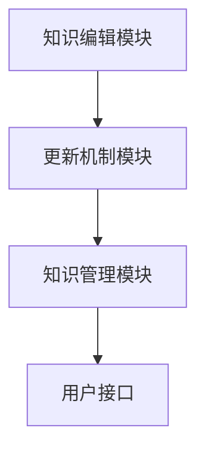
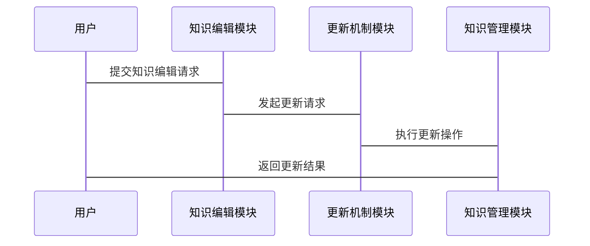

                 


# AI Agent的知识编辑与更新机制设计

> 关键词：AI Agent, 知识编辑, 更新机制, 数学模型, 算法实现, 系统架构

> 摘要：本文系统地探讨了AI Agent的知识编辑与更新机制设计，从核心概念到算法实现，从系统架构到项目实战，全面剖析了知识编辑与更新机制的原理、方法和应用。文章内容涵盖了知识表示、编辑与更新的数学模型、算法实现、系统架构设计、项目实战以及最佳实践等方面，为AI Agent的设计和实现提供了深入的理论支持和实践指导。

---

## 第一章: AI Agent概述

### 1.1 AI Agent的基本概念
#### 1.1.1 什么是AI Agent
AI Agent（人工智能代理）是指能够感知环境、自主决策并执行任务的智能实体。AI Agent可以通过传感器获取信息，通过推理和学习做出决策，并通过执行器与环境交互。AI Agent可以是软件程序、机器人或其他智能系统。

#### 1.1.2 AI Agent的分类
AI Agent可以根据功能、智能水平和应用场景进行分类：
1. **简单反射型Agent**：基于简单的规则做出反应。
2. **基于模型的反射型Agent**：利用内部模型进行推理和决策。
3. **目标驱动型Agent**：根据目标驱动行为。
4. **实用驱动型Agent**：基于效用函数优化决策。
5. **学习型Agent**：通过学习提升智能水平。

#### 1.1.3 AI Agent的核心特点
AI Agent的核心特点包括自主性、反应性、目标驱动性和智能性。自主性指AI Agent能够独立运作；反应性指能够感知环境并实时响应；目标驱动性指基于目标进行决策；智能性指具备推理、学习和适应能力。

### 1.2 知识编辑与更新机制的背景
#### 1.2.1 知识编辑的定义与作用
知识编辑是指将知识从一种形式转换为另一种形式，以便更好地存储、管理和使用。知识编辑的作用包括知识清洗、知识融合和知识表示。

#### 1.2.2 更新机制的重要性
更新机制是指在知识发生变化时，及时对知识进行调整和更新。更新机制的重要性体现在数据的实时性、准确性和一致性上。

#### 1.2.3 问题背景与挑战
随着AI Agent应用场景的扩展，知识编辑与更新机制的设计面临以下挑战：
1. **知识的动态变化**：环境中的知识不断变化，需要实时更新。
2. **知识的复杂性**：知识的结构复杂，编辑与更新的难度大。
3. **知识的准确性**：如何保证知识编辑与更新的准确性是关键问题。

---

## 第二章: 知识编辑与更新机制的核心概念

### 2.1 知识编辑的原理
#### 2.1.1 知识表示方法
知识表示是知识编辑的基础。常用的知识表示方法包括：
1. **符号表示法**：使用符号和规则表示知识。
2. **向量表示法**：使用向量空间模型表示知识。
3. **图表示法**：使用图结构表示知识。

#### 2.1.2 知识抽取与处理流程
知识抽取与处理流程包括：
1. **数据获取**：从数据源获取原始数据。
2. **数据清洗**：去除噪声和冗余数据。
3. **知识抽取**：从数据中提取有用的知识。
4. **知识融合**：将多个来源的知识进行整合。
5. **知识校正**：对知识进行验证和修正。

#### 2.1.3 知识存储与管理
知识存储与管理需要考虑存储结构和管理策略。常用的知识存储结构包括数据库、知识图谱和分布式存储。

### 2.2 更新机制的设计原则
#### 2.2.1 动态更新的必要性
动态更新是指在运行过程中实时更新知识。动态更新的必要性体现在应对环境变化和提升系统性能。

#### 2.2.2 更新机制的分类
更新机制可以根据触发条件和更新策略进行分类：
1. **基于规则的更新机制**：根据预定义的规则进行更新。
2. **基于事件的更新机制**：根据特定事件触发更新。
3. **基于反馈的更新机制**：根据系统反馈进行更新。

#### 2.2.3 更新策略的选择
更新策略的选择需要考虑系统的实时性、准确性和资源消耗。常用策略包括全量更新、增量更新和按需更新。

---

## 第三章: 知识编辑与更新机制的数学模型

### 3.1 知识表示的数学模型
#### 3.1.1 向量空间模型
向量空间模型将知识表示为向量空间中的点。例如，文本表示可以使用词向量模型（如Word2Vec）。

$$
\text{词向量表示} = \sum_{i=1}^{n} w_i \cdot v_i
$$

其中，$w_i$ 是第$i$个词的重要性，$v_i$ 是第$i$个词的向量。

#### 3.1.2 图结构模型
图结构模型将知识表示为节点和边的图结构。例如，知识图谱中的实体和关系可以用图结构表示。

$$
\text{图结构表示} = \{ (e_1, r_1, e_2), (e_2, r_2, e_3), \ldots \}
$$

其中，$e_i$ 是实体，$r_i$ 是关系。

#### 3.1.3 概率模型
概率模型将知识表示为概率分布。例如，贝叶斯网络可以用概率分布表示知识。

$$
P(A|B) = \frac{P(B|A)P(A)}{P(B)}
$$

### 3.2 更新机制的数学公式
#### 3.2.1 基于概率的更新公式
基于概率的更新公式可以用于知识的概率更新。例如，贝叶斯更新公式：

$$
P(A|B) = \frac{P(B|A)P(A)}{P(B)}
$$

#### 3.2.2 基于向量的相似度计算
基于向量的相似度计算可以用于向量空间模型的更新。例如，余弦相似度：

$$
\text{相似度} = \frac{\vec{A} \cdot \vec{B}}{|\vec{A}| |\vec{B}|}
$$

#### 3.2.3 基于图的传播模型
基于图的传播模型可以用于图结构模型的更新。例如，标签传播算法：

$$
f^{(t+1)}(v) = \frac{\sum_{u \in N(v)} f^{(t)}(u)}{|N(v)|}
$$

---

## 第四章: 知识编辑与更新机制的算法实现

### 4.1 知识编辑算法
#### 4.1.1 知识抽取算法
知识抽取算法包括文本抽取、模式匹配和特征提取。例如，使用正则表达式从文本中抽取特定信息。

#### 4.1.2 知识融合算法
知识融合算法包括数据清洗、冲突检测和知识整合。例如，使用图数据融合算法将多个来源的知识整合到一个知识图谱中。

#### 4.1.3 知识校正算法
知识校正算法包括语法校正、语义校正和逻辑校正。例如，使用自然语言处理技术对文本进行语法和语义校正。

### 4.2 更新机制算法
#### 4.2.1 基于规则的更新算法
基于规则的更新算法根据预定义的规则进行更新。例如，使用触发器和动作规则进行更新。

#### 4.2.2 基于机器学习的更新算法
基于机器学习的更新算法使用机器学习模型进行预测和更新。例如，使用回归模型预测知识的变化。

#### 4.2.3 基于反馈的自适应更新算法
基于反馈的自适应更新算法根据系统反馈进行自适应更新。例如，使用强化学习算法根据反馈调整更新策略。

---

## 第五章: 系统架构与设计

### 5.1 系统功能设计
#### 5.1.1 知识编辑模块
知识编辑模块负责知识的抽取、融合和校正。例如，从文本中抽取实体和关系。

#### 5.1.2 更新机制模块
更新机制模块负责知识的动态更新。例如，根据事件触发更新知识图谱。

#### 5.1.3 知识管理模块
知识管理模块负责知识的存储和管理。例如，将知识存储到数据库或知识图谱中。

### 5.2 系统架构图


### 5.3 接口设计与交互流程
#### 5.3.1 接口定义
接口定义包括API接口和数据格式。例如，提供RESTful API接口进行知识编辑和更新。

#### 5.3.2 交互流程图


---

## 第六章: 项目实战

### 6.1 环境安装
项目实战需要安装必要的工具和库。例如，安装Python、TensorFlow和Keras等。

### 6.2 核心代码实现
以下是知识编辑与更新机制的核心代码示例：

```python
import numpy as np

class KnowledgeEditor:
    def __init__(self):
        self.knowledge_base = {}

    def update_knowledge(self, key, value):
        self.knowledge_base[key] = value

    def get_knowledge(self, key):
        return self.knowledge_base.get(key, None)

# 示例用法
editor = KnowledgeEditor()
editor.update_knowledge("temperature", 25)
print(editor.get_knowledge("temperature"))  # 输出：25
```

### 6.3 案例分析
案例分析包括实际应用场景和案例解读。例如，AI Agent在智能客服中的应用。

### 6.4 项目总结
项目总结包括项目成果、经验教训和未来改进方向。

---

## 第七章: 最佳实践与总结

### 7.1 最佳实践
最佳实践包括设计原则、代码规范和性能优化技巧。

### 7.2 小结
小结总结了知识编辑与更新机制设计的核心内容和关键点。

### 7.3 注意事项
注意事项包括系统维护、安全性和可扩展性问题。

### 7.4 拓展阅读
拓展阅读推荐相关领域的书籍和论文，供读者进一步学习。

---

## 作者：AI天才研究院/AI Genius Institute & 禅与计算机程序设计艺术 /Zen And The Art of Computer Programming

---

以上是《AI Agent的知识编辑与更新机制设计》的完整目录和内容框架，涵盖了从基础概念到算法实现、系统设计再到项目实战的全过程。通过本文，读者可以系统地了解AI Agent的知识编辑与更新机制设计的核心内容和方法，为实际应用提供理论支持和实践指导。

