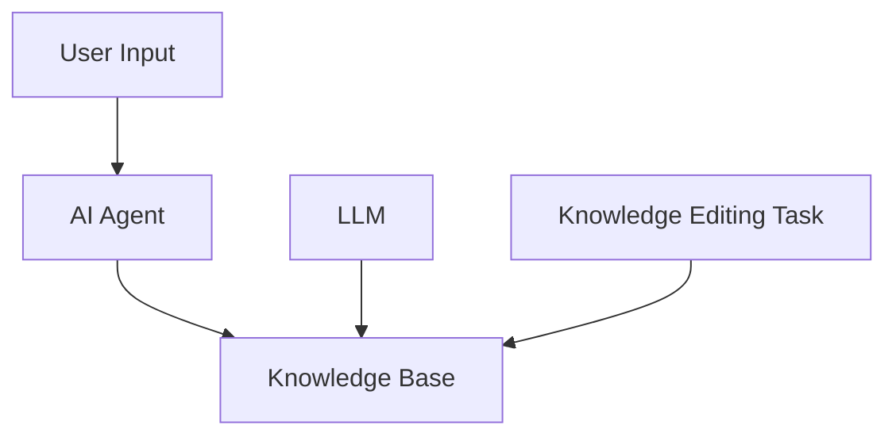
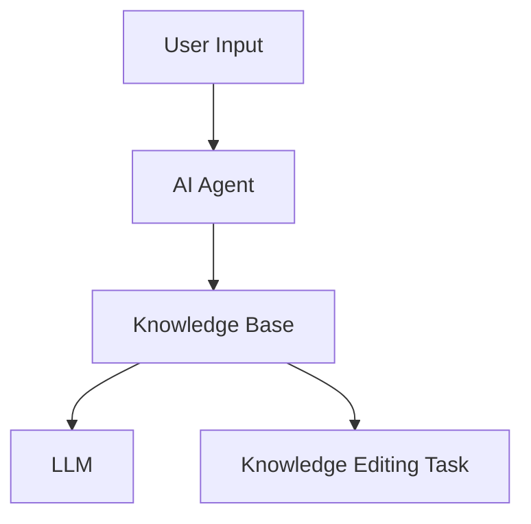
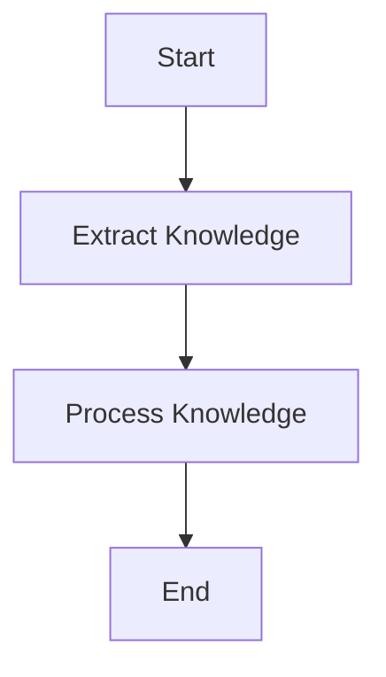
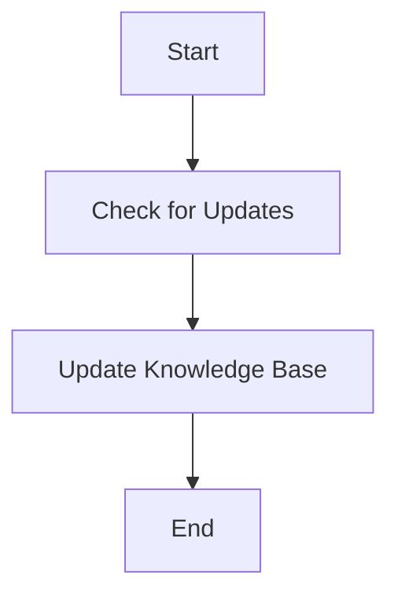
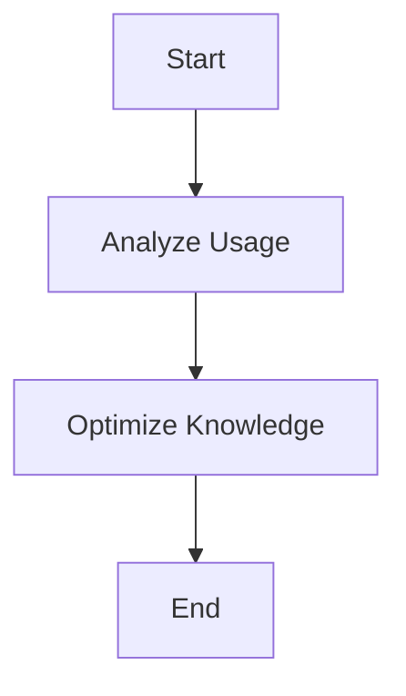
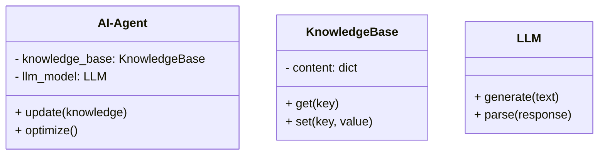
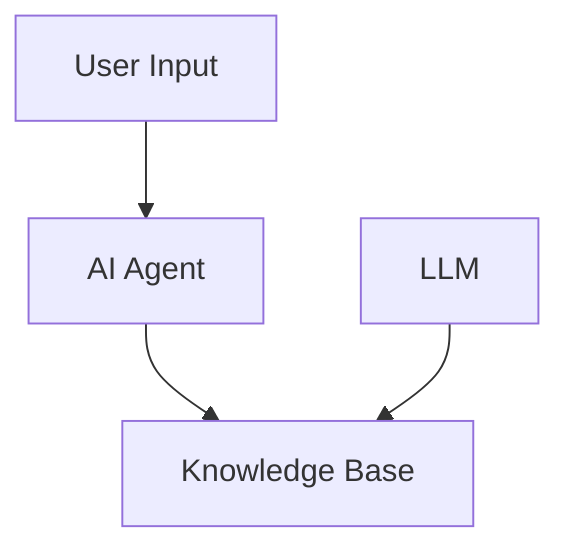
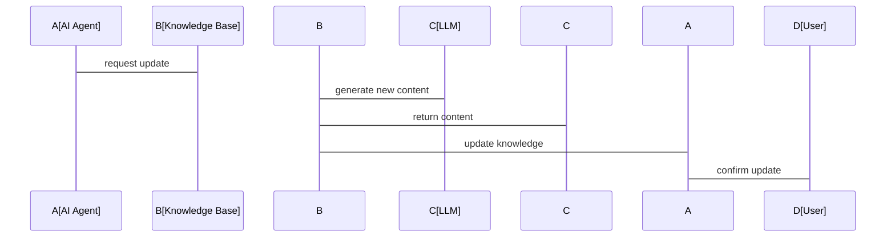

                 


# AI Agent的知识编辑系统：动态管理LLM的知识库

> 关键词：AI Agent，知识编辑系统，LLM，动态知识库，知识管理

> 摘要：本文详细探讨了AI Agent在知识编辑系统中的应用，特别是如何动态管理大型语言模型（LLM）的知识库。通过分析背景、核心概念、算法原理、系统架构以及实际案例，本文为读者提供了一个全面的理解框架，帮助他们在实际项目中有效利用AI Agent来优化知识库的动态管理。

---

## 第一部分: AI Agent的知识编辑系统背景与核心概念

### 第1章: AI Agent与知识编辑系统概述

#### 1.1 问题背景

- **1.1.1 当前知识管理的挑战**  
  知识库的动态更新需求日益增长，传统的静态知识管理方法难以应对快速变化的信息环境。如何高效地管理和更新知识库成为一大挑战。

- **1.1.2 LLM知识库的动态管理需求**  
  大型语言模型（LLM）的知识库需要实时更新以保持准确性，但动态管理的复杂性使得传统方法难以满足需求。

- **1.1.3 AI Agent在知识管理中的作用**  
  AI Agent通过自动化和智能化的方式，能够有效解决知识库动态管理中的诸多问题。

#### 1.2 问题描述

- **1.2.1 知识编辑系统的定义**  
  知识编辑系统是一种利用AI Agent对知识库进行动态更新和管理的系统。

- **1.2.2 知识库动态管理的核心问题**  
  包括知识的实时更新、版本控制、冲突解决等。

- **1.2.3 AI Agent在知识编辑中的任务**  
  包括知识抽取、更新、验证和优化等任务。

#### 1.3 解决方案

- **1.3.1 AI Agent的知识编辑能力**  
  AI Agent能够自动识别和更新知识库中的信息。

- **1.3.2 动态知识库管理的实现路径**  
  通过AI Agent实现知识的实时更新和维护。

- **1.3.3 系统架构的设计思路**  
  结构化设计，确保系统的高效性和可扩展性。

#### 1.4 边界与外延

- **1.4.1 知识编辑系统的边界**  
  明确系统的功能范围和接口。

- **1.4.2 系统的外延与扩展性**  
  系统应具备良好的扩展性，支持未来的功能扩展。

- **1.4.3 与相关系统的接口关系**  
  明确与其他系统的接口和数据交换方式。

#### 1.5 核心概念结构

- **1.5.1 核心要素组成**  
  包括AI Agent、知识库、LLM模型等。

- **1.5.2 系统功能模块**  
  包括知识抽取、更新、验证、优化等功能模块。

- **1.5.3 实体关系图**



---

### 第2章: 核心概念与联系

#### 2.1 AI Agent的核心原理

- **2.1.1 AI Agent的基本概念**  
  AI Agent是一种能够感知环境并采取行动以实现目标的智能实体。

- **2.1.2 知识编辑系统的功能模块**  
  包括知识抽取、动态更新和自适应优化模块。

- **2.1.3 LLM与知识库的交互机制**  
  LLM通过API与知识库进行交互，AI Agent负责协调和管理。

#### 2.2 核心概念对比分析

- **2.2.1 AI Agent与传统知识管理系统对比**  
  | 特性          | AI Agent知识编辑系统 | 传统知识管理系统 |
  |---------------|-----------------------|------------------|
  | 自动化能力     | 高                   | 低               |
  | 实时性         | 高                   | 低               |
  | 智能性         | 高                   | 低               |

- **2.2.2 动态知识库与静态知识库的差异**  
  动态知识库能够实时更新，而静态知识库则无法做到这一点。

- **2.2.3 不同LLM模型的特性对比**  
  比较不同LLM模型在知识编辑系统中的表现，如准确性、响应速度等。

#### 2.3 ER实体关系图



---

## 第三部分: 算法原理与数学模型

### 第3章: 算法原理

#### 3.1 知识抽取与处理算法

- **3.1.1 知识抽取算法原理**  
  使用自然语言处理技术从文本中提取知识。

- **3.1.2 算法流程图**



- **3.1.3 Python实现代码**

```python
def extract_knowledge(text):
    # 使用NLP模型提取知识
    knowledge = model(text)
    return knowledge
```

- **3.1.4 算法的数学模型**

$$
\text{Knowledge} = f(\text{Text})
$$

---

#### 3.2 动态知识库更新算法

- **3.2.1 动态更新算法原理**  
  使用增量式更新方法，仅更新变化的部分。

- **3.2.2 算法流程图**



- **3.2.3 Python实现代码**

```python
def update_knowledge_base():
    # 检查更新
    if has_updates():
        # 应用更新
        apply_updates()
```

- **3.2.4 算法的数学模型**

$$
\Delta \text{Knowledge} = g(\text{Updates})
$$

---

#### 3.3 自适应优化算法

- **3.3.1 自适应优化算法原理**  
  根据使用情况调整知识库的结构和内容。

- **3.3.2 算法流程图**



- **3.3.3 Python实现代码**

```python
def optimize_knowledge():
    # 分析使用情况
    usage = analyze_usage()
    # 进行优化
    optimize(usage)
```

- **3.3.4 算法的数学模型**

$$
\text{Optimized Knowledge} = h(\text{Usage})
$$

---

## 第四部分: 系统分析与架构设计

### 第4章: 系统分析与架构设计

#### 4.1 问题场景介绍

- **4.1.1 知识库动态管理的场景**  
  包括实时更新、版本控制、冲突解决等。

- **4.1.2 项目介绍**  
  介绍AI Agent知识编辑系统的开发背景和目标。

#### 4.2 系统功能设计

- **4.2.1 领域模型设计**



- **4.2.2 系统架构设计**



- **4.2.3 接口设计**  
  包括AI Agent与知识库的接口、AI Agent与LLM的接口等。

- **4.2.4 交互序列图**



---

## 第五部分: 项目实战

### 第5章: 项目实战

#### 5.1 环境安装

- **5.1.1 系统要求**  
  需要安装Python、相关库和工具。

- **5.1.2 安装步骤**

```bash
pip install numpy
pip install transformers
pip install matplotlib
```

#### 5.2 核心代码实现

- **5.2.1 知识抽取代码**

```python
import numpy as np
from transformers import Llama

model = Llama()
def extract_knowledge(text):
    return model.generate(text)
```

- **5.2.2 知识更新代码**

```python
def update_knowledge_base(old_knowledge, new_knowledge):
    return {**old_knowledge, **new_knowledge}
```

- **5.2.3 优化代码**

```python
def optimize(knowledge):
    return sorted(knowledge, key=lambda x: x['timestamp'])
```

#### 5.3 代码解读与分析

- **5.3.1 知识抽取代码解读**  
  使用LLama模型生成新的知识内容。

- **5.3.2 知识更新代码解读**  
  合并旧知识和新知识，生成新的知识库。

- **5.3.3 优化代码解读**  
  根据时间戳对知识进行排序，优化知识库的结构。

#### 5.4 实际案例分析

- **5.4.1 案例背景**  
  假设有一个实时更新的知识库，需要每天更新一次。

- **5.4.2 案例分析**  
  使用AI Agent自动抽取新知识，更新知识库，并优化其结构。

---

## 第六部分: 最佳实践与结语

### 第6章: 最佳实践

#### 6.1 最佳实践 Tips

- 定期备份知识库，防止数据丢失。
- 使用可靠的LLM模型，确保知识的准确性。
- 定期监控系统性能，优化运行效率。

#### 6.2 小结

- 本文详细探讨了AI Agent在知识编辑系统中的应用，特别是动态管理LLM的知识库。

#### 6.3 注意事项

- 确保系统的安全性和稳定性。
- 定期更新算法，适应新的需求。
- 保持系统的可扩展性，方便未来的功能扩展。

#### 6.4 拓展阅读

- 推荐阅读《Large Language Models in AI》。
- 参考GitHub上的相关项目，学习更多实现细节。

---

## 作者

作者：AI天才研究院/AI Genius Institute & 禅与计算机程序设计艺术 /Zen And The Art of Computer Programming

---

这篇文章详细介绍了AI Agent在知识编辑系统中的应用，通过背景分析、算法原理、系统设计和项目实战，为读者提供了全面的理论和实践指导。希望本文能为相关领域的研究和应用提供有价值的参考。

