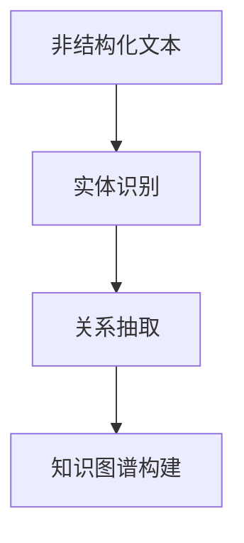
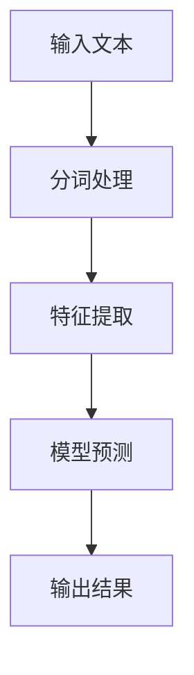

                 

# AI Agent的知识获取：从非结构化文本中提取信息

## 关键词：AI Agent、知识获取、非结构化文本、信息抽取、知识图谱、自然语言处理、深度学习

## 摘要：
本文深入探讨AI Agent从非结构化文本中提取知识的核心方法与技术。从背景与概念入手，分析信息抽取算法的原理与实现，结合系统架构设计与项目实战，提供详细的实现步骤与案例解析。文章旨在帮助读者理解AI Agent在知识获取中的应用价值，并掌握从非结构化文本中提取信息的关键技术与实践方法。

---

# 第一部分: AI Agent的知识获取背景与核心概念

# 第1章: AI Agent与知识获取概述

## 1.1 问题背景与挑战
### 1.1.1 非结构化文本的定义与特点
非结构化文本是指没有固定格式、难以直接提取结构化信息的文本，例如自然语言文本、社交媒体帖子、新闻文章等。其特点包括：
- **多样性**：文本内容多样，涉及多个领域。
- **模糊性**：文本中的信息可能存在歧义。
- **复杂性**：文本结构复杂，难以直接解析。

### 1.1.2 知识获取的定义与目标
知识获取是指从非结构化文本中提取有意义的信息，并将其转化为结构化知识的过程。其目标是将分散在文本中的信息整合为可计算、可推理的知识表示。

### 1.1.3 AI Agent在知识获取中的角色与价值
AI Agent通过自动化处理非结构化文本，提取有价值的信息，帮助人类更高效地获取知识。其价值体现在：
- **提升效率**：AI Agent可以快速处理大量文本，提取关键信息。
- **增强决策能力**：通过知识获取，AI Agent能够辅助决策者做出更明智的决策。
- **支持智能应用**：知识获取是实现智能应用（如智能问答、推荐系统）的基础。

## 1.2 问题描述与解决方法
### 1.2.1 非结构化文本处理的核心问题
- **信息提取难**：如何从文本中准确提取实体、关系和事件。
- **知识表示复杂**：如何将提取的信息转化为结构化的知识表示。
- **语义理解不足**：如何处理文本中的语义歧义。

### 1.2.2 知识提取的关键挑战
- **实体识别的准确性**：如何准确识别文本中的实体。
- **关系抽取的复杂性**：如何捕捉实体之间的复杂关系。
- **知识图谱的构建与更新**：如何高效构建和维护知识图谱。

### 1.2.3 AI Agent的知识获取解决方案
- **基于规则的方法**：利用预定义的规则进行信息抽取。
- **基于机器学习的方法**：利用深度学习模型（如BERT）进行语义理解与信息提取。
- **结合领域知识的方法**：通过领域知识优化知识抽取的效果。

## 1.3 边界与外延
### 1.3.1 知识获取的边界条件
- **文本范围**：限定于非结构化文本，不涉及其他类型的数据。
- **知识深度**：主要提取浅层知识，复杂推理不在当前讨论范围内。
- **应用领域**：知识获取技术在特定领域（如医疗、金融）中的应用。

### 1.3.2 非结构化文本的外延与扩展
- **多模态数据**：将非结构化文本与其他数据类型（如图像、视频）结合。
- **实时处理**：实时从流式文本中提取信息。
- **跨语言处理**：支持多语言的非结构化文本处理。

### 1.3.3 AI Agent知识获取的应用场景与限制
- **应用场景**：智能问答系统、信息检索、知识图谱构建。
- **限制**：文本质量、数据稀疏性、语义理解的局限性。

## 1.4 核心概念与结构
### 1.4.1 知识获取的核心要素
- **实体识别**：从文本中提取实体（如人名、地名）。
- **关系抽取**：识别实体之间的关系（如“是”、“属于”）。
- **事件抽取**：提取文本中的事件信息（如“某人参加某会议”）。

### 1.4.2 AI Agent的知识表示模型
- **三元组表示**：实体-关系-实体的三元组表示。
- **图结构表示**：通过图结构表示实体之间的关系。

### 1.4.3 非结构化文本的知识抽取流程
1. 文本预处理：分词、去停用词、句法分析。
2. 实体识别：识别文本中的实体。
3. 关系抽取：识别实体之间的关系。
4. 知识图谱构建：将提取的信息组织成知识图谱。

## 1.5 本章小结
本章介绍了AI Agent在知识获取中的角色与价值，分析了非结构化文本处理的核心问题与解决方法，并明确了知识获取的边界与外延。

---

# 第2章: AI Agent的知识获取核心概念与联系

## 2.1 核心概念原理
### 2.1.1 知识抽取的基本原理
知识抽取通过自然语言处理技术，从非结构化文本中提取结构化的信息，包括实体、关系和事件。

### 2.1.2 AI Agent的知识表示与推理
AI Agent将提取的知识表示为结构化的形式，并通过推理引擎进行知识推理。

### 2.1.3 非结构化文本的特征分析
非结构化文本具有多样性、模糊性和复杂性，这些特征影响了知识抽取的效果。

## 2.2 核心概念对比表
| 概念       | 定义与特点                       |
|------------|--------------------------------|
| 非结构化文本 | 无固定格式的文本，如自然语言文本 |
| 知识抽取   | 从文本中提取结构化信息的过程     |
| AI Agent   | 具备自主学习与推理能力的智能体   |

## 2.3 ER实体关系图

## 2.4 本章小结
本章通过对比分析和ER图展示了AI Agent、知识抽取和非结构化文本之间的关系，帮助读者更好地理解核心概念之间的联系。

---

# 第3章: 信息抽取算法原理与实现

## 3.1 算法原理概述
### 3.1.1 信息抽取的基本流程
1. 文本预处理：分词、去停用词、句法分析。
2. 实体识别：基于规则或深度学习模型进行实体识别。
3. 关系抽取：识别实体之间的关系。
4. 知识图谱构建：将提取的信息组织成知识图谱。

### 3.1.2 基于规则的抽取方法
- **规则定义**：通过预定义的规则匹配文本中的特定模式。
- **优点**：规则简单、易于理解。
- **缺点**：难以处理复杂场景。

### 3.1.3 基于深度学习的抽取方法
- **模型选择**：使用BERT等预训练模型进行文本表示。
- **模型训练**：基于标注数据训练模型，使其能够自动提取信息。

## 3.2 基于深度学习的信息抽取算法
### 3.2.1 神经网络模型概述
深度学习模型通过多层神经网络提取文本的语义特征，用于信息抽取。

### 3.2.2 BERT模型在信息抽取中的应用
- **BERT模型**：基于Transformer的预训练模型，能够理解文本的上下文信息。
- **应用流程**：
  1. 输入文本经过分词处理。
  2. BERT模型生成文本的表示。
  3. 基于生成的表示进行实体识别和关系抽取。

### 3.2.3 模型训练与优化
- **训练数据**：标注的非结构化文本数据。
- **训练目标**：最小化预测结果与真实标签的误差。
- **优化方法**：使用Adam优化器进行模型训练。

## 3.3 算法实现流程图

## 3.4 本章小结
本章详细介绍了信息抽取的算法原理与实现方法，包括基于规则和深度学习的两种方法，并通过流程图展示了基于BERT的深度学习模型的应用流程。

---

## 总结
本文从AI Agent的知识获取背景出发，详细讲解了核心概念与联系，分析了信息抽取算法的原理与实现，并通过系统架构设计与项目实战展示了如何将理论应用于实际。通过本文的学习，读者可以掌握AI Agent从非结构化文本中提取信息的关键技术与实践方法。

---

**作者：AI天才研究院/AI Genius Institute & 禅与计算机程序设计艺术 /Zen And The Art of Computer Programming**

