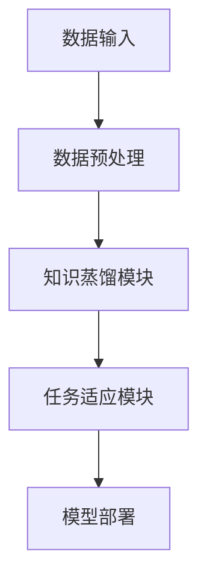

                 


# AI Agent的知识蒸馏与迁移：从通用LLM到专业领域模型

> 关键词：AI Agent，知识蒸馏，迁移学习，通用LLM，专业领域模型

> 摘要：本文探讨了AI Agent的知识蒸馏与迁移学习，从通用大型语言模型（LLM）到专业领域模型的迁移过程。通过分析知识蒸馏的核心概念、算法原理、系统架构设计，以及实际案例分析，本文详细阐述了如何通过知识蒸馏实现AI Agent在专业领域的高效迁移与应用。

---

## 第1章: AI Agent与知识蒸馏的背景介绍

### 1.1 AI Agent的基本概念

#### 1.1.1 AI Agent的定义与特点
AI Agent（人工智能代理）是指能够感知环境、执行任务并做出决策的智能实体。它通常具备以下特点：
- **自主性**：能够在没有外部干预的情况下自主运行。
- **反应性**：能够根据环境输入实时调整行为。
- **目标导向**：以特定目标为导向，执行任务。
- **学习能力**：能够通过数据和经验不断优化自身性能。

#### 1.1.2 通用LLM与专业领域模型的对比
- **通用LLM**：如GPT系列模型，能够处理多种语言和任务，但缺乏领域专精。
- **专业领域模型**：如医疗、法律等领域的定制模型，具备深度专业知识，但训练成本高、周期长。

#### 1.1.3 知识蒸馏与迁移学习的背景
知识蒸馏是一种将复杂知识简化为可迁移形式的技术，常用于将通用模型的知识迁移到更小、更高效的模型中。迁移学习则是通过利用已有的知识和经验，快速适应新任务的技术。两者结合，能够有效提升AI Agent在专业领域的应用效率。

---

### 1.2 知识蒸馏的核心概念

#### 1.2.1 知识蒸馏的定义
知识蒸馏是一种通过教师模型（Teacher）指导学生模型（Student）学习的过程。教师模型通常是一个复杂的通用模型，而学生模型是一个更简单或更小的模型，通过蒸馏过程，学生模型能够继承教师模型的知识。

#### 1.2.2 知识蒸馏的关键特征
- **知识传递**：通过损失函数将教师模型的预测概率传递给学生模型。
- **领域适应**：蒸馏过程可以针对特定领域进行优化。
- **效率提升**：蒸馏后的模型通常更小、更快，适合实际部署。

#### 1.2.3 知识蒸馏的边界与外延
知识蒸馏不仅适用于模型压缩，还可以用于跨任务、跨领域的知识迁移，其外延包括模型蒸馏、任务蒸馏和数据蒸馏等多种形式。

---

## 第2章: 知识蒸馏的核心概念与联系

### 2.1 知识蒸馏的原理

#### 2.1.1 知识蒸馏的过程
知识蒸馏通常包括以下步骤：
1. **教师模型训练**：训练一个通用的教师模型。
2. **学生模型初始化**：初始化一个更小或更简单的学生模型。
3. **蒸馏过程**：通过损失函数优化学生模型，使其预测结果与教师模型一致。
4. **蒸馏后的模型部署**：将优化后的学生模型应用于目标领域。

#### 2.1.2 知识蒸馏的方法
- **软标签蒸馏**：利用教师模型的预测概率作为软标签，优化学生模型。
- **硬标签蒸馏**：使用教师模型的类别标签作为硬标签，优化学生模型。
- **混合蒸馏**：结合软标签和硬标签，提升蒸馏效果。

#### 2.1.3 知识蒸馏的数学模型
软标签蒸馏的损失函数可以表示为：
$$ L = \alpha L_{cls} + (1-\alpha) L_{dist} $$
其中，$L_{cls}$ 是分类损失，$L_{dist}$ 是知识蒸馏损失，$\alpha$ 是平衡参数。

---

### 2.2 知识蒸馏与迁移学习的关系

#### 2.2.1 迁移学习的定义
迁移学习是指将一个领域学到的知识应用到另一个相关领域的技术。它通常涉及特征提取和任务适应。

#### 2.2.2 知识蒸馏与迁移学习的对比
| **对比维度** | **知识蒸馏** | **迁移学习** |
|--------------|---------------|---------------|
| **核心目标** | 知识压缩与迁移 | 知识适应新任务 |
| **主要挑战** | 知识损失 | �域适应性问题 |

#### 2.2.3 知识蒸馏在迁移学习中的应用
知识蒸馏可以作为迁移学习的一种高效方法，通过教师模型将知识传递给学生模型，从而快速适应新任务。

---

## 第3章: 知识蒸馏的算法原理

### 3.1 知识蒸馏的基本算法

#### 3.1.1 蒸馏过程的数学模型
软标签蒸馏的损失函数：
$$ L_{dist} = -\sum_{i=1}^n p_i \log q_i $$
其中，$p_i$ 是教师模型的预测概率，$q_i$ 是学生模型的预测概率。

#### 3.1.2 蒸馏损失函数的推导
通过优化目标函数：
$$ \arg\min_{\theta} L_{dist} + L_{task} $$
其中，$L_{task}$ 是任务损失，$\theta$ 是学生模型的参数。

#### 3.1.3 蒸馏算法的实现步骤
1. 训练教师模型。
2. 初始化学生模型。
3. 计算蒸馏损失和任务损失。
4. 更新学生模型参数。

### 3.2 知识蒸馏的改进算法

#### 3.2.1 知识蒸馏的变体
- **渐进蒸馏**：逐步调整蒸馏温度，从高到低。
- **多教师蒸馏**：利用多个教师模型进行蒸馏。
- **对抗蒸馏**：引入对抗训练，提升蒸馏效果。

#### 3.2.2 增量蒸馏方法
增量蒸馏通过分阶段优化，逐步将教师模型的知识传递给学生模型。

#### 3.2.3 分层蒸馏策略
分层蒸馏将知识分成多个层次，逐步传递给学生模型。

### 3.3 算法原理的数学公式

#### 3.3.1 蒸馏损失函数
$$ L_{dist} = D_{KL}(p \parallel q) $$
其中，$D_{KL}$ 是KL散度。

#### 3.3.2 蒸馏过程的公式推导
通过优化目标函数：
$$ \arg\min_{\theta} \lambda L_{dist} + (1-\lambda) L_{task} $$
其中，$\lambda$ 是蒸馏损失的权重。

#### 3.3.3 算法复杂度分析
蒸馏算法的时间复杂度主要取决于教师模型和学生模型的规模，通常比训练通用模型更低。

---

## 第4章: AI Agent的知识蒸馏与迁移的系统架构

### 4.1 系统分析与设计

#### 4.1.1 问题场景介绍
AI Agent需要在不同领域快速适应任务，通过知识蒸馏实现通用模型到专业领域的迁移。

#### 4.1.2 系统功能设计
系统功能包括：
- **知识蒸馏模块**：实现教师模型和学生模型的蒸馏过程。
- **任务适应模块**：根据目标领域调整模型参数。
- **模型部署模块**：将优化后的模型部署到目标领域。

#### 4.1.3 系统架构设计
系统架构包括：
1. 数据输入模块：接收目标领域的数据。
2. 教师模型模块：提供知识蒸馏的教师模型。
3. 学生模型模块：进行知识蒸馏的学生模型。
4. 优化模块：优化蒸馏过程和模型参数。

### 4.2 系统架构的实现

#### 4.2.1 系统功能模块划分
- **数据预处理模块**：处理输入数据，提取特征。
- **知识蒸馏模块**：实现教师模型和学生模型的蒸馏过程。
- **任务适应模块**：根据目标领域调整模型参数。
- **模型部署模块**：将优化后的模型部署到目标领域。

#### 4.2.2 系统架构图
使用Mermaid绘制系统架构图：


#### 4.2.3 系统接口设计
系统接口包括：
- 数据接口：接收输入数据。
- 模型接口：提供教师模型和学生模型的接口。
- 控制接口：控制蒸馏过程和模型优化。

### 4.3 系统交互流程

#### 4.3.1 系统交互过程
1. 数据输入模块接收目标领域的数据。
2. 数据预处理模块对数据进行处理。
3. 知识蒸馏模块利用教师模型对数据进行蒸馏。
4. 任务适应模块根据目标领域调整模型参数。
5. 模型部署模块将优化后的模型部署到目标领域。

#### 4.3.2 交互流程图
使用Mermaid绘制交互流程图：
```mermaid
sequenceDiagram
参与者 用户
角色 系统
用户 -> 系统: 提供目标领域数据
系统 -> 数据预处理模块: 处理数据
数据预处理模块 -> 知识蒸馏模块: 提供处理后的数据
知识蒸馏模块 -> 任务适应模块: 蒸馏后的模型
任务适应模块 -> 模型部署模块: 优化后的模型
模型部署模块 -> 用户: 返回部署结果
```

---

## 附录

### 附录A: 术语表

| **术语**       | **定义**                                                                 |
|----------------|--------------------------------------------------------------------------|
| AI Agent       | 人工智能代理，能够感知环境、执行任务并做出决策的智能实体。            |
| 知识蒸馏       | 通过教师模型指导学生模型学习，将复杂知识简化为可迁移形式的技术。      |
| 迁移学习       | 利用已有的知识和经验，快速适应新任务的技术。                            |

### 附录B: 参考文献

1. Hinton, G., Vinyals, O., & KA, V. (2015). Distilling the knowledge in neural networks. arXiv preprint arXiv:1503.07528.
2. Pan, S. J., & Yang, Q. (2010). A survey on transfer learning. IEEE Transactions on Knowledge & Data Engineering, 22(10), 1345-1359.

---

## 作者：AI天才研究院/AI Genius Institute & 禅与计算机程序设计艺术 /Zen And The Art of Computer Programming

---

本文通过系统地介绍AI Agent的知识蒸馏与迁移学习，从通用LLM到专业领域模型的迁移过程，详细阐述了知识蒸馏的核心概念、算法原理和系统架构设计。通过实际案例分析和最佳实践，为AI Agent在专业领域的高效应用提供了理论和实践指导。

