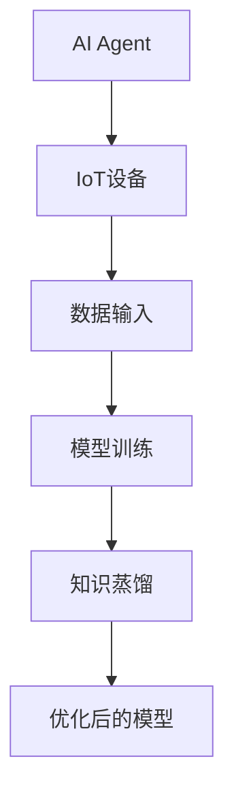
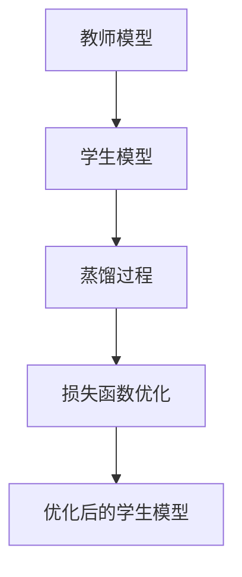
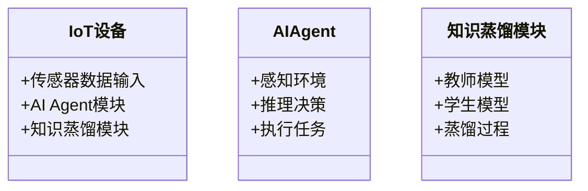
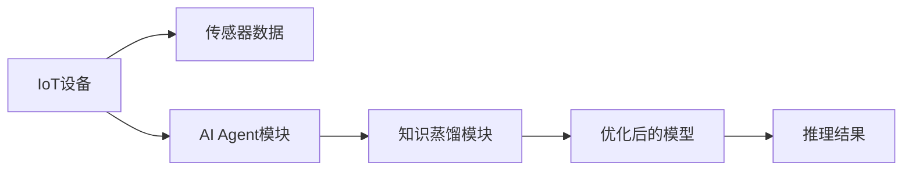
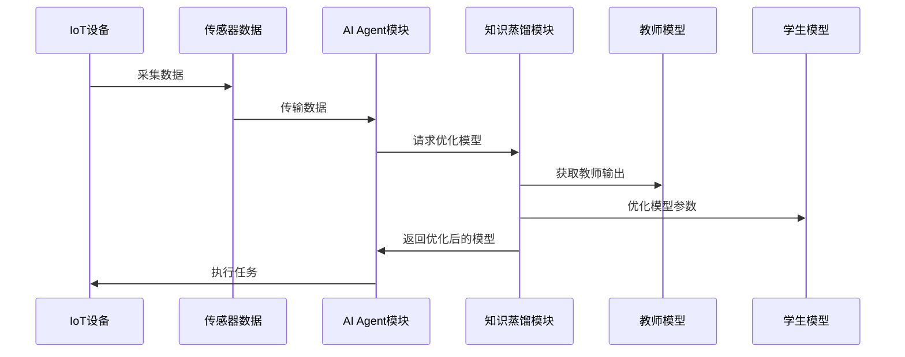

                 


# AI Agent的知识蒸馏在IoT设备中的应用

> 关键词：AI Agent、知识蒸馏、IoT设备、模型压缩、智能优化

> 摘要：本文探讨了AI Agent的知识蒸馏技术在物联网设备中的应用，详细分析了知识蒸馏的基本原理、算法流程、系统架构，并通过实际案例展示了其在IoT环境中的优势与挑战。文章最后总结了知识蒸馏在IoT中的最佳实践和未来发展方向。

---

## 第1章: 背景介绍

### 1.1 问题背景

#### 1.1.1 IoT设备的资源限制
物联网（IoT）设备通常面临计算资源有限的问题，如内存、处理能力和能源。这些限制使得在IoT设备上部署复杂的AI模型变得困难。

#### 1.1.2 AI Agent在IoT中的作用
AI Agent是一种具备自主决策能力的智能体，能够在IoT环境中实时处理数据、做出决策并执行任务。然而，其在IoT设备中的应用受到资源限制的影响。

#### 1.1.3 知识蒸馏技术的引入
知识蒸馏是一种将大型模型的知识迁移到较小模型的技术，能够有效降低模型的资源需求，使其更适合在IoT设备上运行。

---

### 1.2 问题描述

#### 1.2.1 IoT设备中AI模型的部署挑战
IoT设备的资源限制使得部署复杂AI模型变得困难，导致模型性能下降或响应速度变慢。

#### 1.2.2 知识蒸馏在模型压缩中的应用
通过知识蒸馏技术，可以将大型模型的知识迁移到轻量级模型中，从而在IoT设备上实现高效的推理。

#### 1.2.3 知识蒸馏的目标与意义
知识蒸馏的目标是通过优化模型结构和参数，降低模型的资源消耗，同时保持或提升模型的性能。

---

### 1.3 问题解决

#### 1.3.1 知识蒸馏的基本原理
知识蒸馏通过将教师模型的知识迁移到学生模型中，优化学生模型的参数，使其在资源受限的环境下也能表现良好。

#### 1.3.2 知识蒸馏在IoT中的具体应用
在IoT设备中，知识蒸馏可以用于优化传感器数据处理、设备管理、智能决策等任务。

#### 1.3.3 知识蒸馏的优势与局限性
优势包括降低资源消耗、提升模型性能，但其局限性在于蒸馏过程可能需要额外的计算资源。

---

### 1.4 边界与外延

#### 1.4.1 知识蒸馏与其他模型压缩技术的对比
知识蒸馏与其他模型压缩技术（如剪枝、量化）相比，更注重知识的传递和模型性能的提升。

#### 1.4.2 知识蒸馏在IoT中的适用场景
适用于资源受限但需要高性能AI推理的场景，如智能传感器、边缘计算设备。

#### 1.4.3 知识蒸馏的未来发展
随着AI技术的进步，知识蒸馏将在IoT中得到更广泛的应用，优化模型性能和资源利用率。

---

### 1.5 核心要素组成

#### 1.5.1 知识蒸馏的核心概念
包括教师模型、学生模型、蒸馏过程、损失函数等。

#### 1.5.2 IoT设备的特点与限制
计算能力有限、内存受限、功耗敏感。

#### 1.5.3 知识蒸馏在IoT中的实现流程
从教师模型提取知识，训练学生模型，优化模型参数，部署在IoT设备上。

---

## 第2章: 核心概念与联系

### 2.1 AI Agent的基本原理

#### 2.1.1 AI Agent的定义与分类
AI Agent是具备感知环境、自主决策和执行任务能力的智能体，分为简单反射型、基于模型型、目标驱动型和效用驱动型。

#### 2.1.2 AI Agent的核心功能
包括感知、推理、决策、规划和执行。

#### 2.1.3 AI Agent在IoT中的应用案例
如智能家电控制、环境监测、智能安防等。

---

### 2.2 知识蒸馏的基本原理

#### 2.2.1 知识蒸馏的定义
知识蒸馏是一种通过教师模型指导学生模型学习，优化学生模型结构的技术。

#### 2.2.2 知识蒸馏的关键步骤
包括教师模型训练、蒸馏过程、学生模型优化。

#### 2.2.3 知识蒸馏与模型压缩的关系
知识蒸馏结合了知识传递和模型压缩，优化了模型的性能和资源利用率。

---

### 2.3 核心概念对比

#### 2.3.1 AI Agent与传统AI的区别
AI Agent具备自主决策能力，而传统AI依赖于外部控制。

#### 2.3.2 知识蒸馏与传统模型压缩技术的对比
知识蒸馏注重知识传递，而传统压缩技术注重减少模型参数。

#### 2.3.3 知识蒸馏在IoT中的独特优势
能够在资源受限的环境下优化模型性能，提升IoT设备的智能性。

---

### 2.4 ER实体关系图



---

## 第3章: 算法原理讲解

### 3.1 知识蒸馏的算法流程

#### 3.1.1 算法流程图



#### 3.1.2 Python代码示例

```python
import torch
import torch.nn as nn
import torch.optim as optim

# 定义教师模型和学生模型
class TeacherModel(nn.Module):
    def __init__(self):
        super(TeacherModel, self).__init__()
        self.layers = nn.Sequential(
            nn.Conv2d(1, 32, kernel_size=3, stride=1, padding=1),
            nn.ReLU(),
            nn.Conv2d(32, 64, kernel_size=3, stride=1, padding=1),
            nn.ReLU(),
            nn.Flatten(),
            nn.Linear(64*32*32, 10)
        )

class StudentModel(nn.Module):
    def __init__(self):
        super(StudentModel, self).__init__()
        self.layers = nn.Sequential(
            nn.Conv2d(1, 16, kernel_size=3, stride=1, padding=1),
            nn.ReLU(),
            nn.Conv2d(16, 32, kernel_size=3, stride=1, padding=1),
            nn.ReLU(),
            nn.Flatten(),
            nn.Linear(32*32*32, 10)
        )

# 定义蒸馏损失函数
class DistillationLoss(nn.Module):
    def __init__(self, T=1):
        super(DistillationLoss, self).__init__()
        self.T = T

    def forward(self, teacher_logits, student_logits, labels):
        # 计算软标签
        soft_labels = torch.nn.functional.softmax(teacher_logits / self.T, dim=1)
        # 计算蒸馏损失
        loss_kd = torch.nn.KLDivLoss(reduction='batchmean')(torch.nn.functional.log_softmax(student_logits / self.T, dim=1), soft_labels)
        # 计算分类损失
        loss_cls = nn.CrossEntropyLoss()(student_logits, labels)
        # 综合损失
        loss_total = loss_kd + loss_cls
        return loss_total

# 初始化模型和优化器
teacher_model = TeacherModel().cuda()
student_model = StudentModel().cuda()
distillation_loss = DistillationLoss(T=2)
optimizer = optim.Adam(student_model.parameters(), lr=0.001)

# 训练过程
for epoch in range(100):
    for batch_input, batch_labels in dataloader:
        teacher_logits = teacher_model(batch_input)
        student_logits = student_model(batch_input)
        loss = distillation_loss(teacher_logits, student_logits, batch_labels)
        optimizer.zero_grad()
        loss.backward()
        optimizer.step()
```

#### 3.1.3 数学模型与公式

蒸馏过程的损失函数可以表示为：
$$
L_{total} = L_{kd} + L_{cls}
$$
其中，$L_{kd}$ 是蒸馏损失，$L_{cls}$ 是分类损失。

蒸馏损失的计算公式为：
$$
L_{kd} = \frac{1}{N} \sum_{i=1}^{N} D_{KL}(P_i || Q_i)
$$
其中，$P_i$ 是教师模型的软标签，$Q_i$ 是学生模型的软标签。

---

## 第4章: 系统分析与架构设计

### 4.1 问题场景介绍

在IoT环境中，设备需要实时处理大量数据，但受限于计算能力，难以部署复杂的AI模型。通过知识蒸馏技术，可以在IoT设备上部署优化后的轻量级模型，提升设备的智能性和响应速度。

---

### 4.2 系统功能设计

#### 4.2.1 领域模型图



---

### 4.3 系统架构设计

#### 4.3.1 架构图



---

### 4.4 系统接口设计

IoT设备通过API接口与AI Agent模块交互，知识蒸馏模块负责接收教师模型的输出并优化学生模型。

---

### 4.5 系统交互流程

#### 4.5.1 交互流程图



---

## 第5章: 项目实战

### 5.1 环境安装

#### 5.1.1 安装Python和相关库
安装Python 3.8以上版本，以及PyTorch、TensorFlow、Scikit-learn等库。

```bash
pip install torch tensorflow scikit-learn
```

---

### 5.2 系统核心实现

#### 5.2.1 核心代码实现

```python
import torch
import torch.nn as nn
import torch.optim as optim

# 定义教师模型和学生模型
class TeacherModel(nn.Module):
    def __init__(self):
        super(TeacherModel, self).__init__()
        self.layers = nn.Sequential(
            nn.Conv2d(1, 32, kernel_size=3, stride=1, padding=1),
            nn.ReLU(),
            nn.Conv2d(32, 64, kernel_size=3, stride=1, padding=1),
            nn.ReLU(),
            nn.Flatten(),
            nn.Linear(64*32*32, 10)
        )

class StudentModel(nn.Module):
    def __init__(self):
        super(StudentModel, self).__init__()
        self.layers = nn.Sequential(
            nn.Conv2d(1, 16, kernel_size=3, stride=1, padding=1),
            nn.ReLU(),
            nn.Conv2d(16, 32, kernel_size=3, stride=1, padding=1),
            nn.ReLU(),
            nn.Flatten(),
            nn.Linear(32*32*32, 10)
        )

# 定义蒸馏损失函数
class DistillationLoss(nn.Module):
    def __init__(self, T=1):
        super(DistillationLoss, self).__init__()
        self.T = T

    def forward(self, teacher_logits, student_logits, labels):
        soft_labels = torch.nn.functional.softmax(teacher_logits / self.T, dim=1)
        loss_kd = torch.nn.KLDivLoss(reduction='batchmean')(torch.nn.functional.log_softmax(student_logits / self.T, dim=1), soft_labels)
        loss_cls = nn.CrossEntropyLoss()(student_logits, labels)
        return loss_kd + loss_cls

# 初始化模型和优化器
teacher_model = TeacherModel().cuda()
student_model = StudentModel().cuda()
distillation_loss = DistillationLoss(T=2)
optimizer = optim.Adam(student_model.parameters(), lr=0.001)

# 训练过程
for epoch in range(100):
    for batch_input, batch_labels in dataloader:
        teacher_logits = teacher_model(batch_input)
        student_logits = student_model(batch_input)
        loss = distillation_loss(teacher_logits, student_logits, batch_labels)
        optimizer.zero_grad()
        loss.backward()
        optimizer.step()
```

---

### 5.3 代码解读与分析

学生模型通过蒸馏过程学习教师模型的知识，优化后的模型在IoT设备上实现高效的推理。

---

### 5.4 案例分析与应用

通过具体案例展示知识蒸馏在IoT设备中的应用，如智能传感器的数据处理优化。

---

### 5.5 项目总结

总结项目成果，分析知识蒸馏在IoT中的优势和不足，展望未来发展方向。

---

## 第6章: 最佳实践

### 6.1 经验总结

在IoT设备中应用知识蒸馏时，需注意模型选择、蒸馏温度和训练数据的优化。

---

### 6.2 小结

知识蒸馏是一种有效的模型优化技术，能够在资源受限的IoT设备中提升AI Agent的性能。

---

### 6.3 注意事项

确保教师模型的质量，选择合适的蒸馏温度，避免过拟合。

---

### 6.4 拓展阅读

推荐相关文献和资源，供读者进一步学习。

---

## 附录

### 附录A: 术语表

列出文章中涉及的关键术语及其定义。

---

### 附录B: 参考文献

列出相关文献和参考资料。

---

## 作者

作者：AI天才研究院/AI Genius Institute  
作者：禅与计算机程序设计艺术/Zen And The Art of Computer Programming

---

通过以上结构，文章详细探讨了AI Agent的知识蒸馏在IoT设备中的应用，从理论到实践，全面分析了其在物联网环境中的优势和挑战。

