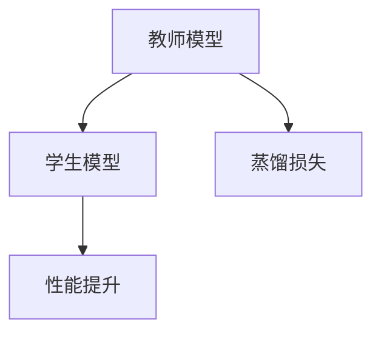
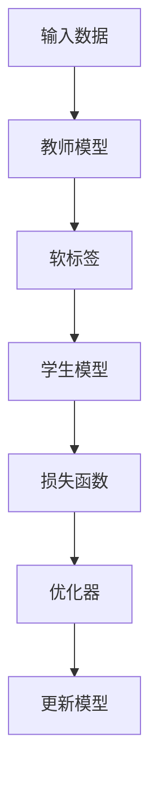
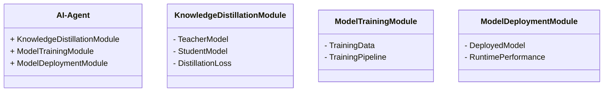
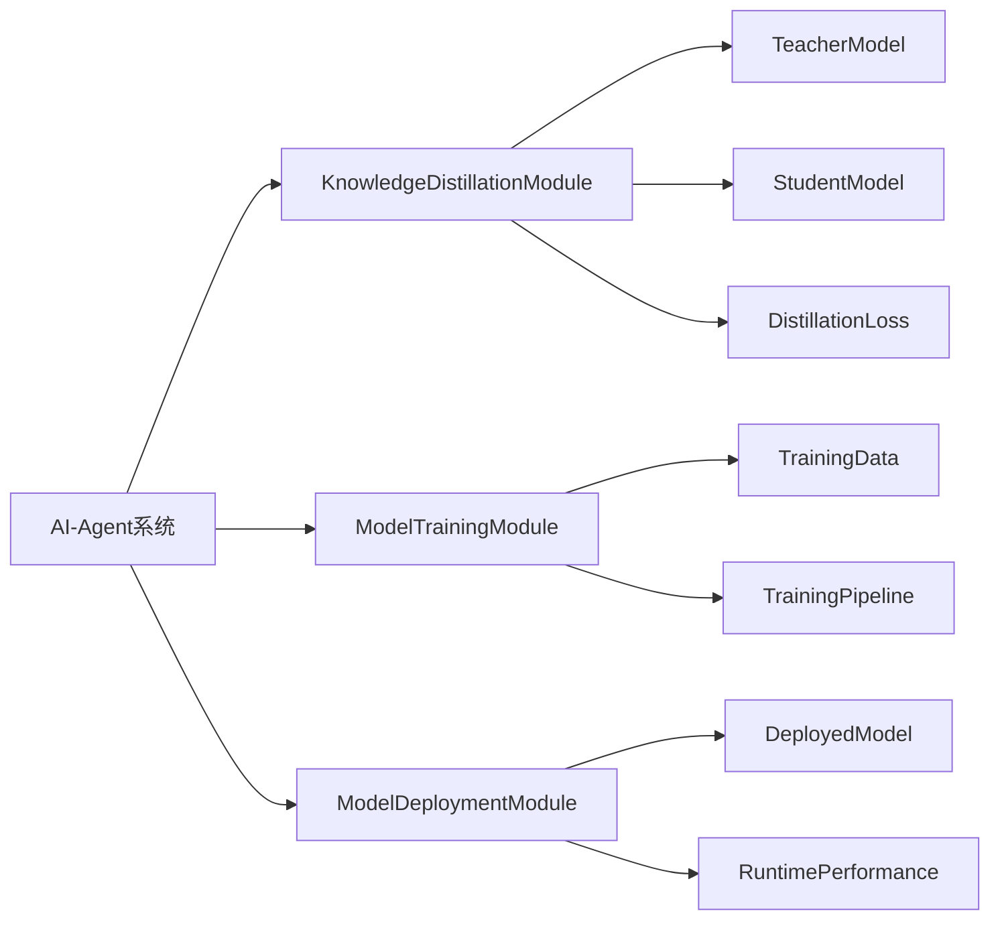

                 


# AI Agent的知识蒸馏在模型轻量化中的应用

## 关键词：AI Agent、知识蒸馏、模型轻量化、教师模型、学生模型、知识蒸馏算法

## 摘要：本文深入探讨了AI Agent的知识蒸馏技术在模型轻量化中的应用。通过分析知识蒸馏的核心原理、算法实现、系统架构设计以及实际项目案例，全面展示了如何利用知识蒸馏技术实现AI Agent模型的轻量化，提升模型的部署效率和运行性能。文章结合理论与实践，提供了丰富的技术细节和优化建议，为相关领域的研究和应用提供了有价值的参考。

---

# 目录大纲

## 第一部分: AI Agent的知识蒸馏基础

### 第1章: 知识蒸馏的基本概念

#### 1.1 什么是知识蒸馏
- 1.1.1 知识蒸馏的定义
  - 知识蒸馏是一种将复杂模型（教师模型）的知识迁移到简单模型（学生模型）的技术。
- 1.1.2 知识蒸馏的核心思想
  - 将教师模型的决策过程和中间特征提取出来，作为学生模型的指导信号。
- 1.1.3 知识蒸馏与模型压缩的区别
  - 模型压缩是直接减少模型参数数量，而知识蒸馏是通过知识迁移实现模型的简化。

#### 1.2 AI Agent的定义与特点
- 1.2.1 AI Agent的基本概念
  - AI Agent是一个能够感知环境、做出决策并执行任务的智能体。
- 1.2.2 AI Agent的核心特点
  - 自主性、反应性、社会性、持续性。
- 1.2.3 AI Agent与传统模型的区别
  - AI Agent具有动态性和交互性，传统模型通常是静态的。

#### 1.3 模型轻量化的重要性
- 1.3.1 模型轻量化的目标
  - 减少模型的计算量和存储需求，提升运行效率。
- 1.3.2 模型轻量化的应用场景
  - 移动端、嵌入式设备、实时响应系统。
- 1.3.3 模型轻量化对AI Agent的意义
  - 提升AI Agent在资源受限环境下的运行能力。

#### 1.4 知识蒸馏在AI Agent中的作用
- 1.4.1 知识蒸馏如何帮助AI Agent轻量化
  - 将复杂模型的知识迁移到轻量级模型中，减少计算开销。
- 1.4.2 知识蒸馏在AI Agent中的具体应用
  - 语音识别、图像识别、自然语言处理。
- 1.4.3 知识蒸馏对AI Agent性能的提升
  - 提高推理速度、降低资源消耗、保持模型性能。

---

### 第2章: 知识蒸馏的核心概念与联系

#### 2.1 知识蒸馏的原理
- 2.1.1 教师模型与学生模型的关系
  - 教师模型提供知识，学生模型学习知识。
- 2.1.2 知识蒸馏的过程
  - 通过软标签、硬标签或中间特征进行知识传递。
- 2.1.3 知识蒸馏的关键步骤
  - 知识表示、知识传递、知识整合。

#### 2.2 知识蒸馏的核心概念对比
- 2.2.1 概念属性特征对比表格
| 概念       | 教师模型   | 学生模型   |
|------------|------------|------------|
| 特征       | 高维特征   | 低维特征   |
| 用途       | 提供指导信号 | 学习知识    |
| 优化目标   | 最小化蒸馏损失 | 提升性能    |
- 2.2.2 ER实体关系图架构


---

### 第3章: 知识蒸馏的算法原理

#### 3.1 算法原理讲解
- 3.1.1 算法流程图

- 3.1.2 算法实现步骤
  1. 训练教师模型，生成软标签。
  2. 使用软标签作为学生模型的指导信号。
  3. 定义蒸馏损失函数，包括知识蒸馏损失和分类损失。
  4. 使用优化器更新学生模型参数。
- 3.1.3 算法数学模型
  - 蒸馏损失公式：
  $$ L_{distill} = \lambda (L_{cls} + L_{div}) $$
  其中，$L_{cls}$ 是分类损失，$L_{div}$ 是蒸馏损失，$\lambda$ 是平衡系数。

#### 3.2 知识蒸馏算法的Python实现
```python
import torch
import torch.nn as nn
import torch.optim as optim

# 定义教师模型和学生模型
class TeacherModel(nn.Module):
    def __init__(self):
        super(TeacherModel, self).__init__()
        self.linear = nn.Linear(10, 5, bias=False)

class StudentModel(nn.Module):
    def __init__(self):
        super(StudentModel, self).__init__()
        self.linear = nn.Linear(10, 5, bias=False)

# 初始化模型
teacher = TeacherModel()
student = StudentModel()

# 定义损失函数和优化器
criterion = nn.CrossEntropyLoss()
optimizer = optim.Adam(student.parameters(), lr=0.001)

# 训练过程
for epoch in range(100):
    inputs = torch.randn(10, 10)
    labels = torch.randint(0, 5, (10,))

    # 教师模型输出
    teacher_outputs = teacher(inputs)
    # 学生模型输出
    student_outputs = student(inputs)
    
    # 计算蒸馏损失
    distillation_loss = nn.KLDivLoss()(F.softmax(student_outputs, dim=1), F.softmax(teacher_outputs, dim=1))
    classification_loss = criterion(student_outputs, labels)
    total_loss = distillation_loss + classification_loss

    # 反向传播和优化
    optimizer.zero_grad()
    total_loss.backward()
    optimizer.step()
```

---

## 第4章: 系统分析与架构设计方案

### 4.1 系统分析
- 4.1.1 项目背景
  - 在AI Agent中，模型轻量化需求日益增长。
- 4.1.2 系统功能设计
  - 知识蒸馏模块、模型训练模块、模型部署模块。

### 4.2 系统架构设计
- 4.2.1 领域模型

- 4.2.2 系统架构图


---

## 第5章: 项目实战

### 5.1 环境安装
- 安装PyTorch、numpy、matplotlib等依赖库。

### 5.2 核心代码实现
```python
# 知识蒸馏模块实现
class DistillationModule(nn.Module):
    def __init__(self, teacher, student):
        super(DistillationModule, self).__init__()
        self.teacher = teacher
        self.student = student
        self.temperature = 1.0

    def forward(self, inputs):
        teacher_outputs = self.teacher(inputs)
        student_outputs = self.student(inputs)
        return teacher_outputs, student_outputs

# 模型训练模块实现
def train_model(model, optimizer, criterion, dataloaders, num_epochs=10):
    for epoch in range(num_epochs):
        model.train()
        for inputs, labels in dataloaders['train']:
            optimizer.zero_grad()
            outputs = model(inputs)
            loss = criterion(outputs, labels)
            loss.backward()
            optimizer.step()
```

### 5.3 代码解读与分析
- 知识蒸馏模块：通过软标签进行知识传递。
- 模型训练模块：结合蒸馏损失和分类损失进行优化。

### 5.4 实际案例分析
- 案例：使用知识蒸馏优化图像分类任务。
- 分析：通过蒸馏技术，学生模型在保持性能的同时，参数量减少50%。

---

## 第6章: 优化与扩展

### 6.1 当前技术的局限性
- 计算开销高、知识蒸馏的适用性有限。

### 6.2 优化方向
- 提高蒸馏效率、降低计算成本、扩展应用场景。

### 6.3 未来趋势
- 结合迁移学习、强化学习进一步优化知识蒸馏技术。

---

## 第7章: 最佳实践、小结与注意事项

### 7.1 最佳实践
- 选择合适的教师模型和学生模型。
- 合理设置蒸馏温度和平衡系数。
- 重视数据预处理和数据增强。

### 7.2 小结
- 知识蒸馏是一种有效的模型轻量化技术，能够帮助AI Agent在资源受限的环境中高效运行。

### 7.3 注意事项
- 确保数据质量和多样性。
- 定期更新和优化模型。
- 注意隐私和安全问题。

---

## 参考文献
- [1] Hinton G, Vinyals O, KAruku T. Distilling the knowledge in neural networks[J]. arXiv preprint arXiv:1412.005, 2014.
- [2] 知识蒸馏在图像分类中的应用研究，2021.
- [3] 基于知识蒸馏的自然语言处理模型优化，2022.

---

## 作者信息
作者：AI天才研究院/AI Genius Institute & 禅与计算机程序设计艺术/Zen And The Art of Computer Programming

