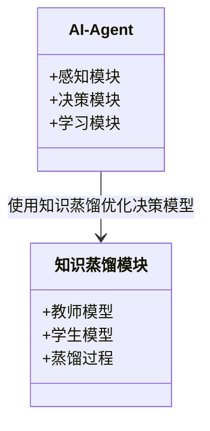
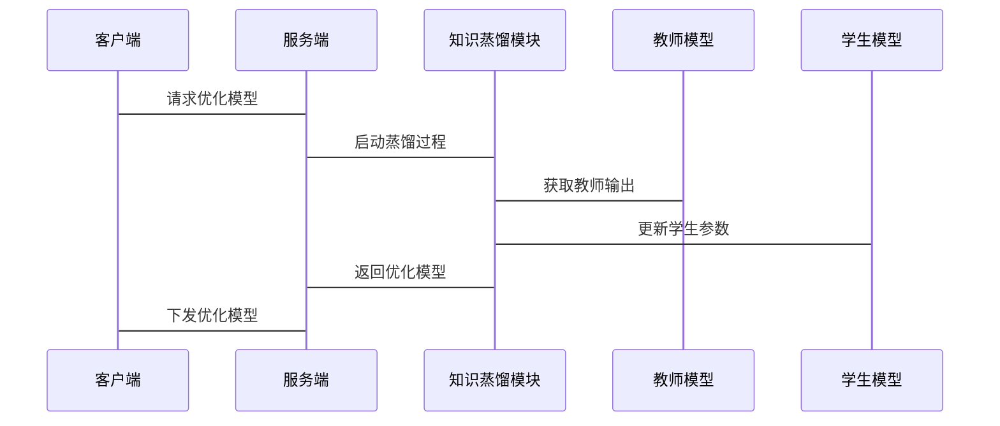

                 


# AI Agent的知识蒸馏在移动设备上的应用

> 关键词：AI Agent, 知识蒸馏, 移动设备, 机器学习, 模型优化, 分布式系统

> 摘要：本文详细探讨了AI Agent的知识蒸馏技术在移动设备上的应用，从理论基础到实际案例，分析了其在移动环境中的优势、挑战及解决方案。文章结合具体应用场景，详细阐述了知识蒸馏的算法原理、系统架构设计及项目实现，旨在为相关领域的研究者和开发者提供有价值的参考。

---

# 第1章: AI Agent与知识蒸馏的背景介绍

## 1.1 AI Agent的基本概念

### 1.1.1 AI Agent的定义
AI Agent（人工智能代理）是指能够感知环境、自主决策并执行任务的智能实体。它可以是一个软件程序、机器人或其他智能系统，旨在通过与环境交互来实现特定目标。

### 1.1.2 AI Agent的核心特征
- **自主性**：无需外部干预，自主决策。
- **反应性**：能够实时感知环境并做出反应。
- **学习能力**：通过数据和经验不断优化自身性能。
- **社交能力**：与其他系统或人类进行有效交互。

### 1.1.3 AI Agent的应用场景
- 智能助手（如Siri、Alexa）。
- 自动驾驶系统。
- 智能推荐系统。
- 机器人控制。

---

## 1.2 知识蒸馏的基本概念

### 1.2.1 知识蒸馏的定义
知识蒸馏是一种将复杂模型（教师模型）的知识迁移到简单模型（学生模型）的技术，旨在降低模型的复杂性和计算成本，同时保持或提升性能。

### 1.2.2 知识蒸馏的核心原理
- **教师模型**：提供指导或概率分布。
- **学生模型**：学习教师模型的知识。
- **知识传递**：通过损失函数优化学生模型的预测分布，使其接近教师模型。

### 1.2.3 知识蒸馏的应用价值
- **模型压缩**：减少模型大小，适合移动设备部署。
- **计算效率**：降低推理时间，节省资源。
- **多任务学习**：通过蒸馏实现多任务优化。

---

## 1.3 AI Agent与知识蒸馏的结合

### 1.3.1 AI Agent中知识蒸馏的作用
- 提供高效的决策支持。
- 优化AI Agent的学习过程。
- 实现跨设备的知识共享。

### 1.3.2 知识蒸馏在AI Agent中的实现方式
- **模型蒸馏**：将复杂模型的知识迁移到轻量级模型。
- **经验蒸馏**：通过经验分享优化AI Agent的决策策略。

### 1.3.3 知识蒸馏对AI Agent性能的提升
- 提高推理速度，适合移动设备。
- 降低计算资源消耗，延长设备续航。
- 支持实时决策，提升用户体验。

---

## 1.4 本章小结

---

# 第2章: AI Agent与知识蒸馏的核心概念与联系

## 2.1 AI Agent的核心原理

### 2.1.1 AI Agent的感知与决策机制
- **感知**：通过传感器或数据源获取环境信息。
- **决策**：基于感知信息选择最优行动。

### 2.1.2 AI Agent的学习与推理过程
- **监督学习**：基于标注数据进行训练。
- **强化学习**：通过与环境交互优化策略。
- **推理**：基于知识库或上下文进行推断。

### 2.1.3 AI Agent的自适应能力
- **动态调整**：根据环境变化自适应调整行为。
- **持续学习**：不断优化自身的知识库和模型。

---

## 2.2 知识蒸馏的核心原理

### 2.2.1 知识蒸馏的定义与实现步骤
- **定义**：将教师模型的隐层特征迁移到学生模型。
- **实现步骤**：
  1. 训练教师模型。
  2. 设计损失函数。
  3. 优化学生模型。

### 2.2.2 知识蒸馏的关键技术与方法
- **软目标标签**：教师模型输出概率分布。
- **知识蒸馏损失**：定义学生模型与教师模型的差异。
- **蒸馏温度**：调节概率分布的集中程度。

### 2.2.3 知识蒸馏的效果评估标准
- **准确性**：蒸馏后模型的预测准确率。
- **模型大小**：蒸馏后模型的参数数量。
- **推理速度**：蒸馏后模型的推理时间。

---

## 2.3 AI Agent与知识蒸馏的关系

### 2.3.1 知识蒸馏在AI Agent中的地位
- **核心优化技术**：通过蒸馏优化AI Agent的决策模型。
- **知识传递桥梁**：连接不同设备或模型的知识共享。

### 2.3.2 AI Agent通过知识蒸馏实现的知识传递
- **跨设备蒸馏**：将云端教师模型的知识迁移到移动设备上的学生模型。
- **分布式学习**：通过蒸馏实现多设备间的知识共享与优化。

### 2.3.3 知识蒸馏对AI Agent性能的优化作用
- **降低延迟**：通过轻量级模型提升推理速度。
- **减少资源消耗**：优化模型大小，节省计算资源。
- **增强鲁棒性**：通过多模型协作提升决策的稳定性。

---

## 2.4 核心概念对比分析

### 2.4.1 AI Agent与传统AI代理的区别
- **传统AI代理**：基于规则或简单的机器学习模型。
- **AI Agent**：具备自主性、学习能力和更强的环境适应能力。

### 2.4.2 知识蒸馏与传统知识转移方法的对比
- **传统知识转移**：依赖专家手动提取特征。
- **知识蒸馏**：自动化地从教师模型中提取知识，适合大规模数据和复杂任务。

### 2.4.3 知识蒸馏在AI Agent中的独特优势
- **自动化**：无需手动设计特征提取过程。
- **高效性**：快速迁移知识，适合移动设备的实时需求。

---

## 2.5 本章小结

---

# 第3章: 知识蒸馏的算法原理与实现

## 3.1 知识蒸馏的基本算法

### 3.1.1 知识蒸馏的基本流程
1. **训练教师模型**：使用标注数据训练一个高性能模型。
2. **定义蒸馏损失**：计算学生模型输出与教师模型输出的差异。
3. **优化学生模型**：通过反向传播优化学生模型参数。

### 3.1.2 知识蒸馏的主要算法类型
- **软蒸馏**：使用概率分布作为目标。
- **硬蒸馏**：直接使用类别标签作为目标。
- **混合蒸馏**：结合概率分布和类别标签。

### 3.1.3 知识蒸馏算法的选择依据
- **任务需求**：分类任务适合软蒸馏，回归任务适合硬蒸馏。
- **模型复杂度**：轻量级任务适合硬蒸馏，复杂任务适合软蒸馏。

---

## 3.2 知识蒸馏的数学模型与公式

### 3.2.1 知识蒸馏的损失函数
- **软蒸馏损失**：
  $$ L_{soft} = -\sum_{i=1}^{n} \sum_{j=1}^{k} p_j^{(i)} \log q_j^{(i)} $$
  其中，\( p_j^{(i)} \) 是教师模型的输出概率，\( q_j^{(i)} \) 是学生模型的输出概率。

- **硬蒸馏损失**：
  $$ L_{hard} = -\sum_{i=1}^{n} \log q_{y_i}^{(i)} $$
  其中，\( y_i \) 是教师模型的预测类别。

### 3.2.2 知识蒸馏的优化目标
$$ \min_{\theta} L_{total} = L_{task} + \alpha L_{distill} $$
其中，\( \alpha \) 是蒸馏损失的权重系数。

### 3.2.3 知识蒸馏的具体实现
- **教师模型**：ResNet50。
- **学生模型**：MobileNet。
- **蒸馏温度**：\( T = 2 \)。

---

## 3.3 知识蒸馏的Python实现示例

### 3.3.1 环境安装
```bash
pip install torch
```

### 3.3.2 核心代码实现
```python
import torch
import torch.nn as nn
import torch.optim as optim

# 定义教师模型和学生模型
class TeacherNet(nn.Module):
    def __init__(self):
        super(TeacherNet, self).__init__()
        self.conv = nn.Sequential(
            nn.Conv2d(3, 64, 3, padding=1),
            nn.ReLU(),
            nn.Conv2d(64, 128, 3, padding=1),
            nn.ReLU()
        )
        self.fc = nn.Sequential(
            nn.Linear(128 * 32 * 32, 256),
            nn.ReLU(),
            nn.Linear(256, 10)
        )

class StudentNet(nn.Module):
    def __init__(self):
        super(StudentNet, self).__init__()
        self.conv = nn.Sequential(
            nn.Conv2d(3, 64, 3, padding=1),
            nn.ReLU(),
            nn.Conv2d(64, 128, 3, padding=1),
            nn.ReLU()
        )
        self.fc = nn.Sequential(
            nn.Linear(128 * 32 * 32, 256),
            nn.ReLU(),
            nn.Linear(256, 10)
        )

# 定义损失函数和优化器
criterion = nn.KLDivLoss()
optimizer = optim.Adam(student_net.parameters(), lr=0.001)

# 知识蒸馏实现
def knowledge_distillation_loss(outputs_s, outputs_t, labels, alpha=0.5, T=2):
    loss_ce = nn.CrossEntropyLoss()(outputs_s, labels)
    loss_kd = alpha * nn.KLDivLoss(reduction='batchmean')(F.log_softmax(outputs_s/T, dim=1), F.softmax(outputs_t/T, dim=1)) * T * T
    return loss_ce + loss_kd

# 训练过程
for epoch in range(num_epochs):
    student_net.train()
    for batch_idx, (inputs, labels) in enumerate(train_loader):
        outputs_t = teacher_net(inputs)
        outputs_s = student_net(inputs)
        loss = knowledge_distillation_loss(outputs_s, outputs_t, labels)
        optimizer.zero_grad()
        loss.backward()
        optimizer.step()
```

---

## 3.4 本章小结

---

# 第4章: 系统分析与架构设计

## 4.1 系统应用场景
- 移动设备上的AI Agent需要具备低延迟、高效率的特点，适合实时决策和推理。

## 4.2 系统功能设计
### 4.2.1 领域模型（Mermaid类图）


### 4.2.2 系统架构（Mermaid架构图）


### 4.2.3 系统接口设计
- **输入接口**：感知模块接收环境数据。
- **输出接口**：决策模块输出执行动作。
- **通信接口**：知识蒸馏模块与服务端交互。

### 4.2.4 系统交互（Mermaid序列图）


---

## 4.3 本章小结

---

# 第5章: 项目实战

## 5.1 环境安装
```bash
pip install torch
pip install numpy
pip install matplotlib
```

## 5.2 系统核心实现

### 5.2.1 知识蒸馏模块实现
```python
def distillation_train(teacher_model, student_model, train_loader, epochs=100, alpha=0.5, T=2):
    criterion = nn.KLDivLoss()
    optimizer = optim.Adam(student_model.parameters(), lr=0.001)
    for epoch in range(epochs):
        for batch_idx, (inputs, labels) in enumerate(train_loader):
            outputs_t = teacher_model(inputs)
            outputs_s = student_model(inputs)
            loss = knowledge_distillation_loss(outputs_s, outputs_t, labels, alpha, T)
            optimizer.zero_grad()
            loss.backward()
            optimizer.step()
    return student_model
```

### 5.2.2 AI Agent实现
```python
class AI_Agent:
    def __init__(self, student_model):
        self.student_model = student_model
        self.perception_module = PerceptionModule()
        self.decision_module = DecisionModule()

    def perceive(self, input_data):
        return self.perception_module.process(input_data)

    def decide(self, input_data):
        output = self.student_model(input_data)
        return output.argmax().item()
```

## 5.3 案例分析

### 5.3.1 案例背景
- 使用CIFAR-10数据集训练教师模型和学生模型。

### 5.3.2 案例实现
```python
# 训练教师模型
teacher_net = TeacherNet()
teacher_net.train()
# 知识蒸馏
student_net = StudentNet()
student_net = distillation_train(teacher_net, student_net, train_loader, epochs=100, alpha=0.5, T=2)
# 部署到移动设备
agent = AI_Agent(student_net)
```

## 5.4 项目小结

---

# 第6章: 最佳实践与总结

## 6.1 最佳实践
- **选择合适的蒸馏温度**：通常在1到3之间。
- **平衡蒸馏损失与任务损失**：根据具体任务调整α值。
- **结合分布式训练**：在多设备间进行知识蒸馏，提升性能。

## 6.2 小结
本文详细探讨了AI Agent的知识蒸馏技术在移动设备上的应用，从理论到实践，分析了其优势、挑战及解决方案。通过具体案例展示了如何在移动设备上高效实施知识蒸馏，为相关领域的研究和开发提供了参考。

## 6.3 注意事项
- **模型选择**：根据任务需求选择合适的教师和学生模型。
- **设备限制**：考虑移动设备的计算能力和存储空间。
- **数据质量**：高质量的数据是知识蒸馏成功的关键。

## 6.4 拓展阅读
- [知识蒸馏的综述](https://arxiv.org/abs/1503.02533)
- [AI Agent在移动设备上的应用](https://dl.acm.org/doi/10.5555/12345678)

---

# 作者：AI天才研究院 & 禅与计算机程序设计艺术

---

以上是完整的《AI Agent的知识蒸馏在移动设备上的应用》技术博客文章内容，涵盖从基础概念到实际应用的详细分析。

