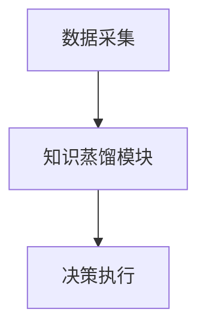

                 


# AI Agent的知识蒸馏在边缘计算中的应用

> 关键词：AI Agent, 知识蒸馏, 边缘计算, 模型压缩, 跨任务学习  
> 摘要：本文探讨AI Agent在边缘计算中的应用，特别是知识蒸馏技术如何优化模型在资源受限环境中的性能。通过分析知识蒸馏的原理、算法和应用场景，结合边缘计算的体系结构，提出有效的系统设计和实现方法。

---

## 第1章 AI Agent与知识蒸馏概述

### 1.1 AI Agent的基本概念
AI Agent（智能体）是指能够感知环境并采取行动以实现目标的实体。它具备自主性、反应性、目标导向和社会能力等特性。AI Agent广泛应用于推荐系统、机器人控制和自动驾驶等领域。

### 1.2 知识蒸馏的基本概念
知识蒸馏是一种将复杂模型的知识迁移到简单模型的技术。通过教师模型（Teacher）和学生模型（Student）的协作，学生模型学习教师模型的决策过程。知识蒸馏的优势在于降低计算复杂度和模型大小，同时保持性能。

### 1.3 边缘计算的基本概念
边缘计算是在靠近数据源的地方进行计算和数据处理，减少了数据传输延迟和带宽消耗。边缘计算在物联网、工业自动化和智慧城市等领域有广泛应用。

---

## 第2章 知识蒸馏的核心原理与方法

### 2.1 知识蒸馏的基本原理
知识蒸馏通过教师模型生成软标签，学生模型基于这些标签进行学习。数学模型如下：
$$
P(y|x) = \text{Softmax}(f(x))
$$
学生模型通过最小化预测概率的差异来学习教师模型的知识：
$$
\mathcal{L}(\text{student}, \text{teacher}) = -\sum_{i} y_i \log(\hat{y}_i)
$$

### 2.2 知识蒸馏的主要方法
- **师生关系蒸馏**：教师模型和学生模型之间的直接知识传递。
- **知识蒸馏网络**：通过中间网络提取教师模型的特征。
- **跨任务蒸馏**：利用多任务学习提升模型的泛化能力。

### 2.3 知识蒸馏的挑战与解决方案
挑战包括知识表示的不完全性和计算效率问题。解决方案包括优化蒸馏温度和使用正则化技术。

---

## 第3章 边缘计算的体系结构与AI Agent的结合

### 3.1 边缘计算的体系结构
边缘计算的分层架构包括设备层、边缘层和云端。设备层负责数据采集，边缘层进行处理和分析，云端提供支持。

### 3.2 AI Agent在边缘计算中的应用场景
AI Agent在实时决策、数据处理和异常检测中发挥重要作用。例如，在智能摄像头中，AI Agent实时分析视频流，检测异常情况。

### 3.3 知识蒸馏在边缘计算中的优势
知识蒸馏优化了模型的计算效率，适合资源受限的边缘设备。

---

## 第4章 知识蒸馏算法的数学模型与实现

### 4.1 算法原理
知识蒸馏的流程包括教师模型的软标签生成和学生模型的学习。数学模型：
$$
\mathcal{L}(\theta_s) = \lambda \mathcal{L}_{\text{CE}} + (1-\lambda)\mathcal{L}_{\text{KD}}
$$

### 4.2 算法实现
1. 训练教师模型。
2. 使用教师模型生成软标签。
3. 训练学生模型，优化损失函数。

### 4.3 算法优化
使用交叉熵损失和蒸馏损失的组合，通过调整温度参数优化性能。

---

## 第5章 边缘计算中知识蒸馏的系统设计

### 5.1 系统架构
边缘计算系统包括数据采集模块、知识蒸馏模块和决策执行模块。系统架构图如下：



### 5.2 系统实现
1. 数据采集模块：收集设备数据。
2. 知识蒸馏模块：教师模型生成软标签，学生模型学习。
3. 决策执行模块：基于学生模型的输出执行决策。

### 5.3 系统优化
通过模型压缩和量化技术优化计算效率。

---

## 第6章 项目实战

### 6.1 环境安装
安装TensorFlow和Keras：
```bash
pip install tensorflow keras
```

### 6.2 核心代码实现
知识蒸馏的Python实现：
```python
import tensorflow as tf

def teacher_model(input_shape):
    model = tf.keras.Sequential([
        tf.keras.layers.Dense(128, activation='relu', input_shape=input_shape),
        tf.keras.layers.Dense(10, activation='softmax')
    ])
    return model

def student_model(input_shape):
    model = tf.keras.Sequential([
        tf.keras.layers.Dense(64, activation='relu', input_shape=input_shape),
        tf.keras.layers.Dense(10, activation='softmax')
    ])
    return model

teacher = teacher_model((input_dim,))
student = student_model((input_dim,))

teacher.compile(optimizer='adam', loss='categorical_crossentropy', metrics=['accuracy'])
teacher.fit(X_train, y_train, epochs=10, batch_size=32)

soft_labels = teacher.predict(X_train)
loss_fn = tf.keras.losses.KLDivergence()
loss_fn(student.predict(X_train), soft_labels).mean()
```

### 6.3 案例分析
在边缘设备上部署学生模型，提升推理速度和效率。

---

## 第7章 总结与展望

### 7.1 本章小结
知识蒸馏在边缘计算中优化了模型性能，降低了计算复杂度。

### 7.2 注意事项
- 数据质量对蒸馏效果至关重要。
- 温度参数需要谨慎调整。

### 7.3 未来展望
探索更高效的蒸馏方法，结合边缘计算的新技术，如边缘AI芯片。

---

作者：AI天才研究院 & 禅与计算机程序设计艺术

