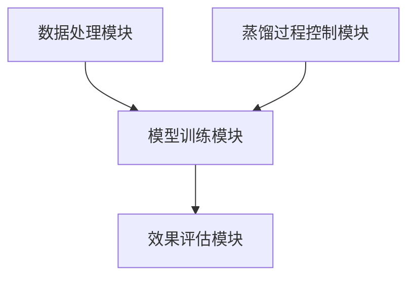
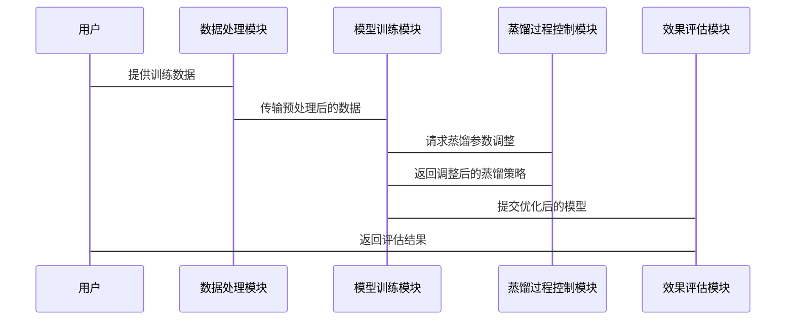

                 


```markdown
# AI Agent的知识蒸馏链：多阶段LLM模型优化

> 关键词：知识蒸馏链，多阶段优化，LLM，人工智能，模型优化

> 摘要：本文深入探讨了AI Agent的知识蒸馏链技术及其在多阶段大型语言模型（LLM）优化中的应用。通过分析知识蒸馏链的核心概念、算法原理、系统架构和项目实战，本文为读者提供了从理论到实践的全面指导。

---

## 第1章: 知识蒸馏链的背景与概念

### 1.1 什么是知识蒸馏链

知识蒸馏链是一种用于优化大型语言模型的多阶段知识传递机制。它通过将知识从复杂的源模型逐步传递到更简洁的目标模型，显著提升了模型的性能和效率。

#### 1.1.1 知识蒸馏链的定义

知识蒸馏链可以定义为一种多阶段的知识传递机制，利用中间模型在源模型和目标模型之间逐步优化，使目标模型在性能上接近甚至超越源模型，同时显著降低计算和存储成本。

#### 1.1.2 知识蒸馏链的核心要素

知识蒸馏链的核心要素包括：

1. **源模型**：大型预训练模型，提供丰富的知识。
2. **中间模型**：用于逐步传递和优化知识。
3. **目标模型**：优化后的模型，性能高且资源消耗低。
4. **蒸馏策略**：决定知识传递的方式和阶段。

#### 1.1.3 知识蒸馏链的分类

知识蒸馏链可以分为以下几种类型：

1. **单阶段蒸馏链**：直接从源模型传递到目标模型。
2. **多阶段蒸馏链**：通过多个中间模型逐步优化。
3. **自适应蒸馏链**：根据模型性能动态调整策略。

### 1.2 多阶段LLM模型优化的背景

随着LLM的快速发展，优化成为必要。多阶段优化通过降低计算成本和提升性能，使模型更易于部署。

#### 1.2.1 大型语言模型的发展现状

LLM目前在模型规模、任务多样性和应用场景上都有显著进展，但资源消耗限制了其广泛应用。

#### 1.2.2 多阶段优化的必要性

多阶段优化通过减少计算成本、提升性能和提高可部署性，解决了传统LLM的资源消耗问题。

#### 1.2.3 知识蒸馏链在LLM优化中的作用

知识蒸馏链通过多阶段传递和优化，显著提升了模型性能，减少了资源消耗，使其更适合实际应用。

### 1.3 知识蒸馏链与传统蒸馏方法的区别

#### 1.3.1 传统蒸馏方法的局限性

传统蒸馏方法一次性传递知识，缺乏灵活性，优化效果有限。

#### 1.3.2 知识蒸馏链的优势

知识蒸馏链通过多阶段优化，灵活性高，优化效果好。

#### 1.3.3 知识蒸馏链的创新点

知识蒸馏链引入多阶段设计和动态调整，提升了优化效果和效率。

### 1.4 本章小结

本章介绍了知识蒸馏链的基本概念、核心要素和分类，探讨了多阶段LLM优化的背景和必要性，分析了知识蒸馏链在LLM优化中的作用，并对比了传统蒸馏方法的局限性和知识蒸馏链的优势。

---

## 第2章: 多阶段LLM模型优化的核心原理

### 2.1 知识蒸馏链的基本原理

知识蒸馏链通过多阶段传递知识，使目标模型逐步优化。

#### 2.1.1 知识蒸馏链的工作流程

工作流程包括数据准备、蒸馏过程、优化调整和效果评估。

#### 2.1.2 知识蒸馏链的关键技术

关键技术包括蒸馏损失函数、知识表示和蒸馏策略。

#### 2.1.3 知识蒸馏链的数学模型

数学模型涉及蒸馏损失函数的计算和优化算法的选择。

### 2.2 多阶段优化的算法原理

多阶段优化通过逐步调整模型参数，使目标模型在各阶段逐步优化。

#### 2.2.1 多阶段优化的定义

多阶段优化是将优化过程划分为多个阶段，每个阶段有不同的优化目标。

#### 2.2.2 多阶段优化的数学模型

数学模型包括阶段划分、目标函数和优化算法的选择。

#### 2.2.3 多阶段优化的实现步骤

实现步骤包括阶段划分、目标函数定义和优化算法选择。

### 2.3 知识蒸馏链与多阶段优化的关系

知识蒸馏链通过多阶段优化实现高效的知识传递。

#### 2.3.1 知识蒸馏链在多阶段优化中的作用

知识蒸馏链作为多阶段优化的关键部分，确保知识的有效传递。

#### 2.3.2 多阶段优化对知识蒸馏链的提升

多阶段优化使知识蒸馏链更加灵活和高效。

#### 2.3.3 知识蒸馏链与多阶段优化的结合

结合两者的优势，实现更高效的模型优化。

### 2.4 本章小结

本章深入探讨了知识蒸馏链的基本原理和多阶段优化的算法原理，分析了两者的关系，并为后续章节的实现和应用奠定了理论基础。

---

## 第3章: 知识蒸馏链的设计与实现

### 3.1 知识蒸馏链的设计原则

设计原则包括简洁性、可扩展性和高效性。

#### 3.1.1 简洁性原则

确保设计简单，易于实现和维护。

#### 3.1.2 可扩展性原则

设计应具备扩展性，适应不同任务和数据。

#### 3.1.3 高效性原则

优化设计以提高效率，降低资源消耗。

### 3.2 知识蒸馏链的实现步骤

实现步骤包括数据准备、模型选择、蒸馏过程和优化调整。

#### 3.2.1 数据准备

选择和准备合适的训练数据，确保蒸馏过程的有效性。

#### 3.2.2 模型选择

选择合适的源模型和目标模型，确保知识的有效传递。

#### 3.2.3 蒸馏过程

通过损失函数优化目标模型，使其接近源模型。

#### 3.2.4 优化调整

根据效果调整蒸馏策略和参数，提升优化效果。

### 3.3 知识蒸馏链的实现细节

实现细节包括数据预处理、模型训练和蒸馏过程中的参数调整。

#### 3.3.1 数据预处理

对数据进行清洗和格式转换，确保训练顺利进行。

#### 3.3.2 模型训练

使用训练数据对目标模型进行蒸馏训练，优化模型参数。

#### 3.3.3 蒸馏过程中的参数调整

动态调整蒸馏过程中的参数，提升优化效果。

#### 3.3.4 优化效果的评估

通过评估指标和对比实验，验证优化效果。

### 3.4 本章小结

本章详细介绍了知识蒸馏链的设计原则和实现步骤，探讨了实现过程中的关键细节，并为后续章节的系统架构和项目实战奠定了基础。

---

## 第4章: 知识蒸馏链的算法优化

### 4.1 算法优化的目标

优化目标包括提高蒸馏效率、提升蒸馏质量和降低计算成本。

#### 4.1.1 提高蒸馏效率

通过优化算法和参数选择，缩短蒸馏时间。

#### 4.1.2 提升蒸馏质量

提高目标模型的性能和生成质量。

#### 4.1.3 降低计算成本

通过优化算法和资源管理，减少计算资源消耗。

### 4.2 算法优化的策略

策略包括损失函数优化、蒸馏策略调整和模型架构改进。

#### 4.2.1 损失函数优化

设计更有效的损失函数，促进知识的有效传递。

#### 4.2.2 蒸馏策略调整

动态调整蒸馏过程中的策略，适应不同阶段的需求。

#### 4.2.3 模型架构改进

优化模型架构，提升蒸馏效率和效果。

### 4.3 算法优化的实现

实现包括损失函数的优化和蒸馏策略的调整。

#### 4.3.1 损失函数的优化

通过数学推导和实验验证，设计更有效的损失函数。

#### 4.3.2 蒸馏策略的调整

根据模型性能和任务需求，动态调整蒸馏策略。

### 4.4 本章小结

本章探讨了算法优化的目标和策略，并详细介绍了实现方法，为后续章节的系统架构设计和项目实战提供了理论支持。

---

## 第5章: 系统架构设计与实现

### 5.1 项目介绍

本项目旨在通过知识蒸馏链优化大型语言模型，提升性能和降低资源消耗。

#### 5.1.1 项目背景

随着LLM的广泛应用，优化成为必要。

#### 5.1.2 项目目标

通过知识蒸馏链实现高效的模型优化。

### 5.2 系统功能设计

系统功能包括数据处理、模型训练、蒸馏过程和效果评估。

#### 5.2.1 数据处理模块

负责数据的准备和预处理。

#### 5.2.2 模型训练模块

实现模型的蒸馏训练和优化。

#### 5.2.3 蒸馏过程控制模块

控制蒸馏过程中的参数和策略。

#### 5.2.4 效果评估模块

评估优化后的模型性能。

### 5.3 系统架构设计

系统架构采用模块化设计，各模块协同工作。

#### 5.3.1 系统架构图

使用Mermaid绘制系统架构图，展示各模块的交互和协作。



#### 5.3.2 系统接口设计

定义各模块之间的接口，确保系统协作顺畅。

#### 5.3.3 系统交互图

使用Mermaid绘制系统交互图，展示用户与系统之间的交互流程。



### 5.4 本章小结

本章详细介绍了系统的功能设计和架构设计，展示了各模块的交互和协作关系，并通过Mermaid图直观地呈现了系统架构和交互流程。

---

## 第6章: 项目实战

### 6.1 环境安装

#### 6.1.1 安装Python

安装Python 3.8及以上版本。

#### 6.1.2 安装依赖库

安装必要的库，如TensorFlow、PyTorch等。

#### 6.1.3 安装其他工具

安装Mermaid和数学公式编辑工具。

### 6.2 系统核心实现源代码

#### 6.2.1 数据预处理代码

```python
def preprocess_data(data):
    # 数据清洗和格式转换
    pass
```

#### 6.2.2 模型训练代码

```python
def train_model(source_model, target_model, data):
    # 蒸馏训练过程
    pass
```

#### 6.2.3 蒸馏过程控制代码

```python
def distillation_control(source_model, target_model, data, params):
    # 动态调整蒸馏策略
    pass
```

#### 6.2.4 效果评估代码

```python
def evaluate_model(target_model, data):
    # 评估优化后的模型性能
    pass
```

### 6.3 代码应用解读与分析

#### 6.3.1 数据预处理代码解读

解读数据预处理代码的功能和实现细节。

#### 6.3.2 模型训练代码解读

分析模型训练代码的逻辑和优化点。

#### 6.3.3 蒸馏过程控制代码解读

解释蒸馏过程控制代码的动态调整策略。

#### 6.3.4 效果评估代码解读

评估优化后的模型性能，并与源模型进行对比。

### 6.4 实际案例分析和详细讲解剖析

#### 6.4.1 案例背景

介绍案例的背景和目标。

#### 6.4.2 案例实现

展示案例的具体实现过程。

#### 6.4.3 案例分析

分析案例的优化效果和经验教训。

### 6.5 本章小结

本章通过项目实战，详细展示了知识蒸馏链的实现过程，包括环境安装、代码实现和案例分析，使读者能够更好地理解和应用知识蒸馏链技术。

---

## 第7章: 总结与展望

### 7.1 本章总结

总结本文的主要内容和研究成果，强调知识蒸馏链在多阶段LLM优化中的重要性。

### 7.2 未来展望

展望未来的研究方向和应用前景，提出改进建议和新的挑战。

#### 7.2.1 研究方向

探讨知识蒸馏链的进一步优化和新应用场景。

#### 7.2.2 技术挑战

分析当前技术面临的挑战和未来需要解决的问题。

### 7.3 最佳实践Tips

总结在实践中的经验和技巧，帮助读者更好地应用知识蒸馏链技术。

#### 7.3.1 数据选择与预处理

强调数据质量和预处理的重要性。

#### 7.3.2 模型选择与优化

建议合理选择模型和优化策略。

#### 7.3.3 环境配置与调试

提供环境配置和调试的实用技巧。

### 7.4 本章小结

本章总结了全文的主要内容，并展望了未来的研究方向和技术挑战，同时提供了最佳实践的建议，帮助读者更好地理解和应用知识蒸馏链技术。

---

## 作者：AI天才研究院 & 禅与计算机程序设计艺术

```

