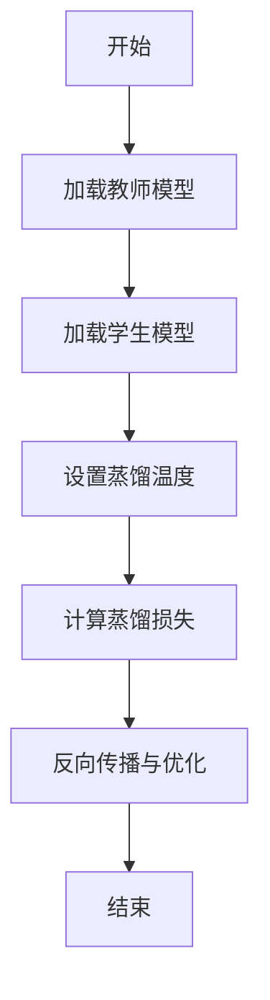
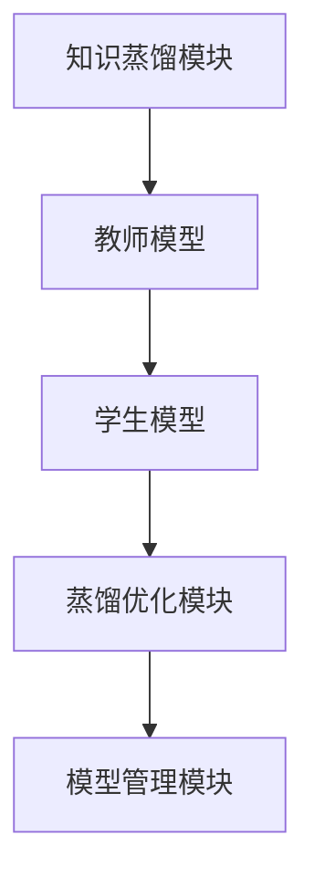
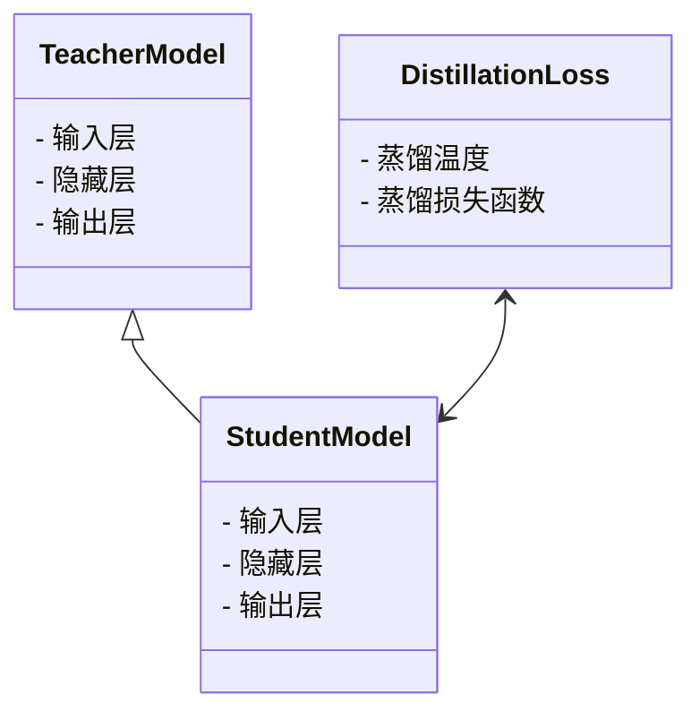
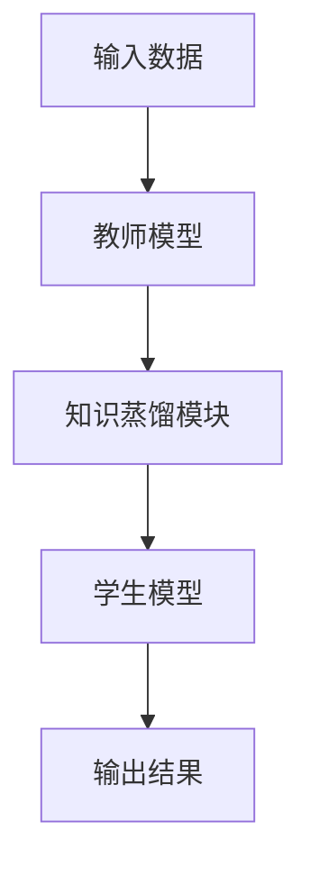

                 


# AI Agent的知识蒸馏：从大型LLM到轻量级模型

> 关键词：知识蒸馏、AI Agent、大型LLM、轻量级模型、模型压缩、性能优化

> 摘要：本文深入探讨了AI Agent的知识蒸馏技术，从大型语言模型（LLM）到轻量级模型的转换过程。通过分析知识蒸馏的核心概念、算法原理、系统架构及项目实战，展示了如何高效地将大型模型的知识迁移到轻量级模型中，提升AI Agent的性能和实用性。

---

# 第1章: 知识蒸馏概述

## 1.1 什么是知识蒸馏
### 1.1.1 知识蒸馏的定义
知识蒸馏是一种将复杂模型（教师模型）的知识迁移到简单模型（学生模型）的技术。通过蒸馏过程，学生模型能够继承教师模型的决策能力和特征表示能力，同时保持轻量级的结构。

### 1.1.2 知识蒸馏的核心概念
- **教师模型**：通常是一个复杂的大型模型，具有强大的特征提取和分类能力。
- **学生模型**：一个相对简单的模型，通过蒸馏过程学习教师模型的知识。
- **蒸馏损失**：衡量学生模型输出与教师模型输出之间差异的损失函数。

### 1.1.3 知识蒸馏的目标与意义
知识蒸馏的目标是降低模型的复杂性，同时保持或提升模型的性能。其意义在于：
- **减少计算资源消耗**：轻量级模型在资源受限的环境中更具优势。
- **提高部署灵活性**：轻量级模型可以更方便地部署到移动设备或边缘计算环境中。
- **提升模型解释性**：简化模型结构有助于提高模型的可解释性。

## 1.2 AI Agent与知识蒸馏的关系
### 1.2.1 AI Agent的基本概念
AI Agent是一种智能实体，能够感知环境、自主决策并执行任务。其核心能力包括理解、推理、规划和学习。

### 1.2.2 大型LLM在AI Agent中的作用
大型语言模型（如GPT）作为教师模型，能够提供强大的自然语言处理能力，为AI Agent提供高质量的知识支持。

### 1.2.3 知识蒸馏在AI Agent中的应用场景
- **任务执行优化**：通过蒸馏，AI Agent可以在资源受限的环境中高效执行复杂任务。
- **多模态能力提升**：结合多模态数据，蒸馏技术可以增强AI Agent的感知和理解能力。

## 1.3 知识蒸馏的背景与挑战
### 1.3.1 大型模型的局限性
- **计算成本高**：训练和推理大型模型需要大量的计算资源和时间。
- **部署难度大**：大型模型难以在资源受限的环境中部署。

### 1.3.2 轻量级模型的需求
- **低资源消耗**：轻量级模型在移动设备和边缘计算中具有优势。
- **快速响应**：轻量级模型能够提供更快的响应速度，提升用户体验。

### 1.3.3 知识蒸馏的技术挑战
- **知识表示的准确性**：如何确保学生模型能够准确继承教师模型的知识。
- **蒸馏过程的效率**：如何在有限的训练时间内完成高效的蒸馏过程。

## 1.4 本章小结
本章从知识蒸馏的基本概念出发，分析了其在AI Agent中的作用和应用场景，同时探讨了技术背景和挑战。

---

# 第2章: 知识蒸馏的核心概念

## 2.1 知识蒸馏的理论基础
### 2.1.1 知识蒸馏的基本原理
知识蒸馏通过优化蒸馏损失函数，使得学生模型的输出尽可能接近教师模型的输出。蒸馏温度是一个关键参数，通常设置为一个介于0.1到2之间的值。

### 2.1.2 知识蒸馏的技术特点
- **灵活性**：适用于不同类型的模型和任务。
- **可扩展性**：支持多教师模型和多学生模型的组合。

### 2.1.3 知识蒸馏的数学模型
蒸馏损失函数的公式如下：
$$L_{distill} = -\sum_{i=1}^{n} p_i \log q_i$$
其中，$p_i$是教师模型的输出概率，$q_i$是学生模型的输出概率。

## 2.2 知识蒸馏的核心要素
### 2.2.1 教师模型与学生模型
- **教师模型**：通常是一个预训练的大型模型，如BERT或GPT。
- **学生模型**：通常是一个轻量级的模型，如小样本的LSTM或Transformer。

### 2.2.2 知识表示与转移
- **知识表示**：通过概率分布的形式表示知识。
- **知识转移**：通过蒸馏损失函数将知识从教师模型转移到学生模型。

### 2.2.3 蒸馏损失函数
蒸馏损失函数的计算公式如下：
$$L_{distill} = \frac{1}{T} \sum_{i=1}^{n} (p_i - q_i)^2$$
其中，$T$是蒸馏温度。

## 2.3 知识蒸馏与模型压缩的对比
### 2.3.1 模型压缩的定义与方法
模型压缩是通过剪枝、量化等技术减少模型的参数数量。

### 2.3.2 知识蒸馏与模型压缩的区别
- **知识蒸馏**：通过知识转移提升学生模型的性能。
- **模型压缩**：通过减少参数数量降低模型复杂度。

### 2.3.3 知识蒸馏的优势与局限性
- **优势**：能够保持或提升模型性能，同时降低计算成本。
- **局限性**：需要额外的训练过程，可能引入额外的计算开销。

## 2.4 本章小结
本章详细讲解了知识蒸馏的核心概念和技术特点，分析了其与模型压缩的区别和优缺点。

---

# 第3章: 知识蒸馏的算法原理

## 3.1 知识蒸馏的基本流程
### 3.1.1 教师模型的输出
教师模型的输出是一个概率分布，表示输入样本属于各个类别的概率。

### 3.1.2 学生模型的输出
学生模型的输出也是一个概率分布，但通常与教师模型的输出存在差异。

### 3.1.3 蒸馏损失的计算
通过计算学生模型输出与教师模型输出之间的差异，优化蒸馏损失函数。

## 3.2 知识蒸馏的数学模型
### 3.2.1 蒸馏损失函数的公式
$$L_{distill} = -\sum_{i=1}^{n} p_i \log q_i$$

### 3.2.2 蒸馏温度的调整
蒸馏温度$T$是一个超参数，通常设置为0.1到2之间的值。较大的$T$会使概率分布更平滑，较小的$T$会使概率分布更尖锐。

### 3.2.3 蒸馏损失的优化
通过反向传播和优化器（如Adam）优化蒸馏损失函数，使得学生模型的输出尽可能接近教师模型的输出。

## 3.3 知识蒸馏的算法实现
### 3.3.1 算法流程图


### 3.3.2 Python代码实现
```python
import torch
import torch.nn as nn
import torch.optim as optim

class TeacherModel(nn.Module):
    def __init__(self):
        super(TeacherModel, self).__init__()
        self.fc = nn.Linear(10, 5)

    def forward(self, x):
        return self.fc(x)

class StudentModel(nn.Module):
    def __init__(self):
        super(StudentModel, self).__init__()
        self.fc = nn.Linear(10, 5)

    def forward(self, x):
        return self.fc(x)

def distillation_loss(teacher_logits, student_logits, temperature):
    teacher_probs = F.softmax(teacher_logits / temperature, dim=-1)
    student_probs = F.softmax(student_logits / temperature, dim=-1)
    loss = -torch.mean(torch.sum(teacher_probs * torch.log(student_probs), dim=-1))
    return loss

teacher_model = TeacherModel()
student_model = StudentModel()
optimizer = optim.Adam(student_model.parameters(), lr=0.001)
temperature = 1.0

for epoch in range(100):
    inputs = torch.randn(10, 10)
    teacher_outputs = teacher_model(inputs)
    student_outputs = student_model(inputs)
    loss = distillation_loss(teacher_outputs, student_outputs, temperature)
    optimizer.zero_grad()
    loss.backward()
    optimizer.step()
```

## 3.4 本章小结
本章详细讲解了知识蒸馏的算法原理，包括流程图和Python代码实现，帮助读者理解如何在实际中应用蒸馏技术。

---

# 第4章: 知识蒸馏的系统架构设计

## 4.1 系统分析与设计
### 4.1.1 问题场景介绍
在AI Agent的应用中，通常需要处理大量数据，且对计算资源有较高要求。通过知识蒸馏，可以将大型模型的知识迁移到轻量级模型中，提升性能和效率。

### 4.1.2 系统功能设计
- **知识蒸馏模块**：负责将教师模型的知识迁移到学生模型。
- **模型管理模块**：负责加载和管理教师模型和学生模型。
- **蒸馏优化模块**：负责优化蒸馏过程，提升蒸馏效率。

### 4.1.3 系统架构图


## 4.2 系统架构设计
### 4.2.1 领域模型设计


### 4.2.2 系统架构图


## 4.3 本章小结
本章通过系统分析与设计，展示了如何将知识蒸馏技术应用于AI Agent的系统架构中。

---

# 第5章: 知识蒸馏的项目实战

## 5.1 环境安装与配置
### 5.1.1 安装Python和PyTorch
```bash
pip install torch
```

### 5.1.2 安装其他依赖
```bash
pip install numpy matplotlib
```

## 5.2 知识蒸馏的核心实现
### 5.2.1 教师模型和学生模型的定义
```python
class TeacherModel(nn.Module):
    def __init__(self):
        super(TeacherModel, self).__init__()
        self.fc = nn.Linear(10, 5)

    def forward(self, x):
        return self.fc(x)

class StudentModel(nn.Module):
    def __init__(self):
        super(StudentModel, self).__init__()
        self.fc = nn.Linear(10, 5)

    def forward(self, x):
        return self.fc(x)
```

### 5.2.2 蒸馏损失函数的实现
```python
def distillation_loss(teacher_logits, student_logits, temperature):
    teacher_probs = F.softmax(teacher_logits / temperature, dim=-1)
    student_probs = F.softmax(student_logits / temperature, dim=-1)
    loss = -torch.mean(torch.sum(teacher_probs * torch.log(student_probs), dim=-1))
    return loss
```

### 5.2.3 蒸馏过程的优化
```python
optimizer = optim.Adam(student_model.parameters(), lr=0.001)
temperature = 1.0

for epoch in range(100):
    inputs = torch.randn(10, 10)
    teacher_outputs = teacher_model(inputs)
    student_outputs = student_model(inputs)
    loss = distillation_loss(teacher_outputs, student_outputs, temperature)
    optimizer.zero_grad()
    loss.backward()
    optimizer.step()
```

## 5.3 知识蒸馏的案例分析
### 5.3.1 数据集准备
```python
train_data = torch.randn(100, 10)
```

### 5.3.2 模型训练与评估
```python
def evaluate(student_model, teacher_model, data_loader, temperature):
    student_model.eval()
    total_loss = 0
    for inputs in data_loader:
        teacher_outputs = teacher_model(inputs)
        student_outputs = student_model(inputs)
        loss = distillation_loss(teacher_outputs, student_outputs, temperature)
        total_loss += loss.item()
    avg_loss = total_loss / len(data_loader)
    return avg_loss

evaluate(student_model, teacher_model, train_data, temperature)
```

## 5.4 本章小结
本章通过具体的项目实战，展示了知识蒸馏技术的实现过程和实际应用。

---

# 第6章: 知识蒸馏的最佳实践

## 6.1 小结与回顾
知识蒸馏是一种有效的模型压缩技术，能够将大型模型的知识迁移到轻量级模型中，提升性能和效率。

## 6.2 注意事项与建议
- **蒸馏温度的选择**：蒸馏温度是一个关键参数，通常设置为0.1到2之间。
- **模型选择与优化**：选择合适的教师模型和学生模型，优化蒸馏过程。
- **数据质量**：高质量的数据有助于提升蒸馏效果。

## 6.3 未来研究方向
- **多教师模型的蒸馏**：研究如何将多个教师模型的知识迁移到学生模型。
- **动态蒸馏**：研究如何在动态环境中进行知识蒸馏。
- **轻量级模型的优化**：进一步优化轻量级模型的结构和性能。

## 6.4 本章小结
本章总结了知识蒸馏的最佳实践，提出了注意事项和未来研究方向。

---

# 附录

## 附录A: 参考文献
1. Hinton, G., Vinyals, O., &

