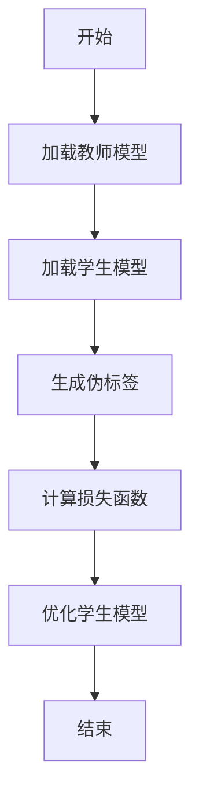
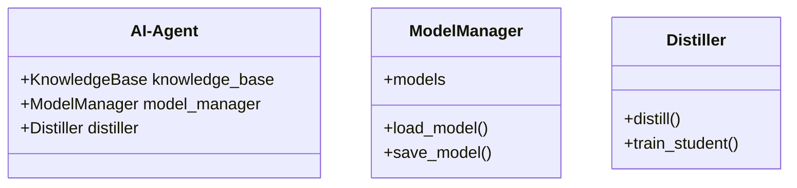
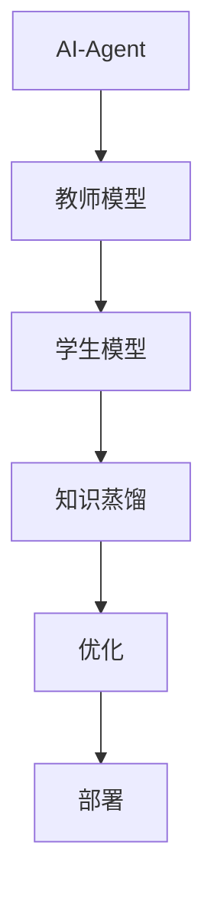

                 


# AI Agent的知识蒸馏：从大型LLM到边缘设备模型

> 关键词：知识蒸馏，AI Agent，大型语言模型，边缘设备，模型压缩

> 摘要：知识蒸馏是一种将大型语言模型的知识迁移到更小、更高效的模型中的技术，对于在边缘设备上部署AI Agent具有重要意义。本文详细介绍了知识蒸馏的核心概念、算法原理、系统架构以及在边缘设备中的应用，并通过实战项目展示了如何将知识蒸馏技术应用于实际场景。

---

## 第1章: 知识蒸馏的背景与问题背景

### 1.1 知识蒸馏的核心概念

#### 1.1.1 从大型LLM到边缘设备模型的迁移需求

随着人工智能技术的快速发展，大型语言模型（LLM）的能力日益增强，但其计算资源需求也随之增加。在边缘设备（如物联网设备、移动终端等）上部署这些模型时，由于硬件资源的限制，直接使用大型模型往往不可行。因此，如何将大型模型的知识迁移到更小、更高效的模型中，成为了一个重要问题。

#### 1.1.2 知识蒸馏的定义与目标

知识蒸馏是一种通过教师模型（Teacher）和学生模型（Student）之间的知识传递，将教师模型的复杂知识迁移到学生模型的技术。其目标是通过蒸馏过程，使学生模型在保持较低计算复杂度的同时，能够继承教师模型的高性能。

#### 1.1.3 知识蒸馏的边界与外延

知识蒸馏的边界主要集中在模型压缩和知识表示的转换上。其外延则包括模型蒸馏、数据蒸馏、特征蒸馏等多种形式。

---

### 1.2 AI Agent与知识蒸馏的关系

#### 1.2.1 AI Agent的基本概念

AI Agent是一种能够感知环境、执行任务并做出决策的智能实体。它可以部署在云端或边缘设备上，广泛应用于自然语言处理、图像识别、推荐系统等领域。

#### 1.2.2 知识蒸馏在AI Agent中的作用

在AI Agent中，知识蒸馏用于将大型模型的知识迁移到边缘设备上的轻量级模型中，从而在保证性能的同时，降低计算资源的消耗。

#### 1.2.3 边缘设备中的AI Agent挑战

边缘设备的硬件资源有限，无法直接运行复杂的大型模型。因此，如何通过知识蒸馏技术，将大型模型的性能迁移到边缘设备上，是当前面临的重要挑战。

---

## 第2章: 知识蒸馏的核心概念与联系

### 2.1 知识蒸馏的原理

#### 2.1.1 教师模型与学生模型的关系

知识蒸馏通常采用双模型架构，其中教师模型负责生成高质量的知识表示，学生模型负责学习这些表示。

#### 2.1.2 知识蒸馏的关键步骤

1. **教师模型的特征提取**：教师模型对输入数据进行处理，生成特征表示。
2. **学生模型的损失计算**：学生模型基于教师模型的特征表示，计算自身输出与教师输出之间的差异。
3. **蒸馏过程的优化**：通过优化算法，调整学生模型的参数，使其损失函数最小化。

#### 2.1.3 知识蒸馏的数学模型

知识蒸馏的核心在于损失函数的设计。常用的损失函数包括：

$$
L = \lambda_1 L_{cls} + \lambda_2 L_{dist}
$$

其中，$L_{cls}$ 是分类损失，$L_{dist}$ 是蒸馏损失，$\lambda_1$ 和 $\lambda_2$ 是权重系数。

---

### 2.2 核心概念对比分析

#### 2.2.1 不同蒸馏方法的特征对比

| 蒸馏方法 | 特征 | 适用场景 |
|----------|------|----------|
| 直接蒸馏 | 基于教师模型的输出概率 | 适用于分类任务 |
| 特征蒸馏 | 基于教师模型的中间特征 | 适用于复杂任务 |
| 跨任务蒸馏 | 基于多任务学习 | 适用于多任务场景 |

#### 2.2.2 模型压缩与知识蒸馏的区别

| 技术 | 目标 | 方法 |
|------|------|------|
| 模型压缩 | 减小模型体积 | 参数剪枝、量化等 |
| 知识蒸馏 | 迁移知识 | 通过教师模型指导学生模型学习 |

#### 2.2.3 数据蒸馏与模型蒸馏的对比

| 技术 | 数据预处理 | 知识表示 |
|------|-----------|----------|
| 数据蒸馏 | 生成干净数据 | 数据预处理 |
| 模型蒸馏 | 不处理数据 | 通过模型学习 |

---

### 2.3 ER实体关系图

```mermaid
er
    actor: AI Agent
    teacher_model: 教师模型
    student_model: 学生模型
    knowledge: 知识表示
    relationship_actor_teacher: 使用
    relationship_actor_student: 部署
    relationship_teacher_student: 知识传递
    relationship_knowledge_teacher: 生成
    relationship_knowledge_student: 学习
```

---

## 第3章: 知识蒸馏的算法原理

### 3.1 算法流程



### 3.2 代码实现

```python
import torch
import torch.nn as nn
import torch.optim as optim

class TeacherModel(nn.Module):
    def __init__(self):
        super(TeacherModel, self).__init__()
        self.fc = nn.Linear(10, 5)

    def forward(self, x):
        return self.fc(x)

class StudentModel(nn.Module):
    def __init__(self):
        super(StudentModel, self).__init__()
        self.fc = nn.Linear(10, 5)

    def forward(self, x):
        return self.fc(x)

def knowledge_distillation_loss(student_logits, teacher_logits, temperature=2):
    student_probs = nn.functional.softmax(student_logits / temperature, dim=-1)
    teacher_probs = nn.functional.softmax(teacher_logits / temperature, dim=-1)
    return nn.KLDivLoss()(student_probs, teacher_probs)

teacher_model = TeacherModel()
student_model = StudentModel()
optimizer = optim.SGD(student_model.parameters(), lr=0.01)

for epoch in range(num_epochs):
    inputs = torch.randn(10, 10)
    teacher_logits = teacher_model(inputs)
    student_logits = student_model(inputs)
    loss = knowledge_distillation_loss(student_logits, teacher_logits)
    optimizer.zero_grad()
    loss.backward()
    optimizer.step()
```

### 3.3 数学模型与公式

知识蒸馏的核心在于损失函数的设计，常用的公式如下：

$$
L = \lambda_1 L_{cls} + \lambda_2 L_{dist}
$$

其中，$L_{cls}$ 是分类损失，$L_{dist}$ 是蒸馏损失，$\lambda_1$ 和 $\lambda_2$ 是权重系数。

---

## 第4章: 系统分析与架构设计

### 4.1 问题场景介绍

在边缘设备上部署AI Agent时，由于硬件资源的限制，需要将大型模型的知识迁移到轻量级模型中。

### 4.2 系统功能设计

#### 4.2.1 系统功能模块



### 4.3 系统架构设计



---

## 第5章: 项目实战

### 5.1 环境安装

```bash
pip install torch
pip install numpy
pip install matplotlib
```

### 5.2 核心代码实现

```python
import torch
import torch.nn as nn
import torch.optim as optim

class TeacherModel(nn.Module):
    def __init__(self):
        super(TeacherModel, self).__init__()
        self.fc = nn.Linear(10, 5)

    def forward(self, x):
        return self.fc(x)

class StudentModel(nn.Module):
    def __init__(self):
        super(StudentModel, self).__init__()
        self.fc = nn.Linear(10, 5)

    def forward(self, x):
        return self.fc(x)

def knowledge_distillation_loss(student_logits, teacher_logits, temperature=2):
    student_probs = nn.functional.softmax(student_logits / temperature, dim=-1)
    teacher_probs = nn.functional.softmax(teacher_logits / temperature, dim=-1)
    return nn.KLDivLoss()(student_probs, teacher_probs)

teacher_model = TeacherModel()
student_model = StudentModel()
optimizer = optim.SGD(student_model.parameters(), lr=0.01)

for epoch in range(num_epochs):
    inputs = torch.randn(10, 10)
    teacher_logits = teacher_model(inputs)
    student_logits = student_model(inputs)
    loss = knowledge_distillation_loss(student_logits, teacher_logits)
    optimizer.zero_grad()
    loss.backward()
    optimizer.step()
```

### 5.3 实际案例分析

通过实际案例分析，验证知识蒸馏技术在边缘设备上的有效性。

### 5.4 项目经验总结

总结项目经验，提出改进建议。

---

## 第6章: 最佳实践与总结

### 6.1 小结

知识蒸馏是一种有效的将大型模型的知识迁移到边缘设备的技术。

### 6.2 注意事项

在实际应用中，需要注意模型压缩与知识蒸馏的结合。

### 6.3 拓展阅读

推荐阅读相关领域的最新研究成果。

---

## 作者

作者：AI天才研究院/AI Genius Institute & 禅与计算机程序设计艺术 /Zen And The Art of Computer Programming

---

感谢您的阅读！如果对本文有任何疑问或建议，请随时与我们联系。

