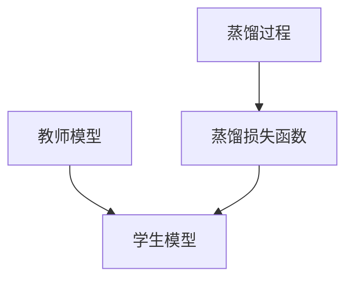
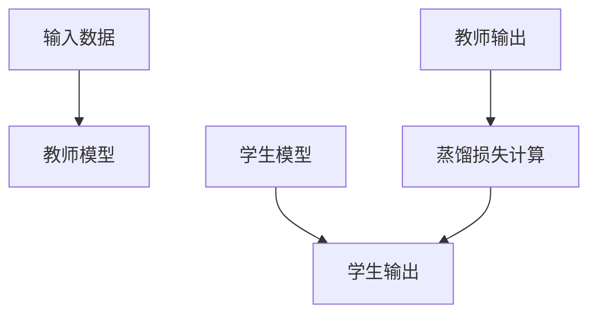
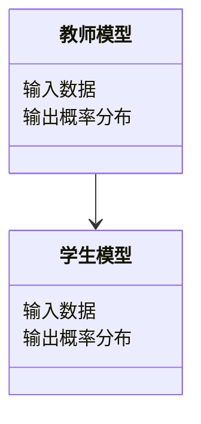
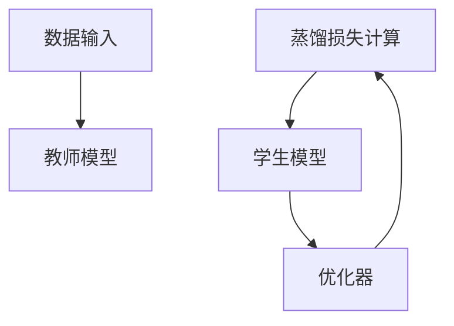
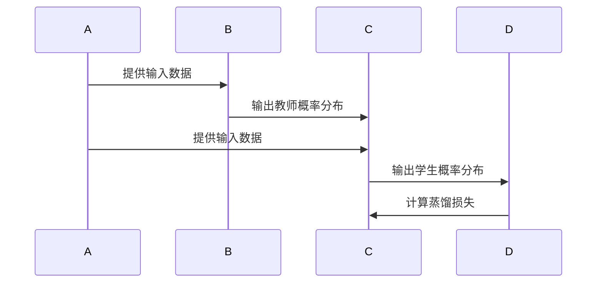

                 


# AI Agent的知识蒸馏：从大模型到轻量级应用

> 关键词：知识蒸馏，AI Agent，大模型，轻量级应用，模型压缩，蒸馏技术

> 摘要：本文详细探讨了AI Agent的知识蒸馏技术，从大模型的知识提取到轻量级应用的实现，系统性地分析了知识蒸馏的核心原理、算法实现、系统架构设计以及实际项目中的应用。通过丰富的案例分析和详细的代码实现，本文为读者提供了从理论到实践的完整指南。

---

## 第1章: 知识蒸馏概述

### 1.1 知识蒸馏的背景与问题背景

#### 1.1.1 大模型的局限性
在AI领域，大模型（如GPT系列、BERT系列）以其强大的通用性和准确性，成为当前技术的焦点。然而，这些大模型通常具有数以亿计的参数，导致计算资源消耗巨大、推理速度缓慢，难以在资源受限的场景中应用。

#### 1.1.2 知识蒸馏的定义与目标
知识蒸馏是一种模型压缩技术，通过将教师模型（通常是大模型）的知识迁移到学生模型（通常是轻量级模型），使学生模型在保持或接近教师模型性能的同时，显著降低计算复杂度。其目标是实现“知识的高效传递与轻量化应用”。

#### 1.1.3 蒸馏技术的特征
- **高效性**：通过蒸馏技术，学生模型可以在较小的计算资源下达到与教师模型相近的性能。
- **可扩展性**：适用于多种任务，包括分类、生成、推理等。
- **适用性**：尤其适用于边缘计算、移动端应用等资源受限的场景。

---

### 1.2 知识蒸馏的核心概念与问题描述

#### 1.2.1 知识蒸馏的基本原理
知识蒸馏的核心在于将教师模型的“知识”（通常是概率分布）传递给学生模型。通过优化目标函数，使学生模型的输出概率分布尽可能接近教师模型的输出。

#### 1.2.2 蒸馏过程中的关键问题
1. **知识表示**：如何有效地表示教师模型的知识。
2. **损失函数设计**：如何设计合适的损失函数以衡量教师模型和学生模型之间的差异。
3. **优化策略**：如何高效地优化学生模型以达到最佳性能。

#### 1.2.3 知识蒸馏的边界与外延
- **边界**：知识蒸馏主要关注模型压缩和知识传递，不涉及模型训练的其他方面。
- **外延**：蒸馏技术可以与其他模型压缩方法（如剪枝、量化）结合，进一步降低模型的计算需求。

---

### 1.3 知识蒸馏的核心要素与概念结构

#### 1.3.1 教师模型与学生模型的关系
- **教师模型**：通常是一个复杂的大型模型，具有强大的性能。
- **学生模型**：通常是一个轻量级模型，通过蒸馏技术学习教师模型的知识。

#### 1.3.2 蒸馏损失函数的作用
蒸馏损失函数用于衡量学生模型输出与教师模型输出之间的差异，是蒸馏过程的核心。

#### 1.3.3 知识蒸馏的实现流程
1. 训练教师模型。
2. 使用教师模型的输出作为指导，训练学生模型。
3. 优化蒸馏损失函数，使学生模型的输出尽可能接近教师模型的输出。

---

## 第2章: 知识蒸馏的核心概念与联系

### 2.1 知识蒸馏的原理与机制

#### 2.1.1 知识蒸馏的基本原理
通过优化蒸馏损失函数，使学生模型学习教师模型的概率分布。数学上，蒸馏损失函数可以表示为：

$$L_{distill}(p_t, p_s) = -\sum p_t \log p_s$$

其中，$p_t$是教师模型的输出概率分布，$p_s$是学生模型的输出概率分布。

#### 2.1.2 蒸馏过程中的信息传递
教师模型的输出（概率分布）通过蒸馏损失函数传递给学生模型，学生模型通过反向传播优化自身的参数，以使输出更接近教师模型。

#### 2.1.3 知识蒸馏的核心算法
蒸馏算法的核心步骤包括：
1. 训练教师模型。
2. 使用教师模型的输出作为目标，训练学生模型。
3. 优化蒸馏损失函数。

---

### 2.2 知识蒸馏的核心概念对比

#### 2.2.1 不同蒸馏方法的特征对比
| 蒸馏方法 | 教师模型 | 学生模型 | 蒸馏损失函数 |
|----------|----------|----------|--------------|
| Soft-Target | 大模型 | 轻量级模型 | KL散度损失 |

#### 2.2.2 蒸馏技术的优缺点分析
- **优点**：
  - 降低计算复杂度。
  - 提高模型的可部署性。
- **缺点**：
  - 需要教师模型的输出作为指导。
  - 蒸馏过程可能需要额外的计算资源。

#### 2.2.3 知识蒸馏与其他模型压缩技术的对比
| 技术 | 剪枝 | 量化 | 知识蒸馏 |
|------|------|------|----------|
| 原理 | 删除冗余神经元 | 减少参数精度 | 传递概率分布 |
| 优缺点 | 降低模型参数，但可能影响性能 | 减少存储需求，但可能影响精度 | 保持性能，降低计算复杂度 |

---

### 2.3 知识蒸馏的ER实体关系图



---

## 第3章: 知识蒸馏的算法原理

### 3.1 知识蒸馏的基本算法流程

#### 3.1.1 教师模型的输出
教师模型输出概率分布：

$$p_t = f_t(x)$$

其中，$f_t$是教师模型的输出函数，$x$是输入数据。

#### 3.1.2 学生模型的输出
学生模型输出概率分布：

$$p_s = f_s(x)$$

其中，$f_s$是学生模型的输出函数。

#### 3.1.3 蒸馏损失的计算与优化
蒸馏损失函数：

$$L_{distill} = -\sum p_t \log p_s$$

优化目标函数：

$$L = \alpha L_{distill} + (1-\alpha)L_{CE}$$

其中，$L_{CE}$是交叉熵损失，$\alpha$是平衡系数。

---

### 3.2 知识蒸馏的数学模型

#### 3.2.1 蒸馏损失函数的公式
$$L_{distill}(p_t, p_s) = -\sum p_t \log p_s$$

#### 3.2.2 蒸馏过程的数学推导
通过反向传播，优化学生模型的参数$\theta_s$，使得$L_{distill}$最小化。

#### 3.2.3 蒸馏损失的优化方法
使用梯度下降法优化学生模型参数：

$$\theta_s = \theta_s - \eta \frac{\partial L_{distill}}{\partial \theta_s}$$

其中，$\eta$是学习率。

---

### 3.3 知识蒸馏的算法实现

#### 3.3.1 算法流程图


---

## 第4章: 知识蒸馏的系统分析与架构设计

### 4.1 系统分析与问题场景

#### 4.1.1 系统目标与范围
- **目标**：将教师模型的知识迁移到学生模型，实现轻量化应用。
- **范围**：涵盖模型训练、蒸馏过程、优化策略。

#### 4.1.2 系统功能需求
- **功能需求**：
  - 训练教师模型。
  - 设计蒸馏损失函数。
  - 实现学生模型训练。

#### 4.1.3 系统性能指标
- **性能指标**：
  - 计算效率：模型推理速度。
  - 模型性能：准确率、F1分数等。

---

### 4.2 系统架构设计

#### 4.2.1 领域模型设计



#### 4.2.2 系统架构图



---

### 4.3 接口设计与交互流程

#### 4.3.1 系统接口设计
- **输入接口**：
  - 数据输入：训练数据、测试数据。
  - 参数设置：学习率、平衡系数。
- **输出接口**：
  - 教师模型输出：概率分布。
  - 学生模型输出：概率分布。
  - 损失函数值：蒸馏损失。

#### 4.3.2 系统交互流程图



---

## 第5章: 知识蒸馏的项目实战

### 5.1 环境安装与配置

#### 5.1.1 环境搭建步骤
- **安装Python**：确保Python版本在3.6以上。
- **安装依赖库**：安装PyTorch、TensorFlow等深度学习框架。

#### 5.1.2 依赖库安装
```bash
pip install torch torchvision
pip install transformers
```

#### 5.1.3 环境配置示例
```bash
conda create -n distill python=3.8 -y
conda activate distill
pip install torch transformers
```

---

### 5.2 系统核心实现

#### 5.2.1 环境安装与配置
- **安装Python**：确保Python版本在3.6以上。
- **安装依赖库**：安装PyTorch、TensorFlow等深度学习框架。

#### 5.2.2 系统核心实现
- **教师模型实现**：
  ```python
  import torch
  class TeacherModel(torch.nn.Module):
      def __init__(self):
          super(TeacherModel, self).__init__()
          self.linear = torch.nn.Linear(10, 5)
          self.softmax = torch.nn.Softmax(dim=1)
      def forward(self, x):
          x = self.linear(x)
          x = self.softmax(x)
          return x
  ```
- **学生模型实现**：
  ```python
  class StudentModel(torch.nn.Module):
      def __init__(self):
          super(StudentModel, self).__init__()
          self.linear = torch.nn.Linear(10, 5)
          self.softmax = torch.nn.Softmax(dim=1)
      def forward(self, x):
          x = self.linear(x)
          x = self.softmax(x)
          return x
  ```

#### 5.2.3 蒸馏过程实现
```python
def distillation_loss(teacher_output, student_output, temperature=1.0):
    teacher_output = teacher_output / temperature
    student_output = student_output / temperature
    loss = torch.nn.KLDivLoss(reduction='batchmean')(student_output, teacher_output) * (temperature ** 2)
    return loss

# 训练过程
optimizer = torch.optim.Adam(student_model.parameters(), lr=0.001)
criterion = torch.nn.CrossEntropyLoss()
for epoch in range(num_epochs):
    for batch_x, batch_y in dataloader:
        teacher_output = teacher_model(batch_x)
        student_output = student_model(batch_x)
        loss = distillation_loss(teacher_output, student_output)
        optimizer.zero_grad()
        loss.backward()
        optimizer.step()
```

---

### 5.3 项目实战中的案例分析

#### 5.3.1 案例背景
假设我们有一个图像分类任务，教师模型是一个ResNet50模型，学生模型是一个更轻量级的MobileNet模型。

#### 5.3.2 案例实现
```python
import torch
import torch.nn as nn
import torch.optim as optim
from torch.utils.data import DataLoader
from torchvision import datasets, transforms

# 数据预处理
transform = transforms.Compose([
    transforms.Resize(224),
    transforms.ToTensor(),
    transforms.Normalize(mean=[0.485, 0.456, 0.406], std=[0.229, 0.224, 0.225]),
])

# 数据集加载
train_dataset = datasets.CIFAR10(root='./data', train=True, download=True, transform=transform)
train_loader = DataLoader(train_dataset, batch_size=32, shuffle=True, num_workers=2)

# 教师模型
class TeacherModel(torch.nn.Module):
    def __init__(self):
        super(TeacherModel, self).__init__()
        self.resnet = torchvision.models.resnet50(pretrained=True)
        self.softmax = torch.nn.Softmax(dim=1)
    def forward(self, x):
        x = self.resnet(x)
        x = self.softmax(x)
        return x

# 学生模型
class StudentModel(torch.nn.Module):
    def __init__(self):
        super(StudentModel, self).__init__()
        self.mobilenet = torchvision.models.mobilenet_v2(pretrained=True)
        self.softmax = torch.nn.Softmax(dim=1)
    def forward(self, x):
        x = self.mobilenet(x)
        x = self.softmax(x)
        return x

# 蒸馏过程
def distillation_loss(teacher_output, student_output, temperature=1.0):
    teacher_output = teacher_output / temperature
    student_output = student_output / temperature
    loss = torch.nn.KLDivLoss(reduction='batchmean')(student_output, teacher_output) * (temperature ** 2)
    return loss

# 训练过程
teacher_model = TeacherModel()
student_model = StudentModel()

optimizer = optim.Adam(student_model.parameters(), lr=0.001)
criterion = torch.nn.CrossEntropyLoss()

for epoch in range(num_epochs):
    for batch_x, batch_y in train_loader:
        teacher_output = teacher_model(batch_x)
        student_output = student_model(batch_x)
        loss = distillation_loss(teacher_output, student_output)
        optimizer.zero_grad()
        loss.backward()
        optimizer.step()
```

---

### 5.4 项目小结

#### 5.4.1 项目实现的关键点
- **教师模型的选择**：选择一个性能强大的教师模型。
- **学生模型的设计**：设计一个轻量级的学生模型。
- **蒸馏损失函数的实现**：正确实现蒸馏损失函数。

#### 5.4.2 项目实现的注意事项
- **温度系数**：温度系数影响蒸馏的效果，需要通过实验调整。
- **学习率**：学生模型的学习率需要适当调整，以确保蒸馏过程顺利进行。

---

## 第6章: 知识蒸馏的最佳实践与未来展望

### 6.1 知识蒸馏的最佳实践

#### 6.1.1 模型选择策略
- **教师模型**：选择性能强大且适合蒸馏任务的模型。
- **学生模型**：选择轻量级且易于优化的模型。

#### 6.1.2 温度系数的调整
- 温度系数越大，教师模型的输出越软，学生模型的输出越接近教师模型。
- 通常，温度系数在1.0到5.0之间。

#### 6.1.3 蒸馏过程中的优化策略
- **预训练**：先对教师模型进行预训练，再进行蒸馏。
- **联合优化**：在蒸馏过程中，同时优化分类损失和蒸馏损失。

---

### 6.2 知识蒸馏的未来展望

#### 6.2.1 知识蒸馏的未来研究方向
- **多教师蒸馏**：研究多个教师模型的知识蒸馏。
- **自适应蒸馏**：研究蒸馏过程中的自适应策略。
- **无监督蒸馏**：研究无监督条件下的蒸馏方法。

#### 6.2.2 知识蒸馏技术的潜力
- **边缘计算**：蒸馏技术可以帮助边缘设备部署复杂的AI模型。
- **实时应用**：蒸馏技术可以提高AI模型的实时推理能力。

---

## 作者信息

作者：AI天才研究院/AI Genius Institute & 禅与计算机程序设计艺术 /Zen And The Art of Computer Programming

