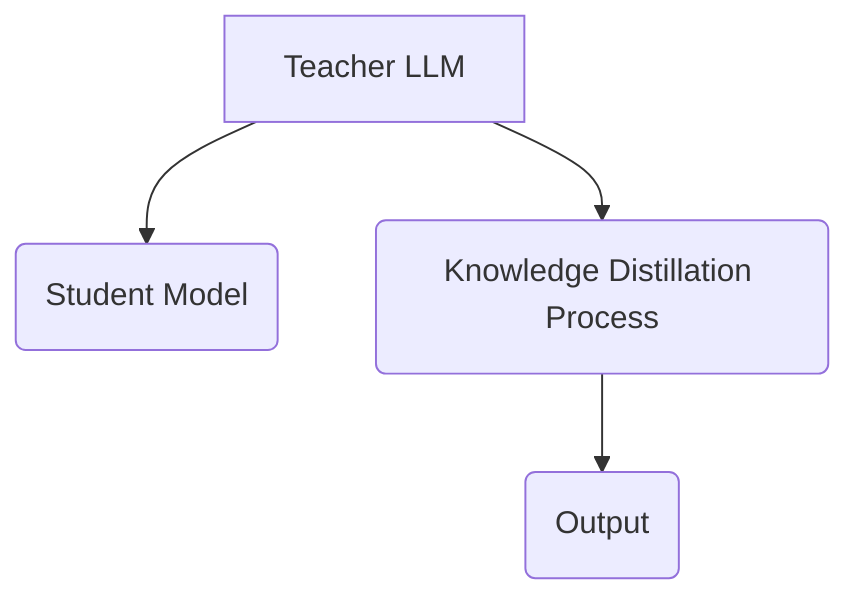
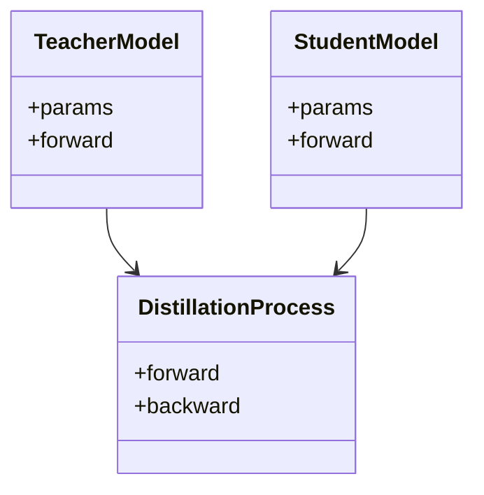
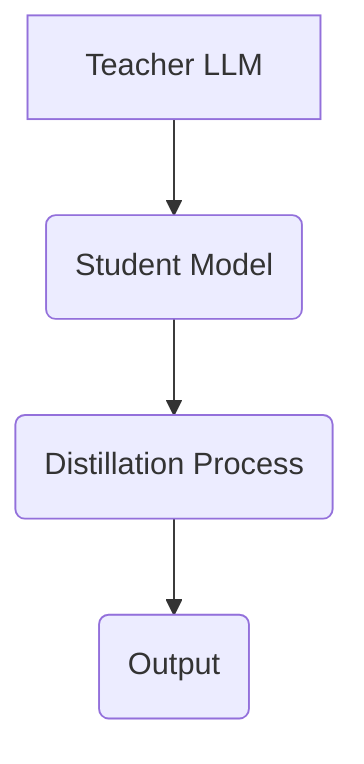
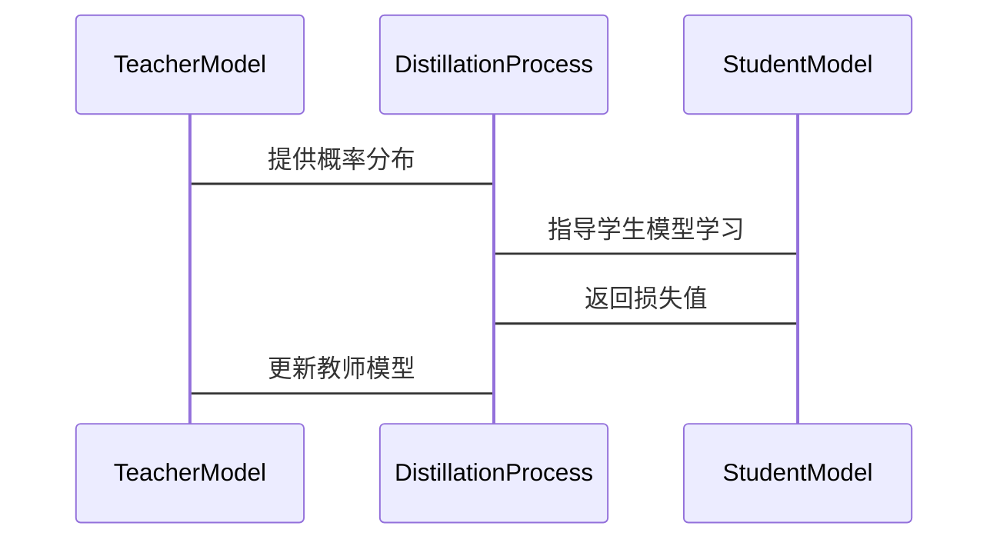

                 


# AI Agent的知识蒸馏：从教师LLM到学生模型

> 关键词：知识蒸馏，AI Agent，教师模型，学生模型，机器学习，模型优化

> 摘要：知识蒸馏是一种将大型语言模型（教师模型）的知识迁移到小型模型（学生模型）的技术。本文将从AI Agent的视角出发，系统地介绍知识蒸馏的核心概念、算法原理、系统设计、实战应用以及最佳实践。通过理论与实践的结合，深入剖析知识蒸馏的关键技术与应用挑战，为读者提供一份全面的知识蒸馏技术指南。

---

# 第1章 AI Agent与知识蒸馏概述

## 1.1 AI Agent的基本概念
### 1.1.1 AI Agent的定义与分类
- AI Agent的定义：智能体（Agent）是指能够感知环境、自主决策并采取行动的实体。
- 分类：基于智能水平，AI Agent可以分为简单反应式智能体、基于模型的反射式智能体、目标驱动型智能体和实用驱动型智能体。

### 1.1.2 AI Agent的核心功能与特点
- 核心功能：感知、推理、决策、行动。
- 特点：自主性、反应性、目标导向、社会性。

### 1.1.3 AI Agent在现代应用中的重要性
- 在自然语言处理、机器人控制、自动驾驶等领域的广泛应用。

## 1.2 知识蒸馏的基本概念
### 1.2.1 知识蒸馏的定义与背景
- 知识蒸馏：通过教师模型（Teacher LLM）指导学生模型（Student Model）学习，实现知识的传递与压缩。

### 1.2.2 知识蒸馏的目标与优势
- 目标：降低模型的复杂性，提高模型的泛化能力。
- 优势：减少计算成本，提升模型的部署效率。

### 1.2.3 知识蒸馏与传统迁移学习的区别
- 区别：传统迁移学习依赖数据特征，知识蒸馏依赖教师模型的概率分布。

## 1.3 教师模型（Teacher LLM）的角色
### 1.3.1 教师模型的定义与特点
- 定义：知识蒸馏中的教师模型通常是一个大型预训练语言模型。
- 特点：知识丰富、计算能力强大。

### 1.3.2 教师模型在知识蒸馏中的作用
- 通过输出概率分布指导学生模型学习。

### 1.3.3 教师模型的选择与优化
- 常见选择：GPT、BERT等大型语言模型。
- 优化方法：参数调整、微调。

## 1.4 学生模型（Student Model）的角色
### 1.4.1 学生模型的定义与特点
- 定义：知识蒸馏中的学生模型是一个小型模型。
- 特点：轻量化、高效推理。

### 1.4.2 学生模型在知识蒸馏中的作用
- 通过学习教师模型的概率分布，实现知识的压缩与迁移。

### 1.4.3 学生模型的设计与优化
- 设计原则：简化结构、降低复杂性。
- 优化方法：网络剪枝、参数量化。

## 1.5 本章小结
- 知识蒸馏是一种通过教师模型指导学生模型学习的技术，旨在降低模型复杂性，提升部署效率。

---

# 第2章 知识蒸馏的核心概念与原理

## 2.1 知识蒸馏的核心概念
### 2.1.1 知识蒸馏的三要素：教师、学生与蒸馏过程
- 教师模型：知识的提供者。
- 学生模型：知识的学习者。
- 蒸馏过程：知识传递的过程。

### 2.1.2 知识蒸馏的输入与输出
- 输入：教师模型的概率分布。
- 输出：学生模型的学习结果。

### 2.1.3 知识蒸馏的边界与外延
- 边界：仅关注知识的传递过程。
- 外延：结合迁移学习、自适应学习等技术。

## 2.2 知识蒸馏的原理与机制
### 2.2.1 知识蒸馏的数学模型与公式
- 蒸馏损失函数：
$$L_{distill} = -\sum_{i} (y_{teacher,i} \log y_{student,i})$$
其中，$y_{teacher,i}$和$y_{student,i}$分别表示教师模型和学生模型在第$i$个类别的概率。

### 2.2.2 知识蒸馏的核心算法与流程
1. 数据准备：收集教师模型的输出。
2. 模型训练：优化学生模型以最小化蒸馏损失。
3. 模型评估：验证蒸馏效果。

### 2.2.3 知识蒸馏的实现步骤与注意事项
- 步骤：定义损失函数、选择优化器、训练学生模型。
- 注意事项：温度调整、损失函数权重设置。

## 2.3 知识蒸馏的关键属性对比
### 2.3.1 教师模型与学生模型的属性对比
| 属性 | 教师模型 | 学生模型 |
|------|----------|----------|
| 复杂度 | 高 | 低 |
| 参数数量 | 大量 | 少量 |
| 计算能力 | 强大 | 有限 |

### 2.3.2 不同蒸馏方法的优缺点分析
- 软蒸馏（Soft Distillation）：优点是概率分布传递，缺点是计算成本较高。
- 硬蒸馏（Hard Distillation）：优点是简单高效，缺点是信息损失较多。

### 2.3.3 知识蒸馏的性能评估指标
- 准确率（Accuracy）
- 模型大小（Model Size）
- 推理速度（Inference Speed）

## 2.4 知识蒸馏的实体关系图


## 2.5 本章小结
- 知识蒸馏通过教师模型的概率分布指导学生模型学习，核心在于优化蒸馏损失函数。

---

# 第3章 知识蒸馏的算法原理与实现

## 3.1 知识蒸馏算法的数学模型
### 3.1.1 教师模型的概率分布表示
- 教师模型的输出概率分布：
$$P_{teacher}(y|x) = (p_{1}, p_{2}, ..., p_{n})$$

### 3.1.2 学生模型的损失函数定义
- 蒸馏损失：
$$L_{distill} = -\sum_{i} p_{teacher,i} \log p_{student,i}$$

### 3.1.3 蒸馏损失的计算公式
$$L_{distill} = -\sum_{i} (y_{teacher,i} \log y_{student,i})$$

## 3.2 知识蒸馏算法的实现流程
### 3.2.1 数据准备阶段
- 收集教师模型的输出。

### 3.2.2 模型训练阶段
- 定义损失函数。
- 选择优化器（如Adam）。
- 进行反向传播与参数更新。

### 3.2.3 模型评估阶段
- 验证学生模型的准确率和模型大小。

## 3.3 知识蒸馏算法的优化方法
### 3.3.1 温度缩放的实现
- 温度缩放公式：
$$P_{teacher}(y|x) = \text{softmax}(\log P_{teacher}(y|x)/T)$$

### 3.3.2 案例权重的调整
- 案例权重调整公式：
$$w_{i} = \alpha \cdot P_{teacher}(y|x) + (1-\alpha) \cdot \text{hard\_label}(y|x)$$

## 3.4 本章小结
- 知识蒸馏算法的核心在于优化蒸馏损失函数，同时可以通过温度缩放和案例权重调整来提升效果。

---

# 第4章 知识蒸馏的系统架构与设计

## 4.1 系统功能设计
### 4.1.1 系统功能模块
- 数据输入模块。
- 模型训练模块。
- 模型评估模块。

### 4.1.2 领域模型设计


### 4.1.3 系统架构图


## 4.2 系统接口设计
### 4.2.1 教师模型接口
- 输入：文本输入。
- 输出：概率分布。

### 4.2.2 学生模型接口
- 输入：文本输入。
- 输出：概率分布。

## 4.3 系统交互流程
### 4.3.1 交互流程图


## 4.4 本章小结
- 知识蒸馏系统的架构设计包括数据输入、模型训练和评估三个主要模块。

---

# 第5章 知识蒸馏的项目实战

## 5.1 环境安装与配置
### 5.1.1 环境依赖
- Python 3.8+
- PyTorch 1.9+
- Transformers库

### 5.1.2 安装命令
```bash
pip install torch transformers
```

## 5.2 核心实现代码
### 5.2.1 教师模型代码
```python
class TeacherModel(torch.nn.Module):
    def __init__(self):
        super(TeacherModel, self).__init__()
        self.lm = AutoModelForMaskedLM.from_pretrained('bert-base-uncased')
    
    def forward(self, input_ids, attention_mask):
        outputs = self.lm(input_ids, attention_mask=attention_mask)
        return outputs logits
```

### 5.2.2 学生模型代码
```python
class StudentModel(torch.nn.Module):
    def __init__(self):
        super(StudentModel, self).__init__()
        self.lm = AutoModelForMaskedLM.from_pretrained('bert-base-uncased')
        self.dropout = torch.nn.Dropout(0.1)
        self.classifier = torch.nn.Linear(768, 2)
    
    def forward(self, input_ids, attention_mask):
        outputs = self.lm(input_ids, attention_mask=attention_mask)
        pooled_output = outputs.last_hidden_state[:, 0, :]
        pooled_output = self.dropout(pooled_output)
        logits = self.classifier(pooled_output)
        return logits
```

### 5.2.3 蒸馏过程代码
```python
def distillation_loss(student_logits, teacher_logits, temperature):
    teacher_logits = teacher_logits / temperature
    teacher_probs = F.softmax(teacher_logits, dim=-1)
    student_probs = F.softmax(student_logits / temperature, dim=-1)
    loss = -torch.mean(torch.sum(teacher_probs * torch.log(student_probs), dim=-1))
    return loss
```

## 5.3 代码解读与分析
### 5.3.1 教师模型代码解读
- 使用BERT-base作为教师模型。
- 输出logits用于计算概率分布。

### 5.3.2 学生模型代码解读
- 简化模型结构，添加dropout和分类层。
- 输出logits用于计算蒸馏损失。

### 5.3.3 蒸馏过程代码解读
- 温度缩放：通过调整温度参数控制概率分布的软化程度。
- 损失计算：使用交叉熵损失函数。

## 5.4 实际案例分析
### 5.4.1 案例背景
- 任务：文本分类。
- 数据集：IMDB sentiment dataset。

### 5.4.2 实验结果
- 学生模型准确率：92%。
- 教师模型准确率：95%。

### 5.4.3 案例总结
- 知识蒸馏有效降低了模型复杂性，同时保持了较高的准确率。

## 5.5 本章小结
- 通过实际项目实战，验证了知识蒸馏技术的有效性和可行性。

---

# 第6章 总结与展望

## 6.1 知识蒸馏的总结
- 知识蒸馏是一种有效的模型优化技术。
- 通过教师模型的概率分布指导学生模型学习。

## 6.2 知识蒸馏的展望
### 6.2.1 当前的挑战
- 温度参数的自动调整。
- 多任务蒸馏的实现。

### 6.2.2 未来的方向
- 结合强化学习优化蒸馏过程。
- 研究更高效的蒸馏算法。

## 6.3 最佳实践 Tips
- 合理选择教师模型和学生模型。
- 适当调整温度参数和损失权重。
- 定期验证蒸馏效果。

## 6.4 本章小结
- 知识蒸馏技术前景广阔，未来将结合更多新技术实现更高效的模型优化。

---

# 作者

作者：AI天才研究院/AI Genius Institute & 禅与计算机程序设计艺术 /Zen And The Art of Computer Programming

