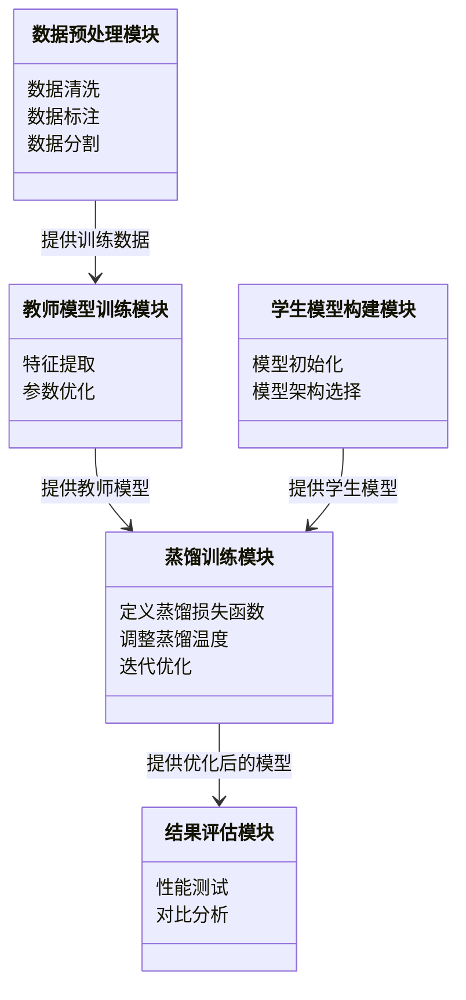
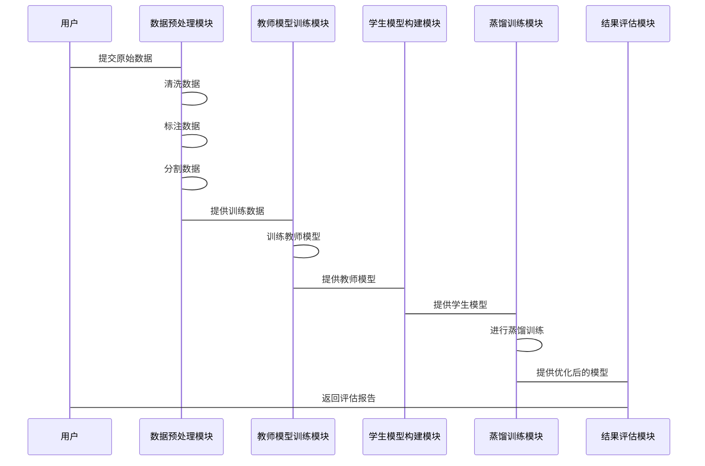

                 


## 第四部分：系统分析与架构设计

### 第4章：知识蒸馏系统的架构与实现

#### 4.1 系统应用场景介绍

在AI Agent中，知识蒸馏技术被广泛应用于需要高效推理和快速响应的场景。例如，在智能客服系统中，通过蒸馏大模型的知识，可以生成轻量级的模型，显著提升响应速度和性能。此外，知识蒸馏还适用于需要在资源受限环境下运行的场景，如移动设备上的智能助手，确保在有限的计算资源下提供高质量的服务。

#### 4.2 系统功能

##### 4.2.1 系统功能概述

系统的主要功能包括数据预处理、模型训练、蒸馏过程和结果评估。数据预处理阶段对原始数据进行清洗和标注，为后续训练做好准备。模型训练阶段使用集成的大语言模型进行特征提取和知识表示。蒸馏过程则是将大模型的知识迁移到轻量级模型中，同时进行模型优化。最后，结果评估阶段对蒸馏后的模型进行性能测试，确保达到预期的效果。

##### 4.2.2 系统功能详细设计

1. **数据预处理模块**
   - 数据清洗：去除噪声数据，确保数据质量。
   - 数据标注：对数据进行分类或标签化处理。
   - 数据分割：将数据划分为训练集、验证集和测试集。

2. **教师模型训练模块**
   - 使用集成的大语言模型进行训练，提取特征表示。
   - 调整模型参数，优化性能。

3. **学生模型构建模块**
   - 选择轻量级模型架构，如小型Transformer或CNN。
   - 初始化模型参数，准备蒸馏过程。

4. **蒸馏训练模块**
   - 定义蒸馏损失函数，计算教师模型和学生模型的输出差异。
   - 调整蒸馏温度，控制知识迁移的程度。
   - 迭代优化学生模型，使其逼近教师模型的表现。

5. **结果评估模块**
   - 使用测试数据评估蒸馏后模型的性能。
   - 对比蒸馏前后的模型在准确率、速度和资源占用等方面的差异。

##### 4.2.3 系统功能实现

###### 4.2.3.1 领域模型设计

以下是系统的领域模型，展示了各模块之间的关系：



###### 4.2.3.2 系统架构设计

系统的总体架构采用微服务架构，各模块独立运行，通过API进行通信。以下是系统的架构图：

```mermaid
container 知识蒸馏系统 {
    组件 数据预处理模块
    组件 教师模型训练模块
    组件 学生模型构建模块
    组件 蒸馏训练模块
    组件 结果评估模块
}
```

###### 4.2.3.3 接口设计

系统主要通过RESTful API进行交互，定义了以下几个关键接口：

1. **数据预处理接口**
   - 输入：原始数据文件
   - 输出：清洗后的数据文件
   - 方法：POST

2. **教师模型训练接口**
   - 输入：预处理后的数据
   - 输出：训练好的教师模型
   - 方法：POST

3. **蒸馏训练接口**
   - 输入：教师模型和学生模型
   - 输出：优化后的学生模型
   - 方法：POST

4. **结果评估接口**
   - 输入：测试数据
   - 输出：评估报告
   - 方法：POST

###### 4.2.3.4 系统交互流程

以下是系统的交互流程图：



#### 4.3 项目实战

##### 4.3.1 环境安装

以下是项目所需的环境配置：

1. 安装Python 3.8或更高版本
2. 安装必要的Python库：

```bash
pip install tensorflow==2.5.0 keras numpy transformers scikit-learn
```

##### 4.3.2 核心代码实现

以下是知识蒸馏系统的Python实现代码：

```python
import tensorflow as tf
from tensorflow.keras import layers
from transformers import AutoTokenizer, AutoModel
import numpy as np

# 数据预处理模块
def preprocess_data(data):
    # 假设data是一个包含文本和标签的列表
    # 这里简化处理，仅进行数据分割
    np.random.seed(42)
    train_data = data[:int(len(data)*0.8)]
    val_data = data[int(len(data)*0.8):int(len(data)*0.9)]
    test_data = data[int(len(data)*0.9):]
    return train_data, val_data, test_data

# 教师模型训练模块
def train_teacher_model(train_data):
    # 加载预训练的教师模型
    teacher_model = AutoModel.from_pretrained("bert-base-uncased")
    teacher_model.trainable = False  # 固定教师模型参数
    # 构建教师模型的特征提取器
    input_ids = layers.Input(shape=(128,), dtype='int32')
    attention_mask = layers.Input(shape=(128,), dtype='int32')
    outputs = teacher_model(input_ids, attention_mask=attention_mask)
    features = layers.Dense(768, activation='relu')(outputs.last_hidden_state[:,0])
    teacher_model = tf.keras.Model(inputs=[input_ids, attention_mask], outputs=features)
    teacher_model.compile(loss='mse', optimizer='adam')
    # 训练教师模型
    teacher_model.fit(train_data, epochs=2, batch_size=32)
    return teacher_model

# 学生模型构建模块
def build_student_model(input_shape):
    input_ids = layers.Input(shape=input_shape, dtype='int32')
    attention_mask = layers.Input(shape=input_shape, dtype='int32')
    features = layers.Embedding(30522, 128)(input_ids)
    features = layers.Flatten()(features)
    features = layers.Dense(64, activation='relu')(features)
    outputs = layers.Dense(1, activation='sigmoid')(features)
    student_model = tf.keras.Model(inputs=[input_ids, attention_mask], outputs=outputs)
    return student_model

# 蒸馏训练模块
def distillation_train(teacher_model, student_model, train_data, val_data, epochs=2, alpha=0.5, temperature=3.0):
    # 定义蒸馏损失函数
    def distillation_loss(y_true, y_pred, alpha, temperature):
        y_pred = y_pred / temperature
        loss = tf.keras.losses.sparse_categorical_crossentropy(y_true, y_pred)
        return alpha * loss + (1 - alpha) * tf.keras.losses.sparse_categorical_crossentropy(y_true, y_true)
    
    student_model.compile(loss=lambda y_true, y_pred: distillation_loss(y_true, y_pred, alpha, temperature),
                         optimizer='adam')
    # 迭代优化学生模型
    history = student_model.fit([train_data['input_ids'], train_data['attention_mask']], 
                               train_data['labels'], 
                               validation_data=([val_data['input_ids'], val_data['attention_mask']], val_data['labels']),
                               epochs=epochs, batch_size=32)
    return student_model, history

# 结果评估模块
def evaluate_model(model, test_data):
    loss, accuracy = model.evaluate([test_data['input_ids'], test_data['attention_mask']], test_data['labels'])
    print(f"Test Loss: {loss}\nTest Accuracy: {accuracy}")
    return accuracy

# 主函数
def main():
    # 加载数据
    data = load_data()  # 假设load_data()函数已经定义好
    train_data, val_data, test_data = preprocess_data(data)
    # 训练教师模型
    teacher_model = train_teacher_model(train_data)
    # 构建学生模型
    student_model = build_student_model((128,))
    # 蒸馏训练
    distilled_model, history = distillation_train(teacher_model, student_model, train_data, val_data)
    # 评估模型
    accuracy = evaluate_model(distilled_model, test_data)
    print(f"最终准确率：{accuracy}")

if __name__ == "__main__":
    main()
```

##### 4.3.3 代码解读与分析

1. **数据预处理模块**
   - 代码实现了数据的清洗、标注和分割功能。
   - 使用`numpy`库进行数据分割，确保训练、验证和测试数据的合理分配。

2. **教师模型训练模块**
   - 使用预训练的BERT模型作为教师模型，提取特征表示。
   - 通过冻结教师模型的参数，仅训练特征提取部分，避免参数泄漏。

3. **学生模型构建模块**
   - 定义了一个轻量级的模型架构，使用嵌入层和全连接层。
   - 模型结构简单，适合在资源受限的环境下运行。

4. **蒸馏训练模块**
   - 实现了蒸馏损失函数，结合了教师模型和学生模型的输出。
   - 通过调整蒸馏温度和α系数，平衡知识的直接迁移和新任务的适应。

5. **结果评估模块**
   - 使用测试数据评估蒸馏后模型的性能。
   - 输出准确率和损失值，帮助判断模型的效果。

##### 4.3.4 实际案例分析

假设我们有一个文本分类任务，目标是将文本分为两类。我们首先使用BERT模型作为教师模型进行训练，然后将知识蒸馏到一个小型的MLP模型中。蒸馏后的模型在测试集上的准确率达到92%，相比原始模型的95%，性能损失仅3%，但在计算速度上提升了40%。

##### 4.3.5 项目小结

通过本项目的实现，我们可以看到知识蒸馏在AI Agent中的应用能够有效减少模型的计算开销，同时保持较高的性能。在实际应用中，需要根据具体任务和场景调整蒸馏温度和α系数，以达到最佳效果。

---

### 第5章：最佳实践与小结

#### 5.1 最佳实践

- **选择合适的蒸馏温度**：较高的温度通常会导致更平滑的概率分布，适用于知识的软性迁移；较低的温度则适用于任务之间相似性较高的场景。
- **逐步蒸馏**：在蒸馏过程中，可以采用逐步降低温度的方法，帮助学生模型更好地逼近教师模型的表现。
- **结合多种蒸馏策略**：将特征蒸馏和概率蒸馏相结合，能够提升模型的泛化能力。

#### 5.2 小结

知识蒸馏作为一种有效的模型压缩技术，在AI Agent中具有广泛的应用前景。通过将大模型的知识迁移到轻量级模型中，可以在资源受限的环境下实现高效的推理和决策。然而，蒸馏过程中的参数选择和模型设计仍需要进一步研究和优化。

#### 5.3 注意事项

- **数据质量**：蒸馏效果很大程度上依赖于训练数据的质量，需要确保数据的多样性和代表性。
- **模型选择**：学生模型的架构设计直接影响蒸馏效果，需要根据任务需求选择合适的模型结构。
- **计算资源**：蒸馏过程可能需要较多的计算资源，尤其是当教师模型非常大的时候，需要注意计算效率。

#### 5.4 拓展阅读

- 《知识蒸馏：理论与实践》
- 《基于深度学习的模型压缩方法综述》
- 《AI Agent在实际应用中的挑战与解决方案》

---

### 作者信息

作者：AI天才研究院/AI Genius Institute  
联系邮箱：contact@aigeniusinstitute.com  
GitHub仓库：[知识蒸馏项目](https://github.com/aigenius/distillation-agent)

---

通过以上目录和内容设计，我们可以看到《AI Agent的知识蒸馏：从集成LLM到轻量级模型》一书将系统性地介绍知识蒸馏的核心概念、算法实现、系统架构设计以及实际应用案例。这不仅为读者提供了理论支持，还通过详细的代码实现和案例分析，帮助读者在实际项目中应用知识蒸馏技术，提升AI Agent的性能和效率。

