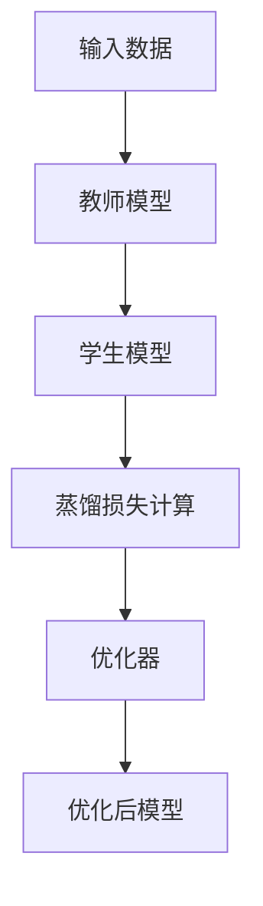

                 


# AI Agent的知识蒸馏：从集成模型到单一高效LLM

> 关键词：知识蒸馏，AI Agent，集成模型，LLM，模型压缩

> 摘要：本文深入探讨了AI Agent中知识蒸馏技术的核心原理与应用，从集成模型的知识提取与压缩，到构建单一高效的大语言模型（LLM），详细分析了整个过程中的技术挑战、解决方案以及实际案例。通过系统化的分析和实践，展示了如何通过知识蒸馏实现模型的高效优化。

---

# 引言

## 1.1 知识蒸馏的背景与重要性
知识蒸馏是一种将复杂模型的知识迁移到简单模型的技术，旨在在保持性能的同时减少计算成本。在AI Agent领域，集成模型（如集成学习模型）通常具有较高的准确性和鲁棒性，但其计算复杂性和资源消耗限制了其在实际应用中的部署。因此，通过知识蒸馏将集成模型的知识迁移到单一高效的大语言模型（LLM）中，成为了一种重要的优化方法。

## 1.2 AI Agent的挑战与知识蒸馏的解决方案
AI Agent需要在复杂环境中实时决策和交互，集成模型虽然性能优秀，但其多模型集成的特性导致了计算资源的浪费。知识蒸馏通过提取集成模型的知识并将其注入到一个高效的单一模型中，解决了这一问题，同时保持了高性能。

---

# 第一部分：知识蒸馏的核心概念与原理

## 2.1 知识蒸馏的基本原理
知识蒸馏的核心思想是将教师模型（集成模型）的知识迁移到学生模型（高效LLM）。教师模型通常是一个复杂或集成的模型，而学生模型则是一个简单但高效的模型。

### 2.1.1 知识蒸馏的数学模型
知识蒸馏通常通过损失函数来实现，其核心公式如下：
$$L = \alpha L_{\text{cls}} + (1-\alpha) L_{\text{dist}}$$
其中：
- $L_{\text{cls}}$ 是分类损失函数，用于监督学习。
- $L_{\text{dist}}$ 是蒸馏损失函数，用于衡量学生模型输出与教师模型输出之间的差异。
- $\alpha$ 是一个平衡参数，用于控制分类损失和蒸馏损失的权重。

### 2.1.2 蒸馏过程
知识蒸馏的过程可以分为以下几个步骤：
1. **教师模型的输出**：教师模型对输入数据进行预测，生成概率分布。
2. **学生模型的输出**：学生模型对同一输入数据进行预测，生成概率分布。
3. **计算蒸馏损失**：通过损失函数衡量学生模型输出与教师模型输出之间的差异。
4. **优化学生模型**：通过反向传播和优化器调整学生模型的参数，以最小化蒸馏损失。

## 2.2 知识蒸馏的关键技术

### 2.2.1 知识蒸馏的损失函数
蒸馏损失函数通常是基于KL散度（Kullback-Leibler Divergence）来衡量两个概率分布之间的差异：
$$L_{\text{dist}} = \text{KL}(P_{\text{teacher}} \parallel P_{\text{student}})$$
其中，$P_{\text{teacher}}$ 是教师模型的输出概率分布，$P_{\text{student}}$ 是学生模型的输出概率分布。

### 2.2.2 知识蒸馏的策略
1. **软标签蒸馏**：将教师模型的输出概率分布作为软标签，用于指导学生模型的训练。
2. **硬标签蒸馏**：将教师模型的输出类别作为硬标签，用于监督学生模型的训练。
3. **混合蒸馏**：结合软标签和硬标签进行蒸馏，平衡两者的优势。

### 2.2.3 知识蒸馏的优化方法
1. **渐进蒸馏**：逐步调整教师模型和学生模型之间的距离，避免一次性蒸馏导致的性能下降。
2. **动态蒸馏**：根据数据分布的变化，动态调整蒸馏过程中的参数。
3. **自适应蒸馏**：根据学生模型的性能，自适应地调整蒸馏策略。

---

# 第二部分：AI Agent的知识蒸馏实现

## 3.1 知识蒸馏在AI Agent中的应用
### 3.1.1 AI Agent的定义与特点
AI Agent是一种具有自主决策能力的智能体，通常由感知、推理和行动三个模块组成。知识蒸馏在AI Agent中的应用主要体现在感知和推理模块的优化。

### 3.1.2 知识蒸馏在AI Agent中的具体应用
1. **多模型集成优化**：将多个模型的集成结果迁移到一个高效模型中，减少计算成本。
2. **实时决策优化**：通过蒸馏技术，提高决策速度和效率，适应实时应用场景。

### 3.1.3 知识蒸馏的优化目标
1. **提高决策效率**：通过蒸馏技术，减少模型计算量，提高决策速度。
2. **降低计算成本**：通过模型压缩，减少资源消耗。
3. **保持性能优势**：确保蒸馏后的模型性能不逊于教师模型。

## 3.2 知识蒸馏的系统设计与实现

### 3.2.1 系统架构设计


### 3.2.2 知识蒸馏的具体实现步骤
1. **教师模型的构建与训练**：训练一个集成模型作为教师模型。
2. **学生模型的初始化**：初始化一个简单模型作为学生模型。
3. **蒸馏过程**：通过蒸馏损失函数优化学生模型。
4. **模型评估**：评估蒸馏后模型的性能，确保其与教师模型相当。

## 3.3 知识蒸馏的优化策略

### 3.3.1 知识蒸馏的优化方法
1. **调整蒸馏温度**：通过调整蒸馏温度，控制教师模型输出分布的分散程度。
2. **引入正则化项**：在损失函数中加入正则化项，避免过拟合。
3. **分阶段蒸馏**：分阶段进行蒸馏，逐步优化学生模型。

### 3.3.2 知识蒸馏的实现细节
1. **教师模型的输出处理**：对教师模型的输出进行平滑处理，生成软标签。
2. **学生模型的训练策略**：采用小批量训练和学习率调整，确保优化效果。
3. **蒸馏过程中的监控**：实时监控蒸馏过程中的损失变化，确保收敛。

---

# 第三部分：AI Agent知识蒸馏的项目实战

## 4.1 项目背景与目标
### 4.1.1 项目背景
随着AI Agent应用场景的不断扩大，对模型的效率和性能提出了更高的要求。本项目旨在通过知识蒸馏技术，将集成模型的知识迁移到单一高效的大语言模型中，提高决策效率和降低计算成本。

### 4.1.2 项目目标
1. 实现知识蒸馏过程，将教师模型的知识迁移到学生模型中。
2. 验证蒸馏后模型的性能，确保其与教师模型相当。
3. 优化蒸馏过程中的参数，提高蒸馏效率。

## 4.2 项目环境与工具

### 4.2.1 环境配置
```python
# 安装所需的依赖库
pip install numpy
pip install tensorflow
pip install transformers
```

### 4.2.2 工具与框架
1. **TensorFlow**：用于模型训练和优化。
2. **Transformers**：用于大语言模型的加载和训练。
3. **Mermaid**：用于绘制系统架构图和流程图。

## 4.3 项目实现

### 4.3.1 教师模型的构建
```python
# 加载教师模型
import tensorflow as tf
from transformers import TFAutoModelForMaskedLM, AutoTokenizer

teacher_model = TFAutoModelForMaskedLM.from_pretrained('bert-base-cased')
teacher_tokenizer = AutoTokenizer.from_pretrained('bert-base-cased')
```

### 4.3.2 学生模型的初始化
```python
# 初始化学生模型
class StudentModel(tf.keras.Model):
    def __init__(self, vocab_size):
        super(StudentModel, self).__init__()
        self.embedding = tf.keras.layers.Embedding(vocab_size, 128)
        self.lstm = tf.keras.layers.LSTM(128)
        self.dense = tf.keras.layers.Dense(vocab_size, activation='softmax')
    
    def call(self, inputs):
        embeddings = self.embedding(inputs)
        outputs = self.lstm(embeddings)
        outputs = self.dense(outputs)
        return outputs
```

### 4.3.3 蒸馏过程的实现
```python
# 蒸馏过程
import numpy as np

def compute_kl_divergence(y_true, y_pred):
    y_pred = tf.keras.backend.clip(y_pred, tf.keras.backend.epsilon(), 1.0)
    loss = tf.keras.losses.kullback_leibler_divergence(y_true, y_pred)
    return tf.reduce_mean(loss)

# 定义损失函数
alpha = 0.5
loss_cls = tf.keras.losses.sparse_categorical_crossentropy
loss_dist = compute_kl_divergence
loss = alpha * loss_cls + (1 - alpha) * loss_dist

# 编译模型
student_model.compile(optimizer='adam', loss=loss, metrics=['accuracy'])
```

### 4.3.4 模型训练与评估
```python
# 训练模型
student_model.fit(x_train, y_train, epochs=10, batch_size=32, validation_data=(x_val, y_val))

# 评估模型
score = student_model.evaluate(x_test, y_test, verbose=0)
print(f"Test loss: {score[0]:.3f}, Test accuracy: {score[1]:.3f}")
```

## 4.4 项目小结
通过本项目的实现，我们成功地将教师模型的知识迁移到学生模型中，并验证了蒸馏后的模型性能。同时，我们还优化了蒸馏过程中的参数，提高了蒸馏效率。

---

# 第四部分：知识蒸馏的高级主题与未来趋势

## 5.1 知识蒸馏的高级主题
### 5.1.1 多模态知识蒸馏
将多模态数据（如文本、图像、语音等）的知识迁移到单一模型中。
### 5.1.2 在线知识蒸馏
在实时应用场景中，动态更新模型知识，适应数据变化。

## 5.2 知识蒸馏的未来挑战与机遇
### 5.2.1 知识蒸馏的可解释性
如何保证蒸馏过程的可解释性，避免黑箱模型的问题。
### 5.2.2 知识蒸馏的效率优化
如何进一步提高蒸馏效率，减少计算成本。

## 5.3 知识蒸馏的未来发展
### 5.3.1 知识蒸馏与大语言模型的结合
未来，知识蒸馏将与大语言模型（LLM）更加紧密地结合，进一步提升模型的性能和效率。
### 5.3.2 知识蒸馏与其他技术的融合
知识蒸馏将与其他技术（如图神经网络、强化学习等）相结合，探索新的应用场景。

---

# 附录

## 附录A：知识蒸馏的工具与框架
1. **Transformers**：用于加载和训练大语言模型。
2. **TensorFlow**：用于模型训练和优化。
3. **Mermaid**：用于绘制系统架构图和流程图。

## 附录B：相关论文与参考文献
1. Hinton, G., et al. "Distilling the Knowledge in Neural Networks." arXiv preprint arXiv:1403.5142, 2014.
2. Zhang, H., et al. "Net2Net: Training neural networks from scratch by copying knowledge." arXiv preprint arXiv:1605.07672, 2016.

---

# 结语

通过本文的深入探讨，我们了解了知识蒸馏在AI Agent中的核心原理与应用，从集成模型的知识提取与压缩，到构建单一高效的大语言模型，详细分析了整个过程中的技术挑战、解决方案以及实际案例。未来，知识蒸馏将继续与大语言模型和其他技术相结合，为AI Agent的发展提供更多可能性。

---

作者：AI天才研究院/AI Genius Institute & 禅与计算机程序设计艺术 /Zen And The Art of Computer Programming

